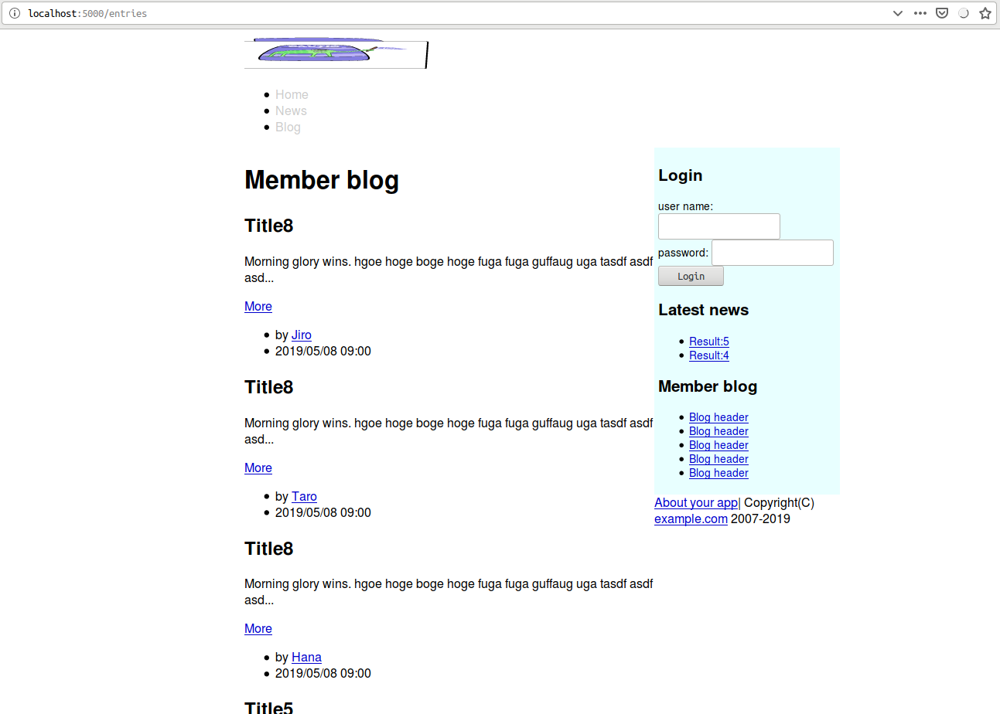
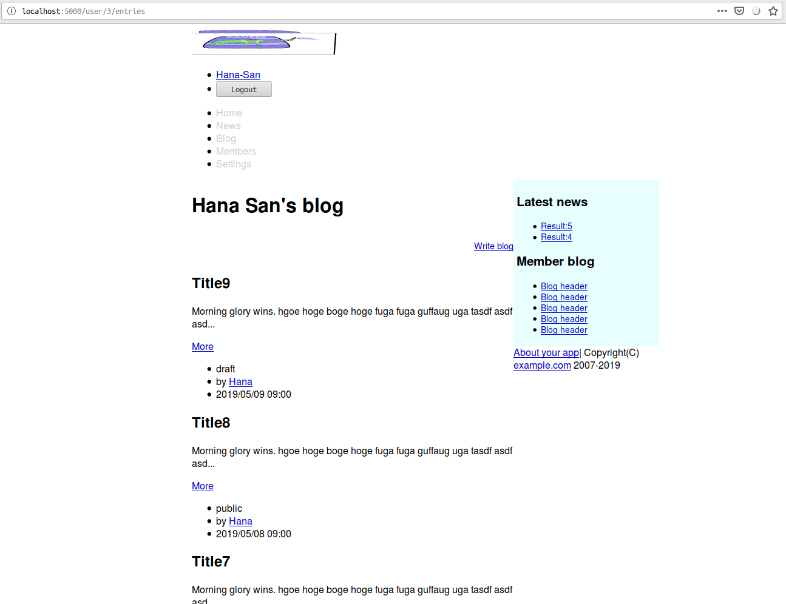
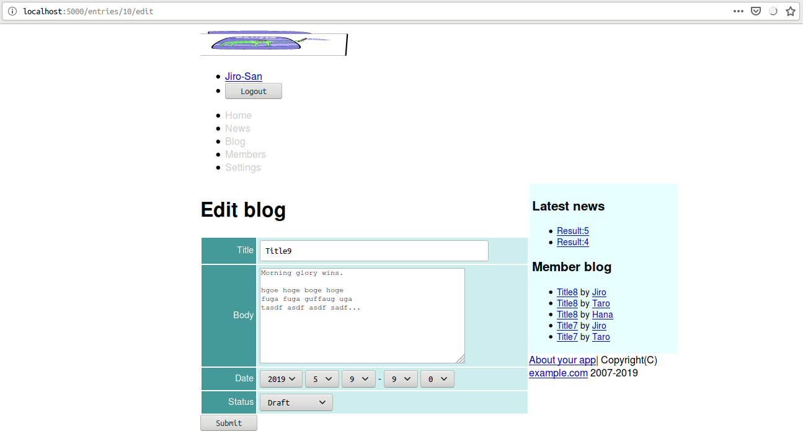

<!--  -->
# Caveman kills ruby on rails - Chapter 10
## Meta info
### 対象読者
* Cavemanでネストしたルーティングを設計したいCLer
* MitoでRelationshipを表したいCLer

## NOTE
筆者はcavemanを捨て[snooze](https://github.com/joaotavora/snooze)を使うようになった。
詳細は[ここ](why-snooze.html)に記してある。

## Introduction
本稿は[原著](https://book.impress.co.jp/books/1117101135)の各章をCommon Lispに翻訳するシリーズの第10章である。
本章では１対多となるモデル間の関連付けを通して、ネストしたルーティングを設計していく。

## 10.1 relationship
Cavemanに、特別、そのような機能はない。
地道にシコシコと実装するしかない。

## 10.2 Prepare model.
### Relationship
#### Model ENTRY
まずはentryモデルを定義しよう。

```lisp
(defclass entry()
  ((user :col-type user :initarg :user :accessor author-of)
   (title :col-type (:varchar 200) :initarg :title :accessor title-of)
   (body :col-type (or :null :text) :initarg :body :accessor body-of)
   (date-posted :col-type :date :initarg :date-posted :accessor date-posted-of)
   (status :col-type (:varchar 16) :initarg :satatus :initform "draft")
   )
  (:metaclass mito:dao-table-class))
```
ここで注意しなければならない厄介な点を一つ。
MITOでRelationshipをどう指定するか、である。

本家ドキュメントREADMEには以下のような例が載っている。

```lisp
(mito:deftable tweet ()
  ((status :col-type :text)
   ;; This slot refers to USER class
   (user-id :references (user id))))
```
このコードは動かない。
その理由が、例ではmysqlをデータベースに使っているが筆者はsqlite3を使っているため、なのか、ドキュメントが間違っているため、なのか、実装が間違っているため、なのか、どれかは調査不足でわからない。

このエラーを避けるためには:referencesの指定をするときは同時に:col-typeも指定してあげれば良いのだが、idをどのような型で表すのかはデータベース依存なので可搬性を考えればできれば避けたい。

もう一つの方法は`ENTRY`での例のように:COL-TYPEに型名を指定する方法である。
このやり方を採用した場合、MITOが暗黙理にuser-idというスロットを追加してくれる。
また、指定したアクセサ（ここでは`AUTHOR-OF`）で`USER`スロットにアクセスすると、いい具合に`USER`オブジェクトを取ってきてくれる。
[cookbool](https://lispcookbook.github.io/cl-cookbook/databases.html#one-to-many-many-to-one)ではこちらのやり方しか紹介されていない。

問題はDJULAと連携するときだ。
`{{entry.user}}`のような形で表したいのだが、それは叶わない。
なぜなら`AUTHOR-OF`アクセサでアクセスしない限り`USER`スロットは未束縛のままだからだ。
そのような必要にかられたなら、アクセサ名をスロット名と同名にし、YOUR-APP.DJULAパッケージにスロット名をIMPORTしておけばよい。
`ACCESS:ACEESS`はスロット名としてより関数名としての名前を優先するのを利用するわけだ。
だいぶハッキーなアプローチだが、railsのような一枚岩のフレームワークではなく、独立したライブラリの組み合わせで事がなされている以上、連携に歪みはつきもので、そういうものとして受け入れるよりほかない。

また、`USER`というスロットは作られるが、これはデータベースには登録されない。
データベースに登録されるのは暗黙理に作られる`USER-ID`の方だ。
この点が問題になるのはクエリを発行するときだ。
`(:= user :user)`みたいな形でクエリが書ければよいのだが、そのようなことはない。
`(:= user-id :user-id)`としなくてはいけない。
データベースに`USER-ID`が登録される点が隠蔽されているのに、である。
しかも、このスロットは暗黙理に作られる隠蔽されたスロットなのでアクセサなどもない。
直接覗きたい場合は`CL:SLOT-VALUE`で覗くしかない。
幸いスロット名（ここではuser-id）はカレントパッケージにインターンされるようなので、わかっていれば苦労することは少なかろう。
問題は隠蔽されているものを隠蔽されていると知らないとうまく使えないことにある。

#### Dependent: :destroy
railsにおける`Dependent: :destroy`のような関係性の指定はできない。
自分で実装するしかない。
ここでは`USER`がDELETEされるときに、彼のENTRYもすべてDELETEされるように実装する。

```lisp
(defmethod mito:delete-dao :before((user user))
  (mito:delete-by-values 'entry :user-id (mito:object-id user)))
```

#### Validation.
バリデーションの定義は以下の通り。

```lisp
(defun validate-entry(entry &rest target-slots)
  (with-check-validate(entry target-slots)
    ((title (:require t)
            (:type string)
            (:assert (<= 1 (length title) 200)))
     (body (:require t))
     (date-posted (:require t)
                  (:key #'local-time:parse-timestring))
     (status (:require t)
             (:assert (find status '("draft" "member-only" "public"):test #'equal))))))
```

#### Scope.
スコープを簡単に指定できる方法などない。
ここではARTICLEの場合と同様ヘルパー関数を定義する。

複雑な条件分岐は[trivia](https://github.com/guicho271828/trivia)があると便利だ。
事前にASDに追加しておくこと。

```lisp
(defun entries(&key (logged-in-p (hermetic:logged-in-p))
                    (user (and logged-in-p (current-user)))
                    author limit)
  (mito:select-dao 'your-app.model::entry
                   (sxql:where (trivia:match*(logged-in-p author)
                                 ((nil nil)`(:= "public" :status))
                                 ((nil _) `(:and (:= ,(mito:object-id author) :user-id)
                                                 (:= "public" :status)))
                                 ((_ nil)`(:or (:= "public" :status)
                                               (:= "member-only" :status)
                                               (:and (:= "draft" :stats)
                                                     (:= ,(mito:object-id user) :user-id))))
                                 ((_ _)
                                  (if(mito:object= user author)
                                    `(:= ,(mito:object-id user) :user-id)
                                    `(:and (:= ,(mito:object-id author) :user-id)
                                           (:or (:= "public" :status)
                                                (:= "member-only" :status)))))))
                   (sxql:order-by (:desc :date-posted))
                   (when limit
                     (sxql:limit limit))))
```

#### Seeds.
シードデータは以下の通り。
ARTICLEを定義する際のLETのスコープ内に潜り込ませて、BODYとNOWを再利用しよう。

```lisp
        (dolist(name '("Jiro" "Taro" "Hana"))
          (let((user(mito:find-dao 'user :name name)))
            (when user
              (dotimes(x 10)
                (mito:create-dao 'entry
                                 :user user
                                 :title (format nil "Title~D" x)
                                 :body body
                                 :date-posted (local-time:timestamp- now (- 10 x) :day)
                                 :status (nth (rem x 3)'("draft" "member-only" "public"))))))))
```

#### Migrate.
`MITO:ENSURE-TABLE-EXISTS`を以下のように修正。

```lisp
(with-connection(db)
  (mapc #'mito:ensure-table-exists '(user article entry)))
```

#### Rebuild.
同様にREBUILDも以下のように修正。

```lisp
(defun rebuild()
  (with-connection(db)
    (mapc #'mito:recreate-table '(user article entry)))
  (seeds))
```
REPLでREBUILDを叩いておくこと。

## Implement blog.
### Nested resource
指定一つでいい具合になってくれたりはしない。
自前で定義していく。

#### routing
ネステッドルーティングの場合は名前付きルーティング（ここでは`ENTRIES-INDEX`）へのディスパッチャとして実装する。
引数`ID`を拡張しながら呼ぶ点要注目。

```lisp
(defroute "/user/:id/entries"(&key id)
  (entries-index (acons "ID" id (lack.request:request-body-parameters ningle:*request*))))
```

#### index
名前付きindexは以下の通り。

```lisp
(defroute entries-index "/entries" (&key id)
  (let((author(when id
                (mito:find-dao 'your-app.model::user :id id))))
    (render "entries/index.html" `(:member ,author
                                           :user ,(current-user)
                                           :news ,(articles 5)
                                           :blogs (1 2 3 4 5)
                                           :entries ,(entries :author author)
                                           ,@(roles)
                                           :token ,(token)
                                           ))))
```

### templates/entries/index.html
テンプレートは以下の通り。

```lisp




{{ member.name | lisp: (lambda(name)(title! (format nil "~A San's blog" name))) }}






<h1></h1>

<div class="toolbar">
        <a href="/entries/new">Write blog</a>
</div>




<h2>{{entry.title}}</h2>
<p>{{ entry.body
    | truncatechars: 80
    }}
</p>
<a href="/entries/{{entry.id}}">More</a>



<p>No entries</p>



```

### templates/entries/footer.html
部分テンプレート実装にあたり、前述のDJULAとの連携における不都合が顔を出してきた。
ここではアクセサ名を変えるのではなくリーダの追加で対処しよう。

モデルの該当部分を以下のように変更する。

```lisp
  ((user :col-type user :initarg :user :accessor author-of :reader author)
```

これで部分テンプレートは以下のようにできる。

```lisp
<ul class="entry-footer">
        
        <li>{{entry.status}}</li>
        
        <a href="/entries/{{entry.id}}/edit">Edit</a>
        <form action="/entries/{{entry.id}}" method="post">
                <input type="hidden" name="AUTHENTICITY-TOKEN" value="{{token}}">
                <input type="hidden" name="METHOD" value="delete">
                <input type="submit" value="Delete">
        </form>
        
        
        <li>
                by <a href="/user/{{entry.user-id}}/entries">
                        {{entry.author.name}}
                </a>
        </li>
        <li>{{ entry.date-posted
             | date: ((:year 4)"/"(:month 2)"/"(:day 2)" "(:hour 2)":"(:min 2))
             }}
        </li>
</ul>
```

#### templates/shared/header.html
リンクを貼るように修正。

```html
                <li><a href="/entries">Blog</a></li>
```



Hanaさんの記事一覧。


ログイン後。



#### SHOW
ルーティングは以下の通り。

```lisp
(defroute show-entry "/entries/:id"(&key id)
  (if(null(ignore-errors(parse-integer id)))
    (myway:next-route)
    (let((entry(mito:find-dao 'your-app.model::entry :id id))
         (entries(entries :limit 5)))
      (render "entries/show.html" `(,@(roles)
                                     :entry ,entry
                                     :token ,(token)
                                     :user ,(current-user)
                                     :entries ,entries
                                     :blog (1 2 3 4 5)
                                     :news ,(articles 5)
                                     :member ,(your-app.model::author-of entry)
                                     )))))
```

#### templates/entries/show.html
テンプレートは以下の通り。

```html



{{ entry
 | lisp: (lambda(entry)
           (title! (format nil "~A - ~A San's blog"
                           (your-app.model::title-of entry)
                           (your-app.model::name-of (your-app.model::author-of entry)))))
 }}



<h1></h1>
<h2>{{entry.title}}</h2>
{{ entry.body | simple-format | safe }}


```

### Sidebar
#### templates/shared/sidebar.html
テンプレートを以下のように修正。

```hmtl
<ul>
        
        <li>
                <a href="/entries/{{entry.id}}">{{entry.title}}</a>
                by <a href="/user/{{entry.user-id}}/entries">{{entry.author.name}}</a>
        </li>
        
</ul>
```


### Create, update and delete
#### new
ルーティングは以下の通り。

```lisp
(defroute "/entries/new"(&key)
  (render "entries/new.html" `(,@(roles)
                                :token ,(token)
                                :entry ,(make-instance 'your-app.model::entry)
                                :user ,(current-user)
                                :blogs ,(entries :limit 5)
                                :news ,(articles 5))))
```

#### templates/entries/new.html
テンプレートは以下の通り。

```html







<h1></h1>

<form class="new-entry" id="new-entry" action="/entries" method="post">
        <input type="hidden" name="AUTHENTICITY-TOKEN" value="{{token}}">
        <input type="hidden" name="METHOD" value="put">
        
        <div><input type="submit" value="Submit"></div>
</form>

```

#### edit
ルーティングは以下の通り。

```lisp
(defroute "/entries/:id/edit"(&key id)
  (if(null(ignore-errors(parse-integer id)))
    (myway:next-route)
    (render "entries/edit.html" `(,@(roles)
                                   :entry ,(mito:find-dao 'your-app.model::entry :id id)
                                   :user ,(current-user)
                                   :blogs ,(entries :limit 5)
                                   :news ,(articles 5)))))
```

#### templates/entries/edit.html
テンプレートは以下の通り。

```html







<h1></h1>

<form class="edit-entry" id="edit-entry" action="/entries/{{entry.id}}" method="post">
        <input type="hidden" name="ANTHENTICITY-TOKEN" value="{{token}}">
        <input type="hidden" name="METHOD" value="put">
        
        <div><input type="submit" value="Submit"></div>
</form>

```

#### templates/entries/form.html
部分テンプレートは以下の通り。

```html


<table class="attr">
        <tr>
                <th width="80"><label for="title">Title</label></th>
                <td><input type="text" name="TITLE" id="title" size="50" value="{{entry.title}}"/></td>
        </tr>
        <tr>
                <th><label for="body">Body</label></th>
                <td><textarea name="BODY" id="body" rows="10" cols="45">{{entry.body}}</textarea></td>
        </tr>
        <tr>
                <th><label for="posted-at">Date</label></th>
                <td>
                        <select id="posted-year" name="POSTED-YEAR">
                                {{ entry.date-posted
                                 | lisp: (lambda(timestamp)
                                           (let((year(local-time:timestamp-year(local-time:now))))
                                             (date-options :start 2000 :end (1+ year)
                                                           :target (local-time:timestamp-year timestamp))))
                                 | safe
                                 }}
                        </select>
                        <select id="posted-month" name="POSTED-MONTH">
                                {{ entry.date-posted
                                 | lisp: (lambda(timestamp)
                                           (date-options :start 1 :end 12
                                                         :target (local-time:timestamp-month timestamp)))
                                 | safe }}
                        </select>
                        <select id="posted-day" name="POSTED-DAY">
                                {{ entry.date-posted
                                 | lisp: (lambda(timestamp)
                                           (date-options :start 1 :end 31
                                                         :target (local-time:timestamp-day timestamp)))
                                 | safe }}
                        </select>
                        -
                        <select id="posted-hour" name="POSTED-HOUR">
                                {{ entry.date-posted
                                 | lisp: (lambda(timestamp)
                                           (date-options :end 59 :target (local-time:timestamp-hour timestamp)))
                                 | safe }}
                        </select>
                        <select id="posted-min" name="POSTED-MIN">
                                {{ entry.date-posted
                                 | lisp: (lambda(timestamp)
                                           (date-options :end 59 :target (local-time:timestamp-minute timestamp)))
                                 | safe }}
                        </select>
                </td>
        </tr>
        <tr>
                <th><label for="status">Status</label></th>
                <td><select id="status" name="STATUS">
                                <option value="draft" selected>Draft</option>
                                <option value="member-only">Member only</option>
                                <option value="public">Public</option>
                        </select>
                </td>
        </tr>
</table>
```

#### Create
ディスパッチャは以下の通り。

```lisp
(defroute("/entries" :method :post)(&key method)
  (cond
    ((string= "put" method)
     (create-entry(lack.request:request-body-parameters ningle:*request*)))
    (t `(401 ()(,(format nil "Unknown method ~S" method))))))
```
名前付きルーティングを実装するにあたり、引数の正規化を行えるように`CL:INITIALIZE-INSTANCE`に:AROUNDメソッドを追加しておこう。

```lisp
(defmethod initialize-instance :around((o entry)&rest args &key posted-year posted-month posted-day posted-hour
                                                      posted-min date-posted &allow-other-keys)
  (apply #'call-next-method o
         `(,@(when (and (null date-posted)
                        posted-year)
               `(:date-posted ,(format nil "~A-~A-~AT~A:~A:00" posted-year posted-month posted-day posted-hour
                                       posted-min)))
            ,@args)))
```

これで名前付きルーティングを以下のようにできる。

```lisp
(defroute create-entry("/entries" :method :put)(&key authenticity-token)
  (if(not(string= authenticity-token (token)))
    '(401 ()("Denied"))
    (multiple-value-bind(entry errors)(your-app.model::validate-entry
                                        (apply #'make-instance 'your-app.model::entry
                                               :user (current-user)
                                               (request-params (lack.request:request-body-parameters ningle:*request*))))
      (if errors
        (render "entries/new.html" `(,@(roles)
                                      :entry ,entry
                                      :token ,(token)
                                      :errors ,errors
                                      :user ,(current-user)
                                      :blogs ,(entries :limit 5)
                                      :news ,(articles 5)))
        (progn (mito:save-dao entry)
               (setf (gethash :notice ningle:*session*) "Stored")
               `(303 (:location ,(format nil "/entries/~D"(mito:object-id entry)))))))))
```

#### update
ディスパッチャは以下の通り。

```lisp
(defroute("/entries/:id" :method :post)(&key method id)
  (cond
    ((string= "post" method)
     (update-entry (acons "ID" id (lack.request:request-body-parameters ningle:*request*))))
    ((string= "delete" method)
     (destroy-entry (acons "ID" id (lack.request:request-body-parameters ningle:*request*))))
    (t `(401 () (,(format nil "Unknown method ~S" method))))))
```

本来のpostメソッドは以下の通り。

```lisp
(defun update-entry(request)
  (destructuring-bind(&key authenticity-token id title body posted-year posted-month posted-day posted-hour
                           posted-min &allow-other-keys)(request-params request)
    (if(not(string= authenticity-token(token)))
      '(401 ()("Denied"))
      (if(null(ignore-errors(parse-integer id)))
        (myway:next-route)
        (let((entry(mito:find-dao 'your-app.model::entry :id id)))
          (setf (your-app.model::title-of entry) title
                (your-app.model::body-of entry)body
                (your-app.model::date-posted-of entry)(format nil "~A-~A-~AT~A:~A:00" posted-year posted-month
                                                              posted-day posted-hour posted-min))
          (multiple-value-bind(entry errors)(your-app.model::validate-entry entry)
            (if errors
              (render "entries/edit.html" `(,@(roles)
                                             :member ,(your-app.model::author-of entry)
                                             :user ,(current-user)
                                             :token ,(token)
                                             :entry ,entry
                                             :news ,(articles 5)
                                             :blogs ,(entries :limit 5)
                                             :errors ,errors
                                             ))
              (progn (mito:save-dao entry)
                     (setf (gethash :notice ningle:*session*) "Updated")
                     `(303 (:location ,(format nil "/entries/~D"(mito:object-id entry))))))))))))
```



#### destroy
ルーティングは以下の通り。

```lisp
(defroute destroy-entry("/entries/:id" :method :delete)(&key authenticity-token id)
  (if(not(string= authenticity-token (token)))
    '(401 () ("Denied"))
    (if(null(ignore-errors(parse-integer id)))
      (myway:next-route)
      (let((entry(mito:find-dao 'your-app.model::entry :id id)))
        (if (null entry)
          `(401 ()(,(format nil "Entry id ~A is not exist" id)))
          (progn (mito:delete-dao entry)
                 (setf (gethash :notice ningle:*session*) "Deleted")
                 `(303 (:location ,(format nil "/user/~D/entries"(mito:object-id (current-user)))))))))))
```

## Summary
* 複数のモデルを関連付けるには、外部キーを利用してテーブルのレコードが別のテーブルのレコードを参照するようにします。
* １対多の関連付けるには、参照元のモデルクラスのスロット定義に参照先クラス名を:COL-TYPE指定します。
* ネストしたURIを設計すると、１対多で関連付けられているモデル達をうまくAPIとして表現できます。
<!--  -->
