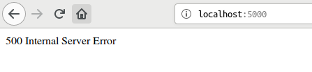
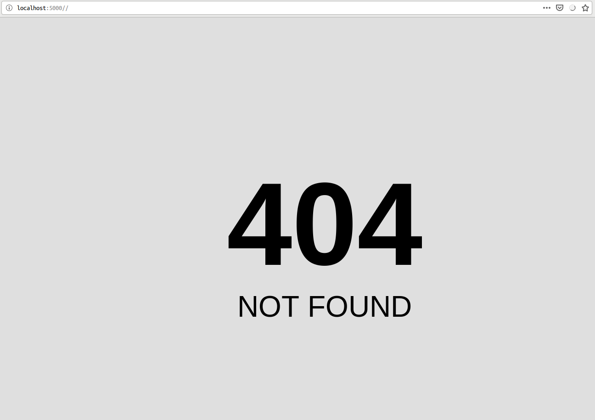
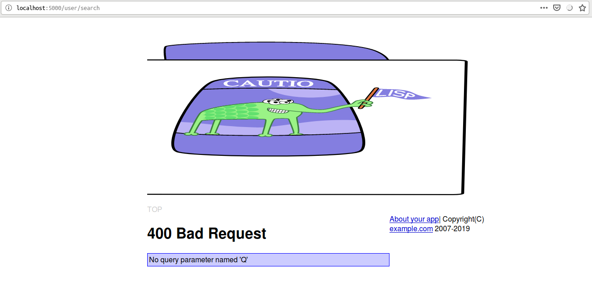

<!--  -->
# Caveman kills ruby on rails - Chapter 11
## Meta info
### 対象読者
* Cavemanにおける例外処理を修めたいCLer

## Introduction
本稿は[原著](https://book.impress.co.jp/books/1117101135)の各章をCommon Lispに翻訳するシリーズの第11章である。
本章ではCavemanにおける例外処理を修めていく。
## Strong parameter
CavemanではデフォルトでRailsでいうstrong-parameter相当の機能がサポートされている。
Cavemanはマイクロウェブフレームワークである[ningle](https://github.com/fukamachi/ningle)を拡張する形で作られているライブラリなのだが、このNINGLEのほうはstrong-parameterがサポートされていない。
Cavemanユーザがこの下層たるNINGLEの仕様に出くわすのは、これまで見てきた通り名前付きpostメソッドを自作する場合に限られるだろう。

## Customizing error page
CavemanではHTTP status codeをある種の例外として投げられる。
基本的な使い方は単に`CAVEMAN2.EXCEPTION:THROW-CODE`にHTTP status codeを整数で渡してあげればいいだけだ。

```lisp
(throw-code 500)
```

クライアントには通常プレーンテクストが:CONTENT-TYPE "text/html"のボディとして送られるようだ。



この投げられた例外に特別な処理を施したい場合、通常総称関数`CAVEMAN2.APP:ON-EXCEPTION`にメソッドを追加することで行うことができる。

`CAVEMAN2:MAKE-PROJECT`でプロジェクトのスケルトンを作っているなら、404へスペシャライズドされたメソッドがもう定義されているはずだ。

デフォルトの404は以下のようなものとなる。



`THROW-CODE`は特別なこだわりがない場合には大変便利なものなのだが、そこから外れると厄介になる。

たとえばstatus-code 405 Method not allowedをサポートしようとした場合などがそうだ。
405はHTTPの仕様ではヘッダにallowヘッダを追加し、受け入れられるメソッドのリストを追加しなければならない（must）

さて、Cavemanでこれを実現するにはどうするのが正攻法なのか。

まず、これらの例外はCommon Lispのコンディションシステムとして実装されている。
よって`CAVEMAN2:HTTP-EXCEPTION`を継承するかたちで独自のコンディションを定義することから始める。

```lisp
(define-condition method-not-allowed(caveman2.exception:http-exception)
  ((allow :initarg :allow :reader allow)
   (method :initarg :method :reader not-allowed)))
```

次に定義されたコンディションに特化した`CAVEMAN2.APP:ON-EXCEPTION`を定義する。

```lisp
(defmethod on-exception((app <web>) (code method-not-allowed))
  (setf (getf (lack.response:response-headers ningle:*response*):allow)(allow code))
  (format nil "Unknown method ~S"(not-allowed code)))
```
ヘッダの追加を`SETF`で行ってある点要注目。

使う場合は以下のようにする。

```lisp
  (let((caveman2.exception:*exception-class* 'method-not-allowed))
    (throw-code 405 :allow "put get" :method "post"))
```

以上が正攻法の場合、だ。
正直、僕はこのアプローチが好きではない。
なぜか。

まずひとつめに、独自の引数を渡したいといった込み入った案件についてはアンドキュメンテッドである。
その上でソースコードに潜り込むとして、正攻法アプローチは学習負荷が高い実装となっている。
METHOD-NOT-ALLOWEDの実装にあたりユーザは、`THROW-CODE`、`HTTP-EXCEPTION`、`*EXCEPTION-CLASS*`といったシンボルについて知らねばならない。

ところで`THROW-CODE`の中身は実は単なる`CL:ERROR`だ。
なら、`THROW-CODE`というブラックボックスを提供するよりは、単に`HTTP-EXCEPION`コンディションクラスを公開するほうが良くはないだろうか。
`HTTP-EXCEPTION`コンディションクラスを公開するなら、ユーザはそのスロットやアクセサについても知る必要が出てくるだろう。
結果覚えることは増えるかもしれない。
だが、それは慣れ親しんだCommon Lisp標準のコンディションシステムだ。
それも一箇所、`HTTP-EXCEPTION`の定義を見れば事足りる。
どこに何が書いてあるかまだ知らないソースコードのあっちこっちを飛びながら学習する必要がない。

この場合使い方は以下のようになる。

```lisp
(error 'method-not-allowed :method "post" :allow "put get" :code 405)
```
正攻法の`CL:LET`で束縛する呼び方よりむしろ短く書けている。
`THROW-CODE`というシンボルについても知らなくて済む。

ふたつめに、正攻法のアプローチなら`ON-EXCEPTION`の仕様についても知らなければならない。
ここで言う`ON-EXCEPTION`の仕様とは、単に返り値に何を返せば良いかだけでなく、`ON-EXCEPTION`がCavemanによりどのように呼び出されているかについても含む。
`ON-EXCEPTION`は第二引数にコンディションオブジェクトを渡す形で呼び出されるのだが、それはCavemanのソースコードに潜って初めて分かることだ。
またヘッダを追加したいなら`LACK.RESPONSE:RESPONSE-HEADERS`と`NINGLE:*RESPONSE*`についても知らなければならなくなる。

もしかしたら`ON-EXCEPTION`はLACK互換の返り値を返せばいいように設計されているので`LACK.RESPONSE:RESPONSE-HEADERS`や`NINGLE:*RESPONSE*`については知らなくとも良いという反論があるかもしれない。
例えば上述のメソッドは以下のようにしても良い。

```lisp
(defmethod on-exception((app <web>) (code method-not-allowed))
  `(,(caveman2.exception:exception-code code)
     (:allow ,(allow code))
     (,(format nil "Unknown method ~S"(not-allowed code)))))
```

そうなのだ。
結局これは上述の`ERROR`呼び出しを以下のように書くのと等価なのだ。

```lisp
`(405 (:allow "put get")(,(format nil "Unknown method ~S""post")))
```

コードは更に短くなり、我々はいまや`ON-EXCEPTION`についても知らなくて良くなった。

学習コストをかけて、長いコードを書いて、その結果得られるものはなんだろうか。
今の所ぼくには、`WHEN`や`UNLESS`で囲んでアーリーリターンの形で例外を投げられるので、コードのネストが深くならないというような点しか思いつかない。
それこそが大事なのかもしれないが。

とはいえこれは「込み入ったことをする場合」の話だ。
エラー画面をカスタマイズする気がないなら大変便利に使えると思う。

ところで本章のテーマはエラーページのカスタマイズだが、込み入ったことは行わないので正攻法のアプローチを取っていくこととする。

### Error templates
#### templates/layouts/error.html
エラー用のレイアウトは以下の通り。

```html
<!DOCTYPE html>
<html>
        <head>
                <meta charset="utf-8">
                <title>
                Title
                </title>
                <link rel="stylesheet" media="all" href="/css/app.css">
        </head>
        <body>
                <div id="container">
                        <header>
                                
                                <nav class="menubar">
                                        <a href="/">TOP</a>
                                </nav>
                        </header>
                        <main>
                        Main content here
                        </main>
                        <footer>
                                
                        </footer>
                </div>
        </body>
</html>
```
### 404 not found.
#### on-exception

```lisp
(defmethod on-exception ((app <web>) (code (eql 404)))
  (declare (ignore app))
  (render "errors/not-found.html"))
```

#### templates/errors/not-found.html

```html


  


<h1>404 Not Found</h1>

```
### 400 Bad request
#### on-exception

```lisp
(defmethod on-exception ((app <web>) (code (eql status-code:+bad-request+)))
  (declare (ignore app))
  (render "errors/bad-request.html" `(:alert ,(flash-gethash :alert ningle:*session*))))
```

#### templates/errors/bad-request.html

```html




<h1>400 </h1>

<p class="notice">{{alert}}</p>


```

後はだいたい同じなので省略。



## Summary
* Mass Assignment脆弱性への対策であるストロングパラメタはデフォルトで有効です。
* 独自のエラーページを作るには総称関数`ON-EXCEPTION`にメソッドを追加します。
<!--  -->
