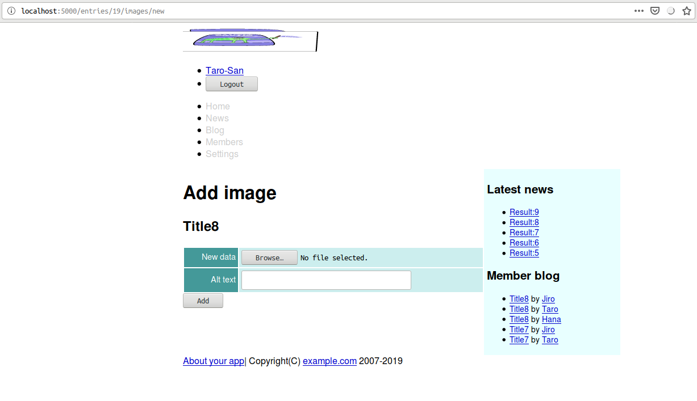

<!--  -->
# Caveman kills ruby on rails - Chapter 13
## Meta info
### 対象読者
* Cavemanに於いてファイルのアップロードを実装したいCLer

## NOTE
筆者はcavemanを捨て[snooze](https://github.com/joaotavora/snooze)を使うようになった。
詳細は[ここ](why-snooze.html)に記してある。

## Introduction
本稿は[原著](https://book.impress.co.jp/books/1117101135)の各章をCommon Lispに翻訳するシリーズの第13章である。
本章ではCavemanにおけるストレージサポートを修めていく。

クラウドストレージのサポートは埒外としおく。

また、13.5の画像表示ヶ所の変更サポートも、いい具合のものがなく、実装は骨なのでTODOとして無視していく。

## 13.1 Active Storage
CavemanにはActive Storageのサポートなどない。

Active Storageが何なのか筆者は詳しくないのだが、2019/5/23現在の筆者の理解としては、これはSICPで言うところの抽象の壁で、ストレージを抽象化しておくというものだろう。
リダイレクト経由でコンテンツにアクセスするのでクライアントからは同じものに見える。
サーバは実装を切り替えることでストレージを切り替えられる、と。

これをごっそり実装するのは骨なので、ここではディスクサービスに相当するものをいい加減にでっちあげてお茶を濁すこととする。

まずはそれ用のパッケージを定義。

```lisp
(in-package :cl-user)
(defpackage #:storage(:use :cl)
  (:shadow #:write #:read #:remove #:probe-file))
(in-package #:storage)
```

ファイルオブジェクトを定義。

```lisp
(defstruct(file (:type vector))
  name size content-type)
```

オブジェクトとパス名とを行き来できるようにヘルパーを定義。

```lisp
(defun prin1-to-base64-string(object)
  (cl-base64:string-to-base64-string(prin1-to-string object)))

(defun read-from-base64-string(string)
  (values(read-from-string(cl-base64:base64-string-to-string string))))
```

ユーザーごとにディレクトリを持ち、各ディレクトリにはサブディレクトリがあり、そこにファイルを格納していく。
それ用のパスを作るヘルパー。

```lisp
(defun make-storage-pathname(id subdirectory &optional file)
  (merge-pathnames (format nil "storage/~A/~A/~@[~A~]" id subdirectory (when file (prin1-to-base64-string file)))
                   your-app.config::*application-root*))
```

書き出し。
なお、受け取るストリームはFLEXI-STREAMSのIN-MEMORY-STREAMを想定している。
これはCamemanの振る舞いに則っている。

```lisp
(defun write(stream id subdirectory file)
  (let((path(ensure-directories-exist(make-storage-pathname id subdirectory file))))
    (with-open-file(s path
                      :direction :output :if-does-not-exist :create :element-type '(unsigned-byte 8)
                      :if-exists nil)
      (if s
        (write-sequence (slot-value stream 'vector) s)
        (warn "File already exists ~S~&Ignored." path)))))
```

読み込み。

```lisp
(defun read(id subdirectory file)
  (with-open-file(s (make-storage-pathname id subdirectory file)
                    :element-type '(unsigned-byte 8))
    (let*((length(file-length s))
          (buffer(make-array length :element-type '(unsigned-byte 8))))
      (read-sequence buffer s)
      (values buffer length))))
```

消去。

```lisp
(defun remove(id subdirectory file)
  (delete-file(make-storage-pathname id subdirectory file)))
```

既に存在するか否かの述語。

```lisp
(defun probe-file(id subdirectory file)
  (cl:probe-file(make-storage-pathname id subdirectory file)))
```

画像ファイルのサイズ変更。

```lisp
(defun convert(id subdirectory original-file converted-file)
  (let((command(format nil "convert -geometry ~A ~A ~A"
                       (file-size converted-file)
                       (make-storage-pathname id subdirectory original-file)
                       (make-storage-pathname id subdirectory converted-file))))
    (let((message(nth-value 1 (uiop:run-program command :ignore-error-status t :error-output :string))))
      (when message
        (error message)))))
```

なお、上記コマンドはImageMagickに依存しているので、インストールしておくこと。

Active Storage用のルーティングは以下の通り。

```lisp
(defroute "/storage/:id/:subdirectory/:filename"(&key id subdirectory filename size content-type)
  (let*((original-file(storage::make-file :name filename :content-type content-type))
        (to-load original-file))
    (when size
      (let((converted-file(storage::make-file :name filename :size size :content-type content-type)))
        (unless(storage::probe-file id subdirectory converted-file)
          (storage::convert id subdirectory original-file converted-file))
        (setf to-load converted-file)))
    (multiple-value-bind(content length)(storage::read id subdirectory to-load)
      `(,status-code:+ok+ (:content-type ,content-type :content-length ,length)
                          ,content))))
```

## 13.2 Uploading profile image.
### Extends user model.
Mitoに於いてテーブルは継承できる。
また、テーブルを作る必要がなく、同様のフィールドをまとめたいだけの場合はmito:dao-table-mixinが利用できる。

まずはファイルモデルmixinを作成。

```lisp
(defclass file()
  ((filename :col-type (or :null (:varchar 128)) :initarg :filename :accessor filename-of)
   (content-type :col-type (or :null (:varchar 32)) :initarg :content-type :accessor content-type-of))
  (:metaclass mito:dao-table-mixin))
```

ファイルモデルを継承してイメージモデルmixinを作成。

```lisp
(defclass image (file)()
  (:metaclass mito:dao-table-mixin))
```

ユーザモデルにイメージモデルをmixin。

```lisp
(defclass user(image)
  ...)
```

### Profile image field for template.
入力フォームのenctypeをmultipart/form-dataに変更する必要がある。

#### templates/user/new.html

```html
<form class="new-user" id="new-user" action="/user" method="post" enctype="multipart/form-data">
```

#### templates/user/edit.html

```html
<form class="edit-user" id="edit-user" action="/user/{{user.id}}" method="post" enctype="multipart/form-data">
```

#### templates/account/edit.html

```html
<form class="edit_account" id="edit_account" action="/account" method="post" enctype="multipart/form-data">
```

また、共有している部分テンプレートも以下のように修正。

#### templates/shared/user-form.html

```html
<table class="attr">
        <tr>
                <th><label for="profile-image">Profile image</label></th>
                <td>
                        <div><input type="file" name="IMAGE" id="profile-image"/></div>
                        
                        <div>
                                
                        </div>
                        
                </td>
        </tr>
        <tr>
```

### Fix routing.
さて、ルーティングの修正だが、まずはディスパッチャから行う。

これはCaveman、NINGLE、clack、LACK、全てに於いてアンドキュメントな振る舞いなのだが（よってどこの責任でこうなっているのか分からないのだが）formのenctypeが少なくともmultipart/form-dataの場合、&KEYで受け取るクエリ変数はすべからくリストとなる。
各リストは３要素で

1. クエリ変数の値。
2. 何かを表すハッシュテーブル。
3. 何かを表すハッシュテーブル。

となっている。

各ハッシュテーブルが何を表しているのかはアンドキュメントなので分からない。
ある種のprintfデバッグをして中身を見ながら開発するよりほかない。

ディスパッチャにはenctype指定のないリクエストも来得る。
よって`ALEXANDRIA:ENSURE-CAR`を用いた以下のような修正となる。

```lisp
(defroute("/user/:id" :method :post)(&key id method)
  (method-case(alexandria:ensure-car method)
    ("delete" (delete-user (acons "ID" id (lack.request:request-body-parameters ningle:*request*))))
    ("post" (update-user (acons "ID" id (lack.request:request-body-parameters ningle:*request*))))))
```

#### update-user
postメソッド本体は以下のように修正。

```lisp
(defun update-user(request)
  (destructuring-bind(&rest args &key authenticity-token id number name full-name sex email administrator image
                            birthday-year birthday-month birthday-day
                            &allow-other-keys) (request-params request)
    (declare(ignore number name full-name sex email administrator birthday-year birthday-month birthday-day))
    (with-authenticity-check((:token (car authenticity-token)))
      (ensure-let((old(mito:find-dao 'your-app.model::user :id id)))
        (let((file(your-app.model::filename-of old)))
          (multiple-value-bind(user errors)(validation:validate
                                             (apply #'your-app.model::update-instance old 
                                                    :image image
                                                    `(,@(mapcar #'alexandria:ensure-car args)
                                                       :administrator "1")))
            (if errors
              (render "user/edit.html" `(,@(roles) :news ,(articles 5) :blogs ,(entries :limit 5) :user ,user
                                                   :token ,(token):errors ,errors))
              (progn (mito:save-dao user)
                     (unless(equal file (ignore-errors(your-app.model::filename-of user)))
                       (your-app.model::purge user "account" file))
                     (setf(gethash :notice ningle:*session*)"Updated")
                     `(,status-code:+see-other+ (:location ,(format nil "/user/~D" id)))))))))))
```

#### update-account
アカウントのpostメソッドは以下のように修正。

```lisp
(defroute("/account" :method :post)(&rest args &key number name full-name sex email (administrator '("1"))
                                          birthday-year birthday-month birthday-day authenticity-token image)
  (declare(ignore number name full-name sex email administrator))
  (with-authenticity-check((:token (car authenticity-token)):logged-in)
    (let*((user(current-user))
          (image-file(your-app.model::filename-of user)))
      (multiple-value-bind(user errors)(validation:validate
                                         (apply #'your-app.model::update-instance user 
                                                :password (gethash :password ningle:*session*)
                                                :image image
                                                (mapcar #'alexandria:ensure-car args)))
        (if errors
          `(,status-code:+bad-request+
             ()(,(render "accounts/edit.html" `(:user ,user :errors ,errors :news ,(articles 5)
                                                      :blogs ,(entries :limit 5) ,@(roles) :token,(token)))))
          (progn (unless(equal image-file (ignore-errors(your-app.model::filename-of user)))
                   (your-app.model::purge user "account" image-file))
                 (mito:save-dao user)
                 (setf(gethash :notice ningle:*session*)"Updated")
                 `(,status-code:+see-other+ (:location "/account"))))))))
```

なお上記コード内の`PURGE`は以下の通り。

```lisp
(defun purge(user subdirectory filename)
  (let(deletedp
       (id(mito:object-id user)))
    (dolist(pathname (uiop:directory-files(storage::make-storage-pathname id subdirectory))
                     deletedp)
      (let((file(storage::read-from-base64-string(pathname-name pathname))))
        (when(equal filename (storage::file-name file))
          (setf deletedp t)
          (storage::remove id subdirectory file))))))
```


### show
アカウント画面に画像が表示されるように修正。

#### templates/user/body.html

```html
<table class="attr">
        <tr>
                <th>Profile image</th>
                <td>
                        
                        
                        
                </td>
        <tr>
```


### Seed data
シードデータに画像を追加。
いい具合にやってくれるようなものはないので愚直に書く。

```lisp
(defun seeds()
  (with-open-file(s (merge-pathnames "profile.png" your-app.config::*application-root*)
                    :element-type '(unsigned-byte 8))
    (let((vector(make-array (file-length s) :element-type '(unsigned-byte 8))))
      (read-sequence vector s)
      (storage::write (make-instance 'flex::vector-input-stream
                                     :vector vector)
                      1 "account" (storage::make-file :name "profile.png" :content-type "image/png"))))
  (let((names #("Taro" "Jiro" "Hana" "John" "Mike" "Sophy" "Bill" "Alex" "Mary" "Tom"))
       ...)
    (with-connection(db)
      (dotimes(x 10)
        (mito:create-dao 'user
                         :number (+ x 10)
                         ...
                         :password "asagao!"
                         :filename (when(zerop x)
                                     "profile.png")
                         :content-type (when(zerop x)
                                         "image/png")
                         ))
  ...)))
```

### validation
IMAGE用のバリデーションは以下の通り。

```lisp
(defmethod validation:validate validation:validate((image image) &key target-slots test)
  (validation:with-check-validate(image :target-slots target-slots :test test)
    ((content-type (:assert (find content-type #0='("image/jpeg" "image/png" "image/gif" "image/bmp")
                                  :test #'equal)
                            "must be one of ~S but ~S" #0# content-type)))))
```

## 13.3 Deleting profile image.
### Checkbox for delete.
#### templates/shared/user-form.html
部分テンプレートを修正。

```html
                        <div>
                                
                                <label for="remove-profile-image-p">Remove profile image</label>
                                <input type="checkbox" name="REMOVE-PROFILE-IMAGE-P" id="remove-profile-image-p">
                        </div>
```

#### routing
クエリ変数`REMOVE-PROFILE-IMAGE-P`を受け取るようにルーティングを変更。

```lisp
(defroute("/account" :method :post)(&rest args &key number name full-name sex email (administrator '("1"))
                                          birthday-year birthday-month birthday-day authenticity-token image
                                          remove-profile-image-p)
  (declare(ignore number name full-name sex email administrator birthday-year birthday-month birthday-day))
  (with-authenticity-check((:token (car authenticity-token)):logged-in)
    (let*((user(current-user))
          (image-file(your-app.model::filename-of user)))
      (multiple-value-bind(user errors)(validation:validate
                                         (apply #'your-app.model::update-instance user 
                                                :password (gethash :password ningle:*session*)
                                                :image image
                                                (mapcar #'alexandria:ensure-car args)))
        (if errors
          `(,status-code:+bad-request+
             ()(,(render "accounts/edit.html" `(:user ,user :errors ,errors :news ,(articles 5)
                                                      :blogs ,(entries :limit 5) ,@(roles) :token,(token)))))
          (progn (trivia:match*((car remove-profile-image-p)
                                (equal image-file (ignore-errors(your-app.model::filename-of user))))
                   ((_ nil) ; when specify new one, always remove old one.
                    (your-app.model::purge user "account" image-file)
                    (storage::write (car image) (mito:object-id user) "account" (make-image-file image)))
                   ((nil _)) ; do not remove, no new one, so do nothing.
                   ((_ _) ; remove old, no new one.
                    (setf (your-app.model::filename-of user)nil
                          (your-app.model::content-type-of user)nil)
                    (your-app.model::purge user "account" image-file)))
                 (mito:save-dao user)
                 (setf(gethash :notice ningle:*session*)"Updated")
                 `(,status-code:+see-other+ (:location "/account"))))))))
```
validation:validateは""ないしNILのスロットを`CL:SLOT-MAKUNBOUND`する点要注意。

また、mitoは未束縛なスロットに関してはデータベースの更新を行わない点要注意。
これはアンドキュメンテッドな振る舞いなので将来変更されるかもしれない。
ここではNILをSETFしている点要注目。


## 13.4 Uploading and showing blog image.
### entry-image model

```lisp
(defclass entry-image(image)
  ((entry :col-type entry :initarg :entry :accerror entry-of)
   (alt-text :col-type (:varchar 128) :initform "alt-text" :initarg :alt-text :accerror alt-text-of))
  (:metaclass mito:dao-table-class))
```

#### validation

```lisp
(defmethod validation:validate validation:validate((object entry-image) &key target-slots test)
  (validation:with-check-validate(object :target-slots target-slots :test test)
    ((entry (:require t))
     (filename (:require t)))))
```
バリデーションはメソッドコンビネーションによりスーパークラスも行われる。
ここではスーパークラスのスロットである`FILENAME`をサブクラスである`ENTRY-IMAGE`内で指定してバリデーションを行っている点要注目。
これにより`USER`オブジェクトのバリデーションでは`FILENAME`は`:REQUIRE`ではないが、ここでは`:REQUIRE`としてバリデートされる。

なおこれはオーバーライドではない点要注意。
スーパークラスのバリデーションは別途行われている。
よってスーパークラスではゆるいバリデーションを行い、ことと次第でサブクラスで厳密なバリデーションを行うことは可能だが、その反対はできない。

### index

#### templates/entry-images/index.html
まずはテンプレートを作成。

```html





<h1></h1>
<h2>{{ entry.title }}</h2>

<ul class="toolbar">
        <a href="/entries/{{entry.id}}">Go back entry</a>
        <a href="/entries/{{entry.id}}/images/new">Add image</a>
</ul>


<table class="list">
        <thead>
                <tr>
                        <th>Number</th>
                        <th>Image</th>
                        <th>Alt text</th>
                        <th>Operation</th>
                </tr>
        </thead>
        <tbody>
                
                <tr>
                        <td>{{index}}</td>
                        <td>
                                
                        </td>
                        <td>{{image.alt-text}}</td>
                        <td>
                                <div>
                                        <a href="/entries/{{entry.id}}/images/{{image.id}}/edit">Edit</a>
                                        <form action="/entries/{{entry.id}}/images/{{image.id}}" method="post">
                                                <input type="hidden" name="AUTHENTICITY-TOKEN" value="{{token}}">
                                                <input type="hidden" name="METHOD" value="delete">
                                                <input type="submit" value="Delete">
                                        </form>
                                </div>
                        </td>
                </tr>
                
        </tbody>
</table>

<p>No images</p>


```

#### routing
テンプレートに引数を渡せるようにルーティングを定義。

```lisp
(defroute index-entry-image "/entries/:id/images"(&key id)
  (with-authenticity-check(:logged-in)
    (ensure-let((entry(mito:find-dao 'your-app.model::entry :id id)))
      (let((images(mito:retrieve-dao 'your-app.model::entry-image :entry-id (mito:object-id entry))))
        (render "entry-images/index.html" `(,@(roles)
                                             :images ,(loop :for image :in images
                                                            :for i :upfrom 1
                                                            :collect (cons image i))
                                             :entry ,entry
                                             :user ,(current-user)
                                             :token ,(token)
                                             :news ,(articles 5)
                                             :blogs ,(entries :limit 5)
                                             ))))))
```


### show
編集フォームへリダイレクトする形で定義。

```lisp
(defroute show-image "/entries/:id/images/:image-id"(&key id image-id)
  (with-authenticity-check(:logged-in)
    (if(null(mito:find-dao 'your-app.model::entry :id id))
      (myway:next-route)
      (if(null(mito:find-dao 'your-app.model::entry-image :id image-id))
        (myway:next-route)
        `(,status-code:+see-other+(:location ,(format nil "/entries/~A/images/~A/edit" id image-id)))))))
```

### new

#### templates/entry-images/new.html
テンプレートを作成。

```html





<h1></h1>
<h2>{{entry.title}}</h2>

<form action="/entries/{{entry.id}}/images" method="post" enctype="multipart/form-data">
        <input type="hidden" name="AUTHENTICITY-TOKEN" value="{{token}}">
        <input type="hidden" name="METHOD" value="put">
        
        <div><input type="submit" value="Add"/></div>
</form>


```

#### templates/entry-images/form.html
部分テンプレートを作成。

```html

<table class="attr">
        <tr>
                <th><label for="image-new-data">New data</label></th>
                <td><input type="file" name="IMAGE" id="image-new-data"/></td>
        </tr>
        <tr>
                <th><label for="image-alt-text">Alt text</label></th>
                <td><input type="text" name="ALT-TEXT" value="{{image.alt-text}}" id="image-alt-text" size="40"/></td>
        </tr>
</table>
```

#### routing
引数を渡せるようにルーティングを定義。

```lisp
(defroute add-image "/entries/:id/images/new"(&key id)
  (with-authenticity-check(:logged-in)
    (ensure-let((entry(mito:find-dao 'your-app.model::entry :id id)))
      (render "entry-images/new.html" `(,@(roles)
                                         :entry ,entry
                                         :user ,(current-user)
                                         :token ,(token)
                                         :news ,(articles 5)
                                         :blogs ,(entries :limit 5)
                                         )))))
```



### create
#### dispatcher

```lisp
(defroute("/entries" :method :post)(&key method)
  (method-case method
    ("put" (create-entry(lack.request:request-body-parameters ningle:*request*)))))
```

#### create-entry-image

```lisp
(defroute create-entry-image("/entries/:entry-id/images" :method :put)(&key authenticity-token entry-id image)
  (with-authenticity-check((:token (car authenticity-token)):logged-in)
    (ensure-let((entry(mito:find-dao 'your-app.model::entry :id entry-id)))
      (multiple-value-bind(entry-image errors)(validation:validate
                                                (make-instance 'your-app.model::entry-image
                                                               :entry entry :image image))
        (let((user(current-user)))
          (if errors
            `(,status-code:+bad-request+()
               (,(render "entry-images/new.html" `(,@(roles) :errors ,errors :entry ,entry :user ,user
                                                             :token ,(token) :news ,(articles 5)
                                                             :blogs ,(entries :limit 5)))))
            (progn (storage::write (car image)
                                   (mito:object-id user)
                                   (format nil "entry~A"entry-id)
                                   (make-image-file image))
                   (mito:insert-dao entry-image)
                   `(,status-code:+see-other+(:location ,(format nil "/entries/~A/images" entry-id))))))))))
```

### Edit
#### templates/entry-images/edit.html
テンプレートを作成。

```html





<h1></h1>
<h2>{{entry.title}}</h2>

<form action="/entries/{{entry.id}}/images/{{image.id}}" method="post" enctype="multipart/form-data">
        <input type="hidden" name="AUTHENTICITY-TOKEN" value="{{token}}"/>
        <input type="hidden" name="METHOD" value="post"/>
        
        <div><input type="submit" value="Update" /></div>
</form>

```

#### routing
引数を渡せるようにルーティングを定義。

```lisp
(defroute edit-entry-image "/entries/:entry-id/images/:image-id/edit"(&key entry-id image-id)
  (with-authenticity-check(:logged-in)
    (ensure-let((entry(mito:find-dao 'your-app.model::entry :id entry-id))
                (image(mito:find-dao 'your-app.model::entry-image :id image-id)))
      (render "entry-images/edit.html" `(,@(roles) :token ,(token) :user ,(current-user) :news ,(articles 5)
                                                   :entry ,entry
                                                   :image ,image
                                                   :blogs ,(entries :limit 5)
                                                   )))))
```

### update

#### dispatcher

```lisp
(defroute dispatch-entry-image("/entries/:entry-id/images/:image-id" :method :post)(&key method entry-id image-id)
  (method-case(alexandria:ensure-car method)
    ("post"
     (update-entry-image (acons "ENTRY-ID" entry-id
                                (acons "IMAGE-ID" image-id (lack.request:request-body-parameters ningle:*request*)))))
    ("delete"
     (destroy-entry-image (acons "ENTRY-ID" entry-id
                                 (acons "IMAGE-ID" image-id (lack.request:request-body-parameters ningle:*request*)))))))
```

#### update-entry-image

```lisp
(defun update-entry-image(request)
  (destructuring-bind(&key authenticity-token entry-id image-id image &allow-other-keys)(request-params request)
    (with-authenticity-check((:token (car authenticity-token)):logged-in)
      (ensure-let((entry(mito:find-dao 'your-app.model::entry :id entry-id))
                  (entry-image(mito:find-dao 'your-app.model::entry-image :id image-id)))
        (let((old (your-app.model::filename-of entry-image))
             (user (current-user))
             (subdirectory(format nil "entry~A"(mito:object-id entry))))
          (multiple-value-bind(entry-image errors)(validation:validate
                                                    (your-app.model::update-instance entry-image :image image))
            (if errors
              `(,status-code:+bad-request+()
                 (,(render "entry-images/edit.html" `(,@(roles) :user ,user :news ,(articles 5)
                                                                :blogs ,(entries :limit 5) :token ,(token)
                                                                :entry ,entry :image ,entry-image
                                                                :errors ,errors))))
              (progn (unless(equal old (your-app.model::filename-of entry-image))
                       (your-app.model::purge user subdirectory old)
                       (storage::write (car image)
                                       (mito:object-id user)
                                       subdirectory
                                       (make-image-file image)))
                     (mito:save-dao entry-image)
                     `(,status-code:+see-other+(:location ,(format nil "/entries/~A/images"
                                                                   (mito:object-id entry))))))))))))
```

### destroy

```lisp
(defroute destroy-entry-image("/entries/:entry-id/images/:image-id" :method :delete)
          (&key authenticity-token entry-id image-id &allow-other-keys)
  (with-authenticity-check((:token authenticity-token):logged-in)
    (ensure-let((entry(mito:find-dao 'your-app.model::entry :id entry-id))
                (entry-image(mito:find-dao 'your-app.model::entry-image :id image-id)))
      (your-app.model::purge (current-user) (format nil "entry~A"(mito:object-id entry))
                             (your-app.model::filename-of entry-image))
      (mito:delete-dao entry-image)
      `(,status-code:+see-other+ (:location ,(format nil "/entries/~A/images"(mito:object-id entry)))))))
```

### footer
フッタにリンクを追加。
#### templates/entries/footer.html

```html
        <a href="/entries/{{entry.id}}/edit">Edit</a>
        <a href="/entries/{{entry.id}}/images">Images</a>
        <form action="/entries/{{entry.id}}" method="post">
```
### Show on blog.
#### templates/entries/show.html

```html
<h2>{{entry.title}}</h2>


<div>
        
</div>

{{ entry.body | simple-format | safe }}


<div>
        
</div>


```


## 13.5 Changing image position.
TODO
## 13.6 Cloud Storage
TODO

## Summary
* Active Storageのサポートなどありません。
* ディスクサービスをでっちあげるのは難しくありません。
* 画像処理ソフトウェアImageMagickを導入すれば、画像ファイルのりサイズ、回転、グレースケール化などの処理を行えます。ImageMagickのAPIを叩くにはUIOP:RUN-PROGRAMを使います。
* モデルに添付ファイルの属性を追加するには定義時に継承します。
<!--  -->
