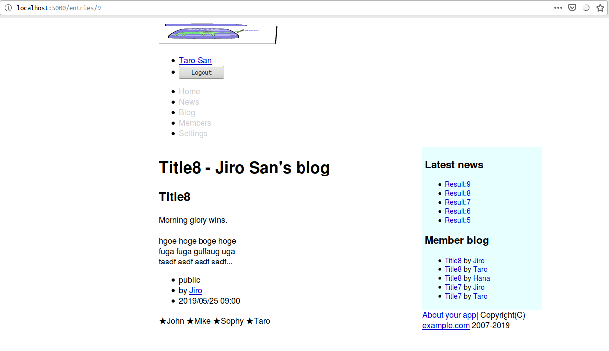
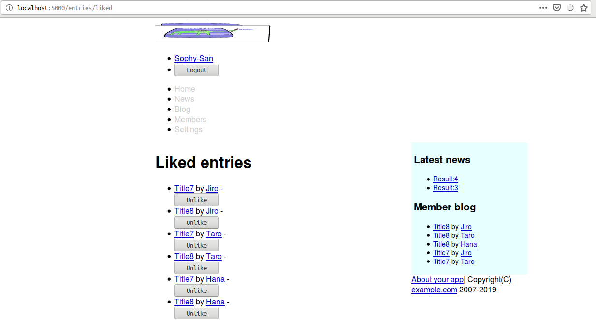

<!--  -->
# Caveman kills ruby on rails - Chapter 14
## Meta info
### 対象読者
* Cavemanに於いて多対多のモデリングを行いたいCLer。

## Introduction
本稿は[原著](https://book.impress.co.jp/books/1117101135)の各章をCommon Lispに翻訳するシリーズの第14章である。
本章ではCavemanにおける多対多のモデリングを修めていく。

## 14.1 Many to many relationship.

## 14.2 VOTE model
まずはモデルを定義。

```lisp
(defclass vote()
  ((entry :col-type entry :initarg :entry :accessor entry-of)
   (user :col-type user :initarg :user :accessor user-of))
  (:metaclass mito:dao-table-class))
```
テーブル作成。

```lisp
(with-connection(db)
  (mapc #'mito:ensure-table-exists '(user article entry entry-image vote)))
```
マイグレーション。

```lisp
(defun rebuild()
  (with-connection(db)
    (mapc #'mito:recreate-table '(user article entry entry-image vote)))
  (seeds))
```
ユーザを消すときにVOTEも消えるように。

```lisp
(defmethod mito:delete-dao :before((user user))
  (mito:delete-by-values 'vote :user-id (mito:object-id user))
  (mito:delete-by-values 'entry :user-id (mito:object-id user)))
```
エントリを消すときにVOTEも消えるように。

```lisp
(defmethod mito:delete-dao :before((o entry))
  (mito:delete-by-values 'vote :entry-id (mito:object-id o))
  (mito:delete-by-values 'entry-image :entry-id (mito:object-id o)))
```
ENTRYがUSERにとって投票可能か否か試験する述語。

```lisp
(defun votablep(entry user)
  (and entry
       (not (mito:object= user (author-of entry)))
       (null (mito:select-dao 'vote
                              (sxql:where (:and (:= :user-id (mito:object-id user))
                                                (:= :entry-id (mito:object-id entry))))
                              (sxql:limit 1)))))
```
シードデータを編集。

```lisp
(defun seeds()
  ...
          (let((user(mito:find-dao 'user :name name)))
            (when user
              (dotimes(x 10)
                (let((entry(mito:create-dao 'entry
                                            :user user
                                            :title (format nil "Title~D" x)
                                            :body body
                                            :date-posted (local-time:timestamp- now (- 10 x) :day)
                                            :status (nth (rem x 3)'("draft" "member-only" "public")))))
                  (when(find x '(7 8))
                    (dolist(name '("John" "Mike" "Sophy"))
                      (let((voter (mito:find-dao 'user :name name)))
                        (mito:create-dao 'vote :user voter :entry entry))))))))))
      )))
```

## 14.3 Like button.
### Index
#### templates/entries/index.html
テンプレートを修正。

```html
        </li>
        
        <li><span class="vote">★{{votes}}</span></li>
        
</ul>
```
テンプレートに引数を渡すようにルーティングを修正。

```lisp
(defroute entries-index "/entries" (&key id)
  (let*((author(when id
                 (mito:find-dao 'your-app.model::user :id id)))
        (entries(entries :author author)))
    (render "entries/index.html" `(:member ,author
                                           :user ,(current-user)
                                           :news ,(articles 5)
                                           :entries ,(loop :for entry :in entries
                                                           :for votes = (mito:count-dao 'your-app.model::vote :entry-id (mito:object-id entry))
                                                           :collect (cons entry (and (< 0 votes)
                                                                                     votes)))
                                           :blogs ,(subseq entries 0 5)
                                           ,@(roles)
                                           :token ,(token)
                                           ))))
```


### Show
#### templates/entries/show.html
テンプレートを修正。

```html



```

#### templates/entires/votes.html
部分テンプレートを作成。

```html
<div class="vote">
        
        ★{{voter.name}}
        
        
        
        <form action="/entries/{{entry.id}}/like" method="post">
                <input type="hidden" name="AUTHENTICITY-TOKEN" value="{{token}}">
                <input type="hidden" name="METHOD" value="post">
                <input type="submit" value="★Like!">
        </form>
        
</div>
```
引数をテンプレートに渡すようにルーティングを修正。

```lisp
(defroute show-entry "/entries/:id"(&key id)
  (with-authenticity-check(:logged-in)
    (ensure-let((entry(mito:find-dao 'your-app.model::entry :id id)))
      (let((entries(entries :limit 5))
           (user(current-user)))
        (render "entries/show.html" `(,@(roles)
                                       :entry ,entry
                                       :token ,(token)
                                       :user ,user
                                       :entries ,entries
                                       :blogs ,entries
                                       :news ,(articles 5)
                                       :member ,(your-app.model::author-of entry)
                                       :images ,(mito:retrieve-dao 'your-app.model::entry-image :entry-id id)
                                       :voters ,(mapcar #'your-app.model::user-of
                                                        (mito:retrieve-dao 'your-app.model::vote :entry-id id))
                                       :votablep ,(your-app.model::votablep entry user)
                                       ))))))
```


### Like
ディスパッチャを以下のように定義。

```lisp
(defroute ("/entries/:id/like" :method :post)(&key method id)
  (method-case method
    ("post" (like-entry (acons "ID" id(lack.request:request-body-parameters ningle:*request*))))))
```
postメソッドの本体を定義。

```lisp
(defun like-entry(request)
  (destructuring-bind(&key authenticity-token id &allow-other-keys)(request-params request)
    (with-authenticity-check((:token authenticity-token):logged-in)
      (ensure-let((entry(mito:find-dao 'your-app.model::entry :id id)))
        (mito:create-dao 'your-app.model::vote :user (current-user) :entry entry)
        (setf (gethash :notice ningle:*session*) "Voted")
        `(,status-code:+see-other+(:location ,(format nil "/entries/~A"id)))))))
```



## 14.4

### liked

#### templates/entries/liked.html
テンプレートを作成。

```html





<h1></h1>

<ul>
        
        <li>
                <a href="/entries/{{entry.id}}">{{entry.title}}</a>
                by
                <a href="/user/{{entry.author.id}}/entries">{{entry.author.name}}</a>
                -
                <form action="/entries/{{entry.id}}/like" method="post">
                        <input type="hidden" name="AUTHENTICITY-TOKEN" value="{{token}}">
                        <input type="hidden" name="METHOD" value="delete">
                        <input type="submit" value="Unlike">
                </form>
        </li>
        
</ul>

<p>No entries</p>


```
ルーティングを定義。

```lisp
(defroute "/entries/liked"(&key)
  (with-authenticity-check(:logged-in)
    (let*((user(current-user))
          (entries(mapcar #'your-app.model::entry-of
                          (mito:retrieve-dao 'your-app.model::vote :user-id (mito:object-id user)))))
      (render "entries/voted.html" `(,@(roles) :news ,(articles 5) :blogs ,(entries :limit 5) :token ,(token)
                                               :user ,user
                                               :entries ,entries
                                               )))))
```

#### templates/entries/index.html
indexを修正。

```html

<ul class="toolbar">
        <li><a href="/entries/new">Write blog</a></li>
        <li><a href="/entries/liked">Liked bog</a></li>
</ul>

```

### Destroy
ルーティングを以下のよう修正。

```lisp
(defroute ("/entries/:id/like" :method :post)(&key method id)
  (method-case method
    ("delete" (unlike-entry (acons "ID" id(lack.request:request-body-parameters ningle:*request*))))
    ("post" (like-entry (acons "ID" id(lack.request:request-body-parameters ningle:*request*))))))
```
本体は以下のように定義。

```lisp
(defroute unlike-entry("/entries/:id/like" :method :delete)(&key authenticity-token id)
  (with-authenticity-check((:token authenticity-token):logged-in)
    (ensure-let((entry(mito:find-dao 'your-app.model::entry :id id)))
      (mito:delete-dao(mito:find-dao 'your-app.model::vote
                                     :user-id (mito:object-id(current-user))
                                     :entry-id (mito:object-id entry)))
      (setf(gethash :notice ningle:*session*)"Unliked")
      `(,status-code:+see-other+(:location "/entries/liked")))))
```



## Summary
* リレーショナルデータベースで多対多の関連付けを行うときには、２テーブル間の結びつきを記録するための中間テーブルを別途用意します。
* 中間テーブルのためのモデルでは、各テーブルを:COL-TYPEで指定します。

<!--  -->
