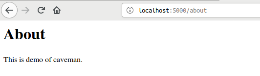
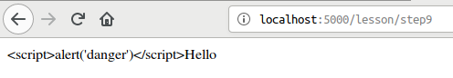
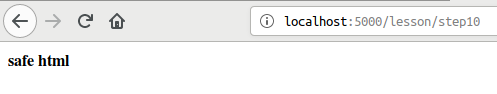
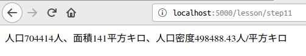
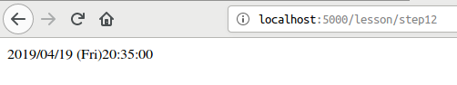
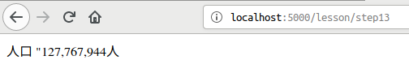
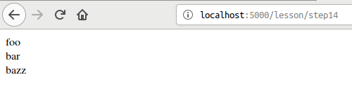
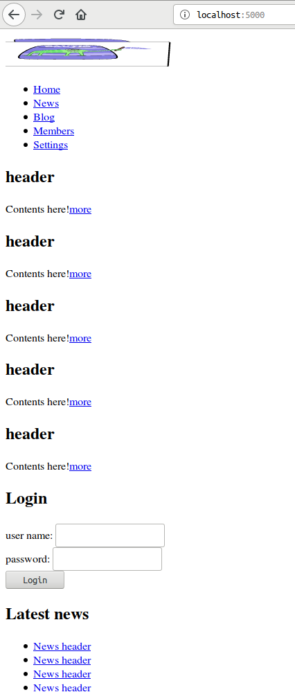
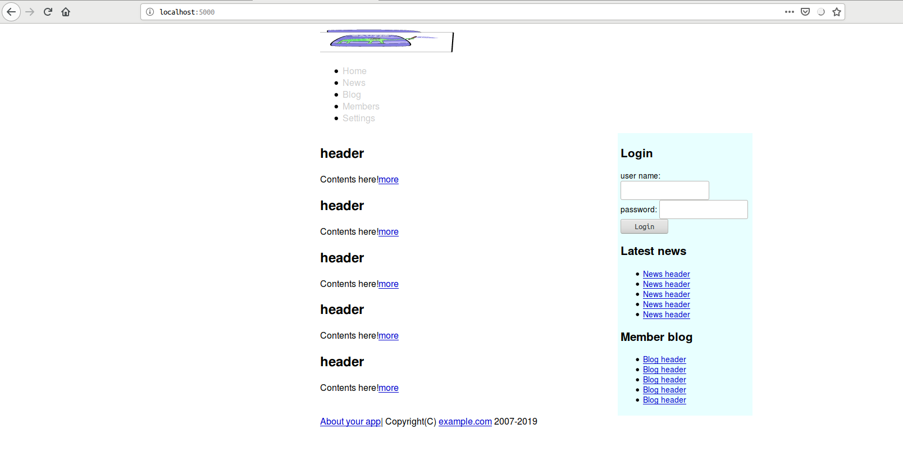

<!--  -->
# Caveman kills ruby on rails - Chapter 3
## Meta info
### 対象読者
* [Caveman](http://8arrow.org/caveman/)とそのテンプレートエンジンである[djula](https://mmontone.github.io/djula/)に興味のあるCLer

## Introduction
本稿は[原著](https://book.impress.co.jp/books/1117101135)の各章をCommon Lispに翻訳するシリーズの第3章である。
本章ではCavemanの基礎とDjulaの基礎を修めていく。

## ルーティングの追加
web.lispに以下の宣言を追加しよう。

```lisp
(defroute "/about"()
  (render #P"about.html" '(:page-title "About")))
```

templatesディレクトリ下にabout.htmlファイルを作る。
中身は以下である。

```html
<p>This is demo of caveman.</p>
```


## CAVEMAN2.ROUTE:DEFROUTEの詳細
bnfはだいたい以下の通り。

ここで「だいたい」と言っているのは、これが公式のドキュメントではなく僕がソースコードをなめまわして書いたものだからだ。
僕個人はあらゆるマクロはbnfを持つべきと思っているので、公式にbnfがないのは遺憾である。
Common Lispのマクロが分かりにくいと不評を買うのは、マクロという形で新しい言語が作られているのに、その言語のbnfがないからだと思っている。
bnfすら存在しないプログラミング言語を習いたいかと自問自答すれば、僕の答えはNOである。

```
(defroute name? routing-rule routing-lambda-list body*)

name := symbol ; not evaluated.

routing-rule := [ rule-string | full-rule ]
rule-string := string
full-rule := (rule-generate-form &key method identifier regexp &allow-other-keys)
rule-generate-form := form ; which generate rule-string, evaluated.
method := [ :get | :post | :put | :delete | :options ]
identifier := internal-use ; ignorable.
regexp := boolean ; you need specify T when rule string has regexp.

routing-lambda-list := list

body := form\*
```

### name
これは通常無視できる。
すなわち指定しなくともよい。
指定するとそのシンボルに一引数関数が定義され、デバッグが少し楽になる。

定義された関数が受け取る引数は、routing-lambda-listへと渡す引数をまとめたものである。

### rule-string
もっとも単純なものは、ただのパスである。
(e.g. "/")

キーワードを含むと`&KEY`で受けられるようになる。

```lisp
(defroute "/hello/:name" ; <--- Specified keyword
          (&key name)    ; <--- is passed as parameter.
  (format nil "Hello, ~A" name))
```

wildcardを含むと`&KEY SPLAT`で受けられるようになる。

```lisp
(defroute "/say/*/to/*" (&key splat)
  ; matches /say/hello/to/world
  (format nil "~A" splat))
;=> (hello world)

(defroute "/download/*.*" (&key splat)
  ; matches /download/path/to/file.xml
  (format nil "~A" splat)) 
;=> (path/to/file xml)
```

キーワード引数で:REGEXPを指定すれば正規表現も使える。

```lisp
(defroute ("/hello/([\\w]+)" :regexp t) (&key captures)
  (format nil "Hello, ~A!" (first captures)))
```

'?'でキーワードを囲めば２種類のパスを同時に作れる。

```lisp
(defroute "/hello/?:name?"(&key name)
  (format nil "Hello ,~A" name))
```
上記のルーティングには"/hello/hoge"でも"/hello?NAME=hoge"でもアクセスできる。
クエリ文字列のキーを大文字で指定しなければならない点要注意。
"/hello?name=hoge"にアクセスすると変数`name`はNILに束縛されることとなる。

クエリ文字列のキーを小文字での指定にしたい場合は、&KEYで受ける変数を縦棒で囲めば対応できる。

```lisp
(defroute "/hello/?:name?"(&key |name|)
  (format nil "Hello ,~A" |name|))
```
しかしそうすると"/hello/hoge"という形でアクセスした場合、変数|name|がNILに束縛されてしまう。

この'?'で囲む記法がcavemanのREADMEに載っていないのは、作者自身が使ってもらいたくないと思っているからなのかもしれない。

### routing-lambda-list
通常のラムダリスト(ordinary-lambda-list)に見えて、その実、異なるものなので、ここではあえてrouting-lambda-listと名付けている。
このラムダリストはURIに含まれるクエリパラメタやキーワードで指定したパス変数などをキーワード引数として受け付ける用のものである。
ここで重要な点が3つある。

1つめはrouting-ruleで指定したキーワード、ないし`&KEY`で指定したクエリパラメタのみが引数として渡されてくるという点である。
たとえば以下のようなroutingがあったとしよう。

```lisp
(defroute "/hello"(&rest args)
  (format nil "~S" args))
```

"/hello?a=1&b=2"にアクセスされたとき`ARGS`には何が入るだろうか？
答えはNIL、すなわち引数はない。
`&KEY`による指定がないからである。

2つめは（前節の繰り返しになるが）クエリパラメタを`&KEY`で指定するばあい、その`SYMBOL-NAME`がキーとなる点だ。
たとえば以下のようなroutingがあったとしよう。

```lisp
(defroute "/hello"(&key name)
  (format nil "~S"name))
```

この場合URIに含まれるクエリ変数キーは通常大文字でなければならない。
（すなわち"/hello?NAME=anonymous"）
「通常」としたのは、これが`CL:READTABLE-CASE`に依存しており、その値は設定可能だからだ。
多くの処理系は`:UPCASE`を規定値としているので、設定していないのなら通常、`CL:SYMBOL-NAME`は大文字となる。

`CL:READTABLE-CASE`の影響を受けたくないのであれば、縦棒でシンボルを包むのが良い。
縦棒で包まれたシンボルは`CL:READTABLE-CASE`の値によらず、ケースが保持されるからだ。
変数名がたとえば`|name|`とされた場合、たとえ`CL:READTABLE-CASE`が`:UPCASE`であっても、`NAME`と大文字に畳み込まれることなく`|name|`となりケースが保持される。

この点READMEに解説がなく、天下りな指示になっているのは不親切だと思う。

さて3つめの注意点だが、`&KEY`で渡す変数のシンタックスが通常のシンタックスとは異なる点である。
Common Lispのキーワード引数は（マニアックな機能ではあるが）公開キーと内部変数とを別のものにすることが可能である。

```lisp
((lambda(&key((:external internal) :initial-value))
    internal)
  :external 3)
; => 3
```
これは主にスペシャル変数の初期値をキーワード引数で受け取りたい場合便利である。

```lisp
((lambda(&key((:stream *standard-output*)*standard-output*))
    ...)
 :stream *debug-io*)
```
この記法がなければ`LET`で明示的に束縛し直さなければならなくなる。

CAVEMAN2.ROUTE:DEFROUTEでこの記法はサポートされていない。

```lisp
(defroute "/hello" (&key ((:|name| name)))
  (format nil "Hello ,~A" name))
```
いちいち縦棒で変数名をくくるのは面倒なので、上記のように書けたら嬉しいと思ったのだが、そんなことはできない。

READMEに説明がないのは不親切だと思う。

### body
返り値は以下のいずれかである。

#### string
文字列がかえされた場合、それがContent-Type: text/htmlのボディとしてクライアントに送られる。
#### pathname
パスネームが返された場合、そのファイルの中身がContent-Type: text/htmlのボディとしてクライアントに送られる。
#### list
リストが返された場合、以下のフォーマットになっていなければならない。

```lisp
(status-code http-headers &optional body)
```

##### status-code
整数で指定する。
##### http-headers
READMEに出てくる`(:content-type "text/plain")`以外の情報が皆無である。
httpレスポンスのヘッダを指定するものらしいのは分かるのだが、それしかわからない。
色々調べた結果、以下のことが判明した。

* キーバリューのPLIST形式で指定する。
* キーはキーワードシンボルか文字列で指定する。
  * 通常のシンボルも使用可能だが、その場合既定値が存在するとヘッダに重複して現れる。（おそらく`CL:EQUALP`で比較されている）
  * 文字列で指定した場合、文字ケースは無視されて正規化される。

ドキュメントに何も記されていないのは不親切だと思う。
##### body
READMEに出てくる`("Hello, Clack!")`以外の情報が皆無である。
わざとエラーを起こして調べたところ、LISTかPATHNAMEか(VECTOR(UNSIGNED-BYTE 8))かのいずれかでないとだめらしい。

* LISTを返す場合、各要素は文字シーケンスでなければならず、各シーケンスが連結されて送られる。
* pathnameを返す場合、そのファイルの中身がContent-Typeとして送られる。
* (VECTOR(UNSIGNED-BYTE 8))を返す場合、それがContent-Typeとして送られる。

ドキュメントに何も記されていないのは不親切だと思う。

## Controller and action
RailsではControllerはクラスであり、そのパブリックメソッドをアクションとする。
Cavemanでは前節で見てきた`CAVEMAN2.ROUTE:DEFROUTE`マクロがControllerであり、かつアクションであろう。

Railsのスタイルを褒めて言えば「きれいに整理整頓されている」となろう。
悪く言えば「過剰に分割されている」とも言えよう。
Railsのスタイルを受け入れてしまえば、一つ一つはコンパクトであり、どこに何があるかはかなり明確だ。
ただスタイルになれるまではどこに何があるか、覚えなければならないものは多い。

Cavemanのスタイルはその逆で、悪く言うなら「とっちらかっている」となろう。
褒めて言えば「ほどよくまとまっている」とも言えよう。
ファイルの分割などはプログラマの責任として放置されている。
よってCaveman自体は最低限の分割しかしておらず、Caveman-projectの初期構造を把握するのは容易である。

これは良し悪しの問題ではなく向き不向きの問題だろう。
この場合の「向き不向き」は、プログラマ個々人の向き不向き、プロジェクトの大小による向き不向き、そしてチーム単位による向き不向きとがあろう。

## 練習の準備
web.lispに以下のroutingを定義する。

```lisp
(defroute "/lesson/step*"(&key splat)
  (case(parse-integer (car splat) :junk-allowed t)
    ))
```

## STEP1 parameterの取得
Cavemanではrouting-rule次第でパラメタの取扱が異なってくる。

### ディレクトリスタイル
URIを"/lesson/step1/Sato"という形で受けたいなら、以下のようにする。

```lisp
(defroute "/lesson/step*/:name"(&key splat name)
  (case(parse-integer (car splat) :junk-allowed t)
    (1 (format nil "Hello, ~A" name))
    ))
```

### クエリスタイル
クエリパラメタで受けたい（e.g. "/lesson/step1?name=Sato"）なら以下のようにする。

```lisp
(defroute "/lesson/step*"(&key splat (|name| "Anonymous"))
  (case(parse-integer (car splat) :junk-allowed t)
    (1 (format nil "Hello, ~A" |name|))
    ))
```

### Railsスタイル
Railsのようにどちらでも受けたいという場合、'?'でキーを囲む記法を利用する。
ただしここではワイルドカードを使ってしまっているので、組み合わせては使えない。

## STEP3 リダイレクション
以下のようにする。
なおコードが大きくなるので一部省略している点要注意。

```lisp
(defroute "/lesson/step*"(&key splat name)
  (case(parse-integer (car splat) :junk-allowed t)
    ...
    (3 '(302 (:location "/lesson/step4")))
    (4 "Moved to step4")
    ))
```

## STEP5 フラッシュ
Cavemanではフラッシュに相当する機能は提供されていないようだ。
必要なら泥臭く自作する。
幸い`NINGLE/CONTEXT:*SESSION*`が提供されているのでさほど難しくはない。
`NINGLE/CONTEXT:*SESSION*`はハッシュテーブルで、各セッションごとに値を保持できる。

```lisp
(defroute "/lesson/step*"(&key splat name)
  (case(parse-integer (car splat) :junk-allowed t)
    ...
    (5 (setf(gethash :notice *session*)"Move to step6")
     `(302 (:location "/lesson/step6")))
    (6 (let((notice(gethash :notice *session*)))
         (remhash :notice *session*)
         notice))
    ))
```

## Template
Cavemanではテンプレートエンジンとして[djula](TODO)を採用している。

### STEP7 Basic
Contoroller側で以下のようにする。

```lisp
(defroute "/lesson/step*"(&key splat name)
  (case(parse-integer (car splat) :junk-allowed t)
    ...
    (7 (render "step7.html" `(:price ,(floor(* 2000 1.08)))))
    ))
```

templatesディレクトリ下に対応するhtmlファイルを作り以下のようにする。

```html
<p>{{price}}yen</p>
```

### STEP8 about YOUR-APP.VIEW:RENDER function.
RENDER関数はsrc/view.lispに定義されている。
第一引数はテンプレートファイルの所在を表すPATHNAMEないしSTRINGである。
第二引数はオプショナルでテンプレートに渡す引数をリストにくくったものとなる。

```lisp
(defroute "/lesson/step*"(&key splat name)
  (case(parse-integer (car splat) :junk-allowed t)
    ...
    (8 (render "step7.html" '(:price 1000)))
    ))
```

### STEP9 HTML特殊文字の変換
RENDER関数に渡された文字列は通常エスケープ処理される。

Controllerは以下の通り。

```lisp
(defroute "/lesson/step*"(&key splat name)
  (case(parse-integer (car splat) :junk-allowed t)
    ...
    (9 (render "step9.html" '(:comment "<script>alert('danger')</script>Hello")))
    ))
```

Viewは以下の通り。

```html
<p>{{comment}}</p>
```


あえてHTMLを埋め込みたい場合はView側で変数参照の後ろにsafeをつける。

Controllerは以下の通り。

```lisp
(defroute "/lesson/step*"(&key splat name)
  (case(parse-integer (car splat) :junk-allowed t)
    ...
    (10 (render "step10.html" '(:comment "<strong>safe html</strong>")))
    ))
```
Viewは以下の通り。

```html
<p>{{comment | safe}}</p>
```


## philosophy of djula
Cavemanのテンプレートエンジンはdjulaであり、djulaの哲学は「Viewはロジックを担うべきではない」だ。

たとえばRailsのテンプレートエンジンと異なり、djulaではView側で変数を作ったり代入したりができない。
変数は必ずRENDER経由で渡されたものでなくてはならない。

formatも一引数フィルターとしてしか使えない。
複雑な文字列はContoller側で作って渡せという考えである。

```lisp
(defroute "/lesson/step*"(&key splat name)
  (case(parse-integer (car splat) :junk-allowed t)
    ...
    (11 `(200 (:content-type "text/html; charset=utf-8")
          (,(let((population 704414)
                 (surface 141.31))
              (your-app.view:render "step11.html" '(:contents ,(format nil "人口~D人、面積~D平方キロ、人口密度~,,2F人/平方キロ"
                                                                       population (floor surface)(/ population surface))))))))
    ))
```

View側は以下の通り。

```html
<p>{{contents}}</p>
```


日付については以下の通り。

```lisp
(defroute "/lesson/step*"(&key splat name)
  (case(parse-integer (car splat) :junk-allowed t)
    ...
    (12 (render "step11.html"
                `(:contents ,(local-time:format-timestring
                                nil
                                (local-time:now)
                                :format
                                '((:year 4)"/"(:month 2)"/"(:day 2)"(" :short-weekday ") "
                                  (:hour 2)":"(:min 2)":"(:sec 2))))))
    ))
```


簡単なフィルターならdjula自身が持っている。

Controllerは以下の通り。

```lisp
(defroute "/lesson/step*"(&key splat name)
  (case(parse-integer (car splat) :junk-allowed t)
    ...
    (13 `(200 (:content-type "text/html; charset=utf-8")
          (,(render "step13.html" '(:population 127767944)))))
    ))
```

Viewは以下の通り。

```html
<p>人口{{ population | format: "~:D" }}人</p>
```


なお、数字の表示が'"127,767,944'というような形で、先頭にダブルクォートがついて表示されてしまうが、おそらくはこれはdjulaのバグである。
面倒なのでここでは無視する。


## カスタムフィルターの定義。
djulaのドキュメントにはTODOとなっている。
公開されていない内部DSLだが、無理やり利用して自作フィルターを作ることとする。

view.lispに以下のコードを追加する。

```lisp
(djula::def-filter :break(it)
  (cl-ppcre:regex-replace-all #\newline it "<br />"))
```

Controller側は以下の通り。

```lisp
(defroute "/lesson/step*"(&key splat name)
  (case(parse-integer (car splat) :junk-allowed t)
    ...
    (14 (render "step14.html" `(:contents ,(format nil "foo~%bar~%bazz"))))
    ))
```

View側は以下の通り。

```html
<p>{{contents|break|safe}}</p>
```


## STEP15 Link
いい具合にリンクを処理してくれる機能などない。

Controller側は以下の通り。

```lisp
(defroute "/lesson/step*"(&key splat name)
  (case(parse-integer (car splat) :junk-allowed t)
    (15 (render "step15.html"))
    ))
```

View側は以下の通り。
手でごりごり書くよりほかない。

```html
<p><a href="/">Home</a></p>
```

## Image
画像をいい具合にリンクしてくれる機能などない。

まずは[ここ](http://www.lisperati.com/lisplogo.svg)から画像をダウンロードしておく。
保存箇所は"static/images/"とする。

Controllerは以下の通り。

```lisp
(defroute "/lesson/step*"(&key splat name)
  (case(parse-integer (car splat) :junk-allowed t)
    ...
    (16 (render "step16.html"))
    ))
```

Viewは以下の通り。

```lisp
<p>Powered by</p>
```

## 条件分岐
djulaで条件分岐は以下のようにして行う。

まずはControllerを。

```lisp
(defroute "/lesson/step*"(&key splat name)
  (case(parse-integer (car splat) :junk-allowed t)
    ...
    (17 `(200 (:content-type "text/html; charset=utf-8")
          (,(let((stock 0))
              (render "step17.html" `(:stock-zerop ,(< 0 stock) :stock ,stock))))))
  ))
```

Viewは以下の通り。

```html

残り{{stock}}個です。

品切れです。

```

## 繰り返し
djulaでの繰り返しは以下のようにする。

まずはControllerを。

```lisp
(defroute "/lesson/step*"(&key splat name)
  (case(parse-integer (car splat) :junk-allowed t)
    ...
    (18 (render "step18.html" '(:items ((:pan . 2680)(:glass . 2550)(:pepper-mill . 4515)(:peeler . 945)))))
  ))
```

Viewは以下の通り。

```html
<table border="1" cellpadding="4">
        
        <tr>
                <th>{{key}}</th>
                <td style="text-align: right">{{val|format: "~:D"}}yen</td>
        </tr>
        
</table>
```

## Mockup
これまではテンプレートファイルを単独で使ってきた。

もちろんこれらは組み合わせて使うことができる。

下準備としてsrc/view.lispの末尾を以下のように編集する。

```lisp
(defpackage your-app.djula
  (:use :cl)
  (:import-from :your-app.config
                :config
                :appenv
                :developmentp
                :productionp)
  (:import-from :caveman2
                :url-for)
  (:export #:title) ; <--- Add.
  )

(in-package :your-app.djula)

(defun title(&optional sub)
  (format nil "~@[~A - ~]~:(~A~)"sub #.(asdf:coerce-name(asdf:find-system :your-app))))
```

準備ができたらtemplates/layouts/下にレイアウトテンプレートファイルを作って以下のようにする。
ファイル名はdemo.htmlとした。

```html
<!DOCTYPE html>
<html>
<head>
  <meta charset="utf-8">
  <title></title>
  <link rel="stylesheet" type="text/css" media="screen" href="/css/main.css">
</head>
<body>
  
</body>
</html>
```

レイアウトテンプレートを使うには、各テンプレートファイルの先頭で使用すべきレイアウトテンプレートを指定しなければならない。
トップページのレイアウトを変更するには対応するテンプレートファイル（ここではtemplates/index.html）を以下のように編集する。

```html



<h2>{{message}}</h2>
<p>Here we go.</p>

```

レイアウトテンプレートで宣言されている名前付きブロックを、各テンプレートで指定することで置換するという振る舞いである。

## レイアウトテンプレートの切り替え。
おそらくはできない。
djulaはそのための機能を提供していないように見える。
どうしてもやりたいなら泥臭く自作するしかない。
ここでは無視する。

## 部分テンプレート
親テンプレートからRENDER関数を呼び出すことで対応する。

templates/layouts/下にapp.htmlテンプレートを作ろう。

```html
<!DOCTYPE html>
<html>
<head>
        <meta charset="utf-8">
        <title></title>
        <link rel="stylesheet" type="text/css" media="screen" href="/css/main.css">
</head>
<body>
        <div id="container">
                <header>
                        
                </header>
                <main>
                
                </main>
                <aside id="sidebar">
                        
                </aside>
                <footer>
                        
                </footer>
</body>
</html>
```

templates/下にsharedディレクトリを掘り、部分テンプレートを記述していく。

まずはheader.html

```html


<nav class="menubar">
        <ul>
                <li><a href="/">Home</a></li>
                <li><a href="#">News</a></li>
                <li><a href="#">Blog</a></li>
                <li><a href="#">Members</a></li>
                <li><a href="#">Settings</a></li>
        </ul>
</nav>
```

sidebar.html

```html


<h2>Latest news</h2>
<ul>
        
        <li><a href="#">News header</a></li>
        
</ul>

<h2>Member blog</h2>
<ul>
        
        <li><a href="#">Blog header</a></li>
        
</ul>
```

login_form.html

```html


<h2>Latest news</h2>
<ul>
        
        <li><a href="#">News header</a></li>
        
</ul>

<h2>Member blog</h2>
<ul>
        
        <li><a href="#">Blog header</a></li>
        
</ul>
```

footer.html

```html
<a href="/about">About your app</a>|
Copyright(C) <a href="#">example.com</a>
2007-2019
```

Controller側を以下のようにする。

```lisp
(defroute "/" ()
  (render #P"index.html" '(:numbers (1 2 3 4 5))))
```



## Stylesheet
Cavemanではstatic/css/下に配置する。
ここではapp.cssという名前とする。

```css
/* whole pages */
body {
        background-color: white;
        color: black;
        margin: 0; padding: 0;
        font-family: Meiryo, sans-serif;
}

/* link */
a:link { color: #00c; }
a:visited { color: #00c; }
a:hover { color: #f00; }
a img { border: none; }

/* whole border */
div#container {
        margin: 0 auto;
        padding-top: 5px;
        width: 780px;
}

/* left pane */
main {
        float: left;
        width: 530px;
        padding: 10px, 10px, 10px, 0;
}

/* right pane */
aside#sidebar {
        float: left;
        width: 230px;
        background-color: #e8ffff;
        padding: 5px;
        font-size: 86%;
}

/* link of menubar */
nav.menubar a { text-decoration: none; }

/* link of menubar (not visited) */
nav.menubar a:link { color: #ccc; }

/* link of menubar (visited) */
nav.menubar a:visited { color: #ccc; }
```



## まとめ

* Cavemanは、HTTPプロトコルでリクエストを受け取ると、ルーティングルールに従って関数（アクション）を呼び出します。
* コントローラの中には、複数のアクションが含まれ得ます。コントローラもアクションもただの関数です。
* アクション関数はSTRINGないしPATHNAMEないしLISTを返します。LISTの場合、HTTP-STATUS-CODE、HTTPレスポンスヘッダPLIST、bodyの3要素で、bodyは文字シーケンスのLISTないしPATHNAMEないし(VECTOR(UNSIGNED-BYTE 8))でなくてはなりません。
* アクション関数ではRENDER関数を呼ぶことでDjulaテンプレートを利用したレンダリングが可能です。
* テンプレートの中ではリキッドタグを使用する形でdjulaDSLを使用できます。
* サイト中のページで共通して使う全体の枠を作るにはレイアウトテンプレートを利用します。ページ内のパーツは部分テンプレートで作成できます。
* サイトの色やフォントはスタイルシートで設計します。
<!--  -->
