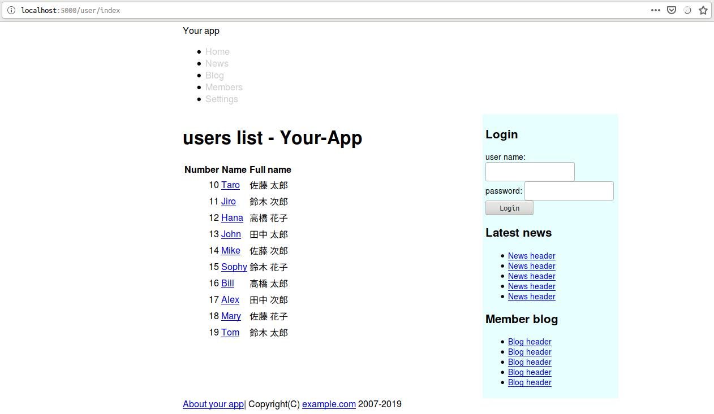
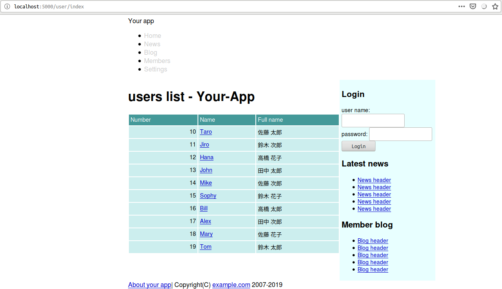
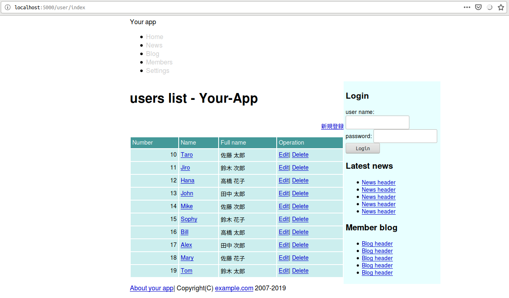
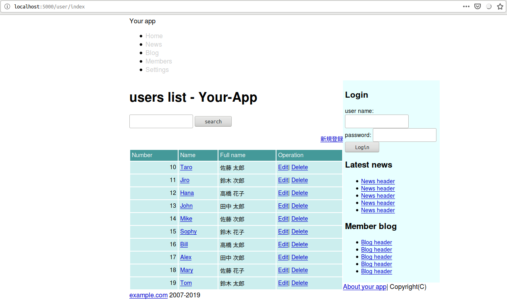
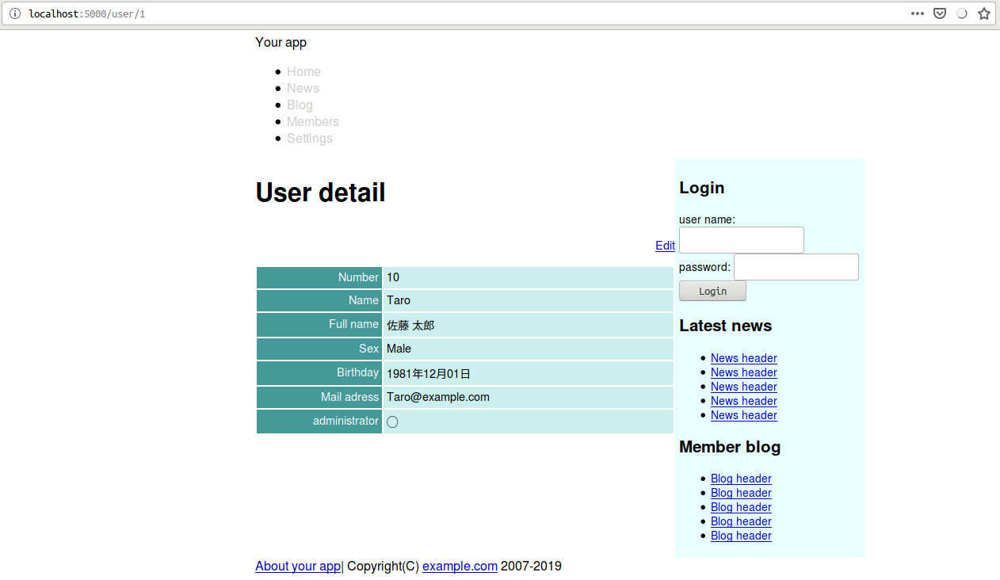

<!--  -->
# Caveman kills ruby on rails - Chapter 5
## Meta info
### 対象読者
* [Caveman](http://8arrow.org/caveman/)と[djula](http://mmontone.github.io/djula/)について学びたいCLer

## Introduction
本稿は[原著](https://book.impress.co.jp/books/1117101135)の各章をCommon Lispに翻訳するシリーズの第5章である。
本章ではリソースベースのルーティングを通してCavemanとdjulaの作法を復習していく。

## 5.1 REST and routing
CavemanにはRailsにおけるリソースに相当するものはない。
レールに乗って素早く動くことはできない。
自身が進むべき坑道を自身で掘り進むのがCavemanの流儀といったところか。

## 5.2 Seven actions
### INDEX

templates/shared/header.htmlのリンクを編集する。

```html
<nav class="menubar">
        <ul>
                <li><a href="/">Home</a></li>
                <li><a href="#">News</a></li>
                <li><a href="#">Blog</a></li>
                <li><a href="/user/index">Members</a></li>
                <li><a href="#">Settings</a></li>
        </ul>
</nav>
```

DEFROUTEは以下の通り。

```lisp
(defroute index "/user/index"()
  (render "user/index.html" `(:users ,(mito:select-dao 'your-app.model::user
                                                       (sxql:order-by :number)))))
```

templates/user/index.htmlを作成し、以下のようにする。

djulaでオブジェクトのスロットへのアクセスには変数名に続き"."でスロット名を指定すれば良い。

```html



<h1></h1>

<table class="list">
        <thead>
                <tr>
                        <th>背番号</th>
                        <th>ユーザー名</th>
                        <th>指名</th>
                </tr>
        </thead>
        <tbody>
                
                <tr>
                        <td style="text-align: right">{{user.number}}</td>
                        <td>{{user.name}}</td>
                        <td>{{user.full-name}}</td>
                </tr>
                
        </tbody>
</table>

<p>会員情報がありません</p>


```


### Apply css
static/css/app.cssに以下のコードを追加する。

```css
/* table */
table.list, table.attr {
        font-size: 90%;
        width: 100%;
}

table.list th, table.attr th {
        background-color: #499;
        color: white;
        font-weight: normal;
}

table.list td, table.list th,
table.attr td, table.attr th {
        padding: 4px;
}

table.list th {
        text-align: left;
}

table.attr th {
        text-align: right;
}

table.list td, table.attr td {
        background-color: #cee;
}
```



### Links
各種リンクの追加を行う。
templates/user/index.htmlを以下のように追加編集する。

```html
<h1></h1>

<div class="toolbar"><a href="/user/new">新規登録</a></div>


```

static/css/app.cssに以下のコードを追加する。

```css
/* toolbar */
ul.toolbar,
div.toolbar {
        padding: 15px 0;
        font-size: 90%;
        text-align: right;
}
```
templates/user/index.htmlに編集用のテーブルヘッダを追加する。

```html
        <thead>
                <tr>
                        <th>Number</th>
                        <th>Name</th>
                        <th>Full name</th>
                        <th>Operation</th>
                </tr>
        </thead>
```
同様にテーブルデータを追加する。

```html
                
                <tr>
                        <td style="text-align: right">{{user.number}}</td>
                        <td>
                                <a href="/user/{{user.id}}/">{{user.name}}</a>
                        </td>
                        <td>{{user.full-name}}</td>
                        <td>
                                <a href="/user/{{user.id}}/edit">Edit</a>|
                                <a data-confirm="Really delete it?" rel="nofollow" data-method="delete" href="/user/{{user.id}}">Delete</a>
                        </td>
                </tr>
                
```



### Search
検索機能追加のためにsrc/web.lispに以下のコードを追加する。

```lisp
(defroute "/user/search"(&key |q|)
  (render "user/index.html"
          `(:users ,(mito:select-dao 'your-app.model::user
                                     (sxql:where `(:or (:like :name ,|q|)
                                                       (:like :full-name ,|q|)))
                                     (sxql:order-by :number)))))
```

templates/user/index.htmlにフォームを追加する。
便利ヘルパーなど存在しないので、ここでは手でゴリゴリ書く。

```html
<form class="search" action="/user/search" accept-charset="UTF-8" method="get">
        <input name="utf8" type="hidden" value="&#x2713;" />
        <input type="text" name="q" id="q" />
        <input type="submit" name="commit" value="search" data-disable-with="search" />
</form>
```


### Detail
ユーザーの詳細を見れるページを追加する。
src/web.lispにルーティングを追加する。

```lisp
(defroute "/user/:id"(&key id)
  (setf id (parse-integer id))
  (render "user/show.html"
          `(:user ,(mito:find-dao 'your-app.model::user :id id))))
```

上記ルーティングのためのテンプレートを/templates/user/show.htmlとして作る。

```html



<h1>User detail</h1>

<div class="toolbar"><a href="/user/{{id}}/edit">Edit</a></div>

<table class="attr">
        <tr>
                <th width="150">Number</th>
                <td>{{user.number}}</td>
        </tr>
        <tr>
                <th>Name</th>
                <td>{{user.name}}</td>
        </tr>
        <tr>
                <th>Full name</th>
                <td>{{user.full-name}}</td>
        </tr>
        <tr>
                <th>Sex</th>
                <td>
                        
                        Male
                        
                        Female
                        
                </td>
        </tr>
        <tr>
                <th>Birthday</th>
                <td>
                        {{ user.birthday|
                        lisp: local-time:timestamp-to-universal|
                        date: ((:year 4)"年"(:month 2)"月"(:day 2)"日") }}
                </td>
        </tr>
        <tr>
                <th>Mail adress</th>
                <td>{{user.email}}</td>
        </tr>
        <tr>
                <th>administrator</th>
                <td>
                        
                        ◯
                        
                        ー
                        
                </td>
        </tr>
</table>

```



## Summary
* RESTとは、リソースという概念を中心にしてウェブアプリケーションを組み立てる考え方です。
* リソースの一覧ページはindexアクション、詳細情報のページはshowアクションで実装します。
<!--  -->
