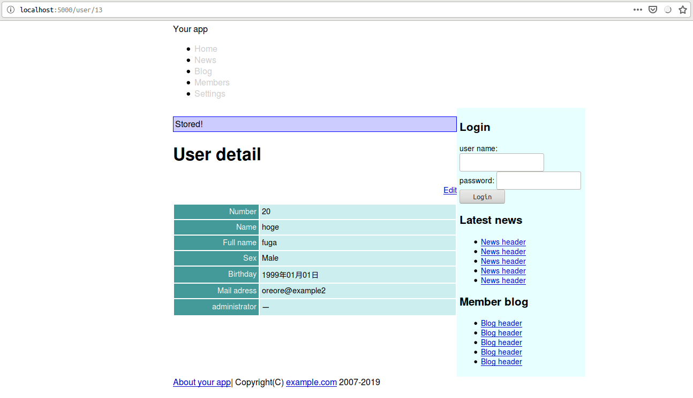
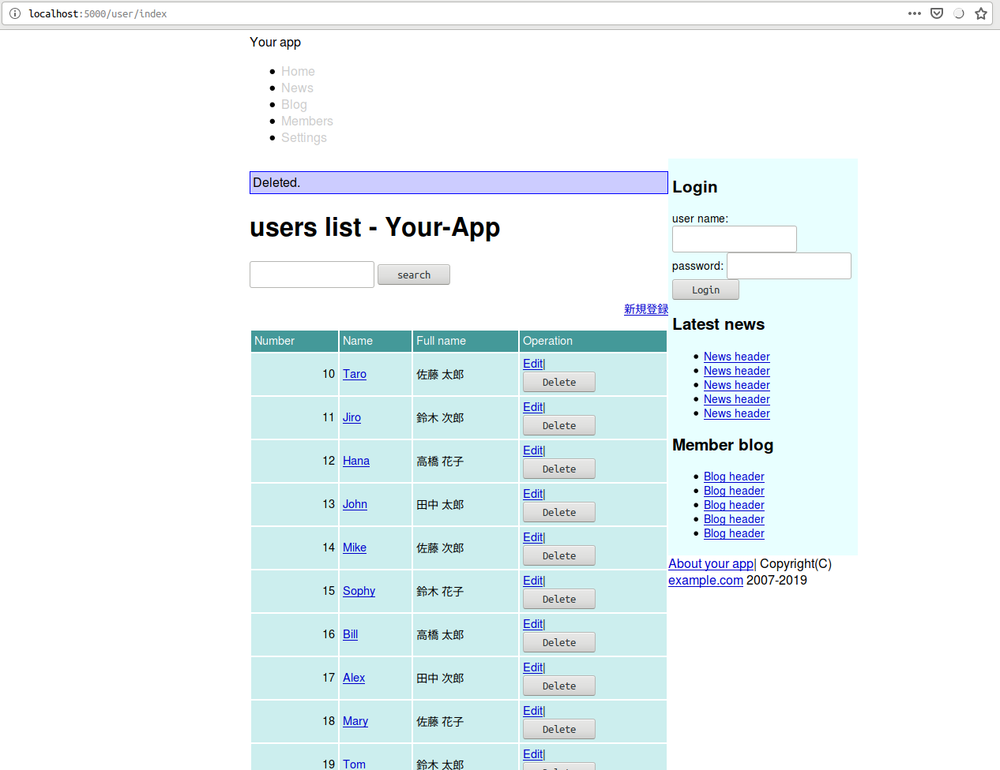

<!--  -->
# Caveman kills ruby on rails - Chapter 6
## Meta info
### 対象読者
* CavemanでCSRF対策をしたいCLer

## NOTE
筆者はcavemanを捨て[snooze](https://github.com/joaotavora/snooze)を使うようになった。
詳細は[ここ](why-snooze.html)に記してある。

## Introduction
本稿は[原著](https://book.impress.co.jp/books/1117101135)の各章をCommon Lispに翻訳するシリーズの第5章である。
本章ではnew、edit、destroyアクションを作成していきながらCavemanの作法を修めていく。

## 6.1 Forms and models
### CSRF対策
Cavemanにそんな機能はない。
幸いCavemanは下層の[lack](https://github.com/fukamachi/lack)-request経由でcookieをサポートしている。
セッショントークンを取り出すヘルパーは以下のようなコードになるだろう。

```lisp
(defun token ()
  (cdr (assoc "lack.session" (lack.request:request-cookies ningle:*request*)
              :test #'string=)))
```
あとはこれを利用して自前で作ればいい。
フォームを含むhtmlテンプレートのレンダリングには必ずトークンを引数として渡すようにする。

### new and edit
Newのルーティングは以下の通り。

```lisp
(defroute "/user/new"()
  (render "user/new.html"
          `(:user ,(make-instance 'your-app.model::user)
                  :token ,(token))))
```

Editのルーティングは以下の通り。

```lisp
(defroute "/user/:id/edit"(&key id)
  (let*((id(ignore-errors(parse-integer id)))
        (user(and id (mito:find-dao 'your-app.model::user :id id))))
    (if user
      (render "user/edit.html" `(:user ,user :token ,(token)))
      (on-exception *web* 404))))
```

### Form template
Cavemanにはformをいい具合に作ってくれるメソッドなどない。
手でゴリゴリ書く。

共通する入力フォームを担うテンプレートは以下の通り。
これをtemplates/user/form.htmlとして作成する。

```html
<table class="attr">
        <tr>
                <th><label for="user-number">Number</label></th>
                <td><input size="8" type="text" name="number" value="{{user.number}}" id="user-number" /></td>
        </tr>
        <tr>
                <th><label for="user-name">Name</label></th>
                <td><input type="text" value="{{user.name}}" name="name" id="user-name" /></td>
        </tr>
        <tr>
                <th><label for="user-full-name">Full Name</label></th>
                <td><input type="text" value="{{user.full-name}}" name="full-name" id="user-full-name" /></td>
        </tr>
        <tr>
                <th>Sex</th>
                <td>
                        <input type="radio" value="1" checked="checked" name="sex" id="member-sex-1" />
                        <label for="member-sex-1">Male</label>
                        <input type="radio" value="2" checked="checked" name="sex" id="member-sex-2" />
                        <label for="member-sex-1">Female</label>
                </td>
        </tr>
        <tr>
                <th><label for="user-birthday">Birthday</label></th>
                <td><select id="member-birthday-li" name="birthday-year">
                                {{ user.birthday
                                 | lisp: (lambda(timestamp)
                                           (let((current-year(local-time:timestamp-year(local-time:now))))
                                             (loop :for i :upfrom 1940 :to current-year
                                                   :with target = (or (and timestamp
                                                                           (local-time:timestamp-year timestamp))
                                                                      (- current-year 20))
                                                   :collect (format nil "<option value=\"~D\"~@[ ~A~]>~2:*~D</option>~%"
                                                                    i (when(= target i)
                                                                        "selected=\"selected\"")))))
                                 | join:""
                                 | safe
                                 }}
                        </select>
                        <select id="member-birthday-2i" name="birthday-month">
                                {{ user.birthday
                                 | lisp: (lambda(timestamp)
                                           (loop :for i :upfrom 1 to 12
                                                 :with target = (or (and timestamp
                                                                         (local-time:timestamp-month timestamp))
                                                                    1)
                                                 :collect (format nil "<option value=\"~D\"~@[ ~A~]>~A</option>~%"
                                                                  i (when(= target i)
                                                                      "selected=\"selected\"")
                                                                  (aref local-time:+month-names+ i))))
                                 | join:""
                                 | safe
                                 }}
                        </select>
                        <select id="birthday-3i" name="birthday-day">
                                {{ user.birthday
                                 | lisp: (lambda(timestamp)
                                           (loop :for i :upfrom 1 to 31
                                                 :with target = (or (and timestamp
                                                                         (local-time:timestamp-day timestamp))
                                                                    1)
                                                 :collect (format nil "<option value=\"~D\"~@[ ~A~]>~2:*~D</option>~%"
                                                                  i (when(= target i)
                                                                      "selected=\"selected\""))))
                                 | join:""
                                 | safe
                                 }}
                        </select>
                </td>
        </tr>
        <tr>
                <th><label for="user-email">Email</label></th>
                <td><input type="text" name="email" id="user-email" /></td>
        </tr>
        <tr>
                <th>Administrator</th>
                <td>
                        <input name="administrator" type="hidden" value="0" />
                        <input type="checkbox" value="1" name="administrator" id="user-administrator" />
                        <label for="user-administrator">Administrator</label>
                </td>
        </tr>
</table>
```

### View of NEW.
New用のテンプレートは以下の通り。

```html






<h1></h1>

<form class="new-user" id="new-user" action="/user" method="post">
        <input name="authenticity-token" type="hidden" value="{{token}}" />
        
        <div>
                <input type="submit" name="commit" value="create user" />
        </div>
</form>

```

### View of EDIT.
Edit用のテンプレートは以下の通り。

```html






<h1></h1>

<div class="toolbar">
        <a href="/user/{{user.id}}">Back to user detail</a>
</div>
<form class="edit-user" id="edit-user" action="/user/{{user.id}}" method="post">
        <input name="_method" type="hidden" value="patch" />
        <input name="authenticity-token" type="hidden" value="{{token}}" />
        
        <div>
                <input type="submit" name="commit" value="edit user" />
        </div>
</form>

```

## 6.2 Create, Update, Destroy
### Create

Createのためのルーティングは以下の通り。
引数のvalidationはTODOである。
引数`|number|`と`|sex|`、`|administrator|`が空文字列で初期化されているのはコンパイラ（sbcl）がクレームをつけるから。
というのも各引数が渡されるべき`CL:PARSE-INTEGER`の第一引数はNILを許さないから。

```lisp
(defroute("/user" :method :post)(&key |authenticity-token| (|number| "") |name| |full-name| (|sex| "") |birthday-year|
                                      |birthday-month| |birthday-day| |email| (|administrator| ""))
  (if(not(string= |authenticity-token| (token)))
    '(403 () ("Denied"))
    (let((user(mito:create-dao 'your-app.model::user
                               :number (parse-integer |number| :junk-allowed t)
                               :name |name|
                               :full-name |full-name|
                               :sex (parse-integer |sex| :junk-allowed t)
                               :birthday (local-time:parse-timestring (format nil "~A-~A-~A" |birthday-year| |birthday-month| |birthday-day|))
                               :email |email|
                               :administrator (eq your-app.model::+true+ (zerop (parse-integer |administrator| :junk-allowed t))))))
      (setf(gethash :notice ningle:*session*)"Stored!")
      `(303 (:location ,(format nil "/user/~D"(mito:object-id user)))))))
```

templates/layouts/app.htmlの該当部分を以下のように編集。

```html
                <main>
                
                <p class="notice">{{notice}}</p>
                
```
flashの取り出しは頻出すると思うのでヘルパーにまとめよう。

```lisp
(defun flash-gethash(key table)
  (let((value(gethash key table)))
    (remhash key table)
    value))
```
Showへのルーティングに:NOTICE引数を渡すように編集する。

```lisp
(defroute "/user/:id"(&key id)
  (let((id(ignore-errors(parse-integer id))))
    (if(null id)
      (myway.mapper:next-route)
      (let((user(mito:find-dao 'your-app.model::user :id id)))
        (if user
          (render "user/show.html" `(:user ,user :notice ,(flash-gethash :notice ningle:*session*)))
          (on-exception *web* 404))))))
```
CSSに以下を追加。

```css
/* flash */
p.notice {
        border: 1px solid blue;
        padding: 3px;
        background-color: #ccf;
}
```


### Update
Updateのためのルーティングは以下の通り。

```lisp
(defroute("/user/:id" :method :post)(&key |authenticity-token| id (|number| "") |name| |full-name| (|sex| "")
                                          |birthday-year| |birthday-month| |birthday-day| |email| (|administrator| ""))
  (if(not(string= |authenticity-token| (token)))
    '(403 () ("Denied"))
    (let((id(ignore-errors(parse-integer id)))
         (user(and id (mito:find-dao 'your-app.model::user :id id))))
      (if(null user)
        '(500 () ("Could not edit unexists user.")))
      (progn (setf (your-app.model::number-of user) (parse-integer |number| :junk-allowed t)
                   (your-app.model::name-of user) |name|
                   (your-app.model::full-name-of user) |full-name|
                   (your-app.model::sex-of user) (parse-integer |sex| :junk-allowed t)
                   (your-app.model::birthday-of user) (local-time:parse-timestring (format nil "~A-~A-~A" |birthday-year| |birthday-month| |birthday-day|))
                   (your-app.model::email-of user) |email|
                   (your-app.model::administrator-of user) (eq your-app.model::+true+ (zerop (parse-integer |administrator| :junk-allowed t))))
             (mito:save-dao user)
             (setf(gethash :notice ningle:*session*)"Updated")
             `(303 (:location ,(format nil "/user/~D" id)))))))
```

### Destroy
さて、デリートのためのルーティングだが、CavemanはマイクロフレームワークなためJS周りのサポートは皆無である。
原著の例ではdeleteをクリックするとポップアップでの確認が出るが、ここでは作らずにすます。
また、postメソッドで送るため、タグをフォームに変更する。

templates/user/index.htmlの該当する部分を以下のように編集する。

```html
        <tbody>
                
                <tr>
                        <td style="text-align: right">{{user.number}}</td>
                        <td>
                                <a href="/user/{{user.id}}">{{user.name}}</a>
                        </td>
                        <td>{{user.full-name}}</td>
                        <td>
                                <a href="/user/{{user.id}}/edit">Edit</a>|
                                <form action="/user/{{user.id}}" method="post">
                                        <input type="hidden" name="_method" value="delete">
                                        <input type="hidden" name="authenticity-token" value="{{token}}">
                                        <input type="submit" value="Delete">
                                </form>
                        </td>
                </tr>
                
        </tbody>
```

上記テンプレートに引数を渡すようにuser/indexのルーティングを以下のように編集する。

```lisp
(defroute index "/user/index"()
  (render "user/index.html" `(:users ,(mito:select-dao 'your-app.model::user
                                                       (sxql:order-by :number))
                                     :token ,(token)
                                     :notice ,(flash-gethash :notice ningle:*session*))))
```
まずはDELETEメソッドのためのルーティングを作成しよう。
これまでと違い名前付きにしている点要注意。

```lisp
(defroute delete-user("/user/:id" :method :delete)(&key |authenticity-token| id)
  (if(not(string= |authenticity-token| (token)))
    `(403 (:content-type "text/plain")("Denied"))
    (let*((id(ignore-errors(parse-integer id)))
          (user(and id (mito:find-dao 'your-app.model::user :id id))))
      (if(null user)
        `(500 (:content-type "text/plain") (,(format nil "~%Could not delete unexists user. id ~S" id)))
        (progn (mito:delete-dao user)
               (setf(gethash :notice ningle:*session*)"Deleted.")
               `(303 (:location "/user/index")))))))
```

これでDELETEのためのAPIはできたが、ブラウザはGETとPOSTしかサポートしていない。
よってPOSTにはディスパッチを担ってもらう。

```lisp
(defroute("/user/:id" :method :post)(&key |authenticity-token| id (|number| "") |name| |full-name| (|sex| "")
                                          |birthday-year| |birthday-month| |birthday-day| |email| (|administrator| "")
                                          |_method|)
  (if(not(string= |authenticity-token| (token)))
    '(403 () ("Denied"))
    (cond
      ((string= |_method| "delete")
       (delete-user (acons "ID" id (lack.request:request-body-parameters ningle:*request*))))
      ((find |_method| '("" "post"))
       (let((id(ignore-errors(parse-integer id)))
            (user(and id (mito:find-dao 'your-app.model::user :id id))))
         (if(null user)
           '(500 (:content-type "text/plain")("Could not edit unexists user."))
           (progn (setf (your-app.model::number-of user) (parse-integer |number| :junk-allowed t)
                        (your-app.model::name-of user) |name|
                        (your-app.model::full-name-of user) |full-name|
                        (your-app.model::sex-of user) (parse-integer |sex| :junk-allowed t)
                        (your-app.model::birthday-of user) (local-time:parse-timestring (format nil "~A-~A-~A" |birthday-year| |birthday-month| |birthday-day|))
                        (your-app.model::email-of user) |email|
                        (your-app.model::administrator-of user) (eq your-app.model::+true+ (zerop (parse-integer |administrator| :junk-allowed t))))
                  (mito:save-dao user)
                  (setf(gethash :notice ningle:*session*)"Updated")
                  `(303 (:location ,(format nil "/user/~D" id)))))))
      (t `(400 (:content-type "text/plain") (,(format nil "Unsuppoeted method ~S" |_method|)))))))
```

先程名前をつけた`DELETE-USER`ルーティングを明示的に呼び出している点要注意。
これにあたり`NINGLE:*REQUEST*`から`LACK.REQUEST:REQUEST-BODY-PARAMETERS`でパラメタを含むALISTを取り出し`CL:ACONS`で拡張している点要注目。
これがないと`ID`が`DELETE-USER`に渡らない。



## Summary
* 7つのアクションに相当するルーティングは自前でゴリゴリ書きます。
* ブラウザはGETとPOSTしかサポートしていないのでPOSTにディスパッチを担当させます。
<!--  -->
