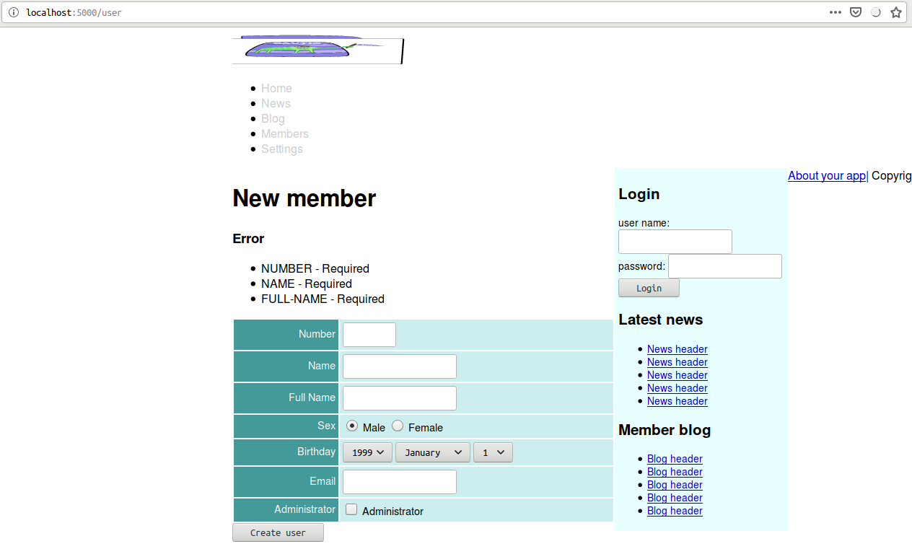
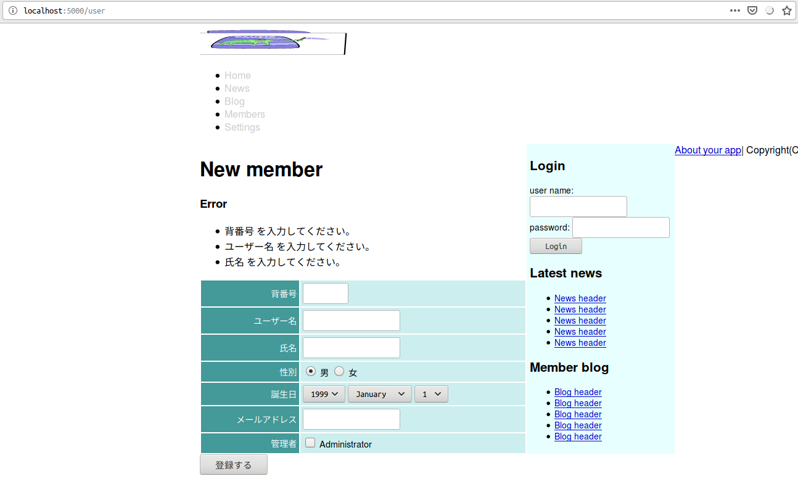

<!--  -->
# Caveman kills ruby on rails - Chapter 7
## Meta info
### 対象読者
* Cavemanでバリデーションとi18nを行いたいCLer。

## NOTE
筆者はcavemanを捨て[snooze](https://github.com/joaotavora/snooze)を使うようになった。
詳細は[ここ](why-snooze.html)に記してある。

## Introduction
本稿は[原著](https://book.impress.co.jp/books/1117101135)の各章をCommon Lispに翻訳するシリーズの第7章である。
本章ではバリデーションと国際化機能について修めていく。

## 7.1 Validation
Cavemanにvalidationの機能などない。
必要なら自作せざるを得ない。
自作に当たっては各種バリデーション用のヘルパーを提供してくれているライブラリ[ratify](https://github.com/Shinmera/ratify)が助けとなろう。

ASDファイルに追加しておこう。

```lisp
  :depends-on ("clack"
               "lack"
               "clack-errors" ; for debug.
               "ratify" ; validation.
               ...)
```

さて、バリデーションの設計であるが、これはサーバサイドのバリデーションである。
本章の例でユーザが自由に入力をできるフォームヶ所は４つである。
複数ヶ所に不正値があった場合、すべて面倒をみたい。
一箇所でも不正であれば全体が不正になるので、開発者としてはその時点でエラーとしたいが、それだとUXが悪くなる。
複数の不正値があるとして、一つしかエラーの指定がない場合、それを修正して送信したあと「後出しで他のエラー指定が出てくる」というのはUXとしては最悪だろう。
不正値に対してはエラーを投げるのではなくリストに積んで返す設計にしたほうがいいだろう。

また、ここでは引数のバリデーションをして、値が正しい場合にのみオブジェクトを作るのではなく、とにかく不正な値であろうとなかろうとお構いなしにオブジェクトをつくり、その後にバリデーション、正規化を行いたい。
とうのも、入力した値が不正だったとして、だからといって入力フォームがすべて空になって一から全部入力し直さなければならなくなるのもまた最悪なUXとなろうからだ。

さて、その実装についてであるが、本当は`CL:MAKE-INSTANCE`を拡張して行いたかった。
:AROUNDメソッドを定義して、スロットに不正値が入っていたら多値でリストを返すという設計である。
言語仕様上できておかしくないし、事実REPLトップレベルでは機能するものができた。
ところが多値を束縛しようとすると機能しない。
おそらくこれはSBCLのバグだ。
最適化のため、`CL:MAKE-INSTANCE`は一引数しか返さないというような管理の仕方がされているのではないか？
というわけでここでは理想の振る舞いをヘルパーに担わせてしまおう。
そうすることで将来バグがとれたとき、リファクタリングがしやすくなろうというものだ。

方向性は見えたので、まず下準備としてテーブルの定義を変更する。
:INITFORMの指定がある場合の値は想定されるユーザー入力にしておく。
具体的には整数を期待するスロットに整数を初期値として入れるのではなく、整数と解釈できる文字列を入れておく。
ユーザーの入力はすべて文字列で受け取ることになるからだ。

```lisp
(defclass user()
  ((number :col-type :integer
           :initarg :number
           :accessor number-of)
   (name :col-type (:varchar 64)
         :initarg :name
         :accessor name-of)
   (full-name :col-type (or (:varchar 128) :null)
              :initarg :full-name
              :accessor full-name-of)
   (email :col-type (or :null :text)
          :initarg :email
          :accessor email-of)
   (birthday :col-type (or :null :date)
             :initarg :birthday
             :accessor birthday-of)
   (sex :col-type :integer
        :initarg :sex
        :initform "1"                     ; <--- This!
        :accessor sex-of)
   (administrator :col-type :boolean
                  :initarg :administrator
                  :initform "1" ; as NIL. ; <--- This!
                  :accessor administrator-of)
   )
  (:metaclass mito:dao-table-class))
```

バリデーション関数には不正のチェックのみならず、期待される正しい値だった場合正規化してスロット値を更新する機能も持たせる。
想定されるコードは以下のようなものだ。

```lisp
(defun validate-user(user)
  (let((alist))
    (if(slot-boundp c 'number)                                   ; check requred.
      (handler-case(let((number(parse-integer(number-of user)))) ; check form.
                     (setf(number-of user)number)                ; canonicalize.
                     (if #0=(< 0 number 100)                     ; check range.
                       (when(mito:find-dao 'user :number number) ; check uniqueness.
                         (push (cons 'number (format nil "Number must unique, already exists."))alist))
                       (push (cons 'number (format nil "Number must in range of ~S but ~S"'#0# number)) alist)))
        (error(c)(push (cons 'number (princ-to-string c)) alist)))
      (push (cons 'number "Number is required.") alist))
    (if(slot-boundp c 'name)                                                       ; check required.
      (let((name(name-of c)))
        (if(ppcre:scan #2="^[A-Za-z][A-Za-z0-9]*$" name)                           ; check form.
          (if #1=(<= 2 (length name) 20)                                           ; check range.
            (when(mito:select-dao 'user (sxql:where `(:like ,name))(sxql:limit 1)) ; check uniqueness.
              (push (cons 'name (format nil "Name must unique, already exists."))alist))
            (push (cons 'name (format nil "Name must in range of ~S but ~S" '#1# (length name))) alist))
          (push (cons 'name (format nil "Invalid form. Must satisfies ~S" #2#)) alist)))
      (push (cons 'name (format nil "Name is required.")) alist))
    (if(slot-boundp c 'full-name)               ; check required.
      (let((full-name(full-name-of c)))
        (unless #3=(<= 0 (length full-name) 20) ; check range.
          (push (cons 'full-name (format nil "Full name must in range of ~S but ~S" '#3# (length full-name))) alist)))
      (push (cons 'full-name "Full name is required.") alist))
   (values user (reverse alist))))
```
これはいかにも辛いのでマクロで抽象化したい。

```lisp
(eval-when(:compile-toplevel :load-toplevel :execute)
  (defun canonicalize-assertions(assertions)
    (mapcar (lambda(assert)
              (etypecase(car assert)
                (SYMBOL
                  (cons (list (car assert)(car assert))(cdr assert)))
                ((CONS (AND SYMBOL (NOT (OR KEYWORD BOOLEAN)))
                       (CONS (AND SYMBOL (NOT (OR KEYWORD BOOLEAN)))
                             NULL))
                 (assert(every (lambda(clause)
                                 (keywordp (car clause)))
                               (cdr assert)))
                 assert)))
            assertions))

  (defun <initialize-slots>(var targets)
    (alexandria:with-unique-names(slot name)
      `(DOLIST(,slot (C2MOP:CLASS-SLOTS (CLASS-OF ,var)))
         (LET((,name(C2MOP:SLOT-DEFINITION-NAME ,slot)))
           (WHEN(OR (AND ,targets
                         (FIND ,name ,targets)
                         (SLOT-BOUNDP ,var ,name)
                         (EQUAL "" (SLOT-VALUE ,var ,name)))
                    (AND (SLOT-BOUNDP ,var ,name)
                         (EQUAL "" (SLOT-VALUE ,var ,name))))
             (SLOT-MAKUNBOUND ,var ,name))))))

  (defun <spec-pair>(clause g.obj g.alist)
    (destructuring-bind((local-var slot-name) . assertions)clause
      `(CONS ',slot-name ,(<spec-function> assertions g.obj slot-name g.alist local-var
                                           (push-form-generator slot-name g.alist)))))

  (defun parse-assertions(assertions)
    (typecase (car assertions)
      ((CONS (EQL :REQUIRE) (CONS (EQL T)NULL))
       (values t (cdr assertions)))
      ((CONS (EQL :REQUIRE) (CONS NULL NULL))
       (values nil (cdr assertions)))
      (T (values nil assertions))))

  (defun push-form-generator(slot-name alist)
    (lambda(message)
      `(push (cons ',slot-name ,message) ,alist)))

  (defun <spec-function>(assertions g.obj slot-name g.alist local-var generator)
    (multiple-value-bind(requirep assertions)(parse-assertions assertions)
    `(LAMBDA()
       (IF(SLOT-BOUNDP ,g.obj ',slot-name)
         ,(let((form(make-form assertions g.alist local-var g.obj slot-name)))
            (when form
              `(LET((,local-var (SLOT-VALUE ,g.obj ',slot-name)))
                  ,form)))
         ,@(when requirep 
             (list (funcall generator "is required")))))))

  (defun make-form(assertions g.alist local-var g.obj slot-name)
    (if(endp assertions)
      nil
      (apply #'spec-diverge g.alist slot-name g.obj local-var (cdr assertions)(car assertions))))

  (defun <type-spec-body>(local-var spec-value rest g.alist g.obj slot-name generator format-arguments)
    `(IF(TYPEP ,local-var ',spec-value)
       ,(make-form rest g.alist local-var g.obj slot-name)
       ,(funcall generator (if format-arguments
                             `(format nil ,@format-arguments)
                             `(format nil "not type-of ~S" ',spec-value)))))

  (defun <key-spec-body>(spec-value local-var g.obj slot-name rest g.alist generator format-arguments)
    (let((v(gensym"CANONICALIZED"))
         (c(gensym"CONDITION")))
      `(handler-case(let((,v (funcall ,spec-value ,local-var)))
                      (setf (slot-value ,g.obj ',slot-name) ,v
                            ,local-var ,v)
                      ,(make-form rest g.alist local-var g.obj slot-name))
         (error(,c),(funcall generator (if format-arguments
                                         `(format nil ,@format-arguments)
                                         `(princ-to-string ,c)))))))

  (defun <assert-spec-body>(spec-value rest g.alist local-var g.obj slot-name generator format-arguments)
    `(if ,spec-value
       ,(make-form rest g.alist local-var g.obj slot-name)
       ,(funcall generator (if format-arguments
                             `(format nil ,@format-arguments)
                             `(format nil "must satisfies ~S but ~S"',spec-value ,local-var)))))

  (defun <unique-spec-body>(g.obj spec-value rest g.alist local-var slot-name generator format-arguments)
    `(UNLESS(MITO:OBJECT-ID ,g.obj)
       (IF(NULL(MITO:SELECT-DAO (CLASS-OF ,g.obj) (SXQL:WHERE ,spec-value)(SXQL:LIMIT 1)))
         ,(make-form rest g.alist local-var g.obj slot-name)
         ,(funcall generator (if format-arguments
                               `(format nil ,@format-arguments)
                               "already exists")))))

  (defun spec-diverge(g.alist slot-name g.obj local-var rest spec-key spec-value &rest format-arguments)
    (ecase spec-key
      (:type (<type-spec-body> local-var spec-value rest g.alist g.obj slot-name (push-form-generator slot-name g.alist) format-arguments))
      (:key (<key-spec-body> spec-value local-var g.obj slot-name rest g.alist (push-form-generator slot-name g.alist)format-arguments))
      (:assert (<assert-spec-body> spec-value rest g.alist local-var g.obj slot-name (push-form-generator slot-name g.alist) format-arguments))
      (:unique (<unique-spec-body> g.obj spec-value rest g.alist local-var slot-name (push-form-generator slot-name g.alist)format-arguments))))
  )

(defmacro with-check-validate((object-generate-form targets-generate-form)(&rest assertions))
  (setf assertions (canonicalize-assertions assertions))
  (alexandria:with-unique-names(alist var targets spec)
    ;; body
    `(LET((,alist)
          (,var ,object-generate-form)
          (,targets ,targets-generate-form))
       ,(<initialize-slots> var targets)
       (mapc (lambda(,spec)
               (when(if ,targets
                      (find (car ,spec),targets)
                      T)
                 (funcall (cdr ,spec))))
             (list ,@(loop :for assert :in assertions
                           :collect (<spec-pair> assert var alist))))
       (values ,var (reverse ,alist)))))
```

これで先のコードは以下のように書けるようになる。

```lisp
(defun validate-user(user &rest target-slots)
  (with-check-validate(user target-slots)
    ((number (:require t)
             (:key #'parse-integer)
             (:assert (< 0 number 100))
             (:unique (:= :number number)))
     (name (:require t)
           (:type string)
           (:assert (ppcre:scan "^[A-Za-z][A-Za-z0-9]*$" name))
           (:assert (<= 2 (length name) 20) "length must be (<= 2 x 20)")
           (:unique (:like :name name)))
     ((n full-name) (:require t)
                    (:type string)
                    (:assert (<= 1 (length n) 20) "length must be (<= 1 x 20)")))))
```

なお、マクロのbnfは以下の通り

```
(with-check-validate(object-generate-form targets-generate-form)&rest clause*)

object-generate-form := form which generate object.
targets-generate-form := form which generate list which icludes slot-names.
clause := (var-spec &rest assertion*)

var-spec := [ slot-name | (local-var slot-name) ]
slot-name := symbol
local-var := symbol

assertion := [ require-assertion | type-assertion | key-assertion | assert-assertion | unique-assertion ]

require-assertion := (:require boolean)

type-assertion := (:type type-spec &rest format-control)
type-spec := form which acceptable for TYPEP second arguments.

key-assertion := (:key key-function &rest format-control)
key-function := as (function * *), but must signal an error when failed.

assert-assertion := (:assert assert-form &rest format-control)
assert-form := form, but must return nil when failed. In this form local-var is able to be refer.

unique-assertion := (:unique query &rest format-control)
query := form which acceptable for SXQL:WHERE. In this form local-var is able to be refer.

format-control := which acceptable (apply #'format nil format-control). In this form local-var is able to be refer.
```

### Checking of mail adress
`RETIFY:TEST-EMAIL`がそれを果たしてくれる。

VALIDATE-USRを以下のように修正。

```lisp
(defun validate-user(user &rest target-slots)
  (with-check-validate(user target-slots)
    ((number (:require t)
             (:key #'parse-integer)
             (:assert (< 0 number 100))
             (:unique (:= :number number)))
     (name (:require t)
           (:type string)
           (:assert (ppcre:scan "^[A-Za-z][A-Za-z0-9]*$" name))
           (:assert (<= 2 (length name) 20) "length must be (<= 2 x 20)")
           (:unique (:like :name name)))
     ((n full-name) (:require t)
                    (:type string)
                    (:assert (<= 1 (length n) 20) "length must be (<= 1 x 20)"))
     (email (:key #'ratify:test-email))))) ; <--- This!
```

初期値のあるスロットのチェックも加えて、最終版。

```lisp
(defun validate-user(user &rest target-slots)
  (with-check-validate(user target-slots)
    ((number (:require t)
             (:key #'parse-integer)
             (:assert (< 0 number 100))
             (:unique (:= :number number)))
     (name (:require t)
           (:type string)
           (:assert (ppcre:scan "^[A-Za-z][A-Za-z0-9]*$" name))
           (:assert (<= 2 (length name) 20) "length must be (<= 2 x 20)")
           (:unique (:like :name name)))
     ((n full-name) (:require t)
                    (:type string)
                    (:assert (<= 1 (length n) 20) "length must be (<= 1 x 20)"))
     (email (:key #'ratify:test-email))
     (password (:require t)
               (:type string)
               (:assert (< 0 (length password)) "Empty string is invalid"))
     (birthday (:key #'local-time:parse-timestring))
     (sex (:require t)
          (:key #'parse-integer)
          (:assert (<= 1 sex 2)))
     (administrator (:require t)
                    (:key (lambda(x)(zerop(parse-integer x))))))))
```

### Templates for error mesages.
エラーメッセージのための部分テンプレートは以下の通り。
templates/shared/errors.htmlに作成する。

```html

<div id="errors">
        <h3>Error</h3>
        <ul>
                
                <li>{{slot}} - {{message}}</li>
                
        </ul>
</div>

```

上記部分テンプレートを以下のような形でtemplates/user/form.htmlの冒頭に追加する。

```html

```

New用のルーティングを修正しなければいけないが、ついでにリファクタリングもしておこう。

REST-API的にはNewアクションはPUTメソッドで実現されるべきだろう。
POSTメソッドは単にディスパッチャとして以下のように修正する。

```lisp
(defroute("/user" :method :post)(&key method)
  (cond
    ((string= "put" method)
     (put-user (lack.request:request-body-parameters ningle:*request*)))
    (t `(400 (:content-type "text/plain") (,(format nil "Unknown method ~S"method))))))
```

NewのUIフォームが正しくPUTメソッドを送るように、また、引数を縦棒でくるむのがめんどくさすぎるのでテンプレートを各々修正。
下はその一例。

```html
        <input name="AUTHENTICITY-TOKEN" type="hidden" value="{{token}}" />
        <input name="METHOD" type="hidden" value="put" />
        
```

分割したPUTメソッドは名前付きにして以下のように実装。
引数から縦棒が取り除かれることにより、オブジェクトのinitargとの共通化が行われた結果、引数をまとめて`CL:APPLY`経由で渡せるようになっている点要注目。
このとき引数に`:ALLOW-OTHER-KEYS T`の指定をしておかないとエラーになるので要注意。


```lisp
(defroute put-user("/user" :method :put)(&rest args
                                               &key authenticity-token birthday-year birthday-month birthday-day
                                               number name full-name email administrator)
  (declare(ignore number name full-name email administrator))
  (if(not(string= authenticity-token (token)))
    `(403 (:content-type "text/plain") "Denied")
    (multiple-value-bind(user errors)(your-app.model::validate-user
                                       (apply #'make-instance 'your-app.model::user
                                              :birthday
                                              (format nil "~A-~A-~A" birthday-year birthday-month birthday-day)
                                              :allow-other-keys t
                                              args))
      (if errors
        `(400 ()(,(render "user/new.html" `(:user ,user :errors ,errors :token,(token)))))
        (progn (setf(gethash :notice ningle:*session*)"Stored!")
               `(303 (:location ,(format nil "/user/~D"(mito:object-id user)))))))))
```
Editのためのルーティングも同様にリファクタリングしていく。

```lisp
(defroute("/user/:id" :method :post)(&key id method)
  (cond
    ((string= method "delete")
     (delete-user (acons "ID" id (lack.request:request-body-parameters ningle:*request*))))
    ((find method '("" "post" nil) :test #'equal)
     (post-user (acons "id" id (lack.request:request-body-parameters ningle:*request*))))
    (t `(400 (:content-type "text/plain") (,(format nil "Unsuppoeted method ~S" method))))))
```
見通しの良さのため、本来のPOSTメソッドとしての処理は個別の`POST-USER`として定義する。
Cavemanが自動的に作る名前付き関数を、代わりに手動で書くことになるが、まぁ、よしとする。

```lisp
(defun post-user(request)
  (destructuring-bind(&key authenticity-token id number name full-name sex birthday-year birthday-month
                           birthday-day email administrator &allow-other-keys)
    (loop :for (key . value) :in request
          :collect (let((*package*(find-package :keyword)))
                     (read-from-string key))
          :collect value)
    (if(not(string= authenticity-token (token)))
      `(403 () ("Denied"))
      (let((id(ignore-errors(parse-integer id)))
           (user(and id (mito:find-dao 'your-app.model::user :id id))))
        (if(null user)
          `(500 (:content-type "text/plain") ("Could not edit unexists user."))
          (progn (setf (your-app.model::number-of user) number
                       (your-app.model::name-of user) name
                       (your-app.model::full-name-of user) full-name
                       (your-app.model::sex-of user) sex
                       (your-app.model::birthday-of user) (format nil "~A-~A-~A" birthday-year birthday-month birthday-day)
                       (your-app.model::email-of user) email
                       (your-app.model::administrator-of user) administrator)
                 (multiple-value-bind(user errors)(your-app.model::validate-user user)
                   (if errors
                     `(400 ()(,(render "user/edit.html" `(:user ,user :errors ,errors :token,(token)))))
                     (progn (mito:save-dao user)
                            (setf(gethash :notice ningle:*session*)"Updated")
                            `(303 (:location ,(format nil "/user/~D" id))))))))))))
```



## Internationalization.
CavemanがテンプレートエンジンにDjulaを使用しているのは既に承知のことだが、Djulaは[cl-locale](https://github.com/fukamachi/cl-locale)を使用したi18nをサポートしている。
もっとも、「使い方についてはdemoを参照してくれ」としかドキュメントにはなく、肝心のdemoも走らせるとi18nに関してはエラーとなるのだが。
とはいえcl-localeは非常に小さなライブラリなのでコードを追うのもそこまで苦ではない。
使い方を見ていこう。

### setup
cl-localeは非常に小さなライブラリなのは既に述べた通りだが、そのままだと少々小さすぎる。
使い勝手が悪いのでユーティリティを自作しておこう。

/src/locale.lispを用意し、your-app.asdの該当箇所を以下のように修正する。

```lisp
  :components ((:module "src"
                :components
                ((:file "main" :depends-on ("config" "view" "db"))
                 (:file "web" :depends-on ("view" "model"))
                 (:file "view" :depends-on ("config"))
                 (:file "db" :depends-on ("config"))
                 (:file "model" :depends-on ("db"))
                 (:file "locale" :depends-on ("config")) ; <--- This!
                 (:file "config"))))
```

/src/locale.lispの先頭はお定まりのものだ。

```lisp
(defpackage :your-app.locale(:use :cl))
(in-package :your-app.locale)
```
cl-localeの作法に則って、以下のような辞書を定義することになろう。

```lisp
(cl-locale:define-dictionary your-app
  ("ja" (merge-pathnames "locale/ja-jp.lisp"
                         your-app.config:*static-directory*))
  ("ja-JP" (merge-pathnames "locale/ja-jp.lisp"
                            your-app.config:*static-directory*)))
```

ところがこのままだと少々使い勝手が悪い。
辞書ファイルは/static/locale/\*.lispとして配置していくのだが、開発中はこのファイルのみを編集することも少なくない。
すなわちアプリケーションのコードには変更が施されないこともままあるということだ。
その場合何が起きるかというと、ASDFは賢くもソースコードに変更が無いことを見極め、ファイルのロードを行わない。
すなわち辞書ファイルの変更が反映されない。
ASDFの:COMPONENTには:STATIC-FILEの指定も可能なのだが、たとえこれを指定しても変更が反映されるようなことはない。
:STATIC-FILEはLispイメージ外のものだからだ。

そこで辞書ファイルのリロードを行いたいのだが、そのような機能はcl-localeには無い。
アプリケーションのロードに:FORCE Tを指定すれば再ロードは行われるが、その場合必要のない全体コンパイルが走るのでできれば避けたい。
そこで辞書ファイルのリロードを行うヘルパーがあると便利だ。
という訳でそれを作っていくのだが、それにあたり問題が２つほどある。

一つはcl-localeがアプリケーション志向で言語志向ではないという点だ。
どういう意味かというと、使うためのAPIは公開されているが、拡張するためのAPIは公開されていないという意味だ。
cl-localeは１パッケージパーファイルのスタイルで開発されているので、各下層パッケージからはエクスポートされている場合もあるがインターフェイスとなるパッケージからは公開されていないものが多い。
もちろんいずれにせよインターナルなシンボルもある。
ここでは容赦なくそれらを使っていくこととする。

２つめの問題は定義コードに書くべきパスの管理が煩わしいという点だ。
リロードするヘルパーはリロードすべきファイルパスを知っていなければならない。
ところがcl-localeはこの情報を使い捨てにする。
すなわち、たとえばlocaleオブジェクトのfile-pathスロットに格納しておくというようなことはなく、リテラルなデータとして使用した後はもう動的に取り出すことはできない。

かといってグローバル変数に突っ込んでおくのも使い勝手が悪い。
今後対応言語辞書が増えていくことを想定したら、１変数にリストなりハッシュテーブルなりで管理するのはいかにもバグの源泉になりそうだ。

というわけでここでは同名のマクロを定義しそれを使っていくこととする。
コードは以下の通り。

```lisp
(defmacro define-dictionary(name &rest args)
  `(Progn (cl-locale:define-dictionary ,name ,@args)
          (defun reload()
            (loop :for (locale dictionary) :in (list ,@(mapcar (lambda(arg)
                                                                 `(list ,@arg))
                                                               args))
                  :do (cl-locale.core::register-dictionary ',name dictionary :locale locale)))))
```

シンタックスは`CL-LOCALE:DEFINE-DICTIONARY`と全く同じなので、先例のコードから単にパッケープリフィックスを除けば良い。

### WITH-I18N
cl-localeは作者の好みを反映して`CL-LOCALE:CURRENT-DICTIONARY`を`CL:SETF`していくスタイルとなっている。
僕個人は`CL:LET`で動的に束縛するほうが好みなので、それを実現したい。
その上で、そのコードは頻出することになろうからWITH系マクロとしてまとめておきたい。

コードは以下の通り。

```lisp
(defmacro with-i18n((dictionary locale)&body string-generate-form)
  `(let((cl-locale.core::*dictionary*(cl-locale.core::ensure-dictionary ',dictionary))
        (cl-locale.core:*locale* ,locale))
     (cl-locale:i18n (progn ,@string-generate-form))))
```

### Switching the locale.
さて、ロケールをどう切り替えるか、だが、HTTPヘッダのaccept-languageを取得しよう。

`NINGLE:*REQUEST*`変数から任意の値を取り出してくる最下層関数は以下の通り。

```lisp
(defun accept-language()
  (and ningle:*request*
       (gethash "accept-language" (getf (lack.request:request-env ningle:*request*):headers))))
```

取り出されたパラメタをパーズするヘルパーは以下の通り。

```lisp
(defun parse-accept-language(parameter)
  (mapcar #'car (sort (mapcar (lambda(param)
                                (ppcre:split ";q=" param))
                              (ppcre:split #\, parameter))
                      #'>
                      :key (lambda(x)(read-from-string(or (cadr x) "1"))))))
```

上記ヘルパーは、複数指定されているかもしれない言語を重要度の高い順にリストにくくって返す。
しかしながら指定された言語が辞書としてサポートされていないかもしれない。
それを確認する用の下層関数は以下の通り。

```lisp
(defun find-locale(locale)
  (and cl-locale.core::*dictionary*
       (gethash locale cl-locale.core::*dictionary*)))
```

ソート済みのリストから最も重要度の高いサポート済みのロケールを返す関数。

```lisp
(defun find-acceptable-locale(locales)
  (find-if #'find-locale locales))
```

### Filter
さてこれで下準備は整った。
djula内部マクロを使うことになるが、/src/view.lispのyour-app.djulaパッケージに以下のコードを突っ込む。

```lisp
(djula::def-filter :i18n(it)
  (your-app.locale::with-i18n(your-app.locale::your-app (your-app.locale::find-acceptable-locale
                                                          (your-app.locale::parse-accept-language
                                                            (your-app.locale::accept-language))))
    it))
```
これに合わせてASDファイルの編集をしておくことを忘れぬよう。

```lip
  :components ((:module "src"
                :components
                ((:file "main" :depends-on ("config" "view" "db"))
                 (:file "web" :depends-on ("view" "model"))
                 (:file "view" :depends-on ("config" "locale")) ; <--- This!
                 (:file "db" :depends-on ("config"))
                 (:file "model" :depends-on ("db"))
                 (:file "locale" :depends-on ("config"))
                 (:file "config"))))
```

本来ならDjulaが提供するi18n機能を使うべきなのだが、肝心のデモが死んでるので上記フィルターを利用することで無理やり実現していく。

使い方だが、テンプレートの中で対応させたいリテラルをDjulaのフィルタータグで包む。
たとえば以下のような形だ。

```html
                <th><label for="user-number">Number</label></th>
```

辞書ファイルはただのalistだ。

```lisp
(("Number" . "背番号"))
```

ケースセンシティブな点、要注意。

また、リテラル同士の一対一対応しかできない点も要注意。
よって動的に生成されるエラーメッセージのi18nは、現行不可能である。

templates/user/form.htmlは以下のようになる。

```html

<table class="attr">
        <tr>
                <th><label for="user-number">Number</label></th>
                <td><input size="8" type="text" name="NUMBER" value="{{user.number}}" id="user-number" /></td>
        </tr>
        <tr>
                <th><label for="user-name">Name</label></th>
                <td><input type="text" value="{{user.name}}" name="NAME" id="user-name" /></td>
        </tr>
        <tr>
                <th><label for="user-full-name">Full Name</label></th>
                <td><input type="text" value="{{user.full-name}}" name="FULL-NAME" id="user-full-name" /></td>
        </tr>
        <tr>
                <th>Sex</th>
                <td>
                        <input type="radio" value="1" checked="checked" name="SEX" id="member-sex-1" />
                        <label for="member-sex-1">Male</label>
                        <input type="radio" value="2" checked="checked" name="SEX" id="member-sex-2" />
                        <label for="member-sex-1">Female</label>
                </td>
        </tr>
        <tr>
                <th><label for="user-birthday">Birthday</label></th>
                <td><select id="member-birthday-li" name="BIRTHDAY-YEAR">
                                {{ user.birthday
                                 | lisp: (lambda(timestamp)
                                           (let((current-year(local-time:timestamp-year(local-time:now))))
                                             (loop :for i :upfrom 1940 :to current-year
                                                   :with target = (or (and timestamp
                                                                           (local-time:timestamp-year timestamp))
                                                                      (- current-year 20))
                                                   :collect (format nil "<option value=\"~D\"~@[ ~A~]>~2:*~D</option>~%"
                                                                    i (when(= target i)
                                                                        "selected=\"selected\"")))))
                                 | join:""
                                 | safe
                                 }}
                        </select>
                        <select id="member-birthday-2i" name="BIRTHDAY-MONTH">
                                {{ user.birthday
                                 | lisp: (lambda(timestamp)
                                           (loop :for i :upfrom 1 to 12
                                                 :with target = (or (and timestamp
                                                                         (local-time:timestamp-month timestamp))
                                                                    1)
                                                 :collect (format nil "<option value=\"~D\"~@[ ~A~]>~A</option>~%"
                                                                  i (when(= target i)
                                                                      "selected=\"selected\"")
                                                                  (aref local-time:+month-names+ i))))
                                 | join:""
                                 | safe
                                 }}
                        </select>
                        <select id="birthday-3i" name="BIRTHDAY-DAY">
                                {{ user.birthday
                                 | lisp: (lambda(timestamp)
                                           (loop :for i :upfrom 1 to 31
                                                 :with target = (or (and timestamp
                                                                         (local-time:timestamp-day timestamp))
                                                                    1)
                                                 :collect (format nil "<option value=\"~D\"~@[ ~A~]>~2:*~D</option>~%"
                                                                  i (when(= target i)
                                                                      "selected=\"selected\""))))
                                 | join:""
                                 | safe
                                 }}
                        </select>
                </td>
        </tr>
        <tr>
                <th><label for="user-email">Email</label></th>
                <td><input type="text" name="EMAIL" id="user-email" /></td>
        </tr>
        <tr>
                <th>Administrator</th>
                <td>
                        <input name="ADMINISTRATOR" type="hidden" value="0" />
                        <input type="checkbox" value="1" name="administrator" id="user-administrator" />
                </td>
        </tr>
</table>
```

templates/shared/errors.htmlは以下のようになる。

```html

<div id="errors">
        <h3>Error</h3>
        <ul>
                
                <li>{{slot|capfirst|lisp: (lambda(s)(substitute #\space #\- s))|i18n}} {{message|i18n}}</li>
                
        </ul>
</div>

```
対応しやすいようにvalidationのエラーメッセージを修正しておく。

```lisp
(defmacro with-check-validate((var)(&rest assertions))
  ;; initialize
  (check-type var symbol)
  (setf assertions (mapcar (lambda(assert)
                             (etypecase(car assert)
                               (symbol (cons (list (car assert)(car assert))(cdr assert)))
                               ((cons (and symbol (not (or keyword boolean)))
                                      (cons (and symbol (not (or keyword boolean)))
                                            null))
                                (assert(every (lambda(clause)
                                                (keywordp (car clause)))
                                              (cdr assert)))
                                assert)))
                           assertions))
  (let((alist(gensym"ALIST"))
       (slot(gensym "SLOT"))
       (name(gensym"NAME")))
    ;; body
    `(LET((,alist))
       (dolist(,slot (c2mop:class-slots (class-of ,var)))
         (let((,name(c2mop:slot-definition-name ,slot)))
           (when(and (slot-boundp ,var ,name)
                     (equal "" (slot-value ,var ,name)))
             (slot-makunbound ,var ,name))))
       ,@(loop :for ((local-var slot-name) . assertions) :in assertions
               :collect (labels((rec(assertions)
                                  (if(endp assertions)
                                    nil
                                    (apply #'body (cdr assertions)(car assertions))))
                                (body(rest key value &rest format-arguments)
                                  (ecase key
                                    (:type
                                      `(if(typep ,local-var ',value)
                                         ,(rec rest)
                                         (push (cons ',slot-name
                                                     ,(if format-arguments
                                                        `(format nil ,@format-arguments)
                                                        `(format nil "is not type-of ~S"',value)))
                                               ,alist)))
                                    (:key
                                      (let((v(gensym"CANONICALIZED"))
                                           (c(gensym"CONDITION")))
                                        `(handler-case(let((,v (funcall ,value ,local-var)))
                                                        (setf (slot-value ,var ',slot-name) ,v
                                                              ,local-var ,v)
                                                        ,(rec rest))
                                           (error(,c)(push (cons ',slot-name (princ-to-string ,c))
                                                           ,alist)))))
                                    (:assert
                                      `(if ,value
                                         ,(rec rest)
                                         (PUSH (CONS ',slot-name ,(if format-arguments
                                                                    `(format nil ,@format-arguments)
                                                                    `(FORMAT NIL "must satisfies ~S but ~S"
                                                                             ',value
                                                                             ,local-var)))
                                               ,alist)))
                                    (:unique
                                      `(unless(mito:object-id ,var)
                                         (if(null(mito:select-dao (class-of ,var) (sxql:where ,value)(sxql:limit 1)))
                                           ,(rec rest)
                                           (push (cons ',slot-name "is already exists"),alist)))))))
                          (if(equal '(:require t) (car assertions))
                            `(if(slot-boundp ,var ',slot-name)
                               (let((,local-var (slot-value ,var ',slot-name)))
                                 ,(rec (cdr assertions)))
                               (push (cons ',slot-name ,"is required") ,alist))
                            (progn (when(equal '(:require nil) (car assertions))
                                     (pop assertions))
                                   `(if(slot-boundp ,var ',slot-name)
                                      (let((,local-var(slot-value ,var ',slot-name)))
                                        ,(rec assertions)))))))
       (values ,var (reverse ,alist)))))
```

辞書ファイルは以下の通り。

```lisp
(("hello" . "(=ﾟωﾟ)ﾉぃょぅ")
 ("Number" . "背番号")
 ("Name" . "ユーザー名")
 ("Full Name" . "氏名")
 ("Sex" . "性別")
 ("Male" . "男")
 ("Female" . "女")
 ("Birthday" . "誕生日")
 ("Email" . "メールアドレス")
 ("Administrator" . "管理者")
 ("Create user" . "登録する")
 ("is required" . "を入力してください。")
 )
```

後は必要に応じて各ファイル地道にシコシコと対応していけば良い。



気をつけなければいけないのは、本i18n機能はHTTPヘッダに依存している点だ。
ブラウザのロケールを変更しないと機能しないので、ブラウザのロケールを日本以外にしている人は要注意。

## Summary
* フォームの値が正しいかどうかをチェックすることをバリデーションといいます。
* エラーメッセージを日本語化するには、cl-localeを使用します。
* 辞書ファイルは連想リスト形式で記述します。
<!--  -->
