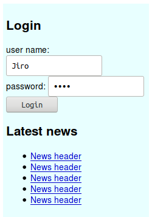
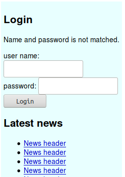
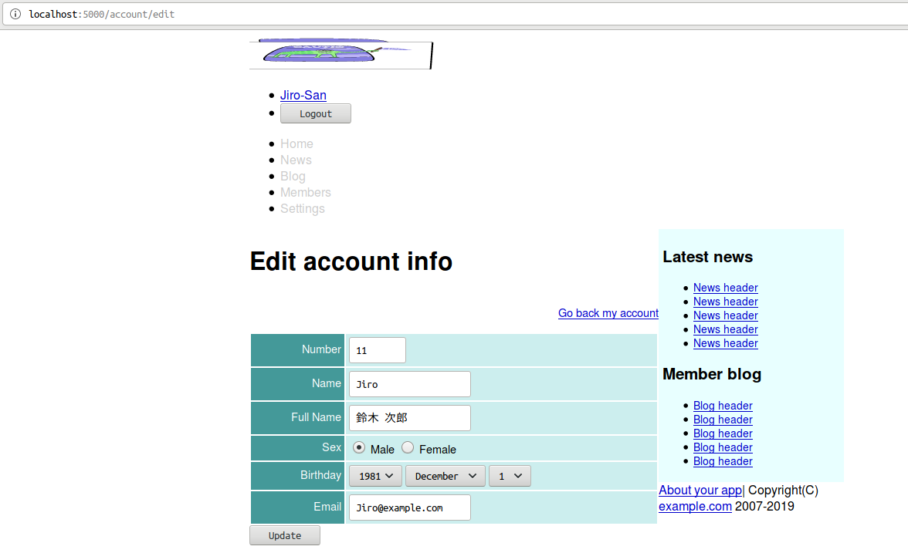
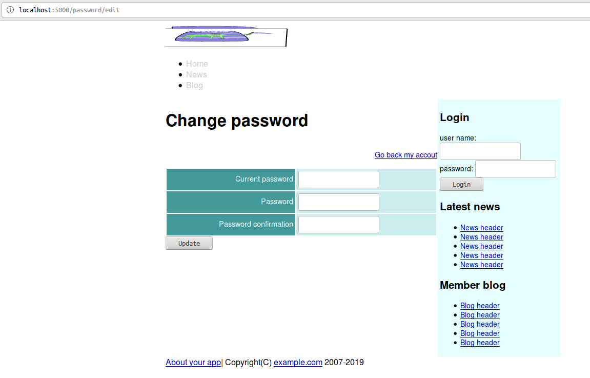
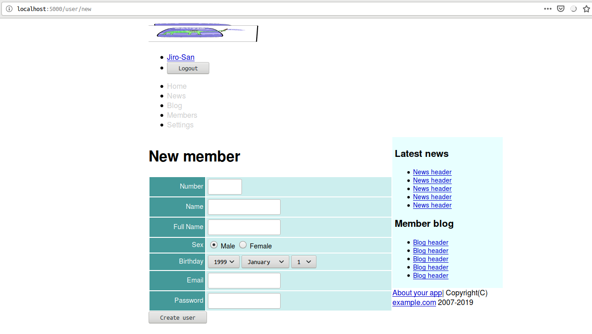

<!--  -->
# Caveman kills ruby on rails - Chapter 8
## Meta info
### 対象読者
* Cavemanでauthenticationを行いたいCLer

## NOTE
筆者はcavemanを捨て[snooze](https://github.com/joaotavora/snooze)を使うようになった。
詳細は[ここ](why-snooze.html)に記してある。

## Introduction
本稿は[原著](https://book.impress.co.jp/books/1117101135)の各章をCommon Lispに翻訳するシリーズの第8章である。
本章ではAuthenticationについて修めていく。

## 8.1 Singular resource
Cavemanに於いてそのようなものは概念でしかない。
自前で以下のようなルーティングを用意することとなろう。

```lisp
(defroute "/account"()
  )

(defroute "/account/new"()
  )

(defroute "/account/edit"()
  )

(defroute("/account" :method :post)()
  )

(defroute("/account" :method :put)()
  )

(defroute("/account" :method :delete)()
  )
```

## 8.2 login with session
Cavemanに於いてセッションは`NINGLE:*SESSION*`に`CL:HASH-TABLE`オブジェクトとして格納されている。

### Hermetic
Common Lispに於いて暗号と言えば[ironclad](https://github.com/sharplispers/ironclad)がデファクトスタンダードだ。
ここではその上に作られた[hermetic](https://github.com/eudoxia0/hermetic)を使用する。
hermeticはclackベースのアプリケーション用に作られたauthenticationシステムとのこと。

まずはASDファイルにhermeticを追加。

```lisp
  :depends-on ("clack"
               "lack"
               "clack-errors" ; for debug.
               "hermetic" ; authentication
```

/src/web.lispにセットアップコードを追加。

```lisp
(hermetic:setup
  :user-p (lambda(name)(mito:find-dao 'your-app.model::user :name name))
  :user-pass (lambda(name)(your-app.model::password-of(mito:find-dao 'your-app.model::user :name name)))
  :user-roles (lambda(name)(cons :logged-in
                                 (let((user(mito:find-dao 'your-app.model::user :name name)))
                                   (and user
                                        (your-app.model::administrator-of user)
                                        '(:administrator)))))
  :session ningle:*session*
  :denied (constantly '(400 (:content-type "text/plain") ("Authenticate denied"))))
```

### Adding column.
ユーザ認証を行えるようにモデルにpasswordスロットを追加。

```lisp
(defclass user()
  ((number :col-type :integer
           :initarg :number
           :accessor number-of)
   ...
   (password :col-type :text
             :initarg :password
             :accessor password-of
             :inflate #'cl-pass:hash
             )
   )
  (:metaclass mito:dao-table-class))
```

### Seeds
シード関数にも対応する初期化引数を追加。

```lisp
(defun seeds()
  (let((names #("Taro" "Jiro" "Hana" "John" "Mike" "Sophy" "Bill" "Alex" "Mary" "Tom"))
       (fnames #("佐藤" "鈴木" "高橋" "田中"))
       (gnames #("太郎" "次郎" "花子")))
    (with-connection(db)
      (dotimes(x 10)
        (mito:create-dao 'user
                         :number (+ x 10)
                         :name (aref names x)
                         :full-name (format nil "~A ~A"(aref fnames (rem x 4))
                                            (aref gnames (rem x 3)))
                         :email (format nil "~A@example.com"(aref names x))
                         :birthday "1981-12-01"
                         :sex (nth (rem x 3)'(1 1 2))
                         :administrator (zerop x)
                         :password "asagao!" ; <--- This!
                         )))))
```

REPLで`REBUILD`を叩いておくこと。

### Actions about session.
クライアントとのセッションを確立するAPIを定義していく。

#### Edit
POSTメソッドはディスパッチャとして実装。
`LOGOUT`関数は後に名前付きルーティングとして実装する点要注意。
また`POST-SESSION`も自作することになる。

```lisp
(defroute("/session" :method :post)(&key method)
  (cond
    ((string= "delete" method)
     (logout (lack.request:request-body-parameters ningle:*request*)))
    ((string= "post" method)
     (post-session(lack.request:request-body-parameters ningle:*request*)))
    (t `(400 (:content-type "text/plain") (,(format nil "Unknown method ~S" method))))))
```
本来のPOSTメソッドは独立した関数として実装。

ブラウザがGETとPOSTとしか扱えない以上、この設計は頻出することとなろう。
独立した関数として本来のPOSTメソッドを実装することも頻出することとなる。
ヘルパーがあると便利なのでまずはヘルパーを定義しておく。

```lisp
(defun request-params(request)
  (loop :for (key . value) :in request
        :collect (let((*package*(find-package :keyword)))
                   (read-from-string key))
        :collect value))
```

`POST-SESSION`の実装は以下の通り。

```lisp
(defun post-session(request)
  (destructuring-bind(&key name password authenticity-token &allow-other-keys)(request-params request)
    (if(not(string= authenticity-token (token)))
      `(403 (:content-type "text/plain") ("Denied"))
      (let((params(list :|username| name :|password| password)))
        (hermetic:login params
          (progn (setf (gethash :id ningle:*session*)
                       (mito:object-id(mito:find-dao 'your-app.model::user :name name))
                       (gethash :password ningle:*session*)
                       password)
                 '(303 (:location "/")))
          (progn (setf (gethash :alert ningle:*session*)
                       "Name and password is not matched.")
                 '(303 (:location "/")))
          (progn (setf (gethash :alert ningle:*session*)
                       "No such user")
                 '(303 (:location "/"))))))))
```
上記コードでキーワードを縦棒エスケープした小文字のものを使用している点要注目。
これはこの表記でなければならない。
hermeticの仕様である。
ドキュメントに解説がないのは不親切だと思う。

また、`CL:LET`で束縛した`PARAM`変数を渡している点も要注目。
`HERMETIC:LOGIN`は不衛生なマクロでこうしないとPARAMSが複数回評価される。
ドキュメントに解説がないのは不親切だと思う。

#### Destroy
destroyアクションの実装は以下の通り。

```lisp
(defroute logout("/session" :method :delete)(&key authenticity-token)
  (if(not(string= authenticity-token (token)))
    `(403 (:content-type "text/plain") ("Denied"))
    (hermetic::logout
      (progn (flash-gethash :id ningle:*session*)
             '(303 (:location "/")))
      '(303 (:location "/")))))
```
`HERMETIC::LOGOUT`は、おそらくポカミスによるエクスポート忘れ。
というのもHERMETICのデモではこのシンボルが使われているから。
というわけでここでは容赦なく使っていく。

### Login form.
ログインフォームを実装していく。

#### templates/shared/login_form.html

```html
<h2>Login</h2>

<p class="alert">{{alert}}</p>

<form id="login_form" action="/session" method="post">
        <input type="hidden" name="AUTHENTICITY-TOKEN" value="{{token}}">
        <input type="hidden" name="METHOD" value="post">
        <div>
                <label>user name:</label>
                <input type="text" name="NAME">
        </div>
        <div>
                <label>password:</label>
                <input type="password" name="PASSWORD">
        </div>
        <div>
                <input type="submit" value="Login">
        </div>
</form>
```

#### roles
ユーザがログインしているか否かで表示するコンテンツを切り替えたい場合はままある。
HERMETICはもちろんそのための機能を提供しているが、それは表示すべきファイルをごっそり切り替えたい場合のものとして設計されている。

ここでは表示すべきテンプレートは同じに、そのコンテンツの一部をテンプレート側で判断して切り替えたい。
すなわち引数として渡したい。
よって簡単なヘルパーを定義しておく。

```lisp
(defun roles()
  (loop :for role :in (hermetic:roles)
        :collect role :collect t))
```

#### templates/shared/sidebar.html
冒頭を以下のように編集。

```html



```

#### templates/shared/header.html
冒頭を以下のように編集。

```html



<ul class="account-menu">
        <li>
                <form id="logout-form" action="/session" method="post">
                        <input type="hidden" name="AUTHENTICITY-TOKEN" value="{{token}}">
                        <input type="hidden" name="METHOD" value="delete">
                        <input type="submit" value="Logout">
                </form>
        </li>
</ul>

```

#### before login

#### after login

#### when failed login


## 8.3 Action callback
CavemanにAction callback相当の機能はおそらくない。
lackの機能は相当するように思えるが、おそらくはアプリケーション単位の処理であろう。
アクション単位ではないはずだ。

どうしてもほしいならマクロでなんとかすればいい。
ここでは手で書くこととする。

### Only member contents
#### templates/shared/header.html

```lisp
<nav class="menubar">
        <ul>
                <li><a href="/">Home</a></li>
                <li><a href="#">News</a></li>
                <li><a href="#">Blog</a></li>
                
                <li><a href="/user/index">Members</a></li>
                <li><a href="#">Settings</a></li>
                
        </ul>
</nav>
```

## 8.4 Making my account page.
### Utils
今ログインしているユーザを参照したいことは多いのでヘルパーを定義しておく。

```lisp
(defun current-user()
  (mito:find-dao 'your-app.model::user :id (gethash :id ningle:*session*)))
```

### Show
showアクションの実装は以下の通り。
401の実装はいまのところいい加減なものである点要注意。

```lisp
(defroute "/account"()
  (if(not(hermetic:logged-in-p))
    '(401 ())
    (render "accounts/show.html"
            `(:user ,(current-user) 
                    :news (1 2 3 4 5)
                    :blogs(1 2 3 4 5)
                    ,@(roles)
                    :token,(token)))))
```
#### templates/user/body.html
共有部分を切り離すためtemplates/user/show.htmlのtableタグをごっそりコピペする。

#### templates/user/show.html
上記テーブルタグを部分テンプレートとしてincludeするように編集。

```html



<h1></h1>

<div class="toolbar"><a href="/user/{{user.id}}/edit">Edit</a></div>




```

#### templates/accounts/show.html
共有部分をincludeしつつ作成。

```html






<h1></h1>

<ul class="toolbar">
        <a href="/account/edit">Edit account info</a>
</ul>



```

#### templates/shared/header.html
名前の表示を追加。

```html
<ul class="account-menu">
        <li><a href="/account">{{user.name}}-San</a></li>
        <li>
```
### Edit account info.
アカウント情報を編集できるようにする。

#### templates/user/new.html
以下のように編集。

```html
        <input name="AUTHENTICITY-TOKEN" type="hidden" value="{{token}}" />
        <input name="METHOD" type="hidden" value="put" />
        
        <div>
                <input type="submit" name="COMMIT" value="Create user" />
        </div>
```

#### templates/user/edit.html
同様の編集をこちらにも。

```html
        <input name="AUTHENTICITY-TOKEN" type="hidden" value="{{token}}" />
        <input name="METHOD" type="hidden" value="post" />
        
        <div>
                <input type="submit" name="COMMIT" value="Edit user" />
        </div>
```

#### templates/accounts/edit.html
以下のように作成。

```html






<h1></h1>

<div class="toolbar">
        <a href="/account">Go back my account</a>
</div>

<form class="edit_account" id="edit_account" action="/account" method="post">
        <input type="hidden" name="METHOD" value="post">
        <input type="hidden" name="AUTHENTICITY-TOKEN" value="{{token}}">
        
        <div><input type="submit" name="commit" value="Update"></div>
</form>

```

#### templates/shared/user-form.html
管理者フラグは管理者のみ変更できるように修正。

```html
        
        <tr>
                <th>Administrator</th>
                <td>
                        <input name="ADMINISTRATOR" type="hidden" value="0" />
                        <input type="checkbox" value="1" name="administrator" id="user-administrator" />
                </td>
        </tr>
        
</table>
```

#### edit
Edit用のルーティングは以下の通り。

```lisp
(defroute "/account/edit"()
  (if(not(hermetic:logged-in-p))
    '(401 ())
    (render "accounts/edit.html"
            `(:token ,(token)
                     :user ,(current-user)
                     :news (1 2 3 4 5)
                     :blogs (1 2 3 4 5)
                     ,@(roles)
                     ))))
```

#### update
Update用のルーティングは以下の通り。

```lisp
(defroute("/account" :method :post)(&key number name full-name sex birthday-year birthday-month birthday-day
                                         email (administrator "1") authenticity-token)
  (if(not(string= authenticity-token (token)))
    '(403(:content-type "text/plain")("Denied"))
    (if(not(hermetic:logged-in-p))
      '(401 ())
      (let*((user(current-user)))
        (setf (your-app.model::number-of user) number
              (your-app.model::name-of user) name
              (your-app.model::full-name-of user) full-name
              (your-app.model::sex-of user) sex
              (your-app.model::birthday-of user) (format nil "~A-~A-~A" birthday-year birthday-month birthday-day)
              (your-app.model::email-of user) email
              (your-app.model::administrator-of user) administrator
              (your-app.model::password-of user)(gethash :password ningle:*session*))
        (multiple-value-bind(user errors)(your-app.model::validate-user user)
          (if errors
            `(400 ()(,(render "accounts/edit.html" `(:user ,user
                                                           :errors ,errors
                                                           :news (1 2 3 4 5)
                                                           :blogs (1 2 3 4 5)
                                                           ,@(roles)
                                                           :token,(token)))))
            (progn (mito:save-dao user)
                   (setf(gethash :notice ningle:*session*)"Updated")
                   '(303 (:location "/account")))))))))
```


## 8.5 Changing password.
### Adding validation.
バリデーションを追加編集。

```lisp
(defun validate-user(user &rest target-slots)
  (with-check-validate(user target-slots)
    ((number (:require t)
              (:key #'parse-integer)
              (:assert (< 0 number 100))
              (:unique (:= :number number)))
      ...
      (password (:require t)
                (:type string)
                (:assert (< 0 (length password)) "Empty string is invalid"))
      ...
      (administrator (:require t)
                     (:key (lambda(x)(zerop(parse-integer x))))))))
```

### Making form which edit password.
#### show
Show用のルーティングは以下の通り。

```lisp
(defroute "/password"() ; as show
  (if(not(hermetic:logged-in-p))
    '(401 ())
    '(303 (:location "/account"))))
```

#### templates/passwords/edit.html
テンプレートは以下の通り。

```html






<h1></h1>

<div class="toolbar">
        <a href="/accout">Go back my accout</a>
</div>

<form action="/password" method="post">
        <input type="hidden" name="AUTHENTICITY-TOKEN" value="{{token}}">
        

        <table class="attr">
                <tr>
                        <th><label for="accout-current-password">Current password</label></th>
                        <td><input type="password" name="OLD" id="account-current-password" /></td>
                </tr>
                <tr>
                        <th><label for="accout-password">Password</label></th>
                        <td><input type="password" name="NEW" id="account-password" /></td>
                </tr>
                <tr>
                        <th><label for="password-confirmation">Password confirmation</label></th>
                        <td><input type="password" name="CONFIRMATION" id="password-confirmation" /></td>
                </tr>
        </table>

        <div><input type="submit" name="commit" value="Update" /></div>
</form>

```

#### templates/accounts/show.html
リンクを追加。

```html
<ul class="toolbar">
        <a href="/account/edit">Edit account info</a>
        <a href="/password/edit">Change password</a>
</ul>
```


### Saving possword.
#### update
Update用のルーティングは以下の通り。

```lisp
(defroute("/password" :method :post)(&key old new confirmation authenticity-token)
  (if(not(hermetic:logged-in-p))
    '(403(:content-type "text/plain")("Denied"))
    (let*((user(current-user))
          (render-args `(:user ,user :token ,(token) :news (1 2 3 4 5) :blogs (1 2 3 4 5))))
      (if(not(string= authenticity-token(token)))
        `(403 (:content-type "text/plain") ("Denied"))
        (if(equal "" old)
          (render "passwords/edit.html" (list* :errors '((current-password . "is required")) render-args))
          (if(not(cl-pass:check-password old (your-app.model::password-of user)))
            (render "passwords/edit.html" (list* :errors '((password . "is not correct")) render-args))
            (if(not(equal new confirmation))
              (render "passwords/edit.html" (list* :errors '((confirmation . "is failed")) render-args))
              (progn (setf (your-app.model::password-of user) new)
                     (multiple-value-bind(user errors)(your-app.model::validate-user user 'your-app.model::password)
                       (if errors
                         (render "passwords/edit.html" (list* :errors errors render-args))
                         (progn (mito:save-dao user)
                                (setf (gethash :notice ningle:*session*) "Password is changed")
                                '(303 (:location "/account")))))))))))))
```

#### templates/shared/user_form.html
新規作成フォームを編集。

```html
        <tr>
                <th><label for="user-email">Email</label></th>
                <td><input type="text" name="EMAIL" value="{{user.email}}" id="user-email" /></td>
        </tr>

        
        <tr>
                <th><label for="password">Password</label></th>
                <td><input id="password" type="text" name="PASSWORD" /></td>
        </tr>
        

        
```

#### templates/user/new.html
参照すべき変数を変更。

```html
<form class="new-user" id="new-user" action="/user" method="post">
        <input name="AUTHENTICITY-TOKEN" type="hidden" value="{{token}}" />
        <input name="METHOD" type="hidden" value="put" />
        {{ new-user
         | lisp: (lambda(user)
                   (your-app.view::render "shared/user-form.html" `(:user ,user)))
         | safe
         }}
        <div>
                <input type="submit" name="COMMIT" value="Create user" />
        </div>
</form>
```

#### /user/new routing
テンプレートの呼び出し側も引数を編集。

```lisp
(defroute "/user/new"()
  (render "user/new.html"
          `(:user ,(current-user)
                  :new-user ,(your-app.model::validate-user(make-instance 'your-app.model::user))
                  :news (1 2 3 4 5)
                  :blogs (1 2 3 4 5)
                  ,@(roles)
                  :token ,(token))))
```


## Summary
* authentication機能を作るにはhermeticを利用すると便利です。
* 複数のページに渡ってブラウザとサーバの間で維持される接続状態をセッションと呼びます。
* ユーザをログイン状態にするには、セッションにidを保存します。セッションからidを取り出せばユーザを識別できます。
* 現在ログインしているユーザを取得するCURRENT-USERのようなヘルパー関数を定義しておくと開発しやすくなります。
* ログイン中のユーザだけに特定のページへのアクセスを許可するにはHERMETIC:AUTHを使用します。
<!--  -->
