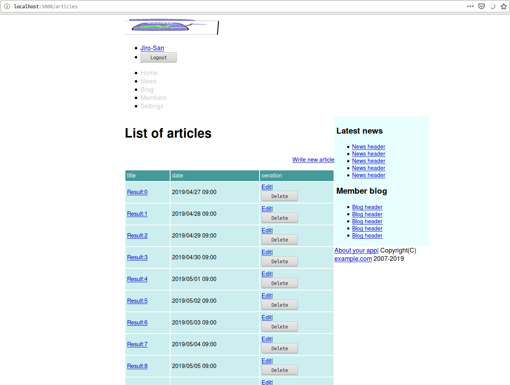
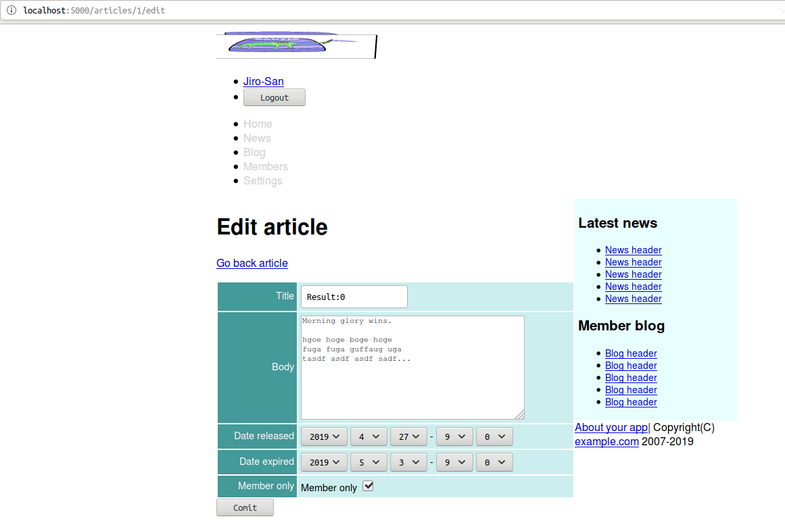
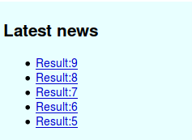

<!--  -->
# Caveman kills ruby on rails - Chapter 9
## Meta info
### 対象読者
* CavemanでScope制御を行いたいCLer

## NOTE
筆者はcavemanを捨て[snooze](https://github.com/joaotavora/snooze)を使うようになった。
詳細は[ここ](why-snooze.html)に記してある。

## Introduction
本稿は[原著](https://book.impress.co.jp/books/1117101135)の各章をCommon Lispに翻訳するシリーズの第9章である。
本章ではCavemanでのScope制御を修めていく。

なお、原著ではPagenationについても触れられているが、Caveman2にそのような機能はなく、また相当するライブラリも存在しない。
どうしても欲しいなら自作するしかない。
実装コストが割と高い印象なので、ここではTODOとして無視していく。

## 9.1 SHOW and EDIT article.
### Define article model.
まずは下準備として新たにarticleモデルを定義する。

```lisp
(defclass article()
  ((title :initarg :title :col-type (:varchar 80) :accessor title-of)
   (body :initarg :body :col-type :text :accessor :body-of)
   (date-released :initarg :date-released :col-type :date :accessor date-released-of)
   (date-expired :initarg :date-expired :col-type (or :null :date) :accessor date-expired-of)
   (member-only-p :initarg :member-only-p :col-type :boolean :initform "1" ; as nil
                  :accessor member-only-p))
  (:metaclass mito:dao-table-class))
```

#### Create table.
定義したモデルのテーブルを作るように編集。

```lisp
(with-connection(db)
  (mito:ensure-table-exists 'user)
  (mito:ensure-table-exists 'article)
  )
```

#### Add seeds.
シードデータを追加するように関数`SEEDS`の中身を編集。

```lisp
(defun seeds()
  (let((names #("Taro" "Jiro" "Hana" "John" "Mike" "Sophy" "Bill" "Alex" "Mary" "Tom"))
       (fnames #("佐藤" "鈴木" "高橋" "田中"))
       (gnames #("太郎" "次郎" "花子")))
    (with-connection(db)
      ... 
      (let((body #.(with-output-to-string(*standard-output*)
                     (format t "Morning glory wins.~2%")
                     (write-line "hgoe hoge boge hoge")
                     (write-line "fuga fuga guffaug uga")
                     (write-string "tasdf asdf asdf sadf... ")))
           (now(local-time:now)))
        (dotimes(x 10)
          (mito:create-dao 'article
                           :title (format nil "Result:~D"x)
                           :body body
                           :date-released (local-time:timestamp- now (- 8 x) :day)
                           :date-expired (local-time:timestamp- now (- 2 x) :day)
                           :member-only-p (zerop (rem x 3)))))
      )))
```

#### Rebuild
ARTICLEのリビルドも行えるように編集。

```lisp
(defun rebuild()
  (with-connection(db)
    (mito:recreate-table 'user)
    (mito:recreate-table 'article)
    )
  (seeds))
```
REPLでREBUILDを叩いておくこと。

### Adding validation.
新規定義されたモデル用のバリデーションを追加。
正直これはマクロにまとめて、モデル定義時にバリデーションも指定できるようにするほうがいいのでは？　とも思う。
ここではそのまま手で書いていく。

```lisp
(defun validate-article(article &rest target-slots)
  (with-check-validate(article target-slots)
    ((title (:require t)
            (:type string)
            (:assert (<= (length title) 80)))
     (body (:require t)
           (:type string)
           (:assert (<= (length body) 2000)))
     (date-released (:require t)
                    (:key #'local-time:parse-timestring))
     (date-expired (:key #'local-time:parse-timestring))
     (member-only-p (:require t)
                    (:key (lambda(x)(zerop(parse-integer x))))))))
```

### Routing
下準備は整ったのでアクションを定義していこう。

#### INDEX
indexは以下の通り。

```lisp
(defroute "/articles"()
  (render "articles/index.html"
          `(:user ,(current-user)
                  :news (1 2 3 4 5)
                  :blogs (1 2 3 4 5)
                  :token ,(token)
                  :articles ,(mito:retrieve-dao 'your-app.model::article)
                  ,@(roles))))
```

#### templates/articles/index.html
index用のテンプレートは以下の通り。

```html




<h1></h1>

<div class="toolbar"><a href="/articles/new">Write new article</a></div>


<table class="list">
        <thead>
                <tr>
                        <th>title</th>
                        <th>date</th>
                        <th>oeration</th>
                </tr>
        </thead>
        <tbody>
                
                <tr>
                        <td><a href="/articles/{{article.id}}">{{article.title}}</a></td>
                        <td>{{ article.date-released
                             | date: ((:year 4)"/"(:month 2)"/"(:day 2)" "(:hour 2)":"(:min 2))
                             }}</td>
                        <td>
                                <a href="/articles/{{article.id}}/edit">Edit</a>|
                                <form action="/articles/{{article.id}}/delete" method="post">
                                        <input type="hidden" name="AUTHENTICITY-TOKEN" value="{{token}}">
                                        <input type="hidden" name="METHOD" value="delete">
                                        <input type="submit" value="Delete">
                                </form>
                        </td>
                </tr>
                
        </tbody>
</table>

<p>No articles</p>


```


#### SHOW
Showは以下の通り。


```lisp
(defroute "/articles/:id"(&key id)
  (if(null(ignore-errors(parse-integer id)))
    (myway.mapper:next-route)
    (render "articles/show.html" `(:article ,(mito:find-dao 'your-app.model::article :id id)
                                              ,@(roles)
                                            :user ,(current-user)
                                            :news (1 2 3 4 5)
                                            :blogs (1 2 3 4 5)
                                            ))))
```
mywayのマッピングに於いて、上記の:idはただの変数でしかなく、不正な文字列も渡ってくる点要注意。

#### 3bmd
Cavemanにsimple_format相当の機能はない。
ここではmarkdownパーザである`3bmd`を使ってお手軽に実装していく。
その結果、副作用としてARTICLE本文はプレーンテクストではなくマークダウンとして解釈されることとなる。

まずはASDファイルに依存を追加。

```lisp
  :depends-on ("clack"
               ...
               ;; HTML Template
               "djula"
               "3bmd" ; markdown.
               ...)
```
SIMPLE-FORMATをDJULAのフィルターとして定義。

```lisp
(djula::def-filter :simple-format(it)
  (with-output-to-string(s)
    (3bmd:parse-string-and-print-to-stream
     (ppcre:regex-replace-all #\newline it "<br>")
     s)))
```

#### templates/articles/show.html
テンプレートは以下の通り。

```html

 {{ article.title | lisp: (lambda(title)(title title)) }}  


<h1>{{article.title}}</h1>


<div class="toolbar"><a href="/articles/{{article.id}}/edit">Edit</a></div>


<table class="attr">
        <tr>
                <th width="100">Title</th>
                <td>{{article.title}}</td>
        </tr>
        <tr>
                <th>Article</th>
                <td>{{ article.body | simple-format | safe }}</td>
        </tr>
        <tr>
                <th>Released at</th>
                <td>{{ article.date-released | date: ((:year 4)"/"(:month 2)"/"(:day 2)" "(:hour 2)":"(:min 2)) }}</td>
        </tr>
        <tr>
                <th>Expired at</th>
                <td>
                        
                        {{ article.date-expired | date: ((:year 4)"/"(:month 2)"/"(:day 2)" "(:hour 2)":"(:min 2)) }}
                        
                </td>
        </tr>
        <tr>
                <th>Member only</th>
                <td>◯-</td>
        </tr>
</table>

```

#### templates/shared/header.html
ヘッダから飛べるようにリンクを追加。

```html
                <li><a href="/">Home</a></li>
                <li><a href="/articles">News</a></li>
                <li><a href="#">Blog</a></li>
```


### NEW and EDIT
#### new
newは以下の通り。

```lisp
(defroute "/articles/new"()
  (render "articles/new.html" `(:article, (make-instance 'your-app.model::article)
                                          :user ,(current-user)
                                          :news (1 2 3 4 5)
                                          :blogs (1 2 3 4 5)
                                          ,@(roles)
                                          :token ,(token))))
```

#### edit
同様にeditは以下の通り。

```lisp
(defroute "/articles/:id/edit"(&key id)
  (render "articles/edit.html" `(:article ,(mito:find-dao 'your-app.model::article :id id)
                                          :user ,(current-user)
                                          ,@(roles)
                                          :token ,(token)
                                          :news (1 2 3 4 5)
                                          :blogs (1 2 3 4 5))))
```

#### templates/articles/new.html
new用のテンプレートは以下の通り。

```html

  


<h1></h1>

<form class="new-article" id="new-article" action="/articles" method="post">
        <input type="hidden" name="AUTHENTICITY-TOKEN" value="{{token}}" />
        <input type="hidden" name="METHOD" value="put">
        

        <div><input type="submit" name="comit" value="Comit"></div>
</form>

```

#### templates/articles/edit.html
同様にedit用のテンプレートは以下の通り。

```html




<h1></h1>

<p><a href="/articles/{{article.id}}">Go back article</a></p>

<form class="edit-article" id="edit-article" action="/articles/{{article.id}}" method="post">
        <input type="hidden" name="AUTHENTICITY-TOKEN" value="{{token}}" />
        <input type="hidden" name="METHOD" value="post">
        

 <div><input type="submit" name="comit" value="Comit"></div>
</form>


```

#### cl-who
日時用のオプションをテンプレート側で書いていくのがだるいので関数として実装してしまおう。
Lisp側からhtmlを扱う場合、文字列として処理していくよりマークアップライブラリを使うほうが便利だ。
ここでは[cl-who](https://github.com/edicl/cl-who)を使っていく。

早速ASDに追加。

```lisp
               ;; HTML Template
               "djula"
               "3bmd" ; markdown.
               "cl-who" ; markup
```

#### date-options
ヘルパー関数`DATE-OPTIONS`は以下の通り。

```lisp
(defun date-options(&key (start 0) (end 0) (target start) labels)
  (loop :for i :upfrom start :to end
        :collect (cl-who:with-html-output-to-string(*standard-output*)
                   ((:option :value i :selected (when(eql i target)
                                                  "selected"))
                    (princ (if labels
                             (aref labels i)
                             i))))
        :into options
        :finally (return (format nil "~{~A~%~}" options))))
```
#### templates/articles/form.html
テンプレートは以下の通り。

```html


<table class="attr">
        <tr>
                <th><label for="title">Title</label></th>
                <td><input name="TITLE" id="title" type="text" value="{{article.title}}"/></td>
        </tr>
        <tr>
                <th><label for="body">Body</label></th>
                <td><textarea rows="10" cols="45" name="BODY" id="body">{{article.body}}</textarea></td>
        </tr>
        <tr>
                <th><label for="released-year">Date released</label></th>
                <td>
                        <select id="released-year" name="RELEASED-YEAR">
                                {{ article.date-released
                                 | lisp: (lambda(timestamp)
                                           (let((year(local-time:timestamp-year(local-time:now))))
                                             (date-options :start 2000 :end (1+ year)
                                                           :target (local-time:timestamp-year timestamp))))
                                 | safe
                                 }}
                        </select>
                        <select id="released-month" name="RELEASED-MONTH">
                                {{ article.date-released
                                 | lisp: (lambda(timestamp)
                                           (date-options :start 1 :end 12
                                                         :target (local-time:timestamp-month timestamp)))
                                 | safe }}
                        </select>
                        <select id="released-day" name="RELEASED-DAY">
                                {{ article.date-released
                                 | lisp: (lambda(timestamp)
                                           (date-options :start 1 :end 31
                                                         :target (local-time:timestamp-day timestamp)))
                                 | safe }}
                        </select>
                        -
                        <select id="released-hour" name="RELEASED-HOUR">
                                {{ article.date-released
                                 | lisp: (lambda(timestamp)
                                           (date-options :end 59 :target (local-time:timestamp-hour timestamp)))
                                 | safe }}
                        </select>
                        <select id="released-min" name="RELEASED-MIN">
                                {{ article.date-released
                                 | lisp: (lambda(timestamp)
                                           (date-options :end 59 :target (local-time:timestamp-minute timestamp)))
                                 | safe }}
                        </select>
                </td>
        </tr>

        <tr>
                <th><label for="expired-year">Date expired</label></th>
                <td>
                        <select id="expired-year" name="EXPIRED-YEAR">
                                {{ article.date-expired
                                 | lisp: (lambda(arg)
                                           (let((year(local-time:timestamp-year(local-time:now)))
                                                (timestamp(or arg (local-time:now))))
                                             (date-options :start 2000 :end (1+ year)
                                                           :target (local-time:timestamp-year timestamp))))
                                 | safe }}
                        </select>
                        <select id="expired-month" name="EXPIRED-MONTH">
                                {{ article.date-expired
                                 | lisp: (lambda(arg)
                                           (date-options :start 1 :end 12
                                                         :target (local-time:timestamp-month (or arg
                                                                                                 (local-time:now)))))
                                 | safe }}
                        </select>
                        <select id="expired-day" name="EXPIRED-DAY">
                                {{ article.date-expired
                                 | lisp: (lambda(arg)
                                           (let((timestamp(or arg (local-time:now))))
                                             (date-options :start 1 :end 31
                                                           :target (local-time:timestamp-day timestamp))))
                                 | safe }}
                        </select>
                        -
                        <select id="expired-hour" name="EXPIRED-HOUR">
                                {{ article.date-expired
                                 | lisp: (lambda(arg)
                                           (let((timestamp(or arg (local-time:now))))
                                             (date-options :end 59
                                                           :target (local-time:timestamp-hour timestamp))))
                                 | safe }}
                        </select>
                        <select id="expired-min" name="EXPIRED-MIN">
                                {{ article.date-expired
                                 | lisp: (lambda(arg)
                                           (let((timestamp(or arg (local-time:now))))
                                             (date-options :end 59
                                                           :target (local-time:timestamp-minute timestamp))))
                                 | safe }}
                        </select>
                </td>
        </tr>
        <tr>
                <th>Member only</th>
                <td>
                        <label for="only-member">Member only</label>
                        <input name="ONLY-MEMBER" type="hidden" value="0">
                        <input type="checkbox" id="only-member" name="ONLY-MEMBER" value="1" checked />
                </td>
        </tr>
</table>
```
上記テンプレートについてであるが、上記コードでは例えば`article.date-released`のような変数参照を起点としている。
理由は不明だが、この起点変数を`article`のようにしてオブジェクト自体を受け取るコードにすると、何故か最後の`SAFE`フィルターが機能しない。
おそらくはDJULA側のバグではないかと睨んでいるのだが、自信はない。



#### dispatch
ディスパッチャは以下の通り。

```lisp
(defroute("/articles" :method :post)(&key method)
  (cond
    ((string= "put" method)(new-article(lack.request:request-body-parameters ningle:*request*)))
    (t `(401()(,(format nil "Unknown method ~S"method))))))
```

#### create
New用のpostメソッドは以下の通り。

```lisp
(defroute new-article("/articles" :method :put)(&key authenticity-token released-year released-month released-day
                                                     released-hour released-min expired-year expired-month expired-day
                                                     expired-hour expired-min)
          (dev:peep ningle:*request*)(force-output)
  (if(not(string= authenticity-token (token)))
    '(401()("Denied"))
    (let((render-args `(:user ,(current-user) ,@(roles) :token ,(token) :news (1 2 3 4 5) :blogs (1 2 3 4 5))))
      (multiple-value-bind(article errors)(your-app.model::validate-article
                                            (apply #'make-instance 'your-app.model::article :allow-other-keys t 
                                                   :date-released (format nil "~A-~A-~AT~A:~A:00" released-year
                                                                          released-month released-day released-hour
                                                                          released-min)
                                                   :date-expired (format nil "~A-~A-~AT~A:~A:00" expired-year
                                                                         expired-month expired-day expired-hour
                                                                         expired-min)
                                                   (request-params(lack.request:request-body-parameters ningle:*request*))))
        (if errors
          (render "articles/new.html" (list* :article article :errors errors render-args))
          (progn (mito:insert-dao article)
                 (setf (gethash :notice ningle:*session*)"Stored")
                 `(303 (:location ,(format nil "/articles/~D"(mito:object-id article))))))))))
```

#### dispatch
ディスパッチャは以下の通り。

```lisp
(defroute("/articles/:id" :method :post)(&key method id)
  (cond
    ((and (string= "post" method)
          (ignore-errors(parse-integer id)))
     (edit-article (acons "ID" id(lack.request:request-body-parameters ningle:*request*))))
    ((and (string= "delete" method)
          (ignore-errors(parse-integer id)))
     (destroy-article (acons "ID" id (lack.request:request-body-parameters ningle:*request*))))
    (t `(401()(,(format nil "Unknown method ~S"method))))))
```

#### edit
Edit用のpostメソッドは以下の通り。

```lisp
(defun edit-article(request)
  (destructuring-bind(&key authenticity-token id title body released-min released-hour released-day released-month
                           released-year expired-min expired-hour expired-day expired-month expired-year only-member
                           &allow-other-keys)
                     (request-params request)
    (if(not(string= authenticity-token (token)))
      '(401()("Denied"))
      (if(not(hermetic:logged-in-p))
        '(403()("Denied"))
        (let((article(mito:find-dao 'your-app.model::article :id id)))
          (setf (your-app.model::title-of article)title
                (your-app.model::body-of article)body
                (your-app.model::date-released-of article)(format nil"~A-~A-~AT~A:~A:00" released-year released-month
                                                                  released-day released-hour released-min)
                (your-app.model::date-expired-of article)(format nil"~A-~A-~AT~A:~A:00" expired-year expired-month
                                                                 expired-day expired-hour expired-min)
                (your-app.model::only-member-p article)only-member)
          (multiple-value-bind(article errors)(your-app.model::validate-article article)
            (if errors
              (render "articles/edit.html" `(:article ,article :errors ,errors :user ,(current-user)
                                                      ,@(roles) :token ,(token)
                                                      :news (1 2 3 4 5) :blogs (1 2 3 4 5)))
              (progn (mito:save-dao article)
                     (setf (gethash :notice ningle:*session*)"Updated")
                     `(303 (:location ,(format nil "/articles/~D"(mito:object-id article))))))))))))
```

#### destroy
Destroyは以下の通り。

```lisp
(defroute destroy-article("/article/:id" :method :delete)(&key authenticity-token id)
  (if(not(string= authenticity-token(token)))
    '(401()("Denied"))
    (if(not(hermetic:logged-in-p))
      '(403()("Denied"))
      (if(null(ignore-errors(setf id (parse-integer id))))
        (myway.mapper:next-route)
        (progn (mito:delete-by-values 'your-app.model::article :id id)
               `(303 (:location "/articles")))))))
```

## 9.2 active record callback
Rubyでコールバックと呼ばれている概念（の一部？）はCommon Lispにおける補助メソッドのことであるようだ。
Common Lisp界隈では補助メソッドのことをコールバックとはけして呼ばないのでCLer的には違和感がある。

### NO-EXPIRATION-P
Common Lispに於いて:BEFOREメソッドは通常副作用のために用いられる。
引数の制御は:AROUNDメソッドの仕事だ。
もしこれが引数の制御ではなく、引数に不正な値が来たらエラーを投げるというような仕事であったなら:BEFOREメソッドのほうが適任であっただろうが、ここでやりたいのはそれではない。

```lisp
(defmethod initialize-instance :around((o article)&rest args
                                                        &key date-released released-year released-month released-day
                                                        released-hour released-min date-expiration expired-year
                                                        expired-month expired-day expired-hour expired-min
                                                        no-expiration-p &allow-other-keys)
  (apply #'call-next-method o `(,@(when (and (null date-released)
                                             released-year)
                                    `(:date-released ,(format nil "~A-~A-~AT~A:~A:00" released-year released-month
                                                              released-day released-hour released-min)))
                                 ,@(when (and (not no-expiration-p)
                                              (null date-expiration)
                                              expired-year)
                                     `(:date-expired ,(format nil "~A-~A-~AT~A:~A:00" expired-year expired-month
                                                              expired-day expired-hour expired-min)))
                                 ,@args)))
```

createアクションを以下のように修正。
処理の一部を`CL:INITIALIZE-INSTANCE`に投げたのでコードがスッキリした。

```lisp
(defroute new-article("/articles" :method :put)(&key authenticity-token no-expiration-p)
  (if(not(string= authenticity-token (token)))
    '(401()("Denied"))
    (let((render-args `(:user ,(current-user) ,@(roles) :token ,(token) :news ,(articles 5) :blogs (1 2 3 4 5))))
      (multiple-value-bind(article errors)(your-app.model::validate-article
                                            (apply #'make-instance 'your-app.model::article
                                                   (request-params(lack.request:request-body-parameters
                                                                     ningle:*request*))))
        (if errors
          (render "articles/new.html" (list* :article article :errors errors
                                             :no-expiration-p no-expiration-p render-args))
          (progn (mito:insert-dao article)
                 (setf (gethash :notice ningle:*session*)"Stored")
                 `(303 (:location ,(format nil "/articles/~D"(mito:object-id article))))))))))
```

#### templates/articles/form.html
クライアントが引数を送信できるように修正。

```html
                <td>
                        <div>
                                <label for="no-expiration">No expiration</label>
                                <input type="checkbox" checked
                                name="NO-EXPIRATION-P" id="no-expiration"/>
                        </div>
                        <div>
                        <select id="expired-year" name="EXPIRED-YEAR">
```

### Scope definition
ここで言うスコープとは記事の公開範囲を指す。

#### PUBLICP
まずはヘルパーとしてPUBLICPを定義しよう。

```lisp
(defun publicp(article)
  (local-time:timestamp<
    (date-released-of article)
    (local-time:now)
    (date-expired-of article)))
```

#### templates/shared/sidebar.html
サイドバーのテンプレートを以下のように修正。

```html
        
        <li><a href="/articles/{{a.id}}">{{a.title}}</a></li>
        
```



### INDEX of articles

#### helper ARTICLES
スコープに合わせた記事リストを得るためのヘルパーを定義する。

そのための下請けとして、まずはデータベースにおける時刻の表示フォーマットを得る関数を定義。
このようなヘルパーは本来sxqlが担うべきではなかろうか。

```lisp
(defun format-to-date(&optional(time(local-time:now)))
  (local-time:format-timestring nil time :format '((:year 4)"-"(:month 2)"-"(:day 2))))
```
直接必要なヘルパーは以下の通り。

```lisp
(defun articles(n &key (logged-in-p(hermetic:logged-in-p))
                  (user(and logged-in-p (current-user))))
  (if logged-in-p
    (if(your-app.model::administrator-of user)
      (mito:select-dao 'your-app.model::article
                       (sxql:order-by(:desc :date-released))(sxql:limit n))
      (let((now(your-app.web::format-to-date)))
        (mito:select-dao 'your-app.model::article
                         (sxql:where (:and (:< :date-released now)
                                           (:< now :date-expired)))
                         (sxql:order-by(:desc :date-released))
                         (sxql:limit n))))
    (let((now(your-app.web::format-to-date)))
      (mito:select-dao 'your-app.model::article
                       (sxql:where (:and (:< :date-released now)
                                         (:< now :date-expired)
                                         (:= :only-member your-app.model::+false+)))
                       (sxql:order-by(:desc :date-released))
                       (sxql:limit n)))))
```

#### index of articles
indexアクションを以下のように修正。

```lisp
(defroute "/articles"()
  (render "articles/index.html"
          `(:user ,(current-user)
                  :news ,(articles 5)
                  :blogs (1 2 3 4 5)
                  :token ,(token)
                  :articles ,(hermetic:auth(:administrator)
                               (mito:retrieve-dao 'your-app.model::article)
                               (articles 5))
                  ,@(roles))))
```

#### SHOW of articles.
showアクションを以下のように修正。

```lisp
(defroute "/articles/:id"(&key id)
  (if(null(ignore-errors(parse-integer id)))
    (myway.mapper:next-route)
    (let((article(mito:find-dao 'your-app.model::article :id id)))
      (if(find :administrator (hermetic:roles))
        #0=(render "articles/show.html" `(:article ,article
                                                   ,@(roles)
                                                   :token ,(token)
                                                   :user ,(current-user)
                                                   :news ,(articles 5)
                                                   :blogs (1 2 3 4 5)
                                                   ))
        (if(your-app.model::publicp article)
          #0#
          '(401()("No articles")))))))
```

#### Top controller
トップページも以下のように修正。

```
(defroute "/" ()
  "Top page"
  (let((articles(articles 5)))
    (render #P"index.html" `(:notice ,(flash-gethash :notice ningle:*session*)
                                     :user,(when(hermetic:logged-in-p)
                                             (current-user))
                                     ,@(roles)
                                     :token ,(token)
                                     :alert ,(flash-gethash :alert ningle:*session*)
                                     :news ,articles
                                     :blogs (1 2 3 4 5)
                                     :articles ,articles
                                     ))))
```

#### templates/index.html

```html



<h2>{{article.title}}</h2>
<p>
{{ article.body | truncatechars:80 }}
<a href="/article/{{article.id}}">More</a>
</p>



```

#### Validation
バリデーションを以下のように追加。

```lisp
     (date-expired (:key #'local-time:parse-timestring)
                   (:assert (local-time:timestamp< (date-released-of article) date-expired) "Date expired too old"))
```

## 9.4 pagenation
TODO

## Summary
* コマンドが総称関数なら補助メソッド拡張が行える場合があります。
* モデルのスコープとは、レコードの検索の仕方を名付けた概念です。必要に応じて関数定義します。
* WITH-CHECK-VALIDATEマクロは我ながら柔軟な作りになってると思います。
* ページネーション機能はありません。

<!--  -->
