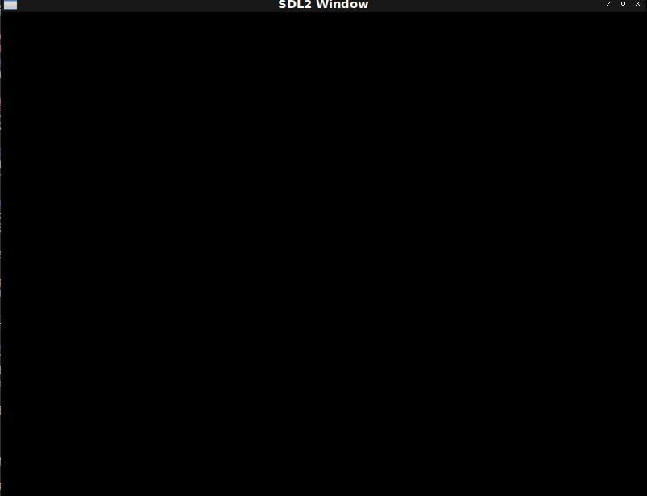

# Fight against cl-opengl 1.
## Metanotes.
### 対象読者
* OpenGL周りに興味のあるCLer。
* Common Lispに興味のあるOpenGL経験者。

CLerには筆者が得たOpenGL、cl-opengl周りの知識を、非CLerにはCommon Lisp固有（？）の抽象化技法を解説していきます。

### 何でないか
* Common Lisp開発環境構築については触れません。

## Introduction.
Common LispでOpenGLを使いたくてあれこれ調べてみたものの古い情報しかなくて困ったので得た知見を書き残しておきます。

OpenGL全ての機能を網羅する気はなく、簡単な2Dゲームを作る土台を把握できればそれでヨシとします。

筆者自身はOpenGL周りの知識は皆無です。
OpenGLのtutorialsをCommon Lispに移植しながらOpenGLについて学び必要なライブラリを探しなければ自作していきます。

本章はエコシステム周りが話題の中心となります。

## About OpenGL.
OpenGLは仕様であって実装ではありません。
Common Lispが仕様であって実装でないのと同じです。

この仕様は[2006年に標準化団体に移行したようです](https://ja.wikipedia.org/wiki/OpenGL#%E6%AD%B4%E5%8F%B2)。
その結果（？）2006年ころに第一次OpenGLブームが起きたようで（要出典）書籍やライブラリもこの頃に出版・開発開始が多いみたいです（感想・推測）。

OpenGL自体の仕様策定は活発なようで[第一版が2020年の書籍も出ています](https://learnopengl.com/book/book_pdf.pdf)。

## Common Lisp eco-systems about opengl.
Common LispのOpenGLに関するプロダクトは2015年ころのコミットが2021年現在最新コミットであるものが多く2015年ころに良く言えば「枯れた」悪く言えば「飽きられた」ニュートラルにとらえれば「開発者にとって欲しい機能は実装された」とみなせそうです。

ですが前節で記した通り現在でもOpenGLの開発は活発でOpenGLでのワークフローも刷新されていますがCommon Lisp界隈のOpenGLに関する話題は新しいもので出てきてません。

ネットで探してでてくるtutorialsは筆者が探した範囲では2021年現在非推奨の古い作法ばかりでした。
本シリーズを書くきっかけもCommon LispでOpenGL最新流儀の作法を自身で構築する必要に迫られたためです。

### FFI of oepngl.
[cl-opengl](https://github.com/3b/cl-opengl)一択です。
[lisp-builder](https://github.com/lispbuilder/lispbuilder)もOpenGLへのバインディングを持ちますが非推奨で「cl-openglを使え」とREADMEにあります。

### Windowing support.
OpenGLはGPUに依頼してアレコレしてもらうためのものでウィンドウやキーボード入力のサポートは埒外です。
本節ではそのためのライブラリを列挙します。

#### [cl-sdl2](https://github.com/lispgames/cl-sdl2)
本シリーズではこれを採用します。
理由は筆者がすでに慣れているからぐらいのものです。

#### [cl-glut](https://github.com/3b/cl-opengl/tree/master/glut)
cl-openglにはglutへのバインディングも付いてきます。
cl-glutを不採用とした理由はその設計と筆者の好みによるものです。

cl-glutはCLOSで固められた設計をしております。

筆者はcleanupコードをWITH系マクロでラップしたいというお気持ちがあります。
（WITH系マクロについては後述します。）

上記二点が両立できないためcl-glutは不採用としました。

#### [cl-glfw3](https://github.com/AlexCharlton/cl-glfw3)
対抗馬はこれです。
不採用とした理由は「よく知らないから」くらいのものです。
上に記したpdfではglfwを採用しているので事と次第によっては本シリーズ途中に乗り換えるやもしれませぬ。

ここに記す理由は「一応存在は知ってるから」くらいのものです。
メモです。

#### lisp-builder
バッテリーインクルーデッドという思想についての筆者のお気持ちは好悪半々です。
「便利！好き！」というお気持ちと「余計なものまでつけんじゃねぇよ」というお気持ちです。

不採用の理由はこの度は後者が勝ったためです。
後者が勝った理由は筆者がOpenGL周りの知識が皆無で何が必要になるか把握できておらず小さく始めたかったからです。

## Framework of my own.
OpenGLの最新作法に則ったフレームワークはないっぽいので[自作します。](https://github.com/hyotang666/fude-gl)

「筆」からとってFundamental Utility Definitions Especially for openGLと適当にでっちあげました。

本シリーズはfude-glの開発記録でもあります。

## First window.
とりあえずwindowの表示をしてみましょう。

```lisp
(defun first-window ()
  (sdl2:with-init (:everything)
    (sdl2:with-window (win :flags '(:shown :opengl)
                           :x 100
                           :y 100
                           :w 800
                           :h 600)
      (sdl2:with-gl-context (context win)
        (sdl2:with-event-loop (:method :poll)
          (:quit ()
            t)
          (:idle ()
            (sdl2:gl-swap-window win)))))))
```



## WITH type macros.
OpenGLはGPUとやりとりするためのインターフェイスです。
別の言葉で表すとそれはLisp処理系の埒外です。
データの送受信は配列で行いますがそのためにLispの配列は使えません。
Common Lispの配列は生の配列ではなくLisp Objectとしての配列だからです。
cl-openglはOpenGLに渡すための配列を作る関数`GL:ALLOC-GL-ARRAY`を提供しています。

繰り返しになりますが`GL:ALLOC-GL-ARRAY`はLisp処理系の埒外に配列を作ります。
別の言葉で表すとガベッジコレクタに回収されません。
プログラマの責任において`GL:FREE-GL-ARRAY`しなければなりません。

このような場合C++ならクラスを作りデストラクタでfreeする設計にするかもしれません。
Common LispではWITH系マクロを作ります。
その代表は[`WITH-OPEN-FILE`](http://www.lispworks.com/documentation/HyperSpec/Body/m_w_open.htm)です。

WITH-OPEN-FILEの展開系（@sbcl）は以下のようなものとなります。

```lisp
* (macroexpand-1 '(with-open-file (s "~/path/to/file")
                    the body))

1 (let ((s (open "~/path/to/file")) (#:g22647 t))
2   (unwind-protect (multiple-value-prog1 (progn the body) (setq #:g22647 nil))
3     (when s
4       (close s :abort #:g22647))))
```

1. リソースを確保し変数に束縛。
2. [`UNWIND-PROTECT`](http://www.lispworks.com/documentation/HyperSpec/Body/s_unwind.htm)でラップし本体を実行。
4. リソースを開放。

`UNWIND-PROTECT`は本体実行中にエラーが起きてもcleanupが実行されるのを保証する特殊形式です。

リソースの確保・開放を行う`OPEN`・`CLOSE`を直接使用せずマクロを通して間接的に使用することでリーク（開放忘れ）を防ぎます。
また`UNWIND-PROTECT`で包んであるのでエラーが起きても開放は確実に行われます。

## WITH-GL-VECTOR
小手調べとして`WITH-GL-VECTOR`マクロを作りましょう。

### FOREIGN-TYPE
Common Lispの型をFFI側が必要とする型名に変換する必要があります。
気をつけなければならない点としてCFFIが欲しい名前とCL-OPENGLが欲しい名前とに違いがある点が挙げられます（一敗）。

```lisp
(defun foreign-type (cl-type &key cffi)
  (cond ((and cffi (subtypep cl-type 'single-float)) :float)
        ((and cffi (subtypep cl-type 'double-float)) :double)
        ((subtypep cl-type 'float) :float)
        ((subtypep cl-type '(unsigned-byte 8))
         (if cffi
             :unsigned-char
             :unsigned-byte))
        ((subtypep cl-type '(signed-byte 8))
         (if cffi
             :char
             :byte))
        ((subtypep cl-type '(unsigned-byte 16)) :unsigned-short)
        ((subtypep cl-type '(signed-byte 16)) :short)
        ((subtypep cl-type '(unsigned-byte 32)) :unsigned-int)
        ((subtypep cl-type '(signed-byte 32)) :int)
        ((and cffi (subtypep cl-type '(unsigned-byte 64))) :unsigned-long)
        ((and cffi (subtypep cl-type '(signed-byte 64))) :long)
        (t (error "Not supported type. ~S" cl-type))))
```

### MAKE-GL-VECTOR
Common Lispにおいて配列（ARRAY）は多次元をも含みます。
しかしながら`GL:ALLOC-GL-ARRAY`は一次元配列のみを扱います。
Common Lispにおいて一次元配列には`VECTOR`という特別の呼称を用いるのが常です。
（ARRAYと呼ぶと多次元になりうることを暗に示唆する。）

また`GL:ALLOC-GL-ARRAY`は中身のない配列を返します。
利便性のためにLispの`VECTOR`を渡すとその中身が代入されたGL配列が返される薄いヘルパを定義します。

```lisp
(defun make-gl-vector (initial-contents)
  (let* ((length (length initial-contents))
         (a
          (gl:alloc-gl-array
            (foreign-type (array-element-type initial-contents) :cffi t)
            length)))
    (dotimes (i length a) (setf (gl:glaref a i) (aref initial-contents i)))))
```

### WETH-GL-VECTOR
マクロ自体は大変薄いラッパとなります。

```lisp
(defmacro with-gl-array ((&rest bind*) &body body)
  `(let ,(mapcar
           (lambda (bind)
             (check-type bind (cons symbol (cons t null)))
             (destructuring-bind
                 (var vector)
                 bind
               `(,var (make-gl-array ,vector))))
           bind*)
     (unwind-protect (progn ,@body)
       ,@(mapcar (lambda (bind) `(gl:free-gl-array ,(car bind))) bind*))))
```
