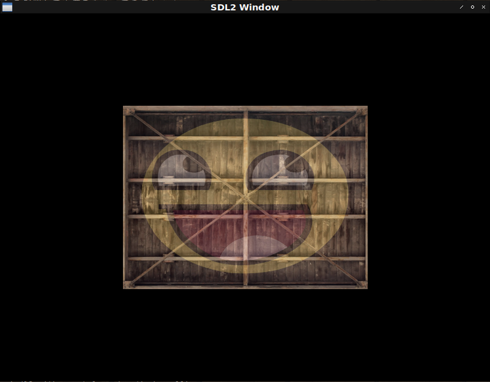

# Fight against cl-opengl 10.
## Metanotes
### 対象読者
[前章](clopengl9.html)読了済みの方。

## Introduction
前章では`texture`を抽象化しました。
しかしながら白状しますと`texture`を一つしか扱えないという不具合があります。
今回は複数の`texture`を取り扱えるよう拡張を施します。

また新たに見えてきた抽象化点を実装します。

## uniform
これまでのコードでは`WITH-SHADER`で`uniform`を束縛したものの実際には使用しませんでした。
実際にコードを動かした方なら既にご承知かと思われますが使われてない変数があるという警告がでます。

`uniform`変数に`texture`を渡すコードを書いていないのに動くのは既定値がいい具合に処理してくれていたからです。
複数の`texture`を取り扱う場合は既定値に頼らず自前で`uniform`変数に`texture`を渡す必要があります。

マクロを改築しましょう。

```lisp
(defmacro with-textures ((&rest bind*) &body body)
  ;; Trivial syntax check.
  (dolist (b bind*) (the (cons symbol (cons texture-target *)) b))
  (labels ((vname (k v)
             (case k
               ((:texture-wrap-s :texture-wrap-t :texture-wrap-r)
                (ensure-check v 'texture-wrapping))
               ((:texture-mag-filter) (ensure-check v 'texture-mag-filter))
               ((:texture-min-fileter) (ensure-check v 'texture-min-filter))
               (otherwise v)))
           (<option-setters> (params target)
             (destructuring-bind
                 (&key (texture-wrap-s :repeat) (texture-wrap-t :repeat)
                  (texture-min-filter :linear) (texture-mag-filter :linear)
                  &allow-other-keys)
                 params
               (let ((params
                      (list* :texture-wrap-s texture-wrap-s :texture-wrap-t
                             texture-wrap-t :texture-mag-filter
                             texture-mag-filter :texture-min-filter
                             texture-min-filter
                             (uiop:remove-plist-keys
                               '(:texture-wrap-s :texture-wrap-t
                                 :texture-min-filter :texture-mag-filter)
                               params))))
                 (loop :for (k v) :on params :by #'cddr
                       :collect `(gl:tex-parameter ,target
                                                   ,(ensure-check k
                                                                  'texture-pname)
                                                   ,(vname k v))))))
           (ensure-check (v type)
             (if (constantp v)
                 (progn (assert (typep v type)) v)
                 `(the ,type ,v))))
    ;; The body.
    `(destructuring-bind
         ,(mapcar #'car bind*)
         (gl:gen-textures ,(length bind*))
       (unwind-protect
           (progn
            ,@(mapcan
                (lambda (b)
                  (destructuring-bind
                      (var target &key params init (uniform 0))
                      b
                    `((gl:active-texture ,var) ; <--- New!
                      (gl:bind-texture ,(ensure-check target 'texture-target)
                                       ,var)
                      ,@(<option-setters> params target) ,init
                      (gl:uniformi ,uniform ,var)))) ; <--- New!
                bind*)
            ,@body)
         (gl:delete-textures (list ,@(mapcar #'car bind*)))))))
```

### face.png
これでうまく動くはずです。
本家tutorialsを参照して画像をもらってきましょう。

```lisp
(let ((pathname (merge-pathnames "awesomeface.png" (user-homedir-pathname))))
  (unless (probe-file pathname)
    (dex:fetch "https://learnopengl.com/img/textures/awesomeface.png" pathname))
  (defparameter *face* (opticl:vertical-flip-image (opticl:read-png-file pathname))))
```

コードは以下のようになります。

```lisp
(defshader some-textures 330 (xy st)
  (:vertex ((coord :vec2))
    "gl_Position = vec4(xy, 0.0, 1.0);"
    "coord = st;")
  (:fragment ((color :vec4) &uniform (tex1 :|sampler2D|) (tex2 :|sampler2D|))
    "color = mix(texture(tex1, coord), texture(tex2, coord), 0.2);"))

(defparameter *texture-quad*
  (concatenate '(array single-float (*))
               (make-instance 'some-textures :x -0.5 :y 0.5 :s 0.0 :t 1.0) ; top left
               (make-instance 'some-textures :x 0.5 :y 0.5 :s 1.0 :t 1.0) ; top right
               (make-instance 'some-textures :x -0.5 :y -0.5 :s 0.0 :t 0.0) ; bottom left
               (make-instance 'some-textures :x 0.5 :y -0.5 :s 1.0 :t 0.0))) ; bottom right

(defun some-textures ()
  (sdl2:with-init (:everything)
    (sdl2:with-window (win :flags '(:shown :opengl)
                           :x 100
                           :y 100
                           :w 800
                           :h 600)
      (sdl2:with-gl-context (context win)
        (with-shader ((some-textures (:vertices *texture-quad*)
                                     (:indices '(0 1 2 2 3 1))
                                     (:uniform (tex1-loc tex1) (tex2-loc tex2))))
          (with-textures ((tex1 :texture-2d :init (tex-image-2d *image*)
                                :uniform tex1-loc)
                          (tex2 :texture-2d :init (tex-image-2d *face*)
                                :uniform tex2-loc))
            (sdl2:with-event-loop (:method :poll)
              (:quit ()
                t)
              (:idle ()
                (with-clear (win (:color-buffer-bit))
                  (draw-elements :triangles (indices-of some-textures)))))))))))
```


## Issue
動くには動きますがコードに不満が残ります。
`WITH-SHADER`で束縛された`uniform`変数は`WITH-TEXTURE`に渡されるだけで以降使用されません。
このような中間変数は見えない方が健全です。

これはこんなふうに書けたらいいなというデッサンでしかありませんが以下のように書けると各コードやデータの関係性が見えやすくてよろしゅうございます。

```lisp
(with-shader ((some-textures (:vertices *texture-quad*)
                             (:indices '(0 1 2 2 3 1))
                             (:uniform (tex1 :texture-2d (tex-image-2d *image*))
                                       (tex2 :texture-2d (tex-image-2d *face*)))))
  (sdl2:with-event-loop (:method :poll)
    (:quit ()
      t)
    (:idle ()
      (with-clear (win (:color-buffer-bit))
        (draw-elements :triangles (indices-of some-textures))))))
```

### Implementation.
改築しましょう。

```lisp
(defmacro with-shader ((&rest bind*) &body body)
  (let ((uniform-vars
         (alexandria:make-gensym-list
           (loop :for (nil . clause*) :in bind*
                 :sum (loop :for c :in clause*
                            :when (eq :uniform (car c))
                              :sum (count-if #'listp (cdr c)))))))
    `(with-vao ,(mapcar
                  (lambda (bind)
                    (destructuring-bind
                        (class &rest clause*)
                        bind
                      `(,class
                        ,@(loop :for clause :in clause*
                                :when (eq :indices (car clause))
                                  :collect `(:indices
                                             (coerce ,(second clause)
                                                     '(array (unsigned-byte 8)
                                                       (*)))
                                             :target :element-array-buffer)
                                :when (eq :uniform (car clause))
                                  :collect `(:uniform
                                             ,@(mapcar #'alexandria:ensure-car
                                                       (cdr clause)))
                                :else
                                  :collect clause)
                        (:attributes ',class)
                        (:shader (vertex-shader ',class)
                         (fragment-shader ',class)))))
                  bind*)
       ,@(let ((uniforms
                (mapcan
                  (lambda (bind)
                    (remove-if #'symbolp (cdr (assoc :uniform (cdr bind)))))
                  bind*)))
           (if (null uniforms)
               body
               `((with-textures ,(mapcar
                                   (lambda (uniform gvar)
                                     (destructuring-bind
                                         (var target init)
                                         uniform
                                       `(,gvar ,target :init ,init :uniform
                                         ,var)))
                                   uniforms uniform-vars)
                   ,@body)))))))
```
