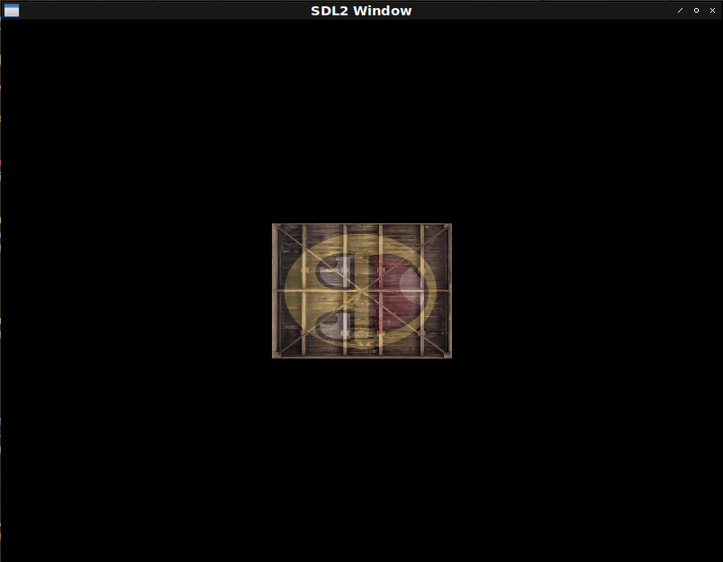

# Fight against cl-opengl 11.
## Metanotes
### 対象読者
[前回](clopengl10.html)読了済みの方。

## Introduction.
前回は複数の`texture`を取り扱えるようマクロの改築を行いました。
本章では行列演算を導入し`texture`の移動、伸縮、回転を実施します。

実装よりはエコシステムの紹介となります。

## Ecosystem.
行列演算を行うライブラリは複数ありますがこれらはけしてOpenGLで行うような画像処理に特化しているわけではありません。
その土台となる機能でしかありません。
僕達が必要としているOpenGLで使うように設計されている行列演算ライブラリは以下の二択です。

### [3d-matrices](https://github.com/Shinmera/3d-matrices) with [3d-vectors](https://github.com/Shinmera/3d-vectors).
本シリーズで採用するのはこれです。

### [sb-cga](https://github.com/nikodemus/sb-cga)
対抗馬はこれです。

こちらを不採用にした理由は幾つかの機能が足りないのと実装が参照しているtutorialsで採用されているGLMと挙動が異なる点があるからです。
具体的にはGLMの回転は左回転ですがsb-cgaは右回転です。

速度はこちらのほうが早そうなので（要計測）何よりも速度が求められる場合はこちらの採用を視野にいれてもいいかもしれません。

## How to use.
`uniform`変数に行列を渡すには`GL:UNIFORM-MATRIX`を使います。

```lisp
(defun radians (degrees) (* degrees (/ pi 180)))

(defshader transform-demo 330 (xy st)
  (:vertex ((coord :vec2) &uniform (transform :mat4))
    "gl_Position = transform * vec4(xy, 0.0, 1.0);"
    "coord = st;")
  (:fragment ((color :vec4) &uniform (tex1 :|sampler2D|) (tex2 :|sampler2D|))
    "color = mix(texture(tex1, coord), texture(tex2, coord), 0.2);"))

(defparameter *texture-quad*
  (concatenate '(array single-float (*))
               (make-instance 'transform-demo :x -0.5 :y 0.5 :s 0.0 :t 1.0) ; top left
               (make-instance 'transform-demo :x 0.5 :y 0.5 :s 1.0 :t 1.0) ; top right
               (make-instance 'transform-demo :x -0.5 :y -0.5 :s 0.0 :t 0.0) ; bottom left
               (make-instance 'transform-demo :x 0.5 :y -0.5 :s 1.0 :t 0.0))) ; bottom right

(defun transform-demo ()
  (sdl2:with-init (:everything)
    (sdl2:with-window (win :flags '(:shown :opengl)
                           :x 100
                           :y 100
                           :w 800
                           :h 600)
      (sdl2:with-gl-context (context win)
        (with-shader ((transform-demo
                        (:vertices *texture-quad*)
                        (:indices '(0 1 2 2 3 1))
                        (:uniform (tex1 :texture-2d (tex-image-2d *image*))
                                  (tex2 :texture-2d (tex-image-2d *face*))
                                  transform)))
          (sdl2:with-event-loop (:method :poll)
            (:quit ()
              t)
            (:idle ()
              (with-clear (win (:color-buffer-bit))
                (gl:uniform-matrix transform 4
                                   (vector
                                     (let ((mat (3d-matrices:meye 4)))
                                       (3d-matrices:nmrotate mat
                                                             3d-vectors:+vz+
                                                             (radians 90))
                                       (3d-matrices:marr
                                         (3d-matrices:nmscale mat
                                                              (3d-vectors:vec
                                                                0.5 0.5
                                                                0.5))))))
                (draw-elements :triangles (indices-of transform-demo))))))))))
```



### Translate X axis.

```lisp
(defun translate-x ()
  (sdl2:with-init (:everything)
    (sdl2:with-window (win :flags '(:shown :opengl)
                           :x 100
                           :y 100
                           :w 800
                           :h 600)
      (sdl2:with-gl-context (context win)
        (with-shader ((transform-demo
                        (:vertices *texture-quad*)
                        (:indices '(0 1 2 2 3 1))
                        (:uniform (tex1 :texture-2d (tex-image-2d *image*))
                                  (tex2 :texture-2d (tex-image-2d *face*))
                                  transform)))
          (sdl2:with-event-loop (:method :poll)
            (:quit ()
              t)
            (:idle ()
              (with-clear (win (:color-buffer-bit))
                (sleep (/ 1 60))
                (gl:uniform-matrix transform 4
                                   (vector
                                     (3d-matrices:marr
                                       (3d-matrices:mtranslation
                                         (3d-vectors:vec (sin (get-internal-real-time))
                                                         0.0
                                                         0.0)))))
                (draw-elements :triangles (indices-of transform-demo))))))))))
```


### Translate Y axis.

```lisp
(defun translate-y ()
  (sdl2:with-init (:everything)
    (sdl2:with-window (win :flags '(:shown :opengl)
                           :x 100
                           :y 100
                           :w 800
                           :h 600)
      (sdl2:with-gl-context (context win)
        (with-shader ((transform-demo
                        (:vertices *texture-quad*)
                        (:indices '(0 1 2 2 3 1))
                        (:uniform (tex1 :texture-2d (tex-image-2d *image*))
                                  (tex2 :texture-2d (tex-image-2d *face*))
                                  transform)))
          (sdl2:with-event-loop (:method :poll)
            (:quit ()
              t)
            (:idle ()
              (with-clear (win (:color-buffer-bit))
                (sleep (/ 1 60))
                (gl:uniform-matrix transform 4
                                   (vector
                                     (3d-matrices:marr
                                       (3d-matrices:mtranslation
                                         (3d-vectors:vec 0.0
                                                         (sin (get-internal-real-time))
                                                         0.0)))))
                (draw-elements :triangles (indices-of transform-demo))))))))))
```


### Scaling.

```lisp
(defun scaling ()
  (sdl2:with-init (:everything)
    (sdl2:with-window (win :flags '(:shown :opengl)
                           :x 100
                           :y 100
                           :w 800
                           :h 600)
      (sdl2:with-gl-context (context win)
        (with-shader ((transform-demo
                        (:vertices *texture-quad*)
                        (:indices '(0 1 2 2 3 1))
                        (:uniform (tex1 :texture-2d (tex-image-2d *image*))
                                  (tex2 :texture-2d (tex-image-2d *face*))
                                  transform)))
          (sdl2:with-event-loop (:method :poll)
            (:quit ()
              t)
            (:idle ()
              (with-clear (win (:color-buffer-bit))
                (sleep (/ 1 60))
                (gl:uniform-matrix transform 4
                                   (vector
                                     (3d-matrices:marr
                                       (3d-matrices:nmscale
                                         (3d-matrices:mtranslation
                                           (3d-vectors:vec 0 0 0))
                                         (let ((v (sin (get-internal-real-time))))
                                           (3d-vectors:vec v v 0.0))))))
                (draw-elements :triangles (indices-of transform-demo))))))))))
```


### Rotating.

```lisp
(defun rotating ()
  (sdl2:with-init (:everything)
    (sdl2:with-window (win :flags '(:shown :opengl)
                           :x 100
                           :y 100
                           :w 800
                           :h 600)
      (sdl2:with-gl-context (context win)
        (with-shader ((transform-demo
                        (:vertices *texture-quad*)
                        (:indices '(0 1 2 2 3 1))
                        (:uniform (tex1 :texture-2d (tex-image-2d *image*))
                                  (tex2 :texture-2d (tex-image-2d *face*))
                                  transform)))
          (sdl2:with-event-loop (:method :poll)
            (:quit ()
              t)
            (:idle ()
              (with-clear (win (:color-buffer-bit))
                (sleep (/ 1 60))
                (gl:uniform-matrix transform 4
                                   (vector
                                     (3d-matrices:marr
                                       (3d-matrices:nmrotate
                                         (3d-matrices:mtranslation
                                           (3d-vectors:vec 0 0 0))
                                         3d-vectors:+vz+
                                         (radians (get-internal-real-time))))))
                (draw-elements :triangles (indices-of transform-demo))))))))))
```


