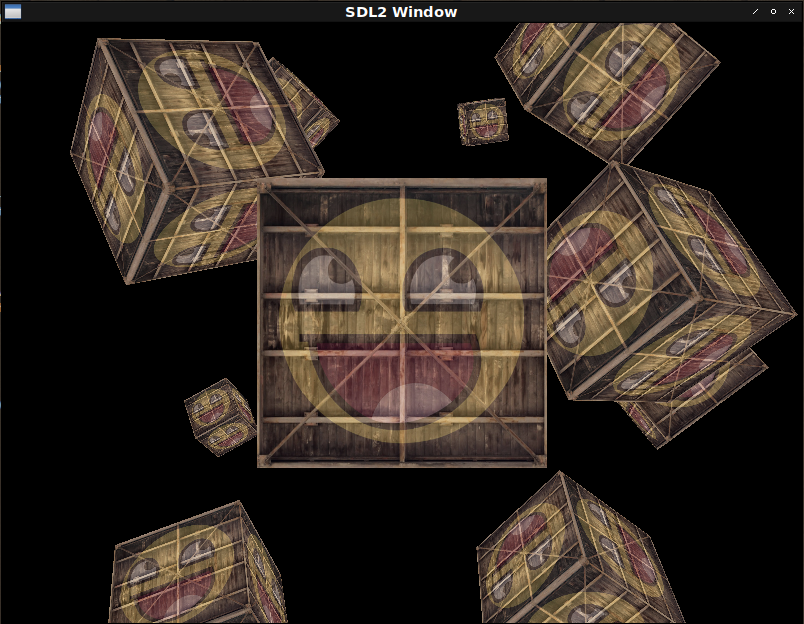

# Fight against cl-opengl 12.
## Metanotes
### 対象読者
[前章](clopengl11.html)読了済みの方。

## Introduction.
前章では行列演算の導入により画像の移動、伸縮、回転を行いました。
本章では3Dの世界に一歩踏み出します。

実装というよりは`3D-MATRICES`のtutorialsのような内容になります。

## Perspective.
二次元画像に遠近法を適用させることで三次元風に表示してみましょう。

```lisp
(defshader coord-demo 330 (xy st)
  (:vertex ((coord :vec2) &uniform (model :mat4) (view :mat4) (projection :mat4))
    "gl_Position = projection * view * model * vec4(xy, 0.0, 1.0);"
    "coord = st;")
  (:fragment ((color :vec4) &uniform (tex1 :|sampler2D|) (tex2 :|sampler2D|))
    "color = mix(texture(tex1, coord), texture(tex2, coord), 0.2);"))

(defparameter *texture-quad*
  (concatenate '(array single-float (*))
               (make-instance 'coord-demo :x -0.5 :y 0.5 :s 0.0 :t 1.0) ; top left
               (make-instance 'coord-demo :x 0.5 :y 0.5 :s 1.0 :t 1.0) ; top right
               (make-instance 'coord-demo :x -0.5 :y -0.5 :s 0.0 :t 0.0) ; bottom left
               (make-instance 'coord-demo :x 0.5 :y -0.5 :s 1.0 :t 0.0))) ; bottom right

(defun coord-demo ()
  (sdl2:with-init (:everything)
    (sdl2:with-window (win :flags '(:shown :opengl)
                           :x 100
                           :y 100
                           :w 800
                           :h 600)
      (sdl2:with-gl-context (context win)
        (with-shader ((coord-demo
                        (:vertices *texture-quad*)
                        (:indices '(0 1 2 2 3 1))
                        (:uniform (tex1 :texture-2d (tex-image-2d *image*))
                                  (tex2 :texture-2d (tex-image-2d *face*))
                                  model view projection)))
          (let ((m (3d-matrices:nmrotate (3d-matrices:meye 4)
                                         3d-vectors:+vx+ ; <--- ｘ軸を指定。
                                         (radians -55))) ; <--- 55度で回転。
                (v (3d-matrices:mtranslation (3d-vectors:vec 0 0 -3)))
                (p (3d-matrices:mperspective 45 ; <--- 遠近法を適用させるための行列。
                                             (multiple-value-call #'/ (sdl2:get-window-size win))
                                             0.1
                                             100)))
            (flet ((send (matrix uniform)
                     (gl:uniform-matrix uniform 4 (vector (3d-matrices:marr matrix)))))
              (sdl2:with-event-loop (:method :poll)
                (:quit ()
                  t)
                (:idle ()
                  (with-clear (win (:color-buffer-bit))
                    (send m model)
                    (send v view)
                    (send p projection)
                    (draw-elements :triangles (indices-of coord-demo))))))))))))
```


注意点は`3D-MATRICES:NMROTATE`はradianを受け取るのに対し`3D-MATRICES:MPERSPECTIVE`はdegreeを受け取る点です。
双方引数は`ANGLE`となっているので混同するので（一敗）こういうのはやめてほしいところです。

## DEPTH
奥行きも入れてcubeを作ってみましょう。

`:depth-test`の追加と`:depth-buffer-bit`のリセットが必要です。

回転が早すぎるので適当に`CL:SLEEP`を挟むとします。

```lisp
(defclass xyz ()
  ((%x :initarg :x :type single-float)
   (%y :initarg :y :type single-float)
   (%z :initarg :z :type single-float))
  (:metaclass vector-class))

(defshader depth-demo 330 (xyz st)
  (:vertex ((coord :vec2) &uniform (model :mat4) (view :mat4) (projection :mat4))
    "gl_Position = projection * view * model * vec4(xyz, 1.0);"
    "coord = st;")
  (:fragment ((color :vec4) &uniform (tex1 :|sampler2D|) (tex2 :|sampler2D|))
    "color = mix(texture(tex1, coord), texture(tex2, coord), 0.2);"))

(defparameter *depth-demo*
  (flet ((make (x y z s %t)
           (make-instance 'depth-demo :x x :y y :z z :s s :t %t)))
    (concatenate '(array single-float (*))
                 ;;
                 (make -0.5 -0.5 -0.5  0.0 0.0)
                 (make 0.5 -0.5 -0.5  1.0 0.0)
                 (make 0.5  0.5 -0.5  1.0 1.0)
                 (make 0.5  0.5 -0.5  1.0 1.0)
                 (make -0.5  0.5 -0.5  0.0 1.0)
                 (make -0.5 -0.5 -0.5  0.0 0.0)
                 ;;
                 (make -0.5 -0.5  0.5  0.0 0.0)
                 (make 0.5 -0.5  0.5  1.0 0.0)
                 (make 0.5  0.5  0.5  1.0 1.0)
                 (make 0.5  0.5  0.5  1.0 1.0)
                 (make -0.5  0.5  0.5  0.0 1.0)
                 (make -0.5 -0.5  0.5  0.0 0.0)
                 ;;
                 (make -0.5  0.5  0.5  1.0 0.0)
                 (make -0.5  0.5 -0.5  1.0 1.0)
                 (make -0.5 -0.5 -0.5  0.0 1.0)
                 (make -0.5 -0.5 -0.5  0.0 1.0)
                 (make -0.5 -0.5  0.5  0.0 0.0)
                 (make -0.5  0.5  0.5  1.0 0.0)
                 ;;
                 (make 0.5  0.5  0.5  1.0 0.0)
                 (make 0.5  0.5 -0.5  1.0 1.0)
                 (make 0.5 -0.5 -0.5  0.0 1.0)
                 (make 0.5 -0.5 -0.5  0.0 1.0)
                 (make 0.5 -0.5  0.5  0.0 0.0)
                 (make 0.5  0.5  0.5  1.0 0.0)
                 ;;
                 (make -0.5 -0.5 -0.5  0.0 1.0)
                 (make 0.5 -0.5 -0.5  1.0 1.0)
                 (make 0.5 -0.5  0.5  1.0 0.0)
                 (make 0.5 -0.5  0.5  1.0 0.0)
                 (make -0.5 -0.5  0.5  0.0 0.0)
                 (make -0.5 -0.5 -0.5  0.0 1.0)
                 ;;
                 (make -0.5  0.5 -0.5  0.0 1.0)
                 (make 0.5  0.5 -0.5  1.0 1.0)
                 (make 0.5  0.5  0.5  1.0 0.0)
                 (make 0.5  0.5  0.5  1.0 0.0)
                 (make -0.5  0.5  0.5  0.0 0.0)
                 (make -0.5  0.5 -0.5  0.0 1.0))))

(defun depth-demo ()
  (sdl2:with-init (:everything)
    (sdl2:with-window (win :flags '(:shown :opengl)
                           :x 100
                           :y 100
                           :w 800
                           :h 600)
      (sdl2:with-gl-context (context win)
        (with-shader ((depth-demo
                        (:vertices *depth-demo*)
                        (:indices '())
                        (:uniform (tex1 :texture-2d (tex-image-2d *image*))
                                  (tex2 :texture-2d (tex-image-2d *face*))
                                  model view projection)))
            (flet ((send (matrix uniform)
                         (gl:uniform-matrix uniform 4 (vector (3d-matrices:marr matrix)))))
              (gl:enable :depth-test) ; <--- New!
              (sdl2:with-event-loop (:method :poll)
                (:quit ()
                  t)
                (:idle ()
                  (sleep (/ 1 15)) ; <--- FPSを制御。
                  (with-clear (win (:color-buffer-bit :depth-buffer-bit)) ; <--- Updated!
                    (let ((m (3d-matrices:nmrotate (3d-matrices:meye 4)
                                                   (3d-vectors:vec 0.5 1 0)
                                                   (radians (get-internal-real-time))))
                          (v (3d-matrices:mtranslation (3d-vectors:vec 0 0 -3)))
                          (p (3d-matrices:mperspective 45
                                                       (multiple-value-call #'/ (sdl2:get-window-size win))
                                                       0.1
                                                       100)))
                      (send m model)
                      (send v view)
                      (send p projection)
                      (gl:draw-arrays :triangles 0 36)))))))))))
```


ぶっ壊れた映像になっていますが、これは`3D-MATRICES`のアルゴリズムがおかしいせいです。
（プルリク申請中。）
修正すると以下のようになります。


## Some cubes.
複数のcubeを表示してみましょう。

変数`V`や`P`はイベントループの外に出したほうが効率が良いですが、ここでは目を瞑るとします。

```lisp
(defshader cubes 330 (xyz st)
  (:vertex ((coord :vec2) &uniform (model :mat4) (view :mat4) (projection :mat4))
    "gl_Position = projection * view * model * vec4(xyz, 1.0);"
    "coord = st;")
  (:fragment ((color :vec4) &uniform (tex1 :|sampler2D|) (tex2 :|sampler2D|))
    "color = mix(texture(tex1, coord), texture(tex2, coord), 0.2);"))

(defun cubes ()
  (sdl2:with-init (:everything)
    (sdl2:with-window (win :flags '(:shown :opengl)
                           :x 100
                           :y 100
                           :w 800
                           :h 600)
      (sdl2:with-gl-context (context win)
        (with-shader ((cubes
                        (:vertices *depth-demo*)
                        (:indices '())
                        (:uniform (tex1 :texture-2d (tex-image-2d *image*))
                                  (tex2 :texture-2d (tex-image-2d *face*))
                                  model view projection)))
            (flet ((send (matrix uniform)
                         (gl:uniform-matrix uniform 4 (vector (3d-matrices:marr matrix)))))
              (let ((cube-positions
                      (list (3d-vectors:vec 0 0 0)
                            (3d-vectors:vec 2 5 -15)
                            (3d-vectors:vec -1.5 -2.2 -2.5)
                            (3d-vectors:vec -3.8 -2.0 -12.3)
                            (3d-vectors:vec 2.4 -0.4 -3.5)
                            (3d-vectors:vec -1.7 3 -7.5)
                            (3d-vectors:vec 1.3 -2 -2.5)
                            (3d-vectors:vec 1.5 2 -2.5)
                            (3d-vectors:vec 1.5 0.2 -1.5)
                            (3d-vectors:vec -1.3 1 -1.5))))
                (gl:enable :depth-test)
                (sdl2:with-event-loop (:method :poll)
                  (:quit ()
                    t)
                  (:idle ()
                    (sleep (/ 1 5))
                    (with-clear (win (:color-buffer-bit :depth-buffer-bit))
                      (loop :for pos :in cube-positions
                            :for i :upfrom 0
                            :do (let ((m (3d-matrices:nmrotate (3d-matrices:mtranslation pos)
                                          (3d-vectors:vec 1 0.3 0.5)
                                          (fude-gl:radians (* 20 i))))
                                      (v (3d-matrices:mtranslation (3d-vectors:vec 0 0 -3)))
                                      (p (3d-matrices:mperspective 45
                                          (multiple-value-call #'/ (sdl2:get-window-size win))
                                          0.1
                                          100)))
                                  (send m model)
                                  (send v view)
                                  (send p projection)
                                  (gl:draw-arrays :triangles 0 36)))))))))))))
```

