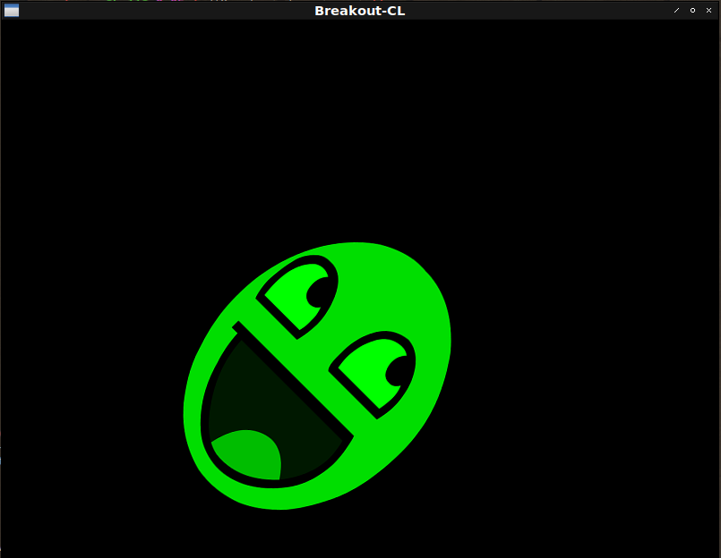

# Fight against cl-opengl 14.
## Metanotes
### 対象読者
[前章](clopengl13.html)読了済みの方。

## Introduction.
前章ではカメラ視点行列を導入しユーザーの入力を受け取りました。
本シリーズの目標は3Dではなく簡単な2Dゲーム作成なのでこれ以上3D周りの機能に踏み込むことはしません。
2Dゲーム作成のための基礎は把握できてきたので応用へと進みましょう。
[本家tutorial](https://learnopengl.com/book/book_pdf.pdf)を参照にブロック崩しをCommon Lispに移植していきます。

本章ではスプライトを扱うための地固めを行います。

## BREAKOUT-CL
ゲーム作成用の`ASDF:SYSTEM`を作りましょう。
ここでは名を`BREAKOUT-CL`とします。

## ORTHO
3D用の`projection`行列は遠近法行列を用いましたが2D用には`orthographic`（正射影）行列を用います。
簡便のために関数にしておきましょう。

```lisp
(defun ortho (win)
  (multiple-value-bind (w h)
      (sdl2:get-window-size win)
    (vector (3d-matrices:marr (3d-matrices:mortho 0 w h 0 -1 1)))))
```

## Shader
`Splite`表示用のシェーダーは以下の通り。

3D視点でないため`view`行列を受け取らない点要注目。

```lisp
(fude-gl:defshader splite 330 (fude-gl:xy fude-gl:st)
  (:vertex ((|texCoord| :vec2) &uniform (model :mat4) (projection :mat4))
    "texCoord = st;"
    "gl_Position = projection * model * vec4(xy, 0.0, 1.0);")
  (:fragment ((color :vec4) &uniform (image :|sampler2D|)
              (|spliteColor| :vec3))
    "color = vec4(spliteColor, 1.0) * texture(image, texCoord);"))
```

## \*QUADS\*
`Splite`描画用の頂点は以下の通り。

```lisp
(defparameter *quads*
  (concatenate '(array single-float (*))
               (make-instance 'splite :x 0.0 :y 1.0 :s 0.0 :t 1.0)
               (make-instance 'splite :x 1.0 :y 0.0 :s 1.0 :t 0.0)
               (make-instance 'splite :x 0.0 :y 0.0 :s 0.0 :t 0.0)
               (make-instance 'splite :x 0.0 :y 1.0 :s 0.0 :t 1.0)
               (make-instance 'splite :x 1.0 :y 1.0 :s 1.0 :t 1.0)
               (make-instance 'splite :x 1.0 :y 0.0 :s 1.0 :t 0.0)))
```

## MODEL-MATRIX
`model`行列を簡単に生成できるように関数にしましょう。

```lisp
(defun model-matrix (x y w h &optional (rotate 0))
  (vector
    (3d-matrices:marr
      (3d-matrices:nmscale
        (3d-matrices:nmtranslate
          (3d-matrices:nmrotate
            (3d-matrices:nmtranslate
              (3d-matrices:mtranslation (3d-vectors:vec x y 0))
              (3d-vectors:vec (* 0.5 w) (* 0.5 h) 0))
            3d-vectors:+vz+ (fude-gl:radians rotate))
          (3d-vectors:vec (* -0.5 w) (* -0.5 h) 0))
        (3d-vectors:vec w h 1)))))
```

## Images.
### EFILETYPE-CASE
拡張子で分岐する簡単な条件分岐マクロを定義します。
わざわざマクロ化する魂胆は修正箇所の削減です。
分岐節を追加・削除（＝サポートされている拡張子を追加・削除）するとエラーメッセージのサポートされている拡張子群が自動的に更新されます。
人が手で二箇所修正しなければならないというルールを導入するよりこのマクロを使わなければならないというルールを導入するほうがコスパがよろしゅうございます。

```lisp
(defmacro efiletype-case (pathname &body clause*)
  ;; Trivial syntax check.
  (assert (every (lambda (clause) (typep clause '(cons cons *))) clause*))
  (let ((type (gensym "FILETYPE")))
    `(let ((,type (pathname-type ,pathname)))
       (cond
         ,@(mapcar
             (lambda (clause)
               `((find ,type ',(car clause) :test #'string-equal)
                 ,@(cdr clause)))
             clause*)
         (t
          (error "Not supported file type ~S. ~S" ,type
                 ',(loop :for c :in clause*
                         :append (car c))))))))
```

### ENSURE-LOAD
画像ファイルが既にローカルにあるならそれを、なければネットからダウンロードしてきます。

```lisp
(defun ensure-load (url)
  (let* ((filename (subseq url (1+ (position #\/ url :from-end t))))
         (pathname
          (ensure-directories-exist
            (merge-pathnames (format nil "img/~A" filename)
                             (asdf:system-source-directory
                               (asdf:find-system :breakout-cl))))))
    (unless (probe-file pathname)
      (uiop:format! *trace-output* "~&Downloading ~S" filename)
      (dex:fetch url pathname))
    (efiletype-case pathname
      ((png) (opticl:read-png-file pathname))
      ((jpg jpeg) (opticl:read-jpeg-file pathname)))))
```

### ENSURE-IMAGE
ロードした画像はキャッシュを取っておくことにします。（何度もロードしたくない。）
また事前に登録されている画像しか取り扱えないようにしておきます。（不測の事態を抱え込みたくない。）

```lisp
(defparameter *images* (make-hash-table :test #'equal))

(let ((urls (make-hash-table)))
  (flet ((def (name url)
           (setf (gethash name urls) url)))
    (def :face "https://learnopengl.com/img/textures/awesomeface.png")
    (def :block "https://learnopengl.com/img/in-practice/breakout/textures/block.png")
    (def :block-solid "https://learnopengl.com/img/in-practice/breakout/textures/block_solid.png")
    (def :background "https://learnopengl.com/img/in-practice/breakout/textures/background.jpg")
    (def :paddle "https://learnopengl.com/img/in-practice/breakout/textures/paddle.png"))
  (defun ensure-image (name)
    (or (gethash name *images*)
        (setf (gethash name *images*)
                (ensure-load
                  (or (gethash name urls)
                      (error "Unknown image file name. ~S ~S" name
                             (alexandria:hash-table-keys urls))))))))
```

## MAIN
`MAIN`関数は以下の通り。

```lisp
(defun main ()
  (sdl2:with-init (:everything)
    (sdl2:with-window (win :flags '(:shown :opengl)
                           :x 100
                           :y 100
                           :w 800
                           :h 600
                           :title "Breakout-CL")
      (sdl2:with-gl-context (context win)
        (gl:enable :blend)
        (gl:blend-func :src-alpha :one-minus-src-alpha)
        (fude-gl:with-shader ((splite
                                (:vertices *quads*)
                                (:uniform model projection |spliteColor|
                                          (image :texture-2d (fude-gl:tex-image-2d
                                                               (ensure-image :face))))))
          (gl:uniform-matrix projection 4 (ortho win))
          (sdl2:with-event-loop (:method :poll)
            (:quit ()
              t)
            (:idle ()
              (sleep (/ 1 30))
              (fude-gl:with-clear (win (:color-buffer-bit))
                (gl:uniform-matrix model 4 (model-matrix 200 200 300 400 45))
                (gl:uniformi image face)
                (gl:uniformf |spliteColor| 0 1 0)
                (gl:draw-arrays :triangles 0 6)))))))))
```

