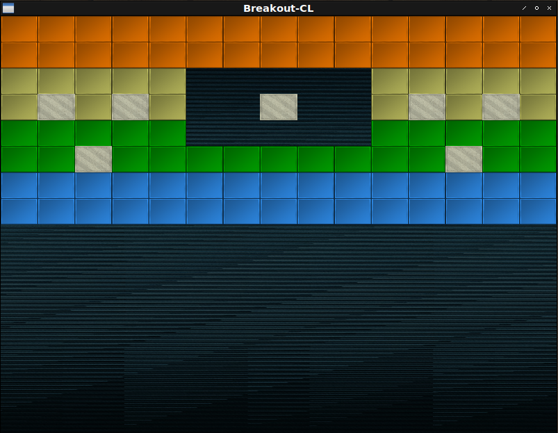
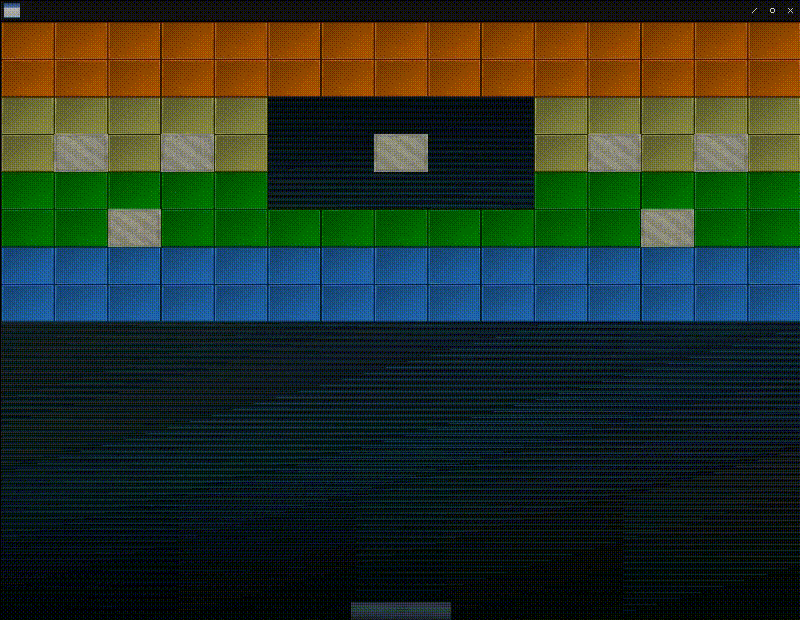

# Fight against cl-opengl 15.
## Metanotes
### 対象読者
[前章](clopengl14.html)読了済みの方。

## Introduction
前章ではスプライト導入の地固めを行いました。
本章ではマクロの改築と`level`パーサを作っていきます。

## WITH-SHADER
マクロ`WITH-SHADER`はシェーダーとテクスチャが一対一対応するものでした。
しかしこれは早すぎる抽象化だったようです。
プレイヤー、ブロック、背景、ボール、様々なテクスチャを一つのシェーダーで描画する必要があります。

改築しましょう。

### WITH-TEXTURE
`uniform`変数とテクスチャが一対多対応となるのでマクロで一律送信できません。
手動で送るべきです。

```lisp
(defmacro with-textures ((&rest bind*) &body body)
  ;; Trivial syntax check.
  (dolist (b bind*) (the (cons symbol (cons texture-target *)) b))
  (labels ((vname (k v)
             (case k
               ((:texture-wrap-s :texture-wrap-t :texture-wrap-r)
                (ensure-check v 'texture-wrapping))
               ((:texture-mag-filter) (ensure-check v 'texture-mag-filter))
               ((:texture-min-fileter) (ensure-check v 'texture-min-filter))
               (otherwise v)))
           (<option-setters> (params target)
             (destructuring-bind
                 (&key (texture-wrap-s :repeat) (texture-wrap-t :repeat)
                  (texture-min-filter :linear) (texture-mag-filter :linear)
                  &allow-other-keys)
                 params
               (let ((params
                      (list* :texture-wrap-s texture-wrap-s :texture-wrap-t
                             texture-wrap-t :texture-mag-filter
                             texture-mag-filter :texture-min-filter
                             texture-min-filter
                             (uiop:remove-plist-keys
                               '(:texture-wrap-s :texture-wrap-t
                                 :texture-min-filter :texture-mag-filter)
                               params))))
                 (loop :for (k v) :on params :by #'cddr
                       :collect `(gl:tex-parameter ,target
                                                   ,(ensure-check k
                                                                  'texture-pname)
                                                   ,(vname k v))))))
           (ensure-check (v type)
             (if (constantp v)
                 (progn (assert (typep v type)) v)
                 `(the ,type ,v))))
    ;; The body.
    `(destructuring-bind
         ,(mapcar #'car bind*)
         (gl:gen-textures ,(length bind*))
       (unwind-protect
           (progn
            ,@(mapcan
                (lambda (b)
                  (destructuring-bind
                      (var target &key params init)
                      b
                    `((gl:active-texture ,var)
                      (gl:bind-texture ,(ensure-check target 'texture-target)
                                       ,var)
                      ,@(<option-setters> params target) ,init)))
                bind*)
            ,@body)
         (gl:delete-textures (list ,@(mapcar #'car bind*)))))))
```

### WITH-SHADER
`WITH-TEXTURE`フォームは生成されるべきではありません。

```lisp
(defmacro with-shader ((&rest bind*) &body body)
  `(with-vao ,(mapcar
                (lambda (bind)
                  (destructuring-bind
                      (class &rest clause*)
                      bind
                    `(,class
                      ,@(loop :for clause :in clause*
                              :when (eq :indices (car clause))
                                :collect `(:indices
                                           (coerce ,(second clause)
                                                   '(array (unsigned-byte 8)
                                                     (*)))
                                           :target :element-array-buffer)
                              :else
                                :collect clause)
                      (:attributes ',class)
                      (:shader (vertex-shader ',class)
                       (fragment-shader ',class)))))
                bind*)
     ,@body))
```
## Level
日本語ではステージと言ったりするでしょうが英語では`level`になるんですね。
興味深い。

### Level
`level`データは外部にプレーンテクストファイルで持つとします。
ファイルから文字列を作るのは`UIOP:READ-FILE-STRING`で行えます。
ここでは簡便のため文字列リテラルで持つとします。

```lisp
(defparameter *level1*
  "5 5 5 5 5 5 5 5 5 5 5 5 5 5 5
5 5 5 5 5 5 5 5 5 5 5 5 5 5 5
4 4 4 4 4 0 0 0 0 0 4 4 4 4 4
4 1 4 1 4 0 0 1 0 0 4 1 4 1 4
3 3 3 3 3 0 0 0 0 0 3 3 3 3 3
3 3 1 3 3 3 3 3 3 3 3 3 1 3 3
2 2 2 2 2 2 2 2 2 2 2 2 2 2 2
2 2 2 2 2 2 2 2 2 2 2 2 2 2 2")
```

### PARSE-LEVEL
文字列の世界からLispの世界への橋渡しをします。

```lisp
(defun parse-level (string)
  (let (h)
    (multiple-value-bind (data width)
        (uiop:while-collecting (data width)
          (with-input-from-string (in string)
            (loop :for line = (read-line in nil)
                  :while line
                  :do (with-input-from-string (in line)
                        (loop :for exp = (read in nil)
                              :while exp
                              :collect exp :into exps
                              :count exp :into width
                              :finally (data exps)
                                       (width width)))
                  :count line :into height
                  :finally (setf h height))))
      (assert (apply #'= width))
      (values data (car width) h))))
```

### GAME-OBJECT
ゲームオブジェクトはひとまず構造体で持ちます。

```lisp
(defstruct game-object x y w h)

(defstruct (blocks (:include game-object)) type color)
```

### INIT-LEVEL
`level`を作成します。

```lisp
(defun init-level (data w h screen-w screen-h)
  (let ((array (make-array (list w h) :initial-element nil))
        (unit-width (/ screen-w w))
        (unit-height (/ screen-h h)))
    (flet ((color (elt)
             (case elt
               (1 (3d-vectors:vec 0.8 0.8 0.7))
               (2 (3d-vectors:vec 0.2 0.6 1.0))
               (3 (3d-vectors:vec 0.0 0.7 0.0))
               (4 (3d-vectors:vec 0.8 0.8 0.4))
               (5 (3d-vectors:vec 1.0 0.5 0.0))
               (otherwise (3d-vectors:vec 1.0 1.0 1.0)))))
      (loop :for line :in data
            :for y :upfrom 0
            :do (loop :for elt :in line
                      :for x :upfrom 0
                      :unless (zerop elt)
                        :do (setf (aref array x y)
                                    (make-blocks :x (* x unit-width)
                                                 :y (* y unit-height)
                                                 :w unit-width
                                                 :h unit-height
                                                 :type (if (= 1 elt)
                                                           :solid
                                                           :normal)
                                                 :color (color elt)))))
      array)))
```

### DRAW
描画関数を導入しましょう。

```lisp
(defun draw (model model-mat image tex)
  (gl:uniform-matrix model 4 model-mat)
  (gl:uniformi image tex)
  (gl:draw-arrays :triangles 0 6))
```

### MAIN
`MAIN`関数は以下の通り。

```lisp
(defun main ()
  (sdl2:with-init (:everything)
    (sdl2:with-window (win :flags '(:shown :opengl)
                           :x 100
                           :y 100
                           :w 800
                           :h 600
                           :title "Breakout-CL")
      (sdl2:with-gl-context (context win)
        (fude-gl:with-shader ((splite
                                (:vertices *quads*)
                                (:uniform model projection |spliteColor|
                                          image)))
          (fude-gl:with-textures ((background :texture-2d
                                              :init (fude-gl:tex-image-2d
                                                      (ensure-image
                                                        :background)))
                                  (block :texture-2d
                                         :init (fude-gl:tex-image-2d
                                                 (ensure-image :block)))
                                  (block-solid :texture-2d
                                               :init (fude-gl:tex-image-2d
                                                       (ensure-image
                                                         :block-solid))))
            (let ((level (level *level1* win)))
              (gl:uniform-matrix projection 4 (ortho win))
              (sdl2:with-event-loop (:method :poll)
                (:quit ()
                  t)
                (:idle ()
                  (sleep (/ 1 30))
                  (fude-gl:with-clear (win (:color-buffer-bit))
                    (draw model
                          (multiple-value-call #'model-matrix
                            0
                            0
                            (sdl2:get-window-size win))
                          image background)
                    (dotimes
                        (i (array-total-size level)
                           (gl:uniformf |spliteColor| 1 1 1))
                      (let ((o (row-major-aref level i)))
                        (when o
                          (with-slots (x y w h type color)
                              o
                            (3d-vectors:with-vec3 (r g b)
                                color
                              (gl:uniformf |spliteColor| r g b))
                            (draw model (model-matrix x y w h) image
                                  (ecase type
                                    (:solid block-solid)
                                    (:normal block)))))))))))))))))
```


インデントの深さが気になるようなら`UIOP:NEST`を使いましょう。
以下のコードは上のコードと等価です。

```lisp
(defun main ()
  (uiop:nest
    (sdl2:with-init (:everything))
    (sdl2:with-window (win :flags '(:shown :opengl)
                           :x 100
                           :y 100
                           :w 800
                           :h 600
                           :title "Breakout-CL"))
    (sdl2:with-gl-context (context win))
    (fude-gl:with-shader ((splite
                            (:vertices *quads*)
                            (:uniform model projection |spliteColor| image))))
    (fude-gl:with-textures ((background :texture-2d
                                        :init (fude-gl:tex-image-2d
                                                (ensure-image :background)))
                            (block :texture-2d
                                   :init (fude-gl:tex-image-2d
                                           (ensure-image :block)))
                            (block-solid :texture-2d
                                         :init (fude-gl:tex-image-2d
                                                 (ensure-image
                                                   :block-solid)))))
    (let ((level (level *level1* win)))
      (gl:uniform-matrix projection 4 (ortho win)))
    (sdl2:with-event-loop (:method :poll)
      (:quit ()
        t))
    (:idle nil (sleep (/ 1 30)))
    (fude-gl:with-clear (win (:color-buffer-bit))
      (draw model
            (multiple-value-call #'model-matrix 0 0 (sdl2:get-window-size win))
            image background)
      (dotimes (i (array-total-size level) (gl:uniformf |spliteColor| 1 1 1))
        (let ((o (row-major-aref level i)))
          (when o
            (with-slots (x y w h type color)
                o
              (3d-vectors:with-vec3 (r g b)
                  color
                (gl:uniformf |spliteColor| r g b))
              (draw model (model-matrix x y w h) image
                    (ecase type (:solid block-solid) (:normal block))))))))))
```

## Player
### PLAYER
プレイヤーオブジェクトを作ります。

```lisp
(defstruct (movable (:include game-object)) velocity)

(defstruct (player (:include movable) (:constructor %make-player)))
```

### CONSTRUCTOR
コンストラクタは以下の通り。

```lisp
(defun make-player (win)
  (multiple-value-bind (w h)
      (sdl2:get-window-size win)
    (let ((paddle-w 100) (paddle-h 20))
      (%make-player :x (- (/ w 2) (/ paddle-w 2))
                    :y (- h paddle-h)
                    :w paddle-w
                    :h paddle-h
                    :velocity 500))))
```

### KEYPRESS-CASE
プレイヤーの操作をキーイベントで取り扱うと反応がカクつきます。
以前の`WALK-AROUND`が進行方向が変わるたびに一瞬固まるのがそれです。
これを回避するにはフレーム処理本体内でキーが押されているか否かを訊ねるようにすればようございます。

簡単に書けるようにマクロを定義しましょう。

```lisp
(eval-when (:compile-toplevel :load-toplevel :execute)
  (defun <keypress-pred> (key)
    (etypecase key
      ((cons (eql or)) `(or ,@(mapcar #'<keypress-pred> (cdr key))))
      ((cons (eql and)) `(and ,@(mapcar #'<keypress-pred> (cdr key))))
      (atom
       `(sdl2:keyboard-state-p
          ,(sdl2:scancode-key-to-value
             (intern (format nil "SCANCODE-~A" key) :keyword)))))))

(defmacro keypress-case (&body clause+)
  `(cond
     ,@(mapcar
         (lambda (clause)
           (if (eq 'otherwise (car clause))
               `(t ,@(cdr clause))
               `(,(<keypress-pred> (car clause)) ,@(cdr clause))))
         clause+)))
```

### MOVE
移動関数は今後のことも考えて総称関数で定義します。

```lisp
(defgeneric move (subject dt width)
  (:method ((player player) (dt float) (width integer))
    (with-slots (x w velocity)
        player
      (keypress-case
        (:left
         (let ((new (max 0 (- x (* velocity dt)))))
           (setf x new)))
        (:right
         (let ((new (min (- width w) (+ x (* velocity dt)))))
           (setf x new)))))))
```

### MAIN
`MAIN`関数は以下の通り。

```lisp
(defun main ()
  (uiop:nest
    (sdl2:with-init (:everything))
    (sdl2:with-window (win :flags '(:shown :opengl)
                           :x 100
                           :y 100
                           :w 800
                           :h 600
                           :title "Breakout-CL"))
    (sdl2:with-gl-context (context win))
    (fude-gl:with-shader ((splite
                            (:vertices *quads*)
                            (:uniform model projection |spliteColor| image))))
    (fude-gl:with-textures ((background :texture-2d
                                        :init (fude-gl:tex-image-2d
                                                (ensure-image :background)))
                            (block :texture-2d
                                   :init (fude-gl:tex-image-2d
                                           (ensure-image :block)))
                            (block-solid :texture-2d
                                         :init (fude-gl:tex-image-2d
                                                 (ensure-image :block-solid)))
                            (paddle :texture-2d ; <--- New!
                                    :init (fude-gl:tex-image-2d
                                            (ensure-image :paddle)))))
    (let ((level (level *level1* win)) (player (make-player win))) ; <--- New!
      (gl:uniform-matrix projection 4 (ortho win)))
    (sdl2:with-event-loop (:method :poll)
      (:quit ()
        t))
    (:idle nil (sleep (/ 1 30)))
    (fude-gl:with-clear (win (:color-buffer-bit))
      (move player 0.05 (sdl2:get-window-size win)) ; <--- New!
      (draw model
            (multiple-value-call #'model-matrix 0 0 (sdl2:get-window-size win))
            image background)
      (dotimes (i (array-total-size level) (gl:uniformf |spliteColor| 1 1 1))
        (let ((o (row-major-aref level i)))
          (when o
            (with-slots (x y w h type color)
                o
              (3d-vectors:with-vec3 (r g b)
                  color
                (gl:uniformf |spliteColor| r g b))
              (draw model (model-matrix x y w h) image
                    (ecase type (:solid block-solid) (:normal block)))))))
      (with-slots (x y w h) ; <--- New!
          player
        (draw model (model-matrix x y w h) image paddle)))))
```

