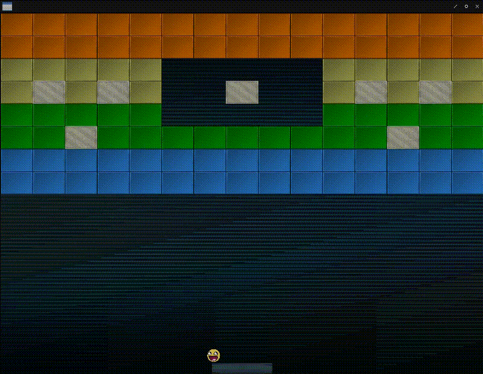

# Fight against cl-opengl 17.
## Metanotes
### 対象読者
[前章](clopengl16.html)読了済みの方。

## Introduction.
前章ではボールを導入しました。
本章では衝突判定を作ります。

## VECTOR-DIRECTION
ベクタから上下左右四方向を計算します。

```lisp
(let ((compass (make-hash-table)))
  (flet ((def (k v)
           (setf (gethash k compass) v)))
    (def :up (3d-vectors:vec 0 1))
    (def :right (3d-vectors:vec 1 0))
    (def :down (3d-vectors:vec 0 -1))
    (def :left (3d-vectors:vec -1 0)))
  (defun vector-direction (target)
    (loop :with normalized = (3d-vectors:vunit target)
          :with max = 0
          :with best
          :for direction :being :each :hash-key :of compass :using
               (:hash-value v)
          :for dot-product = (3d-vectors:v. normalized v)
          :if (< max dot-product)
            :do (setf max dot-product
                      best direction)
          :finally (return best))))
```

## COLLIDEP
衝突判定を計算します。

```lisp
(defun collidep (circle rect)
  (with-slots (radius x y)
      circle
    (with-slots (w h (rect-x x) (rect-y y))
        rect
      (let* ((center (3d-vectors:vec (+ x radius) (+ y radius)))
             (aabb-half-extents (3d-vectors:vec (/ w 2) (/ h 2)))
             (aabb-center
              (3d-vectors:nv+ (3d-vectors:vec rect-x rect-y)
                              aabb-half-extents))
             (difference
              (3d-vectors:v-
                (3d-vectors:v+ aabb-center
                               (3d-vectors:vclamp
                                 (3d-vectors:v- center aabb-center)
                                 (3d-vectors:v- aabb-half-extents)
                                 aabb-half-extents))
                center)))
        (if (< (3d-vectors:vlength difference) radius)
            (values t (vector-direction difference) difference)
            (values nil :up (3d-vectors:vec 0 0)))))))
```

## CHECK-COLLISION
衝突判定と衝突した場合の応答を行います。

```lisp
(defun check-collision (ball player level)
  (unless (ball-stuckp ball)
    (if (collidep ball player)
        (with-slots (x w)
            player
          (let* ((center-board (+ x (/ w 2)))
                 (distance
                  (- (+ (ball-x ball) (ball-radius ball)) center-board))
                 (percentage (/ distance (/ w 2)))
                 (strength 2)
                 (length (3d-vectors:vlength (ball-velocity ball))))
            (3d-vectors:vsetf (ball-velocity ball)
                              (* (car *initial-velocity*) percentage strength)
                              (* -1
                                 (abs
                                   (- (3d-vectors:vy (ball-velocity ball))))))
            (setf (ball-velocity ball)
                    (3d-vectors:v* (3d-vectors:vunit (ball-velocity ball))
                                   length))))
        (dotimes (x (array-total-size level))
          (let ((elt (row-major-aref level x)))
            (when elt
              (multiple-value-bind (collidep direction difference)
                  (collidep ball elt)
                (when collidep
                  (when (eq :normal (blocks-type elt))
                    (setf (row-major-aref level x) nil))
                  (if (find direction '(:left :right))
                      (let ((penetration
                             (- (ball-radius ball)
                                (abs (3d-vectors:vx difference)))))
                        (setf (3d-vectors:vx (ball-velocity ball))
                                (- (3d-vectors:vx (ball-velocity ball))))
                        (if (eq :left direction)
                            (incf (3d-vectors:vx (ball-velocity ball))
                                  penetration)
                            (decf (3d-vectors:vx (ball-velocity ball))
                                  penetration)))
                      (let ((penetration
                             (- (ball-radius ball)
                                (abs (3d-vectors:vy difference)))))
                        (setf (3d-vectors:vy (ball-velocity ball))
                                (- (3d-vectors:vy (ball-velocity ball))))
                        (if (eq :up direction)
                            (incf (3d-vectors:vx (ball-velocity ball))
                                  penetration)
                            (decf (3d-vectors:vx (ball-velocity ball))
                                  penetration))))))))))))
```
## MAIN
`MAIN`関数は以下の通り。

```lisp
(defun main ()
  (uiop:nest
    (sdl2:with-init (:everything))
    (sdl2:with-window (win :flags '(:shown :opengl)
                           :x 100
                           :y 100
                           :w 800
                           :h 600
                           :title "Breakout-CL"))
    (sdl2:with-gl-context (context win)
      (gl:enable :blend)
      (gl:blend-func :src-alpha :one-minus-src-alpha))
    (fude-gl:with-shader ((splite
                            (:vertices *quads*)
                            (:uniform model projection |spliteColor| image))))
    (fude-gl:with-textures ((background :texture-2d
                                        :init (fude-gl:tex-image-2d
                                                (ensure-image :background)))
                            (block :texture-2d
                                   :init (fude-gl:tex-image-2d
                                           (ensure-image :block)))
                            (block-solid :texture-2d
                                         :init (fude-gl:tex-image-2d
                                                 (ensure-image :block-solid)))
                            (paddle :texture-2d
                                    :init (fude-gl:tex-image-2d
                                            (ensure-image :paddle)))
                            (ball-tex :texture-2d
                                      :init (fude-gl:tex-image-2d
                                              (ensure-image :face)))))
    (let* ((level (level *level1* win))
           (player (make-player win))
           (ball (make-ball player)))
      (gl:uniform-matrix projection 4 (ortho win)))
    (sdl2:with-event-loop (:method :poll)
      (:quit ()
        t))
    (:idle nil (sleep (/ 1 30)))
    (fude-gl:with-clear (win (:color-buffer-bit))
      (move player 0.05 (sdl2:get-window-size win) :ball ball)
      (move ball 0.05 (sdl2:get-window-size win))
      (check-collision ball player level) ; <--- New!
      (draw model
            (multiple-value-call #'model-matrix 0 0 (sdl2:get-window-size win))
            image background)
      (dotimes (i (array-total-size level) (gl:uniformf |spliteColor| 1 1 1))
        (let ((o (row-major-aref level i)))
          (when o
            (with-slots (x y w h type color)
                o
              (3d-vectors:with-vec3 (r g b)
                  color
                (gl:uniformf |spliteColor| r g b))
              (draw model (model-matrix x y w h) image
                    (ecase type (:solid block-solid) (:normal block)))))))
      (with-slots (x y w h)
          ball
        (draw model (model-matrix x y w h) image ball-tex))
      (with-slots (x y w h)
          player
        (draw model (model-matrix x y w h) image paddle)))))
```

