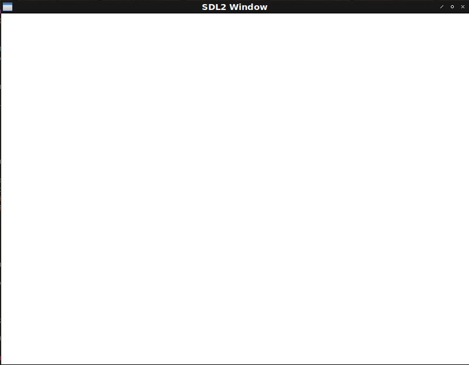

# Fight against cl-opengl 2.
## Metanotes
### 対象読者
[前章](clopengl1.html)読了済みの方。

## Introduction
前章ではとりあえずのwindow表示まで行いました。
今回は今後のための下準備としての抽象化を行います。

## WITH-CLEAR
前回作った真っ黒なwindowは表示しっぱなしのwindowです。
OpenGLでは毎フレームwindowをクリアします。
手で書くのは馬鹿らしいのでこれもマクロでラップします。

### BUFFER-BIT
`GL:CLEAR`はクリアすべきバッファビットを受け取ります。
cl-openglにドキュメントはないのでOpenGLの仕様を読みます。
そんな面倒なことは自作のエンドユーザー（将来の自分含む）にはさせたくないのでドキュメントを兼ねる型を定義しましょう。

```lisp
(deftype buffer-bit ()
  '(member :color-buffer-bit :depth-buffer-bit :stencil-buffer-bit))
```

### WITH-CLEAR
マクロ`WITH-CLEAR`は前回のマクロ`WITH-GL-VECTOR`と同様の薄いラッパでしかありません。

```lisp
(defmacro with-clear
          ((var-win (&rest bufs) &key (color ''(1.0 1.0 1.0 1.0))) &body body)
  `(progn
    (apply #'gl:clear-color ,color)
    (gl:clear ,@(mapcar (lambda (buf) `(the buffer-bit ,buf)) bufs))
    ,@body
    (sdl2:gl-swap-window ,var-win)))
```

`color`の引数にクォートが二重についてる点要注目。
ここで埋め込みたいのはクォートされた式であって`(1.0 1.0 1.0 1.0)`というリストそのものではありません。

`GL:CLEAR`の引数には[`THE`](http://clhs.lisp.se/Body/s_the.htm)特殊形式による型チェックを埋め込むことでコンパイラがユーザーに親切になります。

```lisp
* (the buffer-bit :hoge)

debugger invoked on a SIMPLE-TYPE-ERROR in thread
#<THREAD "main thread" RUNNING {1001578103}>:
  Value of :HOGE in
  (THE BUFFER-BIT :HOGE)
  is
    :HOGE,
  not a
    (MEMBER :COLOR-BUFFER-BIT :DEPTH-BUFFER-BIT :STENCIL-BUFFER-BIT). ; <--- 嬉しい！

Type HELP for debugger help, or (SB-EXT:EXIT) to exit from SBCL.

restarts (invokable by number or by possibly-abbreviated name):
  0: [ABORT] Exit debugger, returning to top level.
```

「オプションが間違っている」だけでは不親切で正しくはどういうオプションがあるのかまで表示してもらいたいものです。
このちょっとした気遣いができてないライブラリに腹を立てることが多いので少なくとも自作のエンドユーザー（将来の自分含む）にはそんな思いをさせたくありません。

## Second window
真っ白なwindowが表示されればokです。

```lisp
(defun second-window ()
  (sdl2:with-init (:everything)
    (sdl2:with-window (win :flags '(:shown :opengl)
                           :x 100
                           :y 100
                           :w 800
                           :h 600)
      (sdl2:with-gl-context (context win)
        (sdl2:with-event-loop (:method :poll)
          (:quit ()
            t)
          (:idle ()
            (with-clear (win (:color-buffer-bit)))))))))
```


