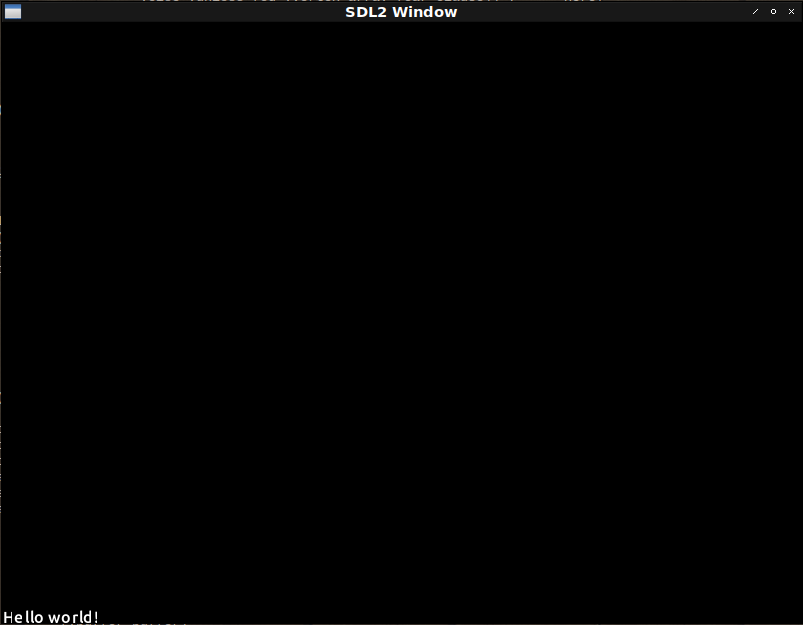

# Fight against cl-opengl 20.
## Metanotes.
### 対象読者
[前章](clopengl19.html)読了済みの方。

## Introduction.
前章ではテクスト描画のための関数を実装していきました。
本章ではこれまでに構築してきたマクロ群を改築していきます。

## Issue.
前回作った関数`RENDER-TEXT`のAPIを見ればわかりますがvertex-array-objectやbertex-buffer-objectの値が必要となります。
ところがこれらの値は現在のマクロでは隠蔽されてしまっております。

そこで必要な場合は変数を指定しそれに束縛してもらえるようにシンタックスを変更しましょう。

変更が必要なのは`WITH-VAO`と`WITH-SHADER`の二つです。
具体的には`WITH-VAO`のシンタックスが変わるのでそれに引きずられて`WITH-SHADER`にも変更が必要となるという内訳になります。

## WITH-VAO
これまでは`:VERTICES`節には初期化フォームを渡すだけでしたが変数も渡すようにシンタックスを変更します。
なお`NIL`を渡した場合は内部で`CL:GENSYM`が使われるものとします。
またvertex-array-objectやvertex-buffer-object参照するための変数を渡すためのオプション節もサポートするようにします。

```lisp
(with-shader ((glyph
                (:vertices vertices ; <--- This var!
                           (make-array (* 4 6)
                                       :element-type 'single-float
                                       :initial-element 0.0)
                           :usage :dynamic-draw)
                (:vertex-array glyph-vao) ; <--- New!
                (:buffer buffer) ; <--- New!
                (:uniform projection text |textColor|))))
```
上のコードは変更後こうなるというデッサンです。
それでは実装に取り掛かりましょう。

### [check-bnf](https://github.com/hyotang666/check-bnf)
増築や改築を繰り返しシンタックスの把握が容易ではなくなってきたのでここらで`CHECK-BNF`を導入することとします。
手前味噌ですがこれは筆者作のライブラリでマクロのシンタックスをBNF風に記述できる`CL:CHECK-TYPE`のお化けです。

コードが肥大してきたのでマクロの本体、コード生成は下層ヘルパに切り出すとします。

```lisp
(defmacro with-vao (&whole whole (&rest bind*) &body body)
  "Each VAR is bound by openGL vertex array object id."
  (check-bnf:check-bnf (:whole whole)
    ((bind* (var option+))
     (option+
      (or vertices-clause
          indices-clause
          uniform-clause
          buffer-clause
          attributes-clause
          shader-clause))
     ;; When this VAR is specified, it is bound by gl-array pointer.
     (vertices-clause ((eql :vertices) var init-form vertices-option*))
     (vertices-option* (member :usage :target :size) check-bnf:expression)
     ;;
     (indices-clause ((eql :indices) init-form indices-option*))
     (indices-option* keyword check-bnf:expression)
     ;; When this VAR is specified, it is bound by openGL uniform location.
     (uniform-clause ((eql :uniform) uniform-var-spec+))
     (uniform-var-spec (or var (var var)))
     ;; When this VAR is specified, it is bound by openGL buffer object id.
     (buffer-clause ((eql :buffer) var))
     ;;
     (attributes-clause ((eql :attributes) attribute-name))
     (attribute-name check-bnf:expression)
     ;; When this VAR is specified, it is bound by openGL shader program id.
     (shader-clause ((eql :shader) var vertex-shader fragment-shader))
     (vertex-shader check-bnf:expression)
     (fragment-shader check-bnf:expression)
     ;;
     (var symbol)
     (init-form check-bnf:expression)))
  (multiple-value-bind (forms refs)
      (parse-with-vao-binds bind* body)
    (if (null refs)
        (car forms)
        `(macrolet ((indices-of (id)
                      (case id ,@refs (otherwise "No indices for ~S" id))))
           ,@forms))))
```
`WITH-VAO`マクロの大半は`CHECK-BNF:CHECK-BNF`フォームに占拠されました。
しかしこれにより何かしらおかしなシンタックスが渡された場合比較的親切なエラーメッセージが表示されます。

```lisp
* (with-vao :not-bind-form :body)

debugger invoked on a CHECK-BNF::VIOLATE-LIST in thread
#<THREAD "main thread" RUNNING {1001590133}>:
  Syntax-error in WITH-VAO

    BIND              := (VAR OPTION+)*
    VAR               := SYMBOL
    OPTION            := [ VERTICES-CLAUSE
                         | INDICES-CLAUSE
                         | UNIFORM-CLAUSE
                         | BUFFER-CLAUSE
                         | ATTRIBUTES-CLAUSE
                         | SHADER-CLAUSE
                         ]+
    VERTICES-CLAUSE   := ((EQL :VERTICES) VAR INIT-FORM VERTICES-OPTION*)
    INIT-FORM         := EXPRESSION
    VERTICES-OPTION   := { [ :USAGE | :TARGET | :SIZE ] EXPRESSION }*
    INDICES-CLAUSE    := ((EQL :INDICES) INIT-FORM INDICES-OPTION*)
    INDICES-OPTION    := { KEYWORD EXPRESSION }*
    UNIFORM-CLAUSE    := ((EQL :UNIFORM) UNIFORM-VAR-SPEC+)
    UNIFORM-VAR-SPEC  := [ VAR | (VAR VAR) ]
    BUFFER-CLAUSE     := ((EQL :BUFFER) VAR)
    ATTRIBUTES-CLAUSE := ((EQL :ATTRIBUTES) ATTRIBUTE-NAME)
    ATTRIBUTE-NAME    := EXPRESSION
    SHADER-CLAUSE     := ((EQL :SHADER) VAR VERTEX-SHADER FRAGMENT-SHADER)
    VERTEX-SHADER     := EXPRESSION
    FRAGMENT-SHADER   := EXPRESSION

  BIND*: Require LIST but :NOT-BIND-FORM.

  in (WITH-VAO :NOT-BIND-FORM
       :BODY)
```
これはエンドユーザーにとっても開発者にとっても嬉しいものです。

### PARSE-WITH-VAO-BINDS
切り出したヘルパーは以下の通りです。
変数が指定されていればそれを使い`NIL`が指定されていれば`CL:GENSYM`するのが特徴です。

```lisp
(defun <init-buffer> (clause buf vec)
  (destructuring-bind
      (&key (target :array-buffer) (usage :static-draw))
      clause
    `((gl:bind-buffer ,(type-assert target 'buffer-target) ,buf)
      (gl:buffer-data ,(type-assert target 'buffer-target)
                      ,(type-assert usage 'buffer-usage) ,vec))))

(defun parse-with-vao-binds (bind* body)
  (let ((refs))
    (labels ((clause (clause bind)
               (or (assoc clause (cdr bind))
                   (error "Missing required cluase ~S in ~S" clause bind)))
             (rec (bind*)
               (if (endp bind*)
                   body
                   (destructuring-bind
                       (prog vs fs)
                       (cdr (clause :shader (car bind*)))
                     (unless prog ; <--- Here!
                       (setf prog (gensym "PROG")))
                     `((with-prog ((,prog ,vs ,fs))
                         ,(body (assoc :indices (cdar bind*)) prog bind*))))))
             (<may-uniform-bind> (uniforms bind*)
               (if uniforms
                   `((let ,uniforms
                       ,@(rec (cdr bind*))))
                   (rec (cdr bind*))))
             (<body-form> (bind* prog &optional indices-bind ebo-bind ebo-inits)
               (let* ((verts (clause :vertices (car bind*)))
                      (vertices (or (second verts) (gensym "VERTICES"))) ; <--- Here!
                      (vbo
                       (or (cadr (assoc :buffer (cdar bind*))) (gensym "VBO"))) ; <--- Here!
                      (uniforms
                       (let* ((uniforms (cdr (assoc :uniform (cdar bind*))))
                              (required (uniforms (prog-name prog bind*)))
                              (actual (mapcar #'ensure-second uniforms)))
                         (assert (null
                                   (set-exclusive-or required actual
                                                     :test #'string=))
                           ()
                           "Mismatch uniforms. ~S but ~S" required actual)
                         (mapcar (<uniform-binder> prog) uniforms)))
                      (attr (second (clause :attributes (car bind*)))))
                 `(with-gl-vector ((,vertices ,(third verts)) ,@indices-bind)
                    (with-buffer ,(list* vbo ebo-bind)
                      (with-vertex-array ((,(caar bind*)
                                           ,@(<init-buffer> (cdddr verts) vbo
                                                            vertices)
                                           (link-attributes ,attr ,prog)
                                           ,@ebo-inits))
                        ,@(<may-uniform-bind> uniforms bind*))))))
             (prog-name (prog bind*)
               (or (and (symbol-package prog) prog) (caar bind*)))
             (body (vec prog bind*)
               (if vec
                   (alexandria:with-unique-names (vector indices ebo)
                     `(let ((,vector ,(second vec)))
                        ,(progn
                          (push (list (prog-name prog bind*) `',vector) refs)
                          (<body-form> bind* prog `((,indices ,vector))
                                       (list ebo)
                                       (<init-buffer> (cddr vec) ebo
                                                      indices)))))
                   (<body-form> bind* prog))))
      (values (rec bind*) refs))))
```

## WITH-SHADER
vertex-array-objectを束縛する変数の指定を取り扱うのは`WITH-SHADER`にのみ必要なものです。
一応簡単なシンタックスチェックを入れておきましょう。

```lisp
(defmacro with-shader (&whole whole (&rest bind*) &body body)
  (check-bnf:check-bnf (:whole whole)
    ((bind* (symbol option+))
     (option+ (option-name option-form+))
     (option-name
      (member :vertices
              :indices :uniform
              :buffer :attributes
              :shader :vertex-array))
     (option-form+ check-bnf:expression)))
  `(with-vao ,(mapcar
                (lambda (bind)
                  (destructuring-bind
                      (class &rest clause*)
                      bind
                    `(,(or (cadr (assoc :vertex-array (cdr bind))) ; <--- Here!
                           (gensym "VAO"))
                      ,@(loop :for clause :in clause*
                              :when (eq :indices (car clause))
                                :collect `(:indices
                                           (coerce ,(second clause)
                                                   '(array (unsigned-byte 8)
                                                     (*)))
                                           :target :element-array-buffer)
                              :else :unless (eq :vertex-array (car clause)) ; <--- Here!
                                :collect clause)
                      (:attributes ',(alexandria:ensure-car class))
                      (:shader ,class
                       (vertex-shader ',(alexandria:ensure-car class))
                       (fragment-shader ',(alexandria:ensure-car class))))))
                bind*)
     ,@body))
```

## SHADER
シェーダーは以下の通り。

```lisp
(defshader glyph 330 (xy st)
  (:vertex ((|texCoords| :vec2) &uniform (projection :mat4))
    "texCoords = st;"
    "gl_Position = projection * vec4(xy, 0.0, 1.0);")
  (:fragment ((color :vec4) &uniform (text :|sampler2D|) (|textColor| :vec3))
    "color = vec4(textColor, 1.0) * vec4(1.0, 1.0, 1.0, texture(text, texCoords).r);"))
```

## MAIN
`MAIN`関数は以下の通り。
どうせ`WITH-GLYPH`マクロを書かねばならないのなら`GLYPH`のための`WITH-SHADER`もまるっと隠蔽させるのもいいかもしれません。
そうすれば`RENDER-TEXT`への引数も少なくできます。
とりあえず動くので当面はこれで行くとします。

```lisp
(defun text-demo ()
  (uiop:nest
    (sdl2:with-init (:everything))
    (sdl2:with-window (win :flags '(:shown :opengl) :w 800 :h 600))
    (sdl2:with-gl-context (context win)
      (gl:enable :blend)
      (gl:blend-func :src-alpha :one-minus-src-alpha))
    (with-shader ((glyph
                    (:vertices vertices
                               (make-array (* 4 6)
                                           :element-type 'single-float
                                           :initial-element 0.0)
                               :usage :dynamic-draw)
                    (:vertex-array glyph-vao)
                    (:buffer buffer)
                    (:uniform projection text |textColor|))))
    (with-glyph nil)
    (flet ((send (matrix uniform)
             (gl:uniform-matrix uniform 4 (vector (3d-matrices:marr matrix)))))
      (send
        (multiple-value-bind (w h)
            (sdl2:get-window-size win)
          (3d-matrices:mortho 0 w 0 h -1 1))
        projection))
    (sdl2:with-event-loop (:method :poll)
      (:quit ()
        t)
      (:idle ()
        (sleep (/ 1 15))
        (with-clear (win (:color-buffer-bit))
          (render-text "Hello world!" glyph
                       :color-uniform |textColor|
                       :vertices vertices
                       :vertex-array glyph-vao
                       :vertex-buffer buffer))))))
```

