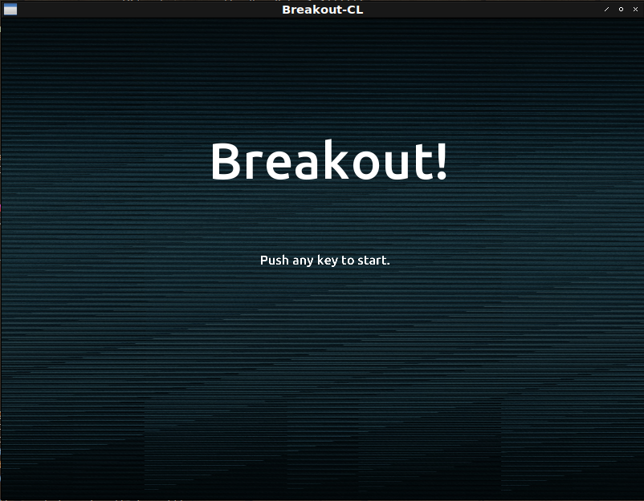

# Fight against cl-opengl 22
## Metanotes
### 対象読者
[前章](clopengl21.html)読了済みの方。

## Introduction
前章ではデバッグしやすいようにリファクタリングを行いました。
本章ではゲームシーケンス遷移を実装します。

## Condition system.
ゲームシーケンス遷移はCondition systemで行うものとします。
理由はなんとなくそれが簡単そうだからくらいのものです。

## SEQUENCE-TRANSITION
コンディションを定義します。

不具合が起きているわけではないので`CL:ERROR`等を継承していないのが特徴です。

```lisp
(define-condition sequence-transition () ((next :reader next :initarg :next)))
```

## Each state.
各ゲームシーケンスは単なる関数として実装します。

テスト用に簡単な関数を定義してみましょう。

以下の関数`RED`では画面を赤でリセットします。
キーが何かしら押されると`SEQUENCE-TRANSITION`をシグナルします。
発されるコンディションには次のゲームシーケンスである`GREEN`関数が`NEXT`スロットに格納されてます。

```lisp
(defun red (win)
  (sdl2:with-event-loop (:method :poll)
    (:quit ()
      t)
    (:keydown () ; <--- When any key pressed...
      (signal 'sequence-transition :next #'green)) ; <--- Signal condition!
    (:idle ()
      (sleep (/ 1 15))
      (with-clear (win (:color-buffer-bit) :color '(1 0 0 1)))))) ; <--- Red!
```

同様に`GREEN`、`BLUE`も定義します。
`GREEN`は`BLUE`に遷移し、`BLUE`は`RED`に遷移するものとします。

```lisp
(defun green (win)
  (sdl2:with-event-loop (:method :poll)
    (:quit ()
      t)
    (:keydown ()
      (signal 'sequence-transition :next #'blue))
    (:idle ()
      (sleep (/ 1 15))
      (with-clear (win (:color-buffer-bit) :color '(0 1 0 1))))))

(defun blue (win)
  (sdl2:with-event-loop (:method :poll)
    (:quit ()
      t)
    (:keydown ()
      (signal 'sequence-transition :next #'red))
    (:idle ()
      (sleep (/ 1 15))
      (with-clear (win (:color-buffer-bit) :color '(0 0 1 1))))))
```

`MAIN`関数内では`SEQUENCE-TRANSITION`を待ち受けるハンドラを立ち上げ捕捉すると変数を更新します。

```lisp
(defun demo ()
  (uiop:nest
    (sdl2:with-init (:everything))
    (sdl2:with-window (win :flags '(:shown :opengl)
                           :x 100
                           :y 100
                           :w 800
                           :h 600
                           :title "Demo"))
    (sdl2:with-gl-context (context win))
    (let ((scene #'red)) ; <--- Initial sequence is RED!
      (tagbody
       :top
        (handler-bind ((sequence-transition ; <--- When SEQUENCE-TRANSITION is signaled...
                        (lambda (condition)
                          (setf scene (next condition)) ; <--- Var is updated!
                          (go :top))))
          (funcall scene win))))))
```


## SEQUENCE-HANDLER-BIND
ハンドラの詳細はマクロでラップしてしまいましょう。

```lisp
(defmacro sequence-handler-bind ((var init-form) &body body)
  `(let ((,var ,init-form))
     (tagbody
      :top
       (handler-bind ((sequence-transition
                       (lambda (condition)
                         (setf ,var (next condition))
                         (go :top))))
         ,@body))))
```

これで`MAIN`関数は以下のようになります。

```lisp
(defun demo ()
  (uiop:nest
    (sdl2:with-init (:everything))
    (sdl2:with-window (win :flags '(:shown :opengl)
                           :x 100
                           :y 100
                           :w 800
                           :h 600
                           :title "Demo"))
    (sdl2:with-gl-context (context win))
    (sequence-handler-bind (scene #'red)
      (funcall scene win))))
```

## BREAKOUT
`MAIN`関数は以下の通り。
テキストを描画する機能はどこでも必要になるのでここで定義して引数で関数を渡すことにします。
これにより`CL:FUNCALL`が必要になってしまいますが煩わしい引数を省略できます。

```lisp
(defun main ()
  (uiop:nest
    (with-harmony (server)
      (play :breakout :repeat t))
    (sdl2:with-init (:everything))
    (sdl2:with-window (win :flags '(:shown :opengl)
                           :x 100
                           :y 100
                           :w 800
                           :h 600
                           :title "Breakout-CL"))
    (sdl2:with-gl-context (context win)
      (gl:enable :blend)
      (gl:blend-func :src-alpha :one-minus-src-alpha))
    (with-shader ((glyph
                    (:vertices vertices
                               (make-array (* 4 6)
                                           :element-type 'single-float
                                           :initial-element 0.0)
                               :usage :dynamic-draw)
                    (:vertex-array glyph-setting)
                    (:buffer buffer)
                    (:uniform (text-projection projection) text
                              |textColor|)))
      (in-shader glyph)
      (gl:uniform-matrix text-projection 4
                         (multiple-value-bind (w h)
                             (sdl2:get-window-size win)
                           (vector
                             (3d-matrices:marr
                               (3d-matrices:mortho 0 w 0 h -1 1))))))
    (with-glyph (:size 64))
    (flet ((text-renderer (string &key (x 0) (y 0) (scale 1))
             (render-text string glyph
                          :color-uniform |textColor|
                          :vertices vertices
                          :vertex-array glyph-setting
                          :vertex-buffer buffer
                          :scale scale
                          :x x
                          :y y
                          :win win))))
    (sequence-handler-bind (scene #'entry-point)
      (funcall scene win #'text-renderer))))
```

## ENTRY-POINT
初期シーケンスは以下の通り。
何かしらキーが押されるとゲーム本体に遷移します。

```lisp
(defun entry-point (win text-renderer)
  (uiop:nest
    (with-shader ((splite (:vertices nil *quads*)
                          (:uniform model projection |spliteColor| image)
                          (:vertex-array splite-setting))))
    (with-textures ((background :texture-2d
                                :init (tex-image-2d
                                        (ensure-image :background)))
                    (ball-tex :texture-2d
                              :init (tex-image-2d
                                      (ensure-image :face))))
      (in-shader splite)
      (gl:uniform-matrix projection 4 (ortho win))
      (gl:uniformf |spliteColor| 1 1 1))
    (let* ((title "Breakout!")
           (bbox
            (vecto:string-bounding-box title (* 2 *font-size*)
                                       (font-loader "Ubuntu-M")))))
    (sdl2:with-event-loop (:method :poll)
      (:quit ()
        t)
      (:keydown (:keysym keysym)
        (case (sdl2:scancode keysym)
          (otherwise (signal 'sequence-transition :next #'game)))))
    (:idle nil (sleep (/ 1 15)))
    (with-clear (win (:color-buffer-bit))
      (in-shader splite)
      (in-vertex-array splite-setting)
      (draw :background model image background :win win)
      (funcall text-renderer title
               :x :center
               :y (- (* (floor (nth-value 1 (sdl2:get-window-size win)) 4) 3)
                     (floor (- (zpb-ttf:ymax bbox) (zpb-ttf:ymin bbox)) 2)))
      (funcall text-renderer "Push any key to start."
               :x :center
               :y :center
               :scale 0.25))))
```



## GAME
ゲーム本体は以下の通り。
`WITH-CLEAR`は最初に画面を規定の色で塗りつぶしてしまうので`DRAW`を終えてから遷移処理をしているのが特徴です。

```lisp
(defun game (win text-renderer)
  (uiop:nest
    (with-shader ((splite
                    (:vertices nil *quads*)
                    (:uniform model projection |spliteColor| image)
                    (:vertex-array splite-setting))))
    (with-textures ((background :texture-2d
                                :init (tex-image-2d
                                        (ensure-image :background)))
                    (block :texture-2d
                           :init (tex-image-2d
                                   (ensure-image :block)))
                    (block-solid :texture-2d
                                 :init (tex-image-2d
                                         (ensure-image :block-solid)))
                    (paddle :texture-2d
                            :init (tex-image-2d
                                    (ensure-image :paddle)))
                    (ball-tex :texture-2d
                              :init (tex-image-2d
                                      (ensure-image :face)))))
    (let* ((level (level *level1* win))
           (player (make-player win))
           (ball (make-ball player)))
      (in-shader splite)
      (gl:uniform-matrix projection 4 (ortho win)))
    (sdl2:with-event-loop (:method :poll)
      (:quit ()
        t))
    (:idle nil (sleep (/ 1 60)))
    (with-clear (win (:color-buffer-bit))
      (move player 0.025 (sdl2:get-window-size win) :ball ball)
      (move ball 0.025 (sdl2:get-window-size win) :player player :win win)
      (check-collision ball player level)
      (in-shader splite)
      (in-vertex-array splite-setting)
      (draw :background model image background :win win)
      (draw level model image `(normal-block ,block solid-block ,block-solid)
            :splite-color |spliteColor|)
      (draw ball model image ball-tex)
      (draw player model image paddle)
      (funcall text-renderer (format nil "Lives: ~S" (player-life player))
               :y (- 600 (floor *font-size* 2))
               :scale 0.5)
      (when (zerop (player-life player))
        (signal 'sequence-transition :next #'game-over)))))
```


## GAME-OVER
`GAME-OVER`は以下の通り。
`WITH-CLEAR`を呼んでいないのが特徴です。

```lisp
(defun game-over (win text-renderer)
  (uiop:nest
    (let* ((title "Game over!")
           (bbox
            (vecto:string-bounding-box title (* 2 *font-size*)
                                       (font-loader "Ubuntu-M")))))
    (sdl2:with-event-loop (:method :poll)
      (:quit ()
        t)
      (:keydown (:keysym keysym)
        (case (sdl2:scancode keysym)
          (otherwise (signal 'sequence-transition :next #'entry-point)))))
    (:idle nil
     (funcall text-renderer title
              :x :center
              :y (- (* (floor (nth-value 1 (sdl2:get-window-size win)) 4) 3)
                    (floor (- (zpb-ttf:ymax bbox) (zpb-ttf:ymin bbox)) 2)))
     (funcall text-renderer "Push any key." :x :center :y :center :scale 0.25)
     (sdl2:gl-swap-window win) (sleep 2))))
```
