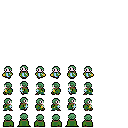
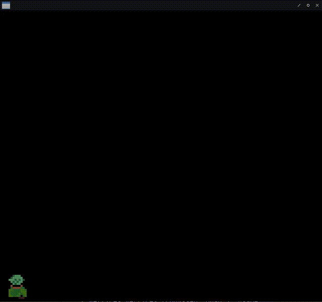
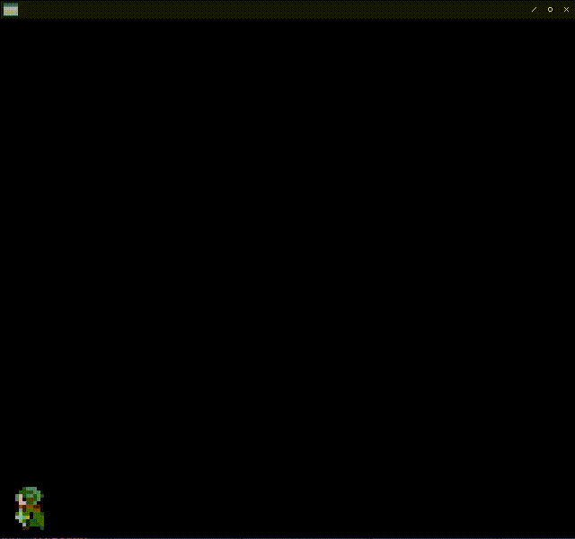

# Fight against cl-opengl 23.
## Metanotes
### 対象読者
[前章](clopengl22.html)読了済みの方。

## Introduction.
前章ではシーケンス遷移を実装しました。
本章ではアニメーションする`texture`を実装します。

なお本章からは前章までの[breakout-cl](https://github.com/hyotang666/breakout-cl)に代わり新たにプロジェクトを立ち上げます。
そもそも筆者が作りたかったのは古の聖剣伝説やゼルダの伝説のような見下ろし型ARPGだったのでそれ用に必要になった知見をオマケ的に書き残しておきます。

## Image size constraint.
制限はグラフィックカードの実装によりけりです。
最新のハイエンドカードの場合制限は無いらしいです（要出典）。
通常（？）は`width`、`height`共に２の冪乗である必要があります。
古い（？）グラフィックカードの場合は更に正方形でなければならないという制限も追加されるようです（一敗）。

ここでは以下の画像を使うとします。



見ての通り隙間ががら空き（右クリックからの画像を表示で確認するとなおわかりやすいです）ですがここではヨシとします。
というのもそもそもサイズが小さいからです。（１２８＊１２８）
筆者はドット絵に謎のロマンを感じる癖の持ち主であり高解像度のグラフィックを使う気がないので無問題です。
なお同じ絵が二つ並んでいるのは[ウディタの仕様](https://pipoya.net/rpg/material-format/#%E7%94%BB%E5%83%8F%E3%82%B5%E3%82%A4%E3%82%BA-3)（八方向）に互換性を持たせようと考えていたからです。
斜めの絵は難しいので一旦四方向のものをコピペしてあるだけです。

## Design.
`texture`をアニメーションさせるためには`texture`の座標を変更してあげればいいだけです。
頂点情報をゴリゴリ書き換えるという手法はテクストレンダリングを実装する時に行いました。
既に学習済みの手法を流用するだけです。

## 4-DIRECTIOINAL

向きやインデックスを管理するための構造体を定義しましょう。
各キャラ絵は１６＊１６でファイルサイズは１２８＊１２８です。

```lisp
(defstruct 4-directional
  (unit 1/8 :type real :read-only t)
  (last-direction 'up :type (member up right left down))
  (up (alexandria:circular-list '(0 0) '(1 0) '(2 0) '(1 0)))
  (right (alexandria:circular-list '(0 1) '(1 1) '(2 1) '(1 1)))
  (left (alexandria:circular-list '(0 2) '(1 2) '(2 2) '(1 2)))
  (down (alexandria:circular-list '(0 3) '(1 3) '(2 3) '(1 3))))
```

## \*QUAD\*
頂点を保持するグローバル変数です。

```lisp
(defparameter *quad*
  (concatenate '(array single-float (*))
               (make-instance 'splite :x 0.0 :y 1.0 :s 0.0 :t 1.0)
               (make-instance 'splite :x 1.0 :y 0.0 :s 1.0 :t 0.0)
               (make-instance 'splite :x 0.0 :y 0.0 :s 0.0 :t 0.0)
               (make-instance 'splite :x 0.0 :y 1.0 :s 0.0 :t 1.0)
               (make-instance 'splite :x 1.0 :y 1.0 :s 1.0 :t 1.0)
               (make-instance 'splite :x 1.0 :y 0.0 :s 1.0 :t 0.0)))
```

## WITH-SHADER
頂点は順次書き換えますが初期状態も欲しくなるので`CL:COPY-SEQ`しておくのが特徴です。

```lisp
(fude-gl:with-shader ((splite
                        (:vertices vertices (copy-seq *quad*) :usage
                                   :dynamic-draw)
                        (:vertex-array vao)
                        (:buffer vbo)
                        (:uniform image projection model)))
  (fude-gl:in-shader splite))
```

## STEP-VBO
更新された頂点リストを返す関数です。
毎回リストをアロケートするのはガベコレ負荷も高く馬鹿らしいですが当面これでヨシとします。

```lisp
(defun step-vbo (directional)
  (destructuring-bind
      (%s %t)
      (car (slot-value directional (slot-value directional 'last-direction)))
    (setf (slot-value directional (slot-value directional 'last-direction))
            (cdr
              (slot-value directional
                          (slot-value directional 'last-direction))))
    (let* ((unit (slot-value directional 'unit))
           (pos-x (* unit %s))
           (pos-w (+ unit pos-x))
           (pos-y (* unit %t))
           (pos-h (+ unit pos-y)))
      (list 0.0 1.0 pos-x pos-h ; Top left
            1.0 0.0 pos-w pos-y ; Bottom right
            0.0 0.0 pos-x pos-y ; Bottom left
            0.0 1.0 pos-x pos-h ; Top left
            1.0 1.0 pos-w pos-h ; Top right
            1.0 0.0 pos-w pos-y))))
```

## DRAW
描画関数は以下の通り。
`RENDER-TEXT`の中身とそっくりなのがわかります。

```lisp
(defgeneric draw (object model image texture shader vertices vao vbo)
  (:method (model-matrix model image (texture texture)
            (shader program) vertices (vao vertex-array)
            (vbo buffer)
    (gl:uniform-matrix model 4 model-matrix)
    (in-shader shader)
    (in-vertex-array vao)
    (gl:active-texture 0)
    (gl:bind-texture (texture-target texture)
                     (texture-id texture))
    (in-buffer vbo)
    (gl:buffer-sub-data (buffer-target vbo) vertices)
    (gl:draw-arrays :triangles 0 6)))
  (:method ((o 4-directional) model image (tex texture)
            (shader program) vertices (vao vertex-array)
            (vbo buffer)
    (loop :for elt :in (step-vbo o)
          :for i :upfrom 0
          :do (setf (gl:glaref vertices i) (float elt)))
    (call-next-method (model-matrix 0 0 64 64) model image tex shader
     vertices vao vbo))))
```

## TEST sequence.
`TEST`シーケンス関数は以下の通り。
ドット絵がくっきりするように`texture`のフィルタを`:NEAREST`で指定しているのが特徴です。

```lisp
(defun test (win)
  (uiop:nest
    (with-shader ((splite
                    (:vertices vertices (copy-seq *quad*) :usage
                               :dynamic-draw)
                    (:vertex-array vao)
                    (:buffer vbo)
                    (:uniform image projection model)))
      (in-shader splite))
    (with-textures ((romius :texture-2d
                            :init (tex-image-2d (load-image :romius))
                            :params (:texture-min-filter :nearest
                                     :texture-mag-filter :nearest))))
    (let ((ortho
           (multiple-value-bind (w h)
               (sdl2:get-window-size win)
             (vector (3d-matrices:marr (3d-matrices:mortho 0 w 0 h -1 1)))))
          (4-directional (make-4-directional)))
      (gl:uniform-matrix projection 4 ortho))
    (sdl2:with-event-loop (:method :poll)
      (:quit ()
        t))
    (:idle nil)
    (with-clear (win (:color-buffer-bit))
      (keypress-case
        (:up (setf (4-directional-last-direction 4-directional) 'up))
        (:down (setf (4-directional-last-direction 4-directional) 'down))
        (:left (setf (4-directional-last-direction 4-directional) 'left))
        (:right (setf (4-directional-last-direction 4-directional) 'right)))
      (draw 4-directional model image romius splite vertices vao vbo))))
```



## TIMER
上のGIFからは分かりにくいですがアニメーションが速すぎます。
現在６０FPSなのですが毎フレームアニメーションしているのでこのような事態になっている訳です。
アニメーション事態は数フレーム起きに行うほうがいいでしょう。

そこで`TIMER`を導入するとします。

### N-BITS-MAX
任意のビット数で表せる最大整数を返します。

```lisp
(defun n-bits-max (n)
  (values (read-from-string (format nil "#B~V,,,'1A" n #\1))))
```

### TIMER
`TIMER`関数は状態を持つ必要があるので`FUNCALLABLE-OBJECT`として実装します。
`FUNCALLABLE-OBJECT`とは変数へのアクセスが容易になった`closure`だと思えばよろしゅうございます。

```lisp
(defclass timer ()
  ((time :initform (n-bits-max 7) :reader time<-timer)
   (count :initform 0 :accessor count<-timer)
   (turn :initform 0 :accessor turn<-timer))
  (:metaclass c2mop:funcallable-standard-class))

(defmethod initialize-instance :after ((o timer) &key speed)
  (c2mop:set-funcallable-instance-function
   o
   (lambda ()
     (incf (count<-timer o) speed)
     (multiple-value-bind (turn rem)
         (floor (count<-timer o) (time<-timer o))
       (if (plusp turn)
           (setf (count<-timer o) rem
                 (turn<-timer o) turn)
           (setf (count<-timer o) rem
                 (turn<-timer o) 0))))))

(defun make-timer (speed) (make-instance 'timer :speed speed))
```

### UPDATEP
更新すべきか訊ねる述語です。

```lisp
(defun updatep (directional) (< 0 (funcall (slot-value directional 'timer))))
```

### 4-DIRECTIONAL
`TIMER`を持つように定義を変更します。

```lisp
(defstruct 4-directional
  (unit 1/8 :type real :read-only t)
  (timer (make-timer 16) :type function)
  (last-direction 'up :type (member up right left down))
  (up (alexandria:circular-list '(0 0) '(1 0) '(2 0) '(1 0)))
  (right (alexandria:circular-list '(0 1) '(1 1) '(2 1) '(1 1)))
  (left (alexandria:circular-list '(0 2) '(1 2) '(2 2) '(1 2)))
  (down (alexandria:circular-list '(0 3) '(1 3) '(2 3) '(1 3))))
```

### STEP-VBO
`TIMER`を使うように変更します。

現在`TIMER`オブジェクトは`(n-bits-max 7)`=`127`で初期化されており、`SPEED`は１６で初期化されております。
これはすなわち８フレームに一度アニメーションを起こすことを表します。

```lisp
(defun step-vbo (directional)
  (destructuring-bind
      (%s %t)
      (car (slot-value directional (slot-value directional 'last-direction)))
    (when (updatep directional)
      (setf (slot-value directional (slot-value directional 'last-direction))
              (cdr
                (slot-value directional
                            (slot-value directional 'last-direction)))))
    (let* ((unit (slot-value directional 'unit))
           (pos-x (* unit %s))
           (pos-w (+ unit pos-x))
           (pos-y (* unit %t))
           (pos-h (+ unit pos-y)))
      (list 0.0 1.0 pos-x pos-h ; Top left
            1.0 0.0 pos-w pos-y ; Bottom right
            0.0 0.0 pos-x pos-y ; Bottom left
            0.0 1.0 pos-x pos-h ; Top left
            1.0 1.0 pos-w pos-h ; Top right
            1.0 0.0 pos-w pos-y))))
```


