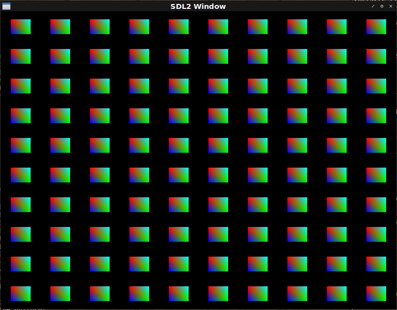
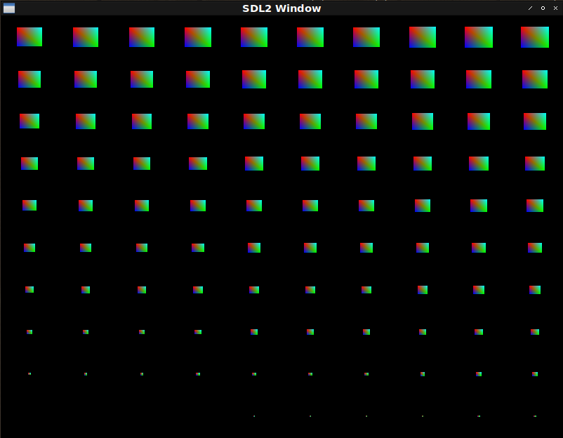

# Fight against openGL 24.
## Metanotes
### 対象読者
[前章](clopengl23.html)読了済みの方。

## Introduction.
前章では`texture`による2Dアニメーションを実装しました。
本章ではGPU Instancingに対応します。

## About GPU instancing.
同じ`texture`を大量に表示したいとしましょう。
仮に千個描画するとして千回OpenGLに依頼をすると依頼をすることそのものがボトルネックとなり得ます。
同じ`texture`の表示なので一度の依頼であとはOpenGL側でいい具合に表示してくれると嬉しゅうございます。

## Refactoring for array uniform.
現在の`DEFSHADER`マクロでは配列`uniform`を宣言できません。
改築しましょう。

シェーダーラムダリストの`uniform`スペックを拡張しオプショナルに第三要素を取れるようにします。
第三要素は整数でこれが指定された場合`uniform`変数は配列とみなされるものとします。
改築後の具体的なシンタックス例は以下の通り。

```lisp
(defshader instancing 330 (xy rgb)
  (:vertex ((|fColor| :vec3) &uniform (offsets :vec2 100)) ; <--- This specifies 100 length array!
    "vec2 offset = offsets[gl_InstanceID];"
    "gl_Position = vec4(xy + offset, 0.0, 1.0);"
    "fColor = rgb;")
  (:fragment ((|fragColor| :vec4)) "fragColor = vec4(fColor, 1.0);"))
```

### CHEK-BNF
[check-bnf](https://github.com/hyotang666/check-bnf)を導入したので`DEFSHADER`改築に合わせ大々的にシンタックスチェックも導入しましょう。

#### UNIFORM-KEYWORDP
シェーダーラムダリストの中に出現する`&UNIFORM`というシンボルを便宜的に`UNIFORM-KEYWORD`と呼ぶことにします。
以下の関数はそれかどうかを訊ねる述語で`check-bnf`展開時に必要になるため`CL:EVAL-WHEN`でくるまれているのが特徴です。

```lisp
(eval-when (:compile-toplevel :load-toplevel :execute)
  (defun uniform-keywordp (thing)
    (and (symbolp thing) (string= '&uniform thing)))
```

#### DEFSHADER
`DEFSHADER`本体はシンタックスチェックを中心にしてコード生成は下層関数に切り出すとします。

```lisp
(defmacro defshader (&whole whole name version superclasses &body shader*)
  (check-bnf:check-bnf (:whole whole)
    ((name symbol))
    ((version unsigned-byte))
    (((superclass+ superclasses) symbol))
    ((shader* (or vertex-clause fragment-clause))
     ;;
     (vertex-clause ((eql :vertex) shader-lambda-list main*))
     ;;
     (fragment-clause ((eql :fragment) shader-lambda-list main*))
     ;;
     (shader-lambda-list (out-spec* uniform-keyword? uniform-spec*))
     (out-spec (var type-key))
     (uniform-keyword (satisfies uniform-keywordp))
     (uniform-spec (var type-key vector-size?))
     (vector-size unsigned-byte)
     ;;
     (var symbol)
     (type-key keyword)
     (main check-bnf:expression)))
  ;; The body.
  `(eval-when (:compile-toplevel :load-toplevel :execute)
     (defclass ,name ,superclasses () (:metaclass vector-class))
     ,@(<shader-forms> shader* superclasses name version)
     (with-prog ((check (vertex-shader ',name) (fragment-shader ',name))))
     ,(<uniforms> name shader*)
     ',name))
```

#### \<SHADER-FORMS\>
切り出されたヘルパです。
ローカル関数の`DEFS`内で条件分岐を行い必要なら配列用の宣言を生成しているのがわかります。

```lisp
(defun <shader-forms> (shader-clause* superclasses name version)
    (let ((format
           (formatter
            #.(concatenate 'string "#version ~A core~%" ; version
                           "~{in ~A ~A;~%~}~&" ; in
                           "~{out ~A ~A;~%~}~&" ; out
                           "~@[~{uniform ~A ~A;~%~}~]~&" ; uniforms
                           "void main () {~%~{~A~^~%~}~%}" ; the body.
                           ))))
      (labels ((defs (list)
                 (loop :for (name type . vector-size) :in list
                       :collect (change-case:camel-case (symbol-name type))
                       :collect (if vector-size ; <--- This!
                                    (format nil "~A[~A]"
                                            (change-case:camel-case
                                              (symbol-name name))
                                            (car vector-size))
                                    (change-case:camel-case
                                      (symbol-name name)))))
               (rec (shaders in acc)
                 (if (endp shaders)
                     (nreverse acc)
                     (body (car shaders) (cdr shaders) in acc)))
               (body (shader rest in acc)
                 (destructuring-bind
                     (type out &rest main)
                     shader
                   (let* ((&uniform (position-if #'uniform-keywordp out))
                          (vars (and out (defs (subseq out 0 &uniform)))))
                     (rec rest vars
                          (cons
                            (<shader-method>
                              (intern (format nil "~A-SHADER" type) :fude-gl)
                              name main
                              (format nil format version in vars
                                      (and &uniform
                                           (defs (subseq out (1+ &uniform))))
                                      main))
                            acc))))))
        (rec shader-clause*
             (loop :for c
                        :in (mapcan (lambda (c) (class-list (find-class c)))
                                    superclasses)
                   :for slots = (c2mop:class-direct-slots c)
                   :when slots
                     :collect (format nil "vec~D" (length slots))
                     :and :collect (change-case:camel-case
                                     (symbol-name (class-name c))))
             nil))))
```

### VERTICES
頂点は以下の通り。

```lisp
(defparameter *instancing*
  (coerce
    #(-0.05 0.05 1.0 0.0 0.0 ; first
      0.05 -0.05 0.0 1.0 0.0 ; second
      -0.05 -0.05 0.0 0.0 1.0 ; third
      -0.05 0.05 1.0 0.0 0.0 ; fourth
      0.05 -0.05 0.0 1.0 0.0 ; fifth
      0.05 0.05 0.0 1.0 1.0 ; sixth
      )
    '(array single-float (*))))
```

### MAIN
`MAIN`関数は以下の通り。

```lisp
(defun instancing ()
  (uiop:nest
    (sdl2:with-init (:everything))
    (sdl2:with-window (win :flags '(:shown :opengl) :w 800 :h 600))
    (sdl2:with-gl-context (context win))
    (with-shader ((instancing
                    (:vertices nil *instancing*)
                    (:uniform offsets)
                    (:vertex-array vao))))
    (let ((translations ; <--- List of the each instance position!
           (uiop:while-collecting (acc)
             (loop :with offset = 0.1
                   :for y :upfrom -10 :below 10 :by 2
                   :do (loop :for x :upfrom -10 :below 10 :by 2
                             :do (acc
                                  (vector (+ (/ x 10) offset)
                                          (+ (/ y 10) offset))))))))
      (in-shader instancing)
      ;; Sending each position to the uniform!
      (loop :for vec2 :in translations
            :for i :upfrom 0
            :do (gl:uniformfv
                  (gl:get-uniform-location (program-id instancing)
                                           (format nil "offsets[~A]" i))
                  vec2))
      (in-vertex-array vao))
    (sdl2:with-event-loop (:method :poll)
      (:quit ()
        t)
      (:idle ()
        (with-clear (win (:color-buffer-bit))
          (%gl:draw-arrays-instanced :triangles 0 6 (length translations)))))))
```


## Refactoring for instanced array.
Common Lispの関数が無限に引数を取れないのと同様に`uniform`配列も実装依存の長さ制限があります。
その制限を回避するには`BUFFER`にデータを格納し`vertex-attrib-array`にデータの一部を乗せるという手法をとります。

今現在使用している抽象化階層のマクロ群（`WITH-SHADER`と`WITH-VAO`）ではこれに対応できません。
ひとまず抽象化階層を降りて下層のマクロを使って実現しましょう。

### Step 1.
#### OFFSET
まずは`offset`用の`VECTOR-CLASS`を定義します。

```lisp
(defclass offset ()
  ((%x :initarg :x :type single-float) (%y :initarg :y :type single-float))
  (:metaclass vector-class))
```

#### SHADER
シェーダーの定義は以下の通り。

```lisp
(defshader instanced-arrays-demo 330 (xy rgb offset)
  (:vertex ((|fColor| :vec3))
    "gl_Position = vec4(xy + offset, 0.0, 1.0);"
    "fColor = rgb;")
  (:fragment ((|fragColor| :vec4)) "fragColor = vec4(fColor, 1.0);"))
```

#### MAIN
`MAIN`関数は以下の通り。

```lisp
(defun instanced-arrays-demo ()
  (sdl2:with-init (:everything)
    (sdl2:with-window (win :flags '(:shown :opengl) :w 800 :h 600)
      (sdl2:with-gl-context (context win)
        (with-prog ((prog (vertex-shader 'instanced-arrays-demo)
                          (fragment-shader 'instanced-arrays-demo)))
          (in-shader prog)
          (with-gl-vector ((translations *translations*)
                           (quad *instancing*))
            (with-buffer ((instance-buffer) (quad-buffer))
              (with-vertex-array ((vao
                                   ;;; buffer initialization.
                                   (in-buffer quad-buffer)
                                   (gl:buffer-data (buffer-target quad-buffer)
                                                   (buffer-usage quad-buffer) quad)
                                   (in-buffer instance-buffer)
                                   (gl:buffer-data (buffer-target instance-buffer)
                                                   (buffer-usage instance-buffer)
                                                   translations)
                                   ;;; Initialize vertex array.
                                   ;; xy
                                   (in-buffer quad-buffer)
                                   (gl:enable-vertex-attrib-array 0)
                                   (gl:vertex-attrib-pointer 0 2
                                                             :float
                                                             nil
                                                             (* 5
                                                                (cffi:foreign-type-size
                                                                  :float))
                                                             0)
                                   ;; rgb
                                   (in-buffer quad-buffer)
                                   (gl:enable-vertex-attrib-array 1)
                                   (gl:vertex-attrib-pointer 1 3
                                                             :float
                                                             nil
                                                             (* 5
                                                                (cffi:foreign-type-size
                                                                  :float))
                                                             (* 2
                                                                (cffi:foreign-type-size
                                                                  :float)))
                                   ;; offset
                                   (in-buffer instance-buffer)
                                   (gl:enable-vertex-attrib-array 2)
                                   (gl:vertex-attrib-pointer 2 2
                                                             :float
                                                             nil
                                                             (* 2
                                                                (cffi:foreign-type-size
                                                                  :float))
                                                             0)
                                   (%gl:vertex-attrib-divisor 2 1)))
                (sdl2:with-event-loop (:method :poll)
                  (:quit ()
                    t)
                  (:idle ()
                    (with-clear (win (:color-buffer-bit))
                      (%gl:draw-arrays-instanced :triangles 0 6 100))))))))))))
```

### Issues.
気に食わないのは`VERTEX-ARRAY`の初期化フォームです。

```lisp
(with-vertex-array ((vao
                     ;;; buffer initialization.
                     (in-buffer quad-buffer)
                     (gl:buffer-data (buffer-target quad-buffer)
                                     (buffer-usage quad-buffer) quad)
                     (in-buffer instance-buffer)
                     (gl:buffer-data (buffer-target instance-buffer)
                                     (buffer-usage instance-buffer)
                                     translations)
                     ;; xy
                     (in-buffer quad-buffer)
                     (gl:enable-vertex-attrib-array 0)
                     (gl:vertex-attrib-pointer 0 2
                                               :float
                                               nil
                                               (* 5
                                                  (cffi:foreign-type-size
                                                    :float))
                                               0)
                     ;; rgb
                     (in-buffer quad-buffer)
                     (gl:enable-vertex-attrib-array 1)
                     (gl:vertex-attrib-pointer 1 3
                                               :float
                                               nil
                                               (* 5
                                                  (cffi:foreign-type-size
                                                    :float))
                                               (* 2
                                                  (cffi:foreign-type-size
                                                    :float)))
                     ;; offset
                     (in-buffer instance-buffer)
                     (gl:enable-vertex-attrib-array 2)
                     (gl:vertex-attrib-pointer 2 2
                                               :float
                                               nil
                                               (* 2
                                                  (cffi:foreign-type-size
                                                    :float))
                                               0)
                     (%gl:vertex-attrib-divisor 2 1)))
  ...)
```
これまでは`LINK-ATTRIBUTES`関数にクラス名を渡して自動的に行っておりましたがそれができなくなったという点が一番大きな課題です。
というのも束縛すべき`BUFFER`を適切に切り替える必要があるからです。

ひとまず各初期化処理を分析してみましょう。

```lisp
(with-vertex-array ((vao
                     ;; xy
                     (in-buffer quad-buffer)
                     (gl:enable-vertex-attrib-array 0) ; <--- This 0 is...
                     (gl:vertex-attrib-pointer 0 ; <--- for here!
                                               2 ; <--- Class XY has 2 slots.
                                               :float
                                               nil
                                               (* 5 ; <--- since total length is xyrgb.
                                                  (cffi:foreign-type-size
                                                    :float))
                                               0) ; <--- offset of the xy in xyrgb.
                     ;; rgb
                     (in-buffer quad-buffer)
                     (gl:enable-vertex-attrib-array 1) ; <--- This 1 is...
                     (gl:vertex-attrib-pointer 1 ; <--- for here!
                                               3 ; <--- Class RGB has 3 slots.
                                               :float
                                               nil
                                               (* 5 ; <--- since total length is xyrgb.
                                                  (cffi:foreign-type-size
                                                    :float))
                                               (* 2 ; <--- offset of the rgb in xyrgb.
                                                  (cffi:foreign-type-size
                                                    :float)))
                     ;; offset
                     (in-buffer instance-buffer)
                     (gl:enable-vertex-attrib-array 2) ; <--- This 2 is...
                     (gl:vertex-attrib-pointer 2 ; <--- for here and...
                                               2 ; <--- Class OFFSET has 2 slots.
                                               :float
                                               nil
                                               (* 2 ; <--- since total length is offset xy.
                                                  (cffi:foreign-type-size
                                                    :float))
                                               0) ; <--- offset of the xy in the offset xy.
                     (%gl:vertex-attrib-divisor 2 ; <--- ...  here!
                                                1)))
  ...)
```

最も大きなブロックは`XY`、`RGB`、`OFFSET`のブロックでありこれは`DEFSHADER`で定義されたクラスの`DIRECT-SUPERCLASSES`から自動的に導き出せます。
また`DIRECT-SUPERCLASSES`リストのインデックスはそのまま`vertex-attrib-array`のインデックスに流用できます。

この時点で覚える一抹の不安としておかしなクラスが`DEFSHADER`の引数に来ることが挙げられます。
低レベルな`DEFCLASS`を直接使うのではなく`DEFINE-VERTEX-ATTRIBUTE`とかいう適当なマクロを定義してそれ経由で定義されたクラスでないと`DEFSHADER`に渡せないという制限を取り入れたほうがいいかもしれません。
（将来の自分を含む）エンドユーザーは何をするか分からないので安全装置としての制限を取り入れるのは良い選択と言えるでしょう。
とりあえずこれは頭の片隅に留め置いておくにとどめて続きを見ていきましょう。

[YAGNI](https://ja.wikipedia.org/wiki/YAGNI)の精神でいきます。
難しく考えるのはやめましょう。

`OFFSET`を区別するのは簡単です。
現時点では全クラスが`VECTOR-CLASS`をメタクラスとしていますが`VECTOR-CLASS`を継承して`ATTRIBUTE-CLASS`や`INSTANCED-ARRAY-CLASS`を導入すればスーパークラスの型に応じて生成すべき処理を切り替えられます。

`instanced-array`は各`VERTEX-ARRAY`につき一つしか取れないという制限を導入すれば話が少しは早くなります。
同様に`instanced-array`は`DEFSHADER`の引数の末尾に現れる必要があるという制限も導入しましょう。

### Design.
最終的に以下のシンタックスで上のセマンティクスを実現できると嬉しいというデッサンです。

```lisp
(defun instanced-arrays-demo ()
  (sdl2:with-init (:everything)
    (sdl2:with-window (win :flags '(:shown :opengl) :w 800 :h 600)
      (sdl2:with-gl-context (context win)
        (fude-gl:with-shader ((instanced-arrays-demo
                                (:vertices quad-buffer-var *instancing*
                                           :instances (instance-buffer-var *translations*)))) ; <--- This!
          (sdl2:with-event-loop (:method :poll)
            (:quit ()
              t)
            (:idle ()
              (fude-gl:with-clear (win (:color-buffer-bit))
                (%gl:draw-arrays-instanced :triangles 0 6 100)))))))))
```

## Implementation.
では実装しましょう。

### \*VERTEX-ATTRIBUTES\*
定義された`vertex-attribute`クラスを格納しておくデータベースです。

```lisp
(eval-when (:compile-toplevel :load-toplevel :execute)
  (defparameter *vertex-attributes* (make-hash-table)))
```

### DEFINE-VERTEX-ATTRIBUTE
`CL:DEFCLASS`への薄いラッパです。
上のデータベースに名前を格納するのが特徴です。

```lisp
(defmacro define-vertex-attribute (name (&rest slot*) &body option*)
  `(progn
    (defclass ,name ()
      ,(mapcar
         (lambda (slot)
           `(,(intern (format nil "%~A" slot) :fude-gl) :initarg
             ,(intern (string slot) :keyword) :type single-float))
         (or slot* (coerce (symbol-name name) 'list)))
      (:metaclass
       ,(if (second (assoc :instances option*))
            'instanced-array
            'attributes)))
    (setf (gethash ',name *vertex-attributes*) ',name)))
```

### ATTRIBUTES
`vertex-attribute`を表すためのメタクラスです。
`VECTOR-CLASS`を継承するのが特徴です。

```lisp
(defclass attributes (vector-class) ())
```

### INSTANCED-ARRAY
同様に`instanced-array`を表すためのメタクラスです。

```lisp
(defclass instanced-array (vector-class) ())
```

### CLASSES
各クラスは上のマクロを使い以下のように定義されなおします。

```lisp
(define-vertex-attribute xy ())
(define-vertex-attribute xyz ())
(define-vertex-attribute st ())
(define-vertex-attribute rgb ())
(define-vertex-attribute offset (x y) (:instances t)))
```
### DEFSHADER
`vertex-attribute`のロケーションインデックスと`VERTEX-ATTRIBUTE`クラスのインデックスとを明示的に対応させましょう。
`layout`キーワードを使ったコードを生成するのが特徴です。

```lisp
(defun <shader-forms> (shader-clause* superclasses name version)
    (let ((format
           (formatter
            #.(concatenate 'string "#version ~A core~%" ; version
                           "~{~@[~A~]in ~A ~A;~%~}~&" ; <--- Insert layout forms when exists!
                           "~{out ~A ~A;~%~}~&" ; out
                           "~@[~{uniform ~A ~A;~%~}~]~&" ; uniforms
                           "void main () {~%~{~A~^~%~}~%}" ; the body.
                           ))))
      (labels ((defs (list)
                 (loop :for (name type . vector-size) :in list
                       :collect nil ; <--- Dummy due to share formatter above!
                       :collect (change-case:camel-case (symbol-name type))
                       :collect (if vector-size
                                    (format nil "~A[~A]"
                                            (change-case:camel-case
                                              (symbol-name name))
                                            (car vector-size))
                                    (change-case:camel-case
                                      (symbol-name name)))))
               (rec (shaders in acc)
                 (if (endp shaders)
                     (nreverse acc)
                     (body (car shaders) (cdr shaders) in acc)))
               (body (shader rest in acc)
                 (destructuring-bind
                     (type shader-lambda-list &rest main)
                     shader
                   (let* ((&uniform
                           (position-if #'uniform-keywordp shader-lambda-list))
                          (vars
                           (and shader-lambda-list
                                (defs (subseq shader-lambda-list 0 &uniform)))))
                     (rec rest vars
                          (cons
                            (<shader-method>
                              (intern (format nil "~A-SHADER" type) :fude-gl)
                              name main
                              (format nil format version in (remove nil vars) ; <--- Remove dummy!
                                      (and &uniform
                                           (delete nil ; <--- Remove dummy!
                                                   (defs
                                                     (subseq shader-lambda-list
                                                             (1+ &uniform)))))
                                      main))
                            acc))))))
        (rec shader-clause*
             (loop :for c :in (mapcar #'find-class superclasses)
                   :for slots = (c2mop:class-direct-slots c)
                   :for i :upfrom 0
                   :when slots
                     :collect (format nil "layout (location = ~A) " i) ; <--- Make layout forms!
                     :and :collect (format nil "vec~D" (length slots))
                     :and :collect (change-case:camel-case
                                     (symbol-name (class-name c))))
             nil))))
```

### HELPERS
前節で書いた抽象度の低いコードは見難いので把握を容易にするためにヘルパー関数を導入しましょう。

#### SEND
バッファにデータを送信する関数です。

```lisp
(defun send (gl-vector buffer)
  (in-buffer buffer)
  (gl:buffer-data (buffer-target buffer) (buffer-usage buffer) gl-vector))
```

#### FIND-ATTRIBUTE
`vertex-attribute`クラスを`shader`クラスから探す関数です。

```lisp
(defun find-attribute (attribute class)
  (loop :for c :in (c2mop:class-direct-superclasses (find-class class))
        :for index :upfrom 0
        :when (eq attribute (class-name c))
          :return (values c index)
        :finally (error "Missing attribute ~S in ~S" attribute
                        (c2mop:class-direct-superclasses (find-class class)))))
```

#### COUNT-ATTRIBUTES
`shader`クラスを受け取り全`vertex-attribute`数を計測します。

```lisp
(defun count-attributes (class)
  (loop :for c :in (c2mop:class-direct-superclasses (find-class class))
        :when (typep c 'attributes)
          :sum (length (c2mop:class-slots c))))
```

#### ATTRIBUTE-OFFSET
指定した`attribute`の先頭からのオフセットを計算します。

```lisp
(defun attribute-offset (attribute class)
  (loop :for c :in (c2mop:class-direct-superclasses (find-class class))
        :until (eq attribute (class-name c))
        :sum (length (c2mop:class-slots c))))
```

#### LINK-ATTRIBUTE
`vertex-attribute`の設定をOpenGLに対し行います。

```lisp
(defun link-attribute (attribute class)
  (multiple-value-bind (c index)
      (find-attribute attribute class)
    (let* ((slots (c2mop:class-slots (c2mop:ensure-finalized c)))
           (type (foreign-type (c2mop:slot-definition-type (car slots)))))
      (gl:enable-vertex-attrib-array index)
      (etypecase c
        (attributes
         (gl:vertex-attrib-pointer index (length slots) type nil
                                   (* (count-attributes class)
                                      (cffi:foreign-type-size type))
                                   (* (attribute-offset attribute class)
                                      (cffi:foreign-type-size type))))
        (instanced-array
         (gl:vertex-attrib-pointer index (length slots) type nil
                                   (* (length slots)
                                      (cffi:foreign-type-size type))
                                   0)
         (%gl:vertex-attrib-divisor 2 1))))))
```

#### Snapshot 1.
上記のヘルパー群を使うと`VERTEX-ARRAY`の初期化フォームは以下のようになります。

```lisp
(with-buffer ((instance-buffer) (quad-buffer))
  (with-vertex-array ((vao
                       ;; Initialize-buffer
                       (send quad quad-buffer)
                       (send translations instance-buffer)
                       ;;; Initialize vertex array.
                       (in-buffer quad-buffer)
                       ;; xy
                       (link-attribute 'xy 'instanced-arrays-demo)
                       ;; rgb
                       (link-attribute 'rgb 'instanced-arrays-demo)
                       ;; offset
                       (in-buffer instance-buffer)
                       (link-attribute 'offset 'instanced-arrays-demo)))
    ...))
```

コードの構造がだいぶスッキリと把握できるようになりました。
`INSTANCE-BUFFER`変数を渡すかたちにすればリンクもまとめ上げられそうです。

#### LINK-ATTRIBUTES

```lisp
(defun link-attributes (class instance-buffer)
  (loop :for c :in (c2mop:class-direct-superclasses (find-class class))
        :when (typep c 'instanced-array)
          :if instance-buffer
            :do (in-buffer instance-buffer)
          :else
            :do (error "Missing instace buffer for ~S." class)
        :do (link-attribute (class-name c) class)))
```

#### Snapshot 2.

```lisp
(with-buffer ((instance-buffer) (quad-buffer))
  (with-vertex-array ((vao
                       ;; Initialize-buffer
                       (send quad quad-buffer)
                       (send translations instance-buffer)
                       ;;; Initialize vertex array.
                       (in-buffer quad-buffer)
                       (link-attributes 'instanced-arrays-demo instance-buffer)))
    ...))
```
### WITH-VAO
上のフォームを以下のフォームで生成できればいいわけです。

```lisp
(with-vao ((vao
            (:shader instanced-arrays-demo
                     (vertex-shader 'instanced-arrays-demo)
                     (fragment-shader 'instanced-arrays-demo))
            (:attributes 'instanced-arrays-demo)
            (:vertices nil *instancing* :instances *translations*)))
  ...)
```

#### CHECK-BNF
シンタックスの定義を拡張します。

```lisp
(defmacro with-vao (&whole whole (&rest bind*) &body body)
  "Each VAR is bound by openGL vertex array object id."
  (check-bnf:check-bnf (:whole whole)
    ((bind* (var option+))
     (option+
      (or vertices-clause
          indices-clause
          uniform-clause
          buffer-clause
          attributes-clause
          shader-clause))
     ;; When this VAR is specified, it is bound by gl-array pointer.
     (vertices-clause ((eql :vertices) var init-form vertices-option*))
     (vertices-option* (member :usage :target :size :instances) ; <--- This!
      check-bnf:expression)
     ;;
     (indices-clause ((eql :indices) init-form indices-option*))
     (indices-option* keyword check-bnf:expression)
     ;; When this VAR is specified, it is bound by openGL uniform location.
     (uniform-clause ((eql :uniform) uniform-var-spec+))
     (uniform-var-spec (or var (var var)))
     ;; When this VAR is specified, it is bound by buffer object.
     (buffer-clause ((eql :buffer) var))
     ;;
     (attributes-clause ((eql :attributes) attribute-name))
     (attribute-name check-bnf:expression)
     ;; When this VAR is specified, it is bound by program object.
     (shader-clause ((eql :shader) var vertex-shader fragment-shader))
     (vertex-shader check-bnf:expression)
     (fragment-shader check-bnf:expression)
     ;;
     (var symbol)
     (init-form check-bnf:expression)))
  (multiple-value-bind (forms refs)
      (parse-with-vao-binds bind* body)
    (if (null refs)
        (car forms)
        `(macrolet ((indices-of (id)
                      (case id ,@refs (otherwise "No indices for ~S" id))))
           ,@forms))))
```

#### PARSE-WITH-VAO-BINDS
`WITH-VAO`マクロが生成すべきコードを実際に作る本体関数はこちらです。
かなり醜いコードになっていますがそれはマクロで隠蔽したいコードがそもそも醜いものだからです。
マクロは言わば臭いものにする蓋です。
坊主憎けりゃ袈裟までの勢いで醜いコードを憎むあまりマクロを捨てようなどとは考えるべきではありません。

```lisp
(defun parse-with-vao-binds (bind* body)
  (let ((refs))
    (labels ((rec (bind*)
               (if (endp bind*)
                   body
                   (destructuring-bind
                       (prog vs fs)
                       (cdr (eassoc :shader (cdar bind*)))
                     (unless prog
                       (setf prog (gensym "PROG")))
                     `((with-prog ((,prog ,vs ,fs))
                         ,(body (assoc :indices (cdar bind*)) prog bind*))))))
             (body (clause prog bind*)
               (if clause
                   (alexandria:with-unique-names (vector indices ebo)
                     `(let ((,vector ,(second clause)))
                        ,(progn
                          (push (list (prog-name prog bind*) `',vector) refs)
                          (<body-form> bind* prog `((,indices ,vector))
                                       `((,ebo
                                          ,@(uiop:remove-plist-key :size (cddr
                                                                           clause))))
                                       (<init-buffer> ebo indices)))))
                   (<body-form> bind* prog)))
             (<body-form> (bind* prog &optional indices-bind ebo-bind ebo-inits)
               (let* ((verts (eassoc :vertices (cdar bind*)))
                      (vertices (or (second verts) (gensym "VERTICES")))
                      (vbo
                       `(,(or (cadr (assoc :buffer (cdar bind*)))
                              (gensym "VBO"))
                         ,@(uiop:remove-plist-key :instances (cdddr
                                                               (assoc :vertices (cdar
                                                                                  bind*))))))
                      (uniforms (uniform-bind bind* prog))
                      (attr (second (eassoc :attributes (cdar bind*))))
                      (instances (getf (cdr verts) :instances))
                      (instances-bind
                       (when instances
                         `((,(gensym "INSTANCES") ,instances))))
                      (instances-buffer
                       (when instances
                         `((,(gensym "INSTANCES-BUFFER"))))))
                 `(with-gl-vector ((,vertices ,(third verts)) ,@indices-bind
                                   ,@instances-bind)
                    (with-buffer ,(append (list vbo) instances-buffer ebo-bind)
                      (with-vertex-array ((,(caar bind*)
                                           ,@(<init-buffer> (car vbo) vertices)
                                           ,@(when instances
                                               (<init-buffer>
                                                 (caar instances-buffer)
                                                 (caar instances-bind)))
                                           (in-shader ,prog)
                                           (in-buffer ,(car vbo))
                                           (link-attributes ,attr
                                                            ,(caar
                                                               instances-buffer))
                                           ,@ebo-inits))
                        ,@(<may-uniform-bind> uniforms bind*))))))
             (<may-uniform-bind> (uniforms bind*)
               (if uniforms
                   `((let ,uniforms
                       (declare (ignorable ,@(mapcar #'car uniforms)))
                       ,@(rec (cdr bind*))))
                   (rec (cdr bind*)))))
      (values (rec bind*) refs))))
```

`DEFSHADER`に手を入れる必要はありませんでした。
薄いラッパでしかないからです。

## InstanceID demo.
`vertex-shader`に手を入れると以下のようなこともできます。

```lisp
(defshader instance-id-demo 330 (xy rgb offset)
  (:vertex ((|fColor| :vec3))
    "gl_Position = vec4(xy * (gl_InstanceID / 100.0) + offset, 0.0, 1.0);"
    "fColor = rgb;")
  (:fragment ((|fragColor| :vec4)) "fragColor = vec4(fColor, 1.0);"))

(defun instance-id-demo ()
  (sdl2:with-init (:everything)
    (sdl2:with-window (win :flags '(:shown :opengl) :w 800 :h 600)
      (sdl2:with-gl-context (context win)
        (with-shader ((instance-id-demo
                        (:vertices quad-buffer-var *instancing*
                                   :instances *translations*)))
          (sdl2:with-event-loop (:method :poll)
            (:quit ()
              t)
            (:idle ()
              (with-clear (win (:color-buffer-bit))
                (%gl:draw-arrays-instanced :triangles 0 6 100)))))))))
```


