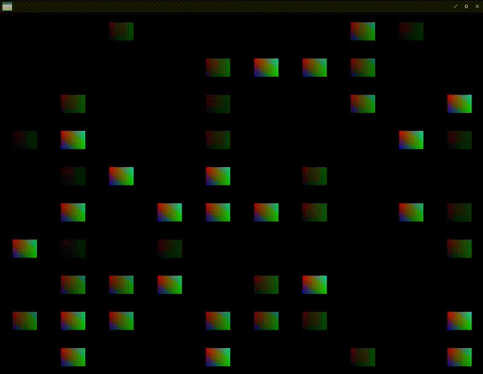

# Fight against cl-opengl 25.
## Metanotes
### 対象読者
[前章](clopengl24.html)読了済みの方。

## Introduction.
前章ではGPU Instancingをサポートしました。
本章ではそれをさらに拡張していきます。

## Issues.
真っ先に立ち上がった不具合は`instanced-array`を一つしか指定できないことです。

具体例として古式ゆかしきドラゴンクエスト的なRPGのマップを考えます。
マップ上には砂漠や草原、山、川といった様々なタイルチップがあります。
これらをタイルチップごとに描画依頼をするのは依頼コストが高く付きます。
同じタイルは一度の依頼で済ませたほうが依頼コストが低く済むのは前章で見た通り。

問題は描画しないというのをどう表すかです。

真っ先に思い浮かぶ手法は必要なインデックスをリストに蓄えて送るというものですが、これはLispyな手法であってもCな手法ではありません。

次に浮かぶ手法はインデックス（座標）配列とは別に描画する・しないのフラグを蓄えた配列を用意するというものです。

ここではこの手法を採用するとします。

次の課題はそのフラグをどのように表すかです。
インデックス（座標）は不変のデータとして扱いたいですがフラグはフレーム置きに変更しうるものです。

`x,y,bool`という順に並んだ一つの配列を用意するより`x,y`と`bool`をそれぞれ別の配列にしたほうが良さそうです。
現在のシンタックスでは`instanced-array`は一つという想定なのでこれは叶いません。

拡張しましょう。

## WITH-VAO
シンタックスのデッサンは以下の通り。

```lisp
(with-vao ((shader (:vertices *vertices*)
                   (:instances (offset *offset*)
                               (bool *bool* :usage :dynamic-draw))))
  ...)
```
これまで`VERTICES-CLAUSE`内のオプションだった`:INSTANCES`を`INSTANCES-CLAUSE`として独立させます。
`:INSTANCES-CLAUSE`内の各オプションは第一要素に`INSTANCED-ARRAY`クラス名を、第二要素にその初期値となる`GL-ARRAY`を、第三要素以降は関連するオプションをk-vペアで受け取るとします。

まずはこのデッサンを`check-bnf`に反映させましょう。

```lisp
(defmacro with-vao (&whole whole (&rest bind*) &body body)
  "Each VAR is bound by openGL vertex array object id."
  (check-bnf:check-bnf (:whole whole)
    ((bind* (var option+))
     (option+
      (or vertices-clause
          indices-clause
          uniform-clause
          buffer-clause
          attributes-clause
          instances-clause ; <--- New!
          shader-clause))
     ;;
     (vertices-clause ((eql :vertices) var init-form vertices-option*))
     (vertices-option* (member :usage :target :size) check-bnf:expression)
     ;;
     (indices-clause ((eql :indices) init-form indices-option*))
     (indices-option* keyword check-bnf:expression)
     ;;
     (uniform-clause ((eql :uniform) uniform-var-spec+))
     (uniform-var-spec (or var (var var)))
     ;;
     (buffer-clause ((eql :buffer) var))
     ;;
     (attributes-clause ((eql :attributes) attribute-name))
     (attribute-name check-bnf:expression)
     ;; 
     (shader-clause ((eql :shader) var vertex-shader fragment-shader))
     (vertex-shader check-bnf:expression)
     (fragment-shader check-bnf:expression)
     ;; This section!
     (instances-clause ((eql :instances) instances-bind*))
     (instances-bind
      ((satisfies instanced-array-p) check-bnf:expression instances-option*))
     (instances-option* (member :usage :target :vector :buffer)
      check-bnf:expression)
     ;;
     (var symbol)
     (init-form check-bnf:expression)))
  (multiple-value-bind (forms refs)
      (parse-with-vao-binds bind* body)
    (if (null refs)
        (car forms)
        `(macrolet ((indices-of (id)
                      (case id ,@refs (otherwise "No indices for ~S" id))))
           ,@forms))))
```

## PARSE-WITH-VAO-BINDS
コードは巨大ですが上の定義で引数がある程度明確になっているので読むのはけして難しくありません。

```lisp
(defun parse-with-vao-binds (bind* body)
  (let ((refs))
    (labels ((rec (bind*)
               (if (endp bind*)
                   body
                   (destructuring-bind
                       (prog vs fs)
                       (cdr (eassoc :shader (cdar bind*)))
                     (unless prog
                       (setf prog (gensym "PROG")))
                     `((with-prog ((,prog ,vs ,fs))
                         ,(body (assoc :indices (cdar bind*)) prog bind*))))))
             (body (clause prog bind*)
               (if (null clause)
                   (<body-form> bind* prog)
                   (alexandria:with-unique-names (vector indices ebo)
                     `(let ((,vector ,(second clause)))
                        ,(progn
                          (push (list (prog-name prog bind*) `',vector) refs)
                          (<body-form> bind* prog `((,indices ,vector))
                                       `((,ebo
                                          ,@(uiop:remove-plist-key :size (cddr
                                                                           clause))))
                                       (list (<init-buffer> ebo indices))))))))
             (<body-form> (bind* prog &optional indices-bind ebo-bind ebo-inits)
               (let* ((verts (eassoc :vertices (cdar bind*)))
                      (vertices (or (second verts) (gensym "VERTICES")))
                      (vbo
                       `(,(or (cadr (assoc :buffer (cdar bind*)))
                              (gensym "VBO"))
                         ,@(cdddr (assoc :vertices (cdar bind*)))))
                      (uniforms (uniform-bind bind* prog))
                      (attr (second (eassoc :attributes (cdar bind*))))
                      (instances (assoc :instances (cdar bind*)))         ; These blocks!
                      (instances-vec-bind                                 ;
                       (mapcar                                            ;
                         (lambda (bind)                                   ;
                           `(,(or (getf bind :vector)                     ;
                                  (gensym "INSTANCES-VECTOR"))            ;
                             ,(second bind)))                             ;
                         (cdr instances)))                                ;
                      (instances-buf-bind                                 ;
                       (mapcar                                            ;
                         (lambda (bind)                                   ;
                           `(,(or (getf bind :buffer)                     ;
                                  (gensym "INSTANCES-BUFFER"))            ;
                             ,@(uiop:remove-plist-keys '(:vector :buffer) ;
                                                       (cddr bind))))     ;
                         (cdr instances))))                               ;
                 `(with-gl-vector ((,vertices ,(third verts)) ,@indices-bind
                                   ,@instances-vec-bind) ; <--- Used here!
                    (with-buffer ,(append (list vbo) instances-buf-bind ; <--- and here!
                                          ebo-bind)
                      (with-vertex-array ((,(caar bind*)
                                           ,(<init-buffer> (car vbo) vertices)
                                           ,@(mapcar
                                               (lambda (buf vec)
                                                 (<init-buffer> (car buf)
                                                                (car vec)))
                                               instances-buf-bind ; <--- and here!
                                               instances-vec-bind) ; <--- and here!
                                           (in-shader ,prog)
                                           (in-buffer ,(car vbo))
                                           (link-attributes ,attr
                                                            (pairlis ; <--- Note!
                                                              ',(mapcar #'car
                                                                        (cdr
                                                                          instances))
                                                              (list
                                                                ,@(mapcar #'car
                                                                          instances-buf-bind))))
                                           ,@ebo-inits))
                        ,@(<may-uniform-bind> uniforms bind*))))))
             (<may-uniform-bind> (uniforms bind*)
               (if (null uniforms)
                   (rec (cdr bind*))
                   `((let ,uniforms
                       (declare (ignorable ,@(mapcar #'car uniforms)))
                       ,@(rec (cdr bind*)))))))
      (values (rec bind*) refs))))
```

上記コード内で`Note!`とコメントしてありますが、複数の`INSTANCED-ARRAY`を取り扱うためには各々`INSTANCED-ARRAY`に対応したバッファに`IN-BUFFER`する必要があります。
そのため`LINK-ATTRIBUTES`のAPIも唯一の`BUFFER`オブジェクトを受け取るものから`INSTANCED-ARRAY`クラス名と`BUFFER`の属性リストを受け取るものに変更する必要があります。

## LINK-ATTRIBUTES
ここでの変更自体は些細なものです。

```lisp
(defun link-attributes (class instance-buffers)
  (loop :for c :in (c2mop:class-direct-superclasses (find-class class))
        :when (typep c 'instanced-array)
          :do (in-buffer (cdr (eassoc (class-name c) instance-buffers))) ; <--- This!
        :do (link-attribute (class-name c) class)))
```

## \<SHADER-FORMS\>
最後に一つ。
`bool`配列は各要素をシェーダーに送ります。
各要素は`:float`で表されますが、現状`float`を生成できません。
代わりに`vec1`と生成されてしまいます。
この点を修正してしまいましょう。
コード全体を載せますが修正箇所はごく一部です。

```lisp
(defun <shader-forms> (shader-clause* superclasses name version)
  (let ((format
         (formatter
          #.(concatenate 'string "#version ~A core~%" ; version
                         "~{~@[~A~]in ~A ~A;~%~}~&" ; in
                         "~{out ~A ~A;~%~}~&" ; out
                         "~@[~{uniform ~A ~A;~%~}~]~&" ; uniforms
                         "void main () {~%~{~A~^~%~}~%}" ; the body.
                         ))))
    (labels ((defs (list)
               (loop :for (name type . vector-size) :in list
                     :collect nil
                     :collect (change-case:camel-case (symbol-name type))
                     :collect (if vector-size
                                  (format nil "~A[~A]"
                                          (change-case:camel-case
                                            (symbol-name name))
                                          (car vector-size))
                                  (change-case:camel-case
                                    (symbol-name name)))))
             (rec (shaders in acc)
               (if (endp shaders)
                   (nreverse acc)
                   (body (car shaders) (cdr shaders) in acc)))
             (body (shader rest in acc)
               (destructuring-bind
                   (type shader-lambda-list &rest main)
                   shader
                 (let* ((&uniform
                         (position-if #'uniform-keywordp shader-lambda-list))
                        (vars
                         (and shader-lambda-list
                              (defs (subseq shader-lambda-list 0 &uniform)))))
                   (rec rest vars
                        (cons
                          (<shader-method>
                            (intern (format nil "~A-SHADER" type) :fude-gl)
                            name main
                            (format nil format version in (remove nil vars)
                                    (and &uniform
                                         (delete nil
                                                 (defs
                                                   (subseq shader-lambda-list
                                                           (1+ &uniform)))))
                                    main))
                          acc))))))
      (rec shader-clause*
           (loop :for c :in (mapcar #'find-class superclasses)
                 :for slots = (c2mop:class-direct-slots c)
                 :for i :upfrom 0
                 :when slots
                   :collect (format nil "layout (location = ~A) " i)
                   :and :collect (format nil "~[~;float~:;~:*vec~D~]" ; <--- This!
                                         (length slots))
                   :and :collect (change-case:camel-case
                                   (symbol-name (class-name c))))
           nil)))))
```

## Demo

### A
表示する・しないというのは`vertex`（頂点）の情報というよりは`fragment`の情報のように思えます。
ここでは`bool`値をalpha値とすることで表示する・しないを切り替えるとします。

そこでまず必要となるのは`a`(alpha)を表す`INSTANCED-ARRAY`クラスです。

```lisp
(define-vertex-attribute a () (:instances t))
```

### SHADER
シェーダーは以下のように定義します。

```lisp
(defshader some-instances-demo 330 (xy rgb offset a)
  (:vertex ((|fColor| :vec4))
    "gl_Position = vec4(xy + offset, 0.0, 1.0);"
    "fColor = vec4(rgb, a);")
  (:fragment ((|fragColor| :vec4)) "fragColor = fColor;"))
```

### MAIN
`MAIN`関数では以下のように使います。
`:VECTOR`オプションでシンボル`VEC`への束縛を指定。
毎フレーム要素のどれかをランダムに更新。
`:BUFFER`オプションでシンボル`VBO`にバッファの束縛を指定し、その束縛経由で`buffer`にデータを送ります。

```lisp
(defun some-instances-demo ()
  (sdl2:with-init (:everything)
    (sdl2:with-window (win :flags '(:shown :opengl) :w 800 :h 600)
      (sdl2:with-gl-context (context win)
        (gl:enable :blend)
        (gl:blend-func :src-alpha :one-minus-src-alpha)
        (with-shader ((some-instances-demo
                        (:vertices quad-buffer-var *instancing*)
                        (:instances (offset *translations*)
                                    (a
                                     (make-array (array-dimension *translations* 0)
                                                 :element-type 'single-float
                                                 :initial-element 0.0)
                                     :usage :dynamic-draw :buffer vbo
                                     :vector vec))))
          (sdl2:with-event-loop (:method :poll)
            (:quit ()
              t)
            (:idle ()
              (with-clear (win (:color-buffer-bit))
                (setf (gl:glaref vec (random (gl::gl-array-size vec)))
                        (sin (get-internal-real-time)))
                (in-buffer vbo)
                (gl:buffer-sub-data (buffer-target vbo) vec)
                (%gl:draw-arrays-instanced :triangles 0 6 100)))))))))
```


