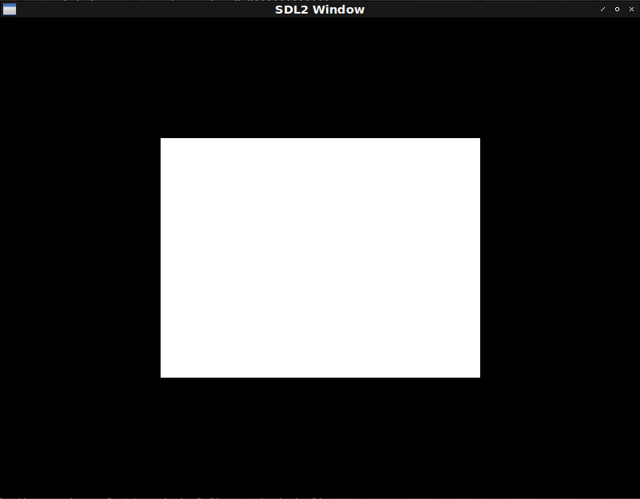

# Fight against cl-opengl 6.
## Metanotes
### 対象読者
[前章](clopengl5.html)読了済みの方。

## Introduction.
前回はVertex Array Objectを抽象化しました。
今回はElement Buffer Objectを抽象化します。

## Bug fix.
Element Buffer Objectへの対応にあたり前回のコードに不具合があることが判明しました。
まずはそれを修正します。

どのような不具合かというとバッファの初期化はVertex Array Objectを指定してから行わなければならなかったというものです。

`WITH-BUFFER`から初期化処理をなくします。

```lisp
(defmacro with-buffer ((&rest var*) &body body)
  (assert (every #'symbolp var*))
  `(destructuring-bind
       ,var*
       (gl:gen-buffers ,(length var*))
     (unwind-protect (progn ,@body) (gl:delete-buffers (list ,@var*)))))
```

よって三角形描画関数は以下のようになります。

```lisp
(defun fixed-hello-triangle ()
  (sdl2:with-init (:everything)
    (sdl2:with-window (win :flags '(:shown :opengl)
                           :x 100
                           :y 100
                           :w 800
                           :h 600)
      (sdl2:with-gl-context (context win)
        (with-gl-vector ((vector *triangle*))
          (with-buffer (buf)
            (with-prog (prog *vertex-shader* *fragment-shader*)
              (with-vertex-array ((vao 
                                    (gl:bind-buffer :array-buffer buf)
                                    (gl:buffer-data :array-buffer :static-draw vector)
                                    (link-attributes 'xy prog)))
                (sdl2:with-event-loop (:method :poll)
                  (:quit ()
                    t)
                  (:idle ()
                    (with-clear (win (:color-buffer-bit)
                                     :color '(0.0 0.0 0.0 1.0))
                      (gl:draw-arrays :triangles 0 3))))))))))))
```

## Element Buffer Object.
四角形を描画するとしましょう。
OpenGLは三角形しか描画できないので四角形を描画するには三角形が２つ必要です。

ではそのための頂点はいくつ必要でしょうか。
一つの三角形は頂点が三つです。
その三角形が二つあるということは単純計算で六つ頂点が必要となります。

三角形二つを組み合わせて四角形を作る場合重複する頂点が出てきます。
単純に四角形を作るだけで考えるなら頂点は四つあればいいはずです。

そこで頂点は四つだけ作りOpenGLには別途三角形描画をどの頂点を使って行うか教えてあげることとします。

コードはこれまで作ってきたヘルパを使って以下のようなものになります。

```lisp
(defparameter *rectangle*
  (concatenate '(array single-float (*))
               (make-instance 'xy :x -0.5 :y -0.5) ; Top left.
               (make-instance 'xy :x 0.5 :y -0.5) ; Top right.
               (make-instance 'xy :x -0.5 :y 0.5) ; Bottom left.
               (make-instance 'xy :x 0.5 :y 0.5) ; Bottom right.
               ))

(defun hello-rectangle ()
  (sdl2:with-init (:everything)
    (sdl2:with-window (win :flags '(:shown :opengl)
                           :x 100
                           :y 100
                           :w 800
                           :h 600)
      (sdl2:with-gl-context (context win)
        (with-gl-vector ((vertices *rectangle*)
                         (indices (coerce '(0 1 2 2 3 1)
                                          '(array (unsigned-byte 8) (*)))))
          (with-buffer (vbo ebo)
            (with-prog (prog *vertex-shader* *fragment-shader*)
              (with-vertex-array ((vao 
                                    (gl:bind-buffer :array-buffer vbo)
                                    (gl:buffer-data :array-buffer :static-draw vertices)
                                    (link-attributes 'xy prog)
                                    (gl:bind-buffer :element-array-buffer ebo)
                                    (gl:buffer-data :element-array-buffer :static-draw indices)))
                (sdl2:with-event-loop (:method :poll)
                  (:quit ()
                    t)
                  (:idle ()
                    (with-clear (win (:color-buffer-bit)
                                     :color '(0.0 0.0 0.0 1.0))
                      (%gl:draw-elements :triangles 
                                         (gl::gl-array-size indices)
                                         (gl::cffi-type-to-gl (gl::gl-array-type indices))
                                         0))))))))))))
```


## Issues
動くだけは動くのですがコードには不満が残ります。

* 変数`VERTICES`は変数`VAO`の初期化フォーム内でしか使われない。
* 変数`VBO`は変数`VAO`の初期化フォーム内でしか使われない。
* 変数`EBO`は変数`VAO`の初期化フォーム内でしか使われない。
* 変数`PROG`は変数`VAO`の初期化フォーム内でしか使われない。
* 変数`VAO`の初期化フォームに重複が多い。

変数`INDICES`こそイベントループ内で参照されていますが、それ以外の変数の多くは変数`VAO`の初期化フォーム内で参照されるのみであることがわかります。
これらは有機的に絡み合い分かちがたく結びついたひとかたまりの処理でありその内部でしか使われない変数は外に見えない方が健全です。

## WITH-VAO
こういうふうに書けると嬉しいなというシンタックスをデッサンしてみたものが以下になります。

```lisp
(with-vao ((vao (:vertices *rectangle*)
                (:attributes 'xy)
                (:indices (coerce '(0 1 2 2 3 1) '(array (unsigned-byte 8) (*)))
                          :target :element-array-buffer)
                (:shader *vertex-shader* *fragment-shader*)))
  (sdl2:with-event-loop (:method :poll)
    (:quit () t)
    (:idle ()
      (with-clear (win (:color-buffer-bit))
        (%gl:draw-elements :triangle
                           (length (indices-of vao))
                           (foreign-type (array-element-type (indices-of vao)))
                           0)))))
```

実装しましょう。

```lisp
(defmacro with-vao ((&rest bind*) &body body)
  (let ((table (gensym "TABLE")))
    (flet ((<init-buffer> (clause buf vec)
             (destructuring-bind
                 (&key (target :array-buffer) (usage :static-draw))
                 (cddr clause)
               `((gl:bind-buffer (the buffer-target ,target) ,buf)
                 (gl:buffer-data (the buffer-target ,target)
                                 (the buffer-usage ,usage) ,vec)))))
      `(let ((,table (make-hash-table)))
         (flet ((indices-of (id)
                  (gethash id ,table)))
           ,@(labels ((rec (bind*)
                        (if (endp bind*)
                            body
                            (let ((prog (gensym "PROG"))
                                  (vector (gensym "VECTOR"))
                                  (vertices (gensym "VERTICES"))
                                  (indices (gensym "INDICES"))
                                  (bufs (alexandria:make-gensym-list 2)))
                              (check-type (car bind*) (cons symbol (cons *)))
                              (assert (every
                                        (lambda (x) (assoc x (cdar bind*)))
                                        '(:vertices :indices :attributes
                                          :shader)))
                              `((with-prog (,prog
                                            ,@(cdr
                                                (assoc :shader (cdar bind*))))
                                  (let ((,vector
                                         ,(second
                                            (assoc :indices (cdar bind*)))))
                                    (with-gl-vector ((,vertices
                                                      ,(second
                                                         (assoc :vertices (cdar
                                                                            bind*))))
                                                     (,indices ,vector))
                                      (with-buffer ,bufs
                                        (with-vertex-array ((,(caar bind*)
                                                             ,@(<init-buffer>
                                                                 (assoc
                                                                   :vertices (cdar
                                                                               bind*))
                                                                 (car bufs)
                                                                 vertices)
                                                             (link-attributes
                                                               ,(second
                                                                  (assoc
                                                                    :attributes (cdar
                                                                                  bind*)))
                                                               ,prog)
                                                             ,@(<init-buffer>
                                                                 (assoc
                                                                   :indices (cdar
                                                                              bind*))
                                                                 (cadr bufs)
                                                                 indices)))
                                          (setf (gethash ,(caar bind*) ,table)
                                                  ,vector)
                                          ,@(rec (cdr bind*))))))))))))
               (rec bind*)))))))
```
`WITH-VAO`を使って四角形描画関数を書き直すと以下のようになります。

```lisp
(defun hello-rectangle ()
  (sdl2:with-init (:everything)
    (sdl2:with-window (win :flags '(:shown :opengl)
                           :x 100
                           :y 100
                           :w 800
                           :h 600)
      (sdl2:with-gl-context (context win)
        (with-vao ((vao (:vertices *rectangle*)
                        (:attributes 'xy)
                        (:indices (coerce '(0 1 2 2 3 1) '(array (unsigned-byte 8) (*)))
                                  :target :element-array-buffer)
                        (:shader *vertex-shader* *fragment-shader*)))
          (sdl2:with-event-loop (:method :poll)
            (:quit () t)
            (:idle ()
              (with-clear (win (:color-buffer-bit)
                               :color '(0.0 0.0 0.0 1.0))
                (%gl:draw-elements :triangles
                                   (length (indices-of vao))
                                   (foreign-type (array-element-type (indices-of vao)))
                                   0)))))))))
```
すっきりして見通しが良くなりました。
またデータの相関図も（少なくとも筆者には）直感的に理解しやすいコードになりました。
