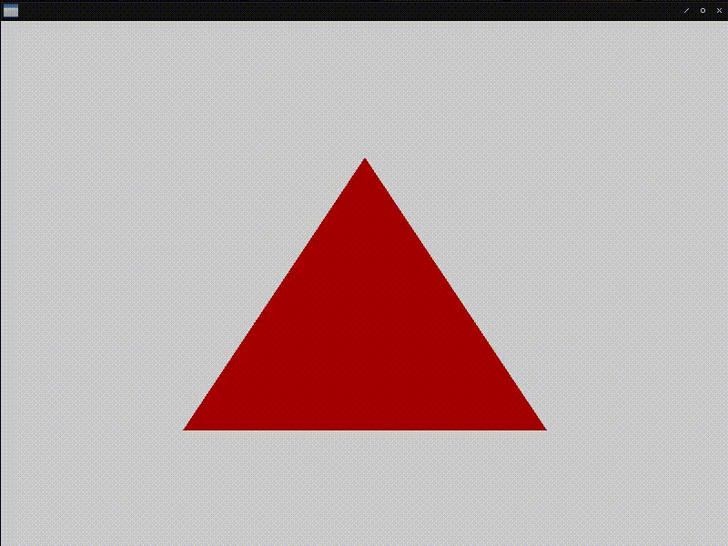

# Fight against cl-opengl 8.
## Metanotes
### 対象読者
[前章](clopengl7.html)読了済みの方。

## Introduction.
前回は`DEFSHADER`マクロを実装しました。
今回は改良を施し`uniform`を取り扱えるようにします。

## Uniform.
`uniform`とはシェーダーから見た際のグローバル変数を指します。
バッファに格納するのは基本的に不変のデータです。
頻繁に値が変わるデータは`uniform`としてシェーダーに送ります。

`uniform`は`DEFSHADER`マクロで以下のように宣言します。

```lisp
(defshader uniform-demo 330 (xy)
  (:vertex () "gl_Position = vec4(xy, 0.0, 1.0);")
  (:fragment ((|fragColor| :vec4) &uniform (color :vec3)) ; <--- Define uniform.
    "fragColor = vec4(color, 1.0);"))
```

節の第二要素を便宜的にシェーダーラムダリストと呼ぶことにします。
シェーダーラムダリストの要素は出力変数とuniform変数とからなります。
ラムダリストキーワード`&UNIFORM`以降がuniform変数と解釈されます。
uniform変数はシェーダーから見て入力です。
入力と出力が同じリストに並んでいるのは少々気持ち悪いですが妥協します。

また`WITH-SHADER`側では以下のようにして`location`と呼ばれるポインタのようなものを変数に束縛します。

```lisp
(with-shader ((uniform-demo (:vertices *triangle*)
                            (:indices (coerce '(0 1 2) '(array (unsined-byte 8) (*)))
                                      :target :element-array-buffer)
                            (:uniform |triangleColor|))) ; <--- Bind uniform location.
  (sdl2:with-event-loop (:method :poll)
    (:quit ()
      t)
    (:idle ()
      (with-clear (win (:color-buffer-bit))
        (gl:uniformf |triangleColor| ; <--- Use it.
                     (/ (+ 1.0 (sin (get-internal-real-time))) 2) 0.0
                     0.0)
        (%gl:draw-elements :triangles
                           (length (indices-of uniform-demo))
                           (foreign-type (array-element-type (indices-of uniform-demo)))
                           0)))))
```

これらはこういうふうに書けると嬉しいというシンタックスのデッサンです。

実際に実装するために`DEFSHADER`と`WITH-VAO`の変更が必要です。

### DEFSHADER
定義された名前から定義されている全uniform変数を返すメソッドを定義するようにします。

```lisp
(defgeneric uniforms (name)
  (:documentation "Accept class name, return its associates uniform symbols."))

(defmacro defshader (name version superclasses &body shader*)
  ;; Trivial syntax check.
  (check-type name symbol)
  (check-type version (or symbol integer))
  (assert (and (listp superclasses) (every #'find-class superclasses)))
  (assert (every (lambda (s) (find (car s) '(:vertex :fragment))) shader*))
  ;; binds
  (let ((format
         #.(concatenate 'string "#version ~A core~%" ; version
                        "~{in ~A ~A;~%~}~&" ; in
                        "~{out ~A ~A;~%~}~&" ; out
                        "~@[~{uniform ~A ~A;~%~}~]~&" ; uniforms
                        "void main () {~%~{~A~^~%~}~%}" ; the body.
                        )))
    (labels ((defs (list)
               (loop :for (name type) :in list
                     :collect (change-case:camel-case (symbol-name type))
                     :collect (change-case:camel-case (symbol-name name))))
             (rec (shaders in acc)
               (if (endp shaders)
                   (nreverse acc)
                   (body (car shaders) (cdr shaders) in acc)))
             (body (shader rest in acc)
               (destructuring-bind
                   (type out &rest main)
                   shader
                 (let* ((&uniform
                         (position-if
                           (lambda (x) (and (symbolp x) (string= '&uniform x)))
                           out))
                        (vars (and out (defs (subseq out 0 &uniform)))))
                   (rec rest `',vars
                        (cons
                          (let ((method
                                 (intern (format nil "~A-SHADER" type)
                                         :fude-gl)))
                            `(defmethod ,method ((type (eql ',name)))
                               ,(if (typep main
                                           '(cons
                                              (cons (eql quote)
                                                    (cons symbol null))
                                              null))
                                    `(,method ',(cadar main))
                                    `(format nil (formatter ,format) ',version
                                             ,in ',vars
                                             ',(and &uniform
                                                    (defs
                                                      (subseq out
                                                              (1+ &uniform))))
                                             ',main))))
                          acc))))))
      ;; The body.
      `(progn
        (defclass ,name ,superclasses () (:metaclass vector-class))
        ,@(rec shader*
               `(loop :for c :in (class-list (find-class type))
                      :for slots = (c2mop:class-direct-slots c)
                      :when slots
                        :collect (format nil "vec~D" (length slots))
                        :and :collect (change-case:camel-case
                                        (symbol-name (class-name c))))
               nil)
        (defmethod uniforms ((type (eql ',name))) ; <--- new!
          (list
            ,@(loop :for (nil lambda-list) :in shader*
                    :for position
                         = (position-if
                             (lambda (x)
                               (and (symbolp x) (string= '&uniform x)))
                             lambda-list)
                    :when position
                      :nconc (let ((acc))
                               (dolist
                                   (x (subseq lambda-list (1+ position)) acc)
                                 (pushnew `',(car x) acc :test #'equal))))))))))
```
### WITH-VAO
`:UNIFORM`節を処理できるようにします。
また`uniform`変数名のエラーチェックも行います。

```lisp
(defmacro with-vao ((&rest bind*) &body body)
  (let ((table (gensym "TABLE")))
    (labels ((<init-buffer> (clause buf vec)
               (destructuring-bind
                   (&key (target :array-buffer) (usage :static-draw))
                   (cddr clause)
                 `((gl:bind-buffer (the buffer-target ,target) ,buf)
                   (gl:buffer-data (the buffer-target ,target)
                                   (the buffer-usage ,usage) ,vec))))
             (<uniform-binder> (prog)
               (lambda (uniform)
                 (etypecase uniform
                   (symbol
                    `(,uniform
                      (gl:get-uniform-location ,prog
                                               ,(change-case:camel-case
                                                  (symbol-name uniform)))))
                   ((cons symbol (cons symbol null))
                    `(,(first uniform)
                      (gl:get-uniform-location ,prog
                                               ,(change-case:camel-case
                                                  (symbol-name
                                                    (second uniform)))))))))
             (rec (bind*)
               (if (endp bind*)
                   body
                   (let ((prog (gensym "PROG"))
                         (vector (gensym "VECTOR"))
                         (vertices (gensym "VERTICES"))
                         (indices (gensym "INDICES"))
                         (vbo (gensym "VBO"))
                         (ebo (gensym "EBO"))
                         (shader (cdr (assoc :shader (cdar bind*))))
                         (vec (assoc :indices (cdar bind*)))
                         (uniforms (cdr (assoc :uniform (cdar bind*))))
                         (verts (assoc :vertices (cdar bind*)))
                         (attr (second (assoc :attributes (cdar bind*)))))
                     (check-type (car bind*) (cons symbol (cons *)))
                     (assert (every (lambda (x) (assoc x (cdar bind*)))
                                    '(:vertices :indices :attributes :shader)))
                     (assert (null
                               (set-exclusive-or
                                 (mapcar #'alexandria:ensure-car uniforms)
                                 (uniforms (caar bind*)))))
                     `((with-prog (,prog ,@shader)
                         (let ((,vector ,(second vec)))
                           (with-gl-vector ((,vertices ,(second verts))
                                            (,indices ,vector))
                             (with-buffer ,(list vbo ebo)
                               (with-vertex-array ((,(caar bind*)
                                                    ,@(<init-buffer> verts vbo
                                                                     vertices)
                                                    (link-attributes ,attr
                                                                     ,prog)
                                                    ,@(<init-buffer> vec ebo
                                                                     indices)))
                                 (setf (gethash ,(caar bind*) ,table) ,vector)
                                 (let ,(mapcar (<uniform-binder> prog) uniforms)
                                   ,@(rec (cdr bind*)))))))))))))
      `(let ((,table (make-hash-table)))
         (flet ((indices-of (id)
                  (gethash id ,table)))
           ,@(rec bind*))))))
```
上記の変更の結果以下のようにして`uniform`変数を使えるようになります。

```lisp
(defshader uniform-demo 330 (xy)
  (:vertex () "gl_Position = vec4(xy, 0.0, 1.0);")
  (:fragment ((|fragColor| :vec4) &uniform (color :vec3))
    "fragColor = vec4(color, 1.0);"))

(defparameter *triangle*
  (concatenate '(array single-float (*))
               (make-instance 'uniform-demo :x 0.0 :y 0.5)
               (make-instance 'uniform-demo :x 0.5 :y -0.5)
               (make-instance 'uniform-demo :x -0.5 :y -0.5)))

(defun uniform-demo ()
  (sdl2:with-init (:everything)
    (sdl2:with-window (win :flags '(:shown :opengl)
                           :x 100
                           :y 100
                           :w 800
                           :h 600)
      (sdl2:with-gl-context (context win)
        (with-shader ((uniform-demo (:vertices *triangle*)
                                    (:indices (coerce '(0 1 2)
                                                      '(array (unsigned-byte 8) (*)))
                                              :target :element-array-buffer)
                                    (:uniform color)))
          (sdl2:with-event-loop (:method :poll)
            (:quit ()
              t)
            (:idle ()
              (with-clear (win (:color-buffer-bit))
                (gl:uniformf color
                             (/ (+ 1.0 (sin (get-internal-real-time))) 2) 0.0
                             0.0)
                (%gl:draw-elements :triangles
                                   (length (indices-of uniform-demo))
                                   (foreign-type (array-element-type
                                                   (indices-of uniform-demo)))
                                   0)))))))))
```


