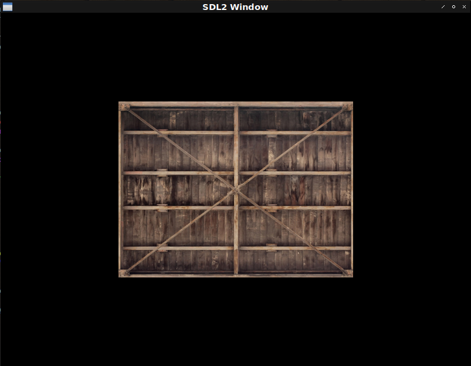

# Fight against cl-opengl 9.
## Metanotes
### 対象読者
[前章](clopengl8.html)読了済みの方。

## Introduction.
前回は`uniform`の取り扱い方を学びました。
本章では`texture`の取り扱い方を学びます。

## Workflow
`texture`を使う典型的な手順は以下のようになります。

1. OpenGLにN個の`texture`生成を依頼。
2. 現在有効な`texture`を一つ指定。
3. `texture`のオプションを設定。
4. ロードしたイメージデータを`texture`に流し込み。
5. 本体処理。
6. OpenGLに`texture`の消去を依頼。

リソースの開放が必要なのでいつもどおりWITH系マクロを定義します。

## WITH-TEXTURES
`texture`周りは複雑なので段階的に構築して行きましょう。

### First step: Generates and deletes.
とりあえずはリソースの確保と開放のみです。

```lisp
(defmacro with-textures ((&rest vars) &body body)
  (destructuring-bind ,vars (gl:gen-textures ,(length vars))
    (unwind-protect (progn ,@body)
      (gl:delete-textures (list ,@vars)))))
```

### Scond step: Association.
#### Texture target.
カレント`texture`の指定には`target`の指定が必要です。
OpenGLの仕様を読み型に落とし込みます。

```lisp
(deftype texture-target ()
  '(member :texture-1d :texture-1d-array
           :texture-2d :texture-2d-array
           :texture-2d-multisample :texture-2d-multisample-array
           :texture-3d :texture-cube-map
           :texture-cube-map-array :texture-rectangle))
```

#### pname.
`texture`のオプションを設定するにはKey-Valueペアを使うと考えればとらえやすいです。
このキーのことを`pname`（おそらくはParameter Name）と呼びます。

サポートされているキーについてはOpenGLの仕様を読み型に落とし込みます。

```lisp
(deftype texture-pname ()
  '(member :depth-stencil-texture-mode
           :texture-base-level :texture-compare-func
           :texture-compare-mode :texture-lod-bias
           :texture-min-filter :texture-mag-filter
           :texture-min-lod :texture-max-lod
           :texture-max-level :texture-swizzle-r
           :texture-swizzle-g :texture-swizzle-b
           :texture-swizzle-a :texture-wrap-s
           :texture-wrap-t :texture-wrap-r))
```
#### Texture-wrap
キーが`:TEXTURE-WRAP-x`の場合valueは列挙型で固定されます。
これもOpenGLの仕様を読み型にしておきます。

```lisp
(deftype texture-wrapping ()
  '(member :repeat :mirrored-repeat :clamp-to-edge :clamp-to-border))
```
#### Texture-mag-filter
キーが`:TEXTURE-MAG-FILTER`の場合のオプションです。
これもOpenGLの仕様を読み型にしておきます。

```lisp
(deftype texture-mag-filter () '(member :linear :nearest))
```

#### Texture-min-filter
キーが`:TEXTURE-MAG-FILTER`の場合のオプションです。
これもOpenGLの仕様を読み型にしておきます。

```lisp
(deftype texture-min-filter ()
  '(or textute-mag-filter
       (member :nearest-mipmap-nearest :lenear-mipmap-nearest
               :nearest-mipmap-linear :linear-mipmap-linear)))
```

現状Tutorialsで出てくるのはこれだけなのでこれ以上は定義しません。
[YAGNI](https://ja.wikipedia.org/wiki/YAGNI)の精神です。

#### Issues.
現在の`WITH-TEXTURES`マクロで`texture`のオプション指定をする場合以下のようなコードとなります。

```lisp
(with-textures (a b)
  (gl:bind-texture :texture-2d b)
  (gl:tex-parameter :texture-2d :texture-wrap-s :repeat)
  (gl:tex-parameter :texture-2d :texture-wrap-t :repeat)
  (gl:tex-parameter :texture-2d :texture-min-filter :linear)
  (gl:tex-parameter :texture-2d :texture-mag-filter :linear)
  (gl:bind-texture :texture-2d a)
  (gl:tex-parameter :texture-2d :texture-wrap-s :repeat)
  (gl:tex-parameter :texture-2d :texture-wrap-t :repeat)
  (gl:tex-parameter :texture-2d :texture-min-filter :linear)
  (gl:tex-parameter :texture-2d :texture-mag-filter :linear)
  ...)
```
重複が多くて辛いのとどの設定がどの`texture`に対してのものだかが見えづらくなってます。
（二つ目の`texture`に関する設定を最初にしてますが気づきましたか？）

以下のように書けた方が`texture`とその設定の関係性が見えやすくて良いです。

```lisp
(with-textures ((a :texture-2d :texture-wrap-s :repeat
                               :texture-wrap-t :repaet
                               :texture-min-filter :linear
                               :texture-mag-filter :linear)
                (b :texture-2d :texture-wrap-s :repeat
                               :texture-wrap-t :repaet
                               :texture-min-filter :linear
                               :texture-mag-filter :linear))
  ...)
```

これを実現するためにマクロを増築しましょう。

```lisp
(defmacro with-textures ((&rest bind*) &body body)
  ;; Trivial syntax check.
  (assert (every (lambda (b) (typep b '(cons symbol (cons texture-target *))))
                 bind*))
  (flet ((vname (k v)
           (case k
             ((:texture-wrap-s :texture-wrap-t :texture-wrap-r)
              `(the texture-wrapping ,v))
             ((:texture-mag-filter) `(the texture-mag-fileter ,v))
             ((:texture-min-fileter) `(the texture-min-fileter ,v))
             (otherwise v))))
    ;; The body.
    `(destructuring-bind
         ,(mapcar #'car bind*)
         (gl:gen-textures ,(length bind*))
       (unwind-protect
           (progn
            ,@(mapcan
                (lambda (b)
                  (destructuring-bind
                      (var target &rest params)
                      b
                    `((gl:bind-texture ,target ,var)
                      ,@(loop :for (k v) :on params :by #'cddr
                              :collect `(gl:tex-parameter
                                          (the texture-pname ,k)
                                          ,(vname k v))))))
                bind*)
            ,@body)
         (gl:delete-textures (list ,@(mapcar #'car bind*)))))))
```

### Third Step: The default.
既定値があるともっと便利です。
以下のように書けます。

```lisp
(with-textures ((a :texture-2d)
                (b :texture-2d))
  t)
```

増築しましょう。

```lisp
(defmacro with-textures ((&rest bind*) &body body)
  ;; Trivial syntax check.
  (dolist (b bind*) (the (cons symbol (cons texture-target *)) b))
  (labels ((vname (k v)
             (case k
               ((:texture-wrap-s :texture-wrap-t :texture-wrap-r)
                (ensure-check v 'texture-wrapping))
               ((:texture-mag-filter) (ensure-check v 'texture-mag-filter))
               ((:texture-min-fileter) (ensure-check v 'texture-min-filter))
               (otherwise v)))
           (<option-setters> (params)
             (destructuring-bind
                 (&key (texture-wrap-s :repeat) (texture-wrap-t :repeat)
                  (texture-min-filter :linear) (texture-mag-filter :linear)
                  &allow-other-keys)
                 params
               (let ((params
                      (list* :texture-wrap-s texture-wrap-s :texture-wrap-t
                             texture-wrap-t :texture-mag-filter
                             texture-mag-filter :texture-min-filter
                             texture-min-filter
                             (uiop:remove-plist-keys
                               '(:texture-wrap-s :texture-wrap-t
                                 :texture-min-filter :texture-mag-filter)
                               params))))
                 (loop :for (k v) :on params :by #'cddr
                       :collect `(gl:tex-parameter
                                   ,(ensure-check k 'texture-pname)
                                   ,(vname k v))))))
           (ensure-check (v type)
             (if (constantp v)
                 (progn (assert (typep v type)) v)
                 `(the ,type ,v))))
    ;; The body.
    `(destructuring-bind
         ,(mapcar #'car bind*)
         (gl:gen-textures ,(length bind*))
       (unwind-protect
           (progn
            ,@(mapcan
                (lambda (b)
                  (destructuring-bind
                      (var target &rest params)
                      b
                    `((gl:bind-texture ,(ensure-check target 'texture-target)
                                       ,var)
                      ,@(<option-setters> params))))
                bind*)
            ,@body)
         (gl:delete-textures (list ,@(mapcar #'car bind*)))))))
```

### Fourth step: Initialize.
`texture`に画像を貼り付けるのも各`texture`ごとにできたほうが関係性が分かりやすくていいです。
画像データは既にロードされているとして以下のように書けると嬉しゅうございます。

```lisp
(with-textures ((a :texture-2d
                   :params (:texture-wrap-s :repeat ...)
                   :init (gl:tex-image-2d :texture-2d 0 :rgb *width* *height* 0 :rgb :unsigned-byte *image*))
                (b ...))
  ...)
```

改築しましょう。

```lisp
(defmacro with-textures ((&rest bind*) &body body)
  ;; Trivial syntax check.
  (dolist (b bind*) (the (cons symbol (cons texture-target *)) b))
  (labels ((vname (k v)
             (case k
               ((:texture-wrap-s :texture-wrap-t :texture-wrap-r)
                (ensure-check v 'texture-wrapping))
               ((:texture-mag-filter) (ensure-check v 'texture-mag-filter))
               ((:texture-min-fileter) (ensure-check v 'texture-min-filter))
               (otherwise v)))
           (<option-setters> (params)
             (destructuring-bind
                 (&key (texture-wrap-s :repeat) (texture-wrap-t :repeat)
                  (texture-min-filter :linear) (texture-mag-filter :linear)
                  &allow-other-keys)
                 params
               (let ((params
                      (list* :texture-wrap-s texture-wrap-s :texture-wrap-t
                             texture-wrap-t :texture-mag-filter
                             texture-mag-filter :texture-min-filter
                             texture-min-filter
                             (uiop:remove-plist-keys
                               '(:texture-wrap-s :texture-wrap-t
                                 :texture-min-filter :texture-mag-filter)
                               params))))
                 (loop :for (k v) :on params :by #'cddr
                       :collect `(gl:tex-parameter
                                   ,(ensure-check k 'texture-pname)
                                   ,(vname k v))))))
           (ensure-check (v type)
             (if (constantp v)
                 (progn (assert (typep v type)) v)
                 `(the ,type ,v))))
    ;; The body.
    `(destructuring-bind
         ,(mapcar #'car bind*)
         (gl:gen-textures ,(length bind*))
       (unwind-protect
           (progn
            ,@(mapcan
                (lambda (b)
                  (destructuring-bind
                      (var target &key params init) ; <--- New!
                      b
                    `((gl:bind-texture ,(ensure-check target 'texture-target)
                                       ,var)
                      ,@(<option-setters> params)
                      ,init))) ; <--- New!
                bind*)
            ,@body)
         (gl:delete-textures (list ,@(mapcar #'car bind*)))))))
```

## Helpers
`texture`マクロの改築はひとまず終了ですが表示にはヘルパがまだ必要です。

### Texture coodinates.
`texture`の座標を個別に管理する必要があります。

```lisp
(defclass st ()
  ((%s :initarg :s :type single-float) (%t :initarg :t :type single-float))
  (:metaclass vector-class))
```

### Images.
いったん棚にあげていた画像のロードを済ませましょう。
本家tutorialsからもらってくるとします。

```lisp
(let ((pathname (merge-pathnames "container.jpg" (user-homedir-pathname))))
  (unless (probe-file pathname)
    (dex:fetch "https://learnopengl.com/img/textures/container.jpg" pathname))
  (defparameter *image* (opticl:read-jpeg-file pathname)))
```

### TEX-IMAGE-2D
cl-openglの`TEX-IAMGE-2D`の引数はLisp配列から自動的に求められるものが多うございます。
ここは一つ独自のラッパを導入しましょう。

```lisp
(deftype base-internal-format ()
  '(member :depth-component :depth-stencil :red :rg :rgb :rgba))

(deftype pixel-format ()
  '(or base-internal-format
       (member :bgr
               :bgra :red-integer
               :rg-integer :rgb-integer
               :bgr-integer :rgba-integer
               :bgra-integer :stencil-index)))

(defun tex-image-2d (array)
  (let ((format (ecase (array-dimension array 2) (3 :rgb) (4 :rgba))))
    (gl:tex-image-2d (the texture-target :texture-2d) 0 ; mipmap level.
                     (the base-internal-format format)
                     (array-dimension array 0) ; width
                     (array-dimension array 1) ; height
                     0 ; legacy stuff.
                     (the pixel-format format)
                     (foreign-type (array-element-type array))
                     (make-array (array-total-size array)
                                 :element-type (array-element-type array)
                                 :displaced-to array))))
```

### DRAW-ELEMENTS
これまではcl-openglの下層パッケージである`%GL`の`DRAW-ELEMENTS`を使っていました。
というのも`CL-OPENGL:DRAW-ELEMENTS`はバッファに対応していないからです。
これにもラッパ関数を作りましょう。

```lisp
(defun draw-elements (mode cl-vector &key (offset 0))
  (%gl:draw-elements mode (length cl-vector)
                     (foreign-type (array-element-type cl-vector)) offset))
```

## Conclusion.
まとめると以下のようになります。

```lisp
(defshader hello-texture 330 (xy st)
  (:vertex ((|texCoord| :vec2))
    "gl_Position = vec4(xy, 0.0, 1.0);"
    "texCoord = st;")
  (:fragment ((color :vec4) &uniform (tex :|sampler2D|))
    "color = texture(tex, texCoord);"))

(defparameter *texture-quad*
  (concatenate '(array single-float (*))
               (make-instance 'hello-texture :x -0.5 :y 0.5 :s 0.0 :t 1.0) ; top left
               (make-instance 'hello-texture :x 0.5 :y 0.5 :s 1.0 :t 1.0) ; top right
               (make-instance 'hello-texture :x -0.5 :y -0.5 :s 0.0 :t 0.0) ; bottom left
               (make-instance 'hello-texture :x 0.5 :y -0.5 :s 1.0 :t 0.0))) ; bottom right

(defun hello-texture ()
  (sdl2:with-init (:everything)
    (sdl2:with-window (win :flags '(:shown :opengl)
                           :x 100
                           :y 100
                           :w 800
                           :h 600)
      (sdl2:with-gl-context (context win)
        (with-shader ((hello-texture (:vertices *texture-quad*)
                                     (:indices '(0 1 2 2 3 1))
                                     (:uniform (tex-loc tex))))
          (with-textures ((tex :texture-2d :init (tex-image-2d *image*)))
            (sdl2:with-event-loop (:method :poll)
              (:quit ()
                t)
              (:idle ()
                (with-clear (win (:color-buffer-bit))
                  (fude-gl:draw-elements :triangles (indices-of hello-texture)))))))))))
```

