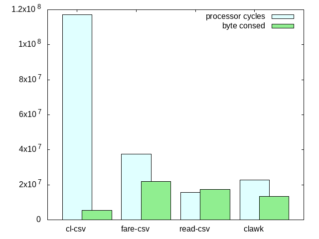

# CSV libralies in Common Lisp comunity.
## Metanotes
### 対象読者
* CSV ライブラリーを探しているCLer

## Introduction.
CSVを解釈するライブラリーの実装が話題になっているので、Common Lisp界隈にあるCSV系ライブラリーをざっくり比較してみました。

## [cl-csv](https://github.com/AccelerationNet/cl-csv)
速度は遅いもののConsing効率は大変良いもの。
なによりもGC負荷を下げたい場合の候補でしょう。

## [fare-csv](https://github.com/fare/fare-csv)
速度も遅くGC負荷も高いものの、[rfc4180](https://datatracker.ietf.org/doc/html/rfc4180)のサポートを明言している唯一（？）の実装。
安心安全に傾けたい場合の候補でしょう。

## [read-csv](https://github.com/WarrenWilkinson/read-csv)
最も速い実装。
Public DomainライセンスなのでCSVベースの独自フォーマットを作りたい場合などのフォーク元におすすめ。
ソースも80行と短い。

## [clawk](https://github.com/sharplispers/clawk)
AWKをLisp上の埋め込み言語として実装したライブラリー。
けしてCSV用のものではないため、たとえば改行を含むカラムとかは解釈できないという欠点がある。
ただし「顧客が本当に欲しかったもの」になる可能性があるので一応列挙。
ライブラリーというよりは言語に近いので把握は困難（エクスポートされているシンボルは173個）なもののマスターしたら手放せなくなるかも。
すでにAWKに慣れ親しんでいるならおすすめ。
速度、GC負荷、ともに二位というなかなか優秀な成績なのも好印象。

## Summary
第一候補はfare-csv、速度に不満が出てきたらread-csvを試すって方向で良いのでは？
仕様が明言されているというのは大きい。
運悪く何かしらバグを踏んだときに仕様をもとに議論を進められるのは心強い。
「俺のいうCSVはお前のいうCSVとは違う」とか「我々の言うCSVとはなにか」についてすり合わせる必要がないというのは割と重要かと思います。

## Bench
With `(time (dotimes (x 100) ...))`.
### cl-csv

```lisp
(let ((count 0))
  (cl-csv:do-csv (row #P"/proc/cpuinfo" :separator #\:)
    (when (uiop:string-prefix-p "processor" (nth 0 row))
      (incf count)))
  count)

1,170,493,080 processor cycles
5,324,864 bytes consed
```

### fare-csv

```lisp
(let ((fare-csv:*separator* #\:))
  (loop :for row :in (fare-csv:read-csv-file "/proc/cpuinfo")
        :when (uiop:string-prefix-p "processor" (nth 0 row))
	:count :it))

376,556,049 processor cycles
21,989,248 bytes consed
```

### read-csv

```lisp
(with-open-file (s "/proc/cpuinfo")
  (loop :for row := (read-csv:read-csv s #\: nil)
        :while row
	:when (uiop:string-prefix-p "processor" (nth 0 row))
	:count :it))

155,720,821 processor cycles
17,479,760 bytes consed
```

### clawk

```lisp
(let ((count 0))
  (clawk:for-file-lines ("/proc/cpuinfo" s line)
    (clawk:with-fields (nil line ":")
      (when (uiop:string-prefix-p "processor" line)
        (incf count))))
  count)

228,809,147 processor cycles
13,268,288 bytes consed
```



上のグラフは短いほうが成績が良いものです。
なお、processor-cyclesとbyte-consedの表示バランスを取るため、processor-cyclesは実際の数値の1/10に調整してあります。

## ソースを読んだ感想。
### Why cl-csv is slow?
CLOSベースで設計されているからでしょうね。
クラスもメソッドも重たいものですから。
またフィールド文字列を作るために`VECTOR-PUSH-EXTEND`を使っているのも遅さに一役買っていると思います。

### Why fare-csv is slow?
フィールド文字列を作るために`STRING-OUTPUT-STREAM`を使っているからでしょう。

また、`PROGV`で実行時に動的に束縛を作っているのも遅さに一役買っていると思います。

また、`DEFCONSTANT`を使っておらずコンパイラが最適化しきれない点もあると思います。
これはたぶん`DEFCONSTANT`を文字列に使うとSBCLが再ロード時にエラーを投げるのを毛嫌いしてのものと思われます。

また、実行時にバリデーションが走るのも遅さに一役買っているでしょう。
`DECLAIM`による型宣言を取り入れ、型の取り扱いがゆるい処理系でのみ実行時チェックに変えるともう少し速くなるかと思われます。

### Why read-csv is fast?
無駄なことをしていないの一言に尽きるでしょう。
ソースコードは短く、少々クセがあるものの、それでも分かりやすく洗練されているといった印象。
実践的なコード例を読みたい初学者にはガチでおすすめ。

## Why clawk is fast?
CSVとしてやるべき処理をやっていないからでしょう。
具体例としてはダブルクォートでエスケープされたカラムの解釈はできません。

それでも一位になれていないのは、代わりにAWKとしてやるべき処理をやっているから。
具体例としては読み込み中の行全体を変数に束縛する、とか、セパレータは正規表現を受け取れる、とか。

## Why cl-csv is less consing?
謎。さっぱりわからない。
なんでこんな少ないconsing量で実装できるの？

