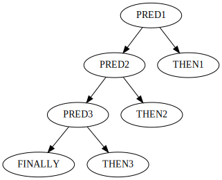

# Refactoring in common lisp.
## Introdunction

Common LispはASTを人間が書く言語です。

そしてASTは本質的に醜くなるものです。
もしそうでないなら今頃あらゆるプログラミング言語がLisp系言語になっていたことでしょう。

では、そのような本質的に醜くなりうるASTを直接書き下す言語（すなわちLisp）としては、どのようにASTをハンドルすれば（すなわちコードを書けば）醜さに陥っていくのを防げるでしょうか。

本稿では著者が知り得ている典型的なリファクタリングパターンを初心者向けに紹介していきます。

# Local function.
インデントが深くなりコードが醜くなる一因として、関数に切り出すべき処理を直接書き下してしまっている場合があります。
そのような場合、ローカル/グローバル問わず、独立した関数に書き出すことでコードを美しくできます。

関数に切り出すという行為には、関数呼び出しそのものに実行コストがかかる、という反論が想定されますが、それは実際に呼び出しがボトルネックになるまでは気にするべきではありません。

また、コメントとともに処理を書いている場合、そのコメント内容を関数名にして切り出したほうが良い場合があります。
もしコメントの内容が「何をしているのか」についてのものであるなら関数への切り出しを検討しましょう。
コメントの内容が「なぜしているのか」の場合はこの限りではありません。

また、スコープを区切って変数を定義しようとした結果ネストが深くなるという場合も関数に切り出したほうが良いかもしれません。

では具体例として、ASDFのメンテナでもあらせられるfareさんの[コードを見てみましょう。](https://github.com/fare/fare-csv/blob/39fcada5db2899af172454899ff13a07c62ebdb9/csv.lisp#L232-L354)
これはCSVをパースするライブラリのコードですが、ローカル関数が大量に定義され本体ではそのうちのエントリポイントとなる関数を呼び出しているだけです。
大変美しく、処理も追いやすいものです。
大いに参考にするべきです。

# Conditional diverging.
条件分岐もコードが醜くなる一因です。

著者の印象では条件分岐は主に三種類に大別できます。
なお、以下の条件分岐名三種は、筆者がかってに名付けたものです。
正式名称をご存知の方はご一報を！

## Sequential condition.
もっとも一般的で分かりやすいのは線形条件分岐です。
グラフで表すと以下のようになります。



## Balanced binary tree condition.
もっとも難解なのは平衡二分木条件分岐です。
グラフで表すと以下のようになります。


## Unballanced binary tree condition.
頻出するパターンとして非平衡二分木条件分岐があります。
名前は苦肉の策でつけたものでもっと良い名前があれば良いのですが。。。

グラフで表すと以下のようになります。


これは主に再帰関数で見かけるものです。
一番上の`pred1`が再帰終了条件で、再帰中は左の枝を辿りますが、終了する場合は右の枝に行きます。
`pred3`が行っているのは返り値を処理するための分岐です。

## IF rather than COND.
もっとも一般的で分かりやすいのが線形条件分岐なのは上に見たとおりです。
通常これを書くのには`COND`が使われます。
先のグラフを`COND`を使って書くと以下のようになります。

```lisp
(cond
  (pred1 then1)
  (pred2 then2)
  (pred3 then3)
  (t finally))
```

陥りがちな罠として、とりあえず線形条件分岐で書こうとするものです。
中でも本来平衡二分木条件分岐であるものを線形条件分岐として書こうとするのは悪手です。

先の平衡二分木条件分岐をLispコードにするなら`IF`を使って以下のようになるでしょう。

```lisp
(if pred1
    (if pred2
        then2
        else2)
    (if pred3
        then3
        else3))
```

上のコードを`COND`を使って無理に線形条件分岐に変更すると以下のコードとなります。

```lisp
(cond
  ((and pred1 pred2) then2)
  ((and pred1 (not pred2)) else2)
  ((and (not pred1) pred2) then3)
  ((and (not pred1) (not pred2)) else3))
```

`IF`を使った前者のコードは条件が網羅的である（すべての`IF`の`then`部と`else`部が埋まっている）のが簡単に見て取れます。
`COND`を使った後者のコードで条件が網羅的であるのを読み取るのは困難です。

条件分岐は通常`IF`を使って書き始めるべきです。
なお、「通常」というからには例外があって、それは`TYPECASE`を使う場合などです。

### Tips.

`IF`を書くときのコツは`then`部に`IF`をネストさせないことです。
悪い例を以下に挙げます。

```lisp
(if pred1
    (if pred2
        (do-a)
        (if pred3
            (do-b)
            (do-c)))
    (do-d))
```

`then`部にある`IF`は`NOT`を使えば簡単に`else`部と入れ替えられます。

```lisp
(if (not pred1)
    (do-d)
    (if pred2
        (do-a)
        (if pred3
            (do-b)
            (do-c))))
```

上記のように`else`部に`IF`が続くコードは線形条件分岐であり、これは`COND`に変換したほうが読みやすいかもしれません。

```lisp
(cond
  ((not pred1) (do-d))
  (pred2 (do-a))
  (pred3 (do-b))
  (t (do-c)))
```

上の条件分岐三例はどれも同じコードですが、読みやすさは各々異なります。
特に第一の例から条件分岐が線形になっていることを読み解くのは困難です。

`IF`がネストしてインデントが深くなってしまっているコードは第一の例のようなコードを書いてしまっている場合が考えられます。

