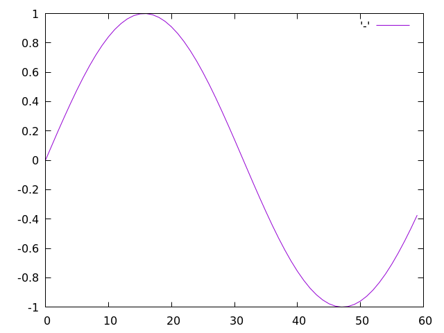
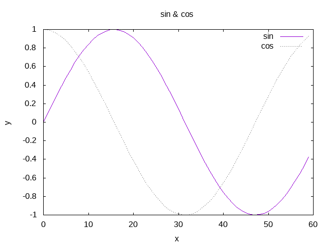

# ゼロから作るDeep Learning. Common Lispで学ぶディープラーニングの理論と実装(1)
ゼロから作るDeep LearningのコードをCommon Lispに移植しながら学習していくシリーズです。

# Common Lisp入門

## 1.1 Common Lispとは

## 1.2 処理系のインストール
ここではインストールに際しての注意点を説明します。

### 1.2.1 処理系
Common LispはANSI仕様が存在するため処理系は複数あります。
ここでは最も開発が活発で実行速度の速さでも群を抜くSBCLを使用します。

### 1.2.2 Dependencies
必要な便利ライブラリはドシドシ使っていきます。

* [Numcl](https://github.com/numcl/numcl)
* [Eazy-gnuplot](https://github.com/guicho271828/eazy-gnuplot)

### 1.2.3 [Roswell](https://github.com/roswell/roswell)
Common Lispのインストール方は様々ありますが、ここでは処理系マネージャであるRoswellを推奨します。
Roswellのインストールに関しては[ここ](https://github.com/roswell/roswell/wiki/Installation)を参照してください。

## 1.3 REPL
処理系のREPL（対話的インターフェース）にはエディタからアクセスできると便利です。
Emacsユーザーは[slime](https://github.com/slime/slime)、VIMユーザーは[vlime](https://github.com/vlime/vlime)を使うと幸せになれます。
もしくは[rlwrap](https://github.com/hanslub42/rlwrap)を使ったほうが幸せになれるかたもいるかもしれません。

### 1.3.1 Arithmetic
加算や乗算などの算術計算は以下のように行います。

```lisp
* (- 1 2 3)
-4

* (* 4 5 6)
120

* (/ 7 5 3)
7/15

* (expt 3 2)
9
```

除算の結果が分数になっている点要注意。
少数が欲しい場合は引数か返り値を明示的に少数にする必要があります。

```lisp
* (/ 7 5.0)
1.4

* (float (/ 7 5))
1.4
```

### 1.3.2 Data types
プログラミングではデータ型（data type）というものがあります。
データ型とはデータの性質を表すもので、たとえば、整数、少数、文字列といった型があります。
Common Lispには`TYPE-OF`という関数があり、この関数でデータの型を調べることができます。

```lisp
* (type-of 10)
(INTEGER 0 4611686018427387903)

* (type-of 1.5)
SINGLE-FLOAT

* (type-of "hoge")
(SIMPLE-ARRAY CHARACTER (4))
```

なお`TYPE-OF`の返り値は型指定子（type specifier）ですが、帰ってくる型指定子は処理系依存です。
同じ処理系であってもバージョン違いで返り値が異なる場合があります。
`TYPE-OF`は通常コードには書きません。
（あくまでREPLと対話的に調べたい時のためのもの。）
コード内で型をチェックしたい場合は`TYPEP`を使います。

```lisp
* (typep 10 'integer)
T

* (typep 10 'float)
NIL
```

また、型により条件分岐を行いたい場合は`TYPECASE`のファミリーが便利に使えます。

```lisp
* (typecase 10
    (float :no)
    (integer :yes))
:YES
```

*NOTE*

歴史的由来により厄介な点が一つあります。

ここでいう歴史的由来とは素のLispの上にオブジェクトシステムが後づけで開発されたことです。
それ自体はLispという言語の柔軟さや強力さを表していることなのですが、後追いで参入してきた初心者にはわかりづらいものとなっている問題点があります。

全てのクラスは型ですが、全ての型がクラスを持つとは限らないのです。

データのクラスを調べたい場合は`CLASS-OF`関数を使います。

```lisp
* (class-of 10)
#<BUILT-IN-CLASS FIXNUM>

* (class-of 1.5)
#<BUILT-IN-CLASS SINGLE-FLOAT>

* (class-of "hoge")
#<BUILT-IN-CLASS SB-KERNEL:SIMPLE-CHARACTER-STRING>
```

具体的な事例としては`T`や`NIL`は`BOOLEAN`型でもありますが、`BOOLEAN`型に対応するクラスは存在しません。 

```lisp
* (typep t 'boolean)
T

* (find-class 'boolean)
; Error
```

### 1.3.3 Variable
グローバルな変数は`DEFPARAMETER`ないし`DEFVAR`で宣言してから使います。

```lisp
* (defvar *x* 10) ; 宣言と初期化。グローバル変数名の左右に`*`をつけるのは作法。
*X*               ; DEFPARAMETER式は宣言された変数名を返す。

* (print *x*) ; *X*の値を出力。
10            ; 出力（副作用）
10            ; PRINT式は出力した値を返す。

* (setf *x* 100) ; 代入には`SETF`を使う。
100              ; SETF式は最後に代入した値を返す。

* (defvar *y* 3.14)
*Y*

* (* *x* *y*)
314.0

* (type-of (* *x* *y*))
SINGLE-FLOAT
```

Common Lispは動的型付けの言語なので変数に型宣言は必要ありません。
ですが型宣言ができないわけではありません。
型宣言をした場合の振る舞いは処理系依存です。
ここで採用しているSBCLはオープンソース処理系の中でも特に型に厳しい処理系です。
型宣言をした場合、コンパイル時に静的な型チェックが行われます。

なお、「;」はコメントで、それ以降の文字は無視されます。

### 1.3.4 List
`LIST`関数でリストオブジェクトを作れます。

```lisp
* (defvar *l* (list 1 2 3 4 5))
*L*

* *l* ; 中身の確認。
(1 2 3 4 5)

* (length *l*) ; 長さの取得。
5

* (nth 0 *l*) ; 最初の要素にアクセス。
1

* (nth 4 *l*)
5

* (setf (nth 4 *l*) 99) ; 代入。
99

* *l*
(1 2 3 4 99)
```

リスト要素へのアクセスには`NTH`関数を使います。
Common Lispは汎変数をサポートしており、値を参照する式は通常、代入できます。
上記例では`NTH`式を経由して`99`を代入しています。

部分リストの取得には`SUBSEQ`関数を使います。

```lisp
* (subseq *l* 0 2) ; インデックスの０番目から２番目まで（２番目は含まない）取得。
(1 2)

* (subseq *l* 1) ; インデックスの１番目から最後まで取得。
(2 3 4 99)
```

### 1.3.5 Hash-table
キーと値のペアを格納する専用のオブジェクトとして`HASH-TABLE`がサポートされています。

```lisp
* (defvar *ht* (make-hash-table)) ; 空のハッシュテーブルを作成。
*HT*

* (setf (gethash :key *ht*) :value) ; 新しいペアを代入。
:VALUE

* (gethash :key *ht*) ; 参照。
:VALUE
```

ハッシュテーブルは多くの処理系で中身が見えません。

```lisp
* *ht*
#<HASH-TABLE :TEST EQL :COUNT 1 {1007F58EF3}>

* (print *ht*)                                ; PRINTしても
#<HASH-TABLE :TEST EQL :COUNT 1 {1007F58EF3}> ; 中身は見えない。
#<HASH-TABLE :TEST EQL :COUNT 1 {1007F58EF3}> ; PRINTは表示したオブジェクトを返す。
```

中身を見たい場合は`INSPECT`関数を使います。
`INSPECT`の表示方法は処理系依存ですのでここでは割愛します。

```lisp
* (inspect *ht*) ; 表示例は割愛。
```

### 1.3.6 Boolean
Common Lispは汎ブールをサポートする言語です。
`NIL`が唯一の偽値（FALSE）で、それ以外はすべてTRUEと解釈されます。

#### AND
`AND`マクロは左から順に評価していき、`NIL`を返すフォームに出会うとそれを返り値とします。
どのフォームも`NIL`を返さなかった場合、最後のフォームの返り値が`AND`マクロの返り値となります。

```lisp
* (and nil t nil)
NIL

* (and 1 2 3)
3
```

#### OR
`OR`マクロは左から順に評価していき、非`NIL`値を返すフォームに出会うとそれを返り値とします。
どのフォームも非`NIL`値を返さなかった場合、`NIL`が`OR`マクロの返り値となります。

```lisp
* (or nil 1 2 3)
1

* (or nil nil nil)
NIL
```

#### NOT
`NOT`関数はブールを反転させます。

```lisp
* (not nil)
T

* (not 0)
NIL
```

#### BOOLEAN
より厳格な型としてブーリアン型も定義されています。
この場合`T`と`NIL`のみがブーリアン型と解釈されます。

```lisp
* (typep nil 'boolean)
T

* (typep 0 'boolean)
NIL
```

ブーリアン型はクラスではありません。

```lisp
* (find-class 'boolean)
; Error.
```

### 1.3.7 If
条件に応じて処理を分岐する場合は分岐に応じて各種コマンドを使い分けます。

#### IF
分岐が二分木となる場合`IF`を使います。

```lisp
* (let ((num (random 2)))
    (if (zerop num)
      :zero
      :one))
```

#### COND, CASE, TYPECASE
分岐が多分木となる場合`COND`、`CASE`、`TYPECASE`などを使います。

```lisp
* (let ((num (random 3)))
    (cond
      ((zerop num) :zero)
      ((evenp num) :even)
      ((oddp num) :odd)))
```

#### WHEN, UNLESS
エラーを投げたりするような副作用が目当ての場合は`WHEN`、`UNLESS`を使います。

```lisp
* (defun my-evenp (num)
    (unless (integerp num)
      (error "~S is not integer." num))
    (zerop (/ num 2)))
```

### 1.3.8 Loop
Loop処理を行うには`LOOP`マクロを使用します。

```lisp
* (loop :for i :in '(1 2 3)
        :do (print i))
1
2
3
NIL
```
`LOOP`マクロは強力でできることが非常に多うございます。
初心者の方はとりあえず[ここ](https://programgenjin.hatenablog.com/entry/2019/03/29/152157)などで概要を学んでおくことをおすすめします。

### 1.3.9 Function
まとまりのある処理を関数として定義することができます。

```lisp
* (defun hello ()
    (print :hello))
HELLO
```

また、関数は引数を取ることができます。

```lisp
* (defun hello (name)
    (format t "Hello, ~A!" name))
HELLO

* (hello "guevara")
Hello, guevara!
NIL
```
## 1.4 Ros Script
### 1.4.1 Save file
### 1.4.2 Class

## 1.5 NumCL
NumclはNumpyのCommon Lisp cloneです。

### 1.5.1 Using numcl
Numclはライブラリです。
標準のCommon Lispには含まれません。
ライブラリをインストールするにはquicklispのコマンドを叩きます。
quicklispはunixのapt-getに相当するライブラリです。
roswellをインストールしているなら、roswellがquicklispをインストールしてくれているのでここではquicklispのインストール方法については触れません。

```lisp
* (ql:quickload :numcl)
(:NUMCL)
```
なお、numclはコンパイル時にメモリを大量に消費します。
ヒープサイズが小さい場合、ヒープを食いつぶして途中で処理系が死にます。
その場合でも途中まではコンパイルが済んでいるので、改めて処理系を立ち上げ直し、繰り返し`QUICKLOAD`をするといずれコンパイルは終了します。

追い込んでいないので数字はおおよそのものですが、ヒープが２ギガあると食いつぶすことはないようです。
ros経由で処理系を立ち上げている場合以下のようにしてヒープサイズを指定できます。

```shell
$> ros -v dynamic-space-size=2gb run
```

### 1.5.2 Making numcl array.
Numcl配列を作るには`NUMCL:ASARRAY`を使います。

```lisp
* (numcl:asarray '(1.0 2.0 3.0))
#(1.0 2.0 3.0)
```
### 1.5.3 Numcl arithmetics.
Numcl配列の算術計算例を示します。

```lisp
* (defvar *x* (numcl:asarray '(1.0 2.0 3.0)))
*X*

* (defvar *y* (numcl:asarray '(2.0 4.0 6.0)))
*Y*

* (numcl:+ *x* *y*) ; 要素ごとの足し算。
#(3.0 6.0 9.0)

* (numcl:- *x* *y*)
#(-1.0 -2.0 -3.0)

* (numcl:* *x* *y*) ; Element-wise product
#(2.0 8.0 18.0)

* (numcl:/ *x* *y*)
#(0.5 0.5 0.5)
```

Broadcast

```lisp
* (numcl:/ *x* 2.0)
#(0.5 1.0 1.5)
```

### 1.5.4 Numcl multi dimensional array.

```lisp
* (defvar *a* (numcl:asarray '((1 2) (3 4)))) ; 多次元配列の作成。
*A*

* *a*            ; 中身の確認。
#2A((1 2) (3 4))

* (numcl:shape *a*)
(2 2)

* (numcl:dtype *a*)
(UNSIGNED-BYTE 4)
```

```lisp
* (defvar *b* (numcl:asarray '((3 0) (0 6))))
*B*

* (numcl:+ *a* *b*) ; Matrix同士の足し算。
#2A((4 2) (3 10))

* (numcl:* *a* *b*) ; Matrix同士の掛け算。
#2A((3 0) (0 24))

* (numcl:* *a* 10) ; Broadcast.
#2A((10 20) (30 40))
```

### 1.5.5 Broadcast.
numpy用のものですがブロードキャストについては[例えばここ](https://machinelearningmastery.com/broadcasting-with-numpy-arrays/)などが参考になるかと思われます。

```lisp
* (numcl:* (numcl:asarray '((1 2) (3 4))) (numcl:asarray '(10 20)))
#2A((10 40) (30 80))
```

### 1.5.6 Access element.
要素へのアクセスには`AREF`関数を使います。

```lisp
* (defvar *x* (numcl:asarray '((51 55) (14 19) (0 4))))
*x*

* (numcl:aref *x* 0)
#(51 55)

* (numcl:aref *x* 0 1)
55
```

`shape`の返り値を利用することでお好みの繰り返しコマンドを使用できます。

```lisp
* (dotimes (x (car (numcl:shape *x*)))
    (print (numcl:aref *x* x)))
#(51 55)
#(14 19)
#(0 4)
NIL
```

```lisp
* *x*
#2A((51 55) (14 19) (0 4))

* (numcl:flatten *x*)
#(51 55 14 19 0 4)     ; <--- Main return value.
#(51 55 14 19 0 4 0 0) ; <--- Background vector.

* *x*
#2A((51 55) (14 19) (0 4)) ; <--- Numcl:flatten has no side effect.
```

```lisp
* (numcl:take (numcl:flatten *x*) '((0 2 4)))
(51 14 0)

* (numcl:> *x* 15)
#2A((1 1) (0 1) (0 0))

* (numcl:take *x* (numcl:where *x* (lambda (x) (> x 15))))
(51 55 19)
```
## 1.6 Plot
ここではEazy-gnuplotを使います。

### 1.6.1 Drawing simple graph.

```lisp
* (ql:quickload :eazy-gnuplot)
(:EAZY-GNUPLOT)

* (let* ((x (numcl:arange 0 6 0.1))
         (y (numcl:sin x)))
    (eazy-gnuplot:with-plots (*standard-output* :debug nil)
      (eazy-gnuplot:gp-setup :terminal '(pngcairo) :output "plot.png")
      (eazy-gnuplot:plot (lambda ()
                           (map nil (lambda (x) (format t "~%~A" x)) y))
                         :with '(:lines)))
    (uiop:run-program "display plot.png"))
```


### 1.6.2 Features.

```lisp
* (let* ((x (numcl:arange 0 6 0.1))
         (y1 (numcl:sin x))
         (y2 (numcl:cos x)))
    (eazy-gnuplot:with-plots (*standard-output* :debug nil)
      (eazy-gnuplot:gp-setup :terminal :png :output "plot.png" :title "sin \\\\& cos"
                             :xlabel "x" :ylabel "y")
      (eazy-gnuplot:gp :set :encoding :utf8)
      (eazy-gnuplot:plot (lambda ()
                           (map nil (lambda (x) (format t "~%~A" x)) y1))
                         :with '(:lines :title "sin"))
      (eazy-gnuplot:plot (lambda ()
                           (map nil (lambda (x) (format t "~%~A" x)) y2))
                         :with '(:lines :title "cos" :linestyle "--")))
    (uiop:run-program "display plot.png"))
```


### 1.6.3 Showing images.
## 1.7 Summary.
本章で学んだこと。

* Common Lispはシンプルで覚えやすいプログラミング言語である。
* Common LispはANSI仕様があり処理系が複数ある。
* 本シリーズではオープンソースで処理速度も早いSBCLを使用する。
* 外部ライブラリとしてnumclとeazy-gnuplotを使用する。
* numclには多次元配列を操作するための便利な関数が数多くある。
