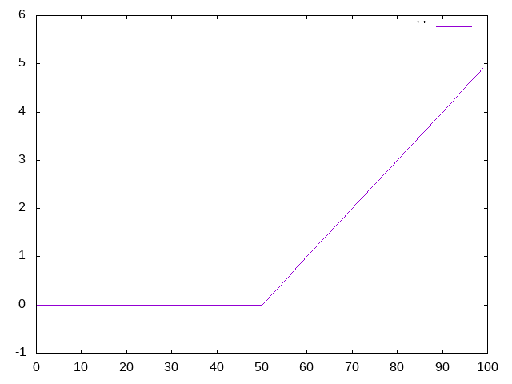

# ゼロから作るDeep Learning.Common Lispで学ぶディープラーニングの理論と実装(3)
原著の内容をCommon Lispに移植しながら学んでいくシリーズです。
詳細は原著でお読みください。
ここでは移植したCommon Lispコードについての解説や注意点を記していきます。

# 3 Neural Network.
## 3.1. From perceptron to Neural network.
### 3.1.1. Example of neural network.
### 3.1.2. Review of perceptron.
### 3.1.3 Activation functions.
## 3.2. Activation functions.
### 3.2.1 Sigmoid function.
### 3.2.2. Implementation of step function.
シンボルの衝突を避けるためバーティカルバーでくくってある点要注意。

```lisp
(defun |step| (x)
  (if (<= 0 x)
    1
    0))
```
numcl対応版。

```lisp
(defun |step| (x)
  (let ((result (numcl:<= 0 x)))
    (typecase result
      ((eql t) 1)
      (null 0)
      (otherwise result))))
```
numclの不等号関数はブーリアンではなくバイナリ（ビットベクター）を返す点要注意。

```lisp
* (defvar *x* (numcl:asarray #(-1.0 1.0 2.0)))
*X*

* (numcl:<= 0 *x*)
#*011
```

### 3.2.3. Graph of step function.

```lisp
* (progn
    (eazy-gnuplot:with-plots (*standard-output* :debug nil)
      (eazy-gnuplot:gp-setup :terminal :png :output "plot.png")
      (eazy-gnuplot:gp :set :yr :|[-0.1:1.1]|)
      (eazy-gnuplot:plot (lambda () (map nil 'print (|step| (numcl:arange -5.0 5.0 0.1))))
                         :with :lines))
    (uiop:run-program "display plot.png"))
```


### 3.2.4. Implementation of sigmoid function.

```lisp
(defun sigmoid (x)
  (numcl:/ 1 (numcl:+ 1 (numcl:exp (numcl:- x)))))
```

```lisp
* (sigmoid (numcl:asarray '(-1.0 1.0 2.0)))
#(0.26894143 0.7310586 0.880797) 
```

```lisp
* (let  ((temp (numcl:asarray '(1.0 2.0 3.0))))
    (values (numcl:+ 1.0 temp)
            (numcl:/ 1.0 temp)))
#(2.0 3.0 4.0)
#(1.0 0.5 0.33333334)
```

```lisp
* (progn 
    (eazy-gnuplot:with-plots (*standard-output* :debug nil)
      (eazy-gnuplot:gp-setup :terminal :png :output "sigmoid.png")
      (eazy-gnuplot:gp :set :yr :|[-0.1:1.1]|)
      (eazy-gnuplot:plot (lambda () (map nil 'print (sigmoid (numcl:arange -5.0 5.0 0.1))))
                         :with :lines))
    (uiop:run-program "display sigmoid.png"))
```


### 3.2.5 Comparing sigmoid function and step function.
### 3.2.6 Non linear functions.
### 3.2.7 ReLU function.
ここでシンボルをバーティカルバーでくくってあるのは衝突対策ではなく、ケースを保持するためです。

```lisp
(defun |ReLU| (x)
  (numcl:max 0 x))
```

```lisp
* (progn
    (eazy-gnuplot:with-plots (*standard-output* :debug nil)
      (eazy-gnuplot:gp-setup :terminal :png :output "relu.png")
      (eazy-gnuplot:gp :set :yr :|[-1:6]|)
      (eazy-gnuplot:plot (lambda () (map nil 'print (|ReLU| (numcl:arange -5.0 5.0 0.1))))
                         :with :lines))
    (uiop:run-program "display relu.png"))
```



## 3.3 Computing multi dimentional array.
### 3.3.1 Multi dimentional array.
numclの配列は通常のCommon Lisp配列でもありますので標準の配列用関数がそのまま使えます。
ここではndimの代わりにそれに相当する標準の`ARRAY-RANK`関数を使っています。

```lisp
* (let ((a (numcl:asarray '(1 2 3 4))))
    (values (array-rank a)
            (numcl:shape a)
            (nth 0 (numcl:shape a))))
1
(4)
4
```

```lisp
* (let ((a (numcl:asarray '((1 2) (3 4) (5 6)))))
    (values (array-rank a)
            (numcl:shape a)))
2
(3 2)
```

### 3.3.2 Dot function.
numclは開発途上のライブラリです。
2020年7月現在未だdot関数は持ちません。

無いと不便なので書きました。

```lisp
(defun dot (a b)
  (cond
    ;; If either a or b is 0-D (scalar),
    ;; it is equivalent to multiply and using numpy.multiply(a, b) or a * b is preferred.
    ((or (not (numcl:numcl-array-p a))
         (not (numcl:numcl-array-p b)))
     (numcl:* a b))
    ;; If both a and b are 1-D arrays, it is inner product of vectors (without complex conjugation).
    ((and (= 1 (array-rank a)) (= 1 (array-rank b)))
     (numcl:inner a b))
    ;; If both a and b are 2-D arrays, it is matrix multiplication, but using matmul or a @ b is preferred.
    ((and (= 2 (array-rank a)) (= 2 (array-rank b)))
     (numcl:matmul a b))
    ;; If a is an N-D array and b is a 1-D array, it is a sum product over the last axis of a and b.
    ((and (<= 2 (array-rank a)) (= 1 (array-rank b)))
     (destructuring-bind (last-axis . rest) (reverse (array-dimensions a))
       (numcl:reshape (numcl:einsum '(ij j -> i)
                                    (numcl:reshape a (list (apply '* rest) last-axis))
                                    b)
                      (reverse rest))))
    ;; If a is an N-D array and b is an M-D array (where M>=2),
    ;; it is a sum product over the last axis of a and the second-to-last axis of b:
    ((<= 2 (array-rank b))
     (destructuring-bind (last-axis-a . rest-a) (reverse (array-dimensions a))
       (destructuring-bind (last-axis-b last2-axis-b . rest-b) (reverse (array-dimensions b))
         (cond
           ;; Tensor * Tensor.
           ((and rest-a rest-b)
            (numcl:reshape (numcl:einsum '(ij kjl -> ikl)
                                         (numcl:reshape a (list (apply #'* rest-a) last-axis-a))
                                         (numcl:reshape b (list (apply #'* rest-b) last2-axis-b last-axis-b)))
                           (append (reverse rest-a) (reverse rest-b) (list last-axis-b))))
           ;; Vector * Matrix.
           ((and (null rest-a) (null rest-b))
            (numcl:einsum '(i ij -> j) a b))
           ;; Vector * Tensor.
           ((and (null rest-a) rest-b)
            (numcl:reshape (numcl:einsum '(i jik -> jk)
                                         a
                                         (numcl:reshape b (list (apply #'* rest-b)
                                                                last2-axis-b last-axis-b)))
                           (reverse (cons last-axis-b rest-b))))
           ;; Tensor * Matrix.
           ((and rest-a (null rest-b))
            (numcl:reshape (numcl:matmul (numcl:reshape a (list (apply #'* rest-a) last-axis-a))
                                         b)
                           (reverse (cons last-axis-a rest-a))))))))
    (t (error "NIY"))))
```

```lisp
* (let ((a (numcl:asarray '((1 2) (3 4))))
        (b (numcl:asarray '((5 6) (7 8)))))
    (values (numcl:shape a)
            (numcl:shape b)
            (dot a b)))
(2 2)
(2 2)
#2A((19 22) (43 50))
```

```lisp
* (let ((a (numcl:asarray '((1 2 3) (4 5 6))))
        (b (numcl:asarray '((1 2) (3 4) (5 6)))))
    (values (numcl:shape a)
            (numcl:shape b)
            (dot a b)))
(2 3)
(3 2)
#2A((22 28) (49 64))
```
行列の形状が一致しない場合エラーとなります。

```lisp
* (let ((a (numcl:asarray '((1 2 3) (4 5 6))))
        (c (numcl:asarray '((1 2) (3 4)))))
    (values (numcl:shape a)
            (numcl:shape c)
            (dot a c)))
=> Error
```

```lisp
* (let ((a (numcl:asarray '((1 2) (3 4) (5 6))))
        (b (numcl:asarray '(7 8))))
    (values (numcl:shape a)
            (numcl:shape b)
            (dot a b)))
(3 2)
(2)
#(23 53 83)
```

### 3.3.3 Matrix * vector of neural network.

```lisp
* (let ((x (numcl:asarray '(1 2)))
        (w (numcl:asarray '((1 3 5) (2 4 6)))))
    (values (numcl:shape x)
            (numcl:shape w)
            (dot x w)))
(2)
(2 3)
#(5 11 17)
```

## 3.4 Implementation of 3 layered neural net.
### 3.4.1 Symbols
### 3.4.2 Implementation of each layer signals.

```lisp
* (let* ((x (numcl:asarray '(1.0 0.5)))
         (w1 (numcl:asarray '((0.1 0.3 0.5) (0.2 0.4 0.6))))
         (b1 (numcl:asarray '(0.1 0.2 0.3)))
         (a1 (numcl:+ (dot x w1) b1)))
    (sigmoid (print a1)))
#(0.3 0.7 1 1)
#(0.5744425 0.66818774 0.7502601)
```

### 3.4.3 Summary of implementation.
原著のコードはpythonに最適化されたものです。
そのままCommon Lispに移植するとかえってわかりにくくなります。
ここでは大胆にCommon Lisp風コードに変更します。

似たような処理を繰り返し手書きするのは嫌です。
結局のところレイヤーが行っているのは入力に重みをかけ合わせバイアスを足し活性化関数を適用するという処理です。
レイヤーは関数とみなせます。
まずはレイヤー関数を返すコンストラクタを定義します。

```lisp
(defun make-layer (weight bias activator)
  (lambda (vector)
    (funcall activator (numcl:+ (dot vector weight)
                                bias))))
```
各レイヤーをリストにくくって返すネットワークのコンストラクタを定義します。

```lisp
(defun make-network ()
  (list (make-layer (numcl:asarray '((0.1 0.3 0.5) (0.2 0.4 0.6)))
                    (numcl:asarray '(0.1 0.2 0.3))
                    'sigmoid)
        (make-layer (numcl:asarray '((0.1 0.4) (0.2 0.5) (0.3 0.6)))
                    (numcl:asarray '(0.1 0.2))
                    'sigmoid)
        (make-layer (numcl:asarray '((0.1 0.3) (0.2 0.4)))
                    (numcl:asarray '(0.1 0.2))
                    'identity)))
```
最後にネットワークと初期入力を受取り畳み込む関数を定義すれば完成です。

```
(defun forward (network input)
  (reduce (lambda (input layer) (funcall layer input))
          network
          :initial-value input))

* (forward (make-network) (numcl:asarray '(1.0 0.5)))
#(0.3168271 0.6962791)
```

## 3.5 Design of output layer.
### 3.5.1 Identity function and softmax function.
numclの`MAX`はnumpyの`MAXIMIZE`に相当します。
numpyの`MAX`が欲しい場合は`AMAX`を使います。

```lisp
* (let* ((a (numcl:asarray '(0.3 2.9 4.0)))
         (exp (numcl:exp a)))
    (numcl:/ exp (numcl:sum exp)))
#(0.018211273 0.24519183 0.7365969)

(defun softmax (a)
  (let* ((max (numcl:amax a))
         (exp (numcl:exp (numcl:- a max)))) ; to prevent overflow.
    (numcl:/ exp (numcl:sum exp))))
```

### 3.5.2 Note about implementation of softmax function.
numclの`EXP`はオーバーフローすると`NAN`ではなくエラーを投げます。

```lisp
* (let ((a (numcl:asarray '(1010 1000 900))))
    (numcl:exp a))
:signals error
```

### 3.5.3 Characteristics of softmax function.

```lisp
* (numcl:sum (print (softmax (numcl:asarray '(0.3 2.9 4.0)))))
#(0.018211273 0.24519183 0.73659694)
1.0
```

### 3.5.4 Neuron number of output layer.

## 3.6 Classify hand written digits.
### 3.6.1 MNIST dataset.

MNISTデータセットをさくっとロードできるスクリプトを作ってあるのでインストールします。

```shell
$ ros install hyotang666/slurp hyotang666/cl-mnist
```
デフォルトでcl-mnistはデータセットをLisp配列として持つので、ヒープを大量に消費します。
ここでは`:SLURP`を指定し、関数として返してもらいます。

```lisp
(ql:quickload :cl-mnist)

(destructuring-bind (&key train-labels test-labels train-images test-images)
    (cl-mnist:load-mnist :flatten t :slurp t)
  (defparameter *train-labels* train-labels)
  (defparameter *train-images* train-images)
  (defparameter *test-labels* test-labels)
  (defparameter *test-images* test-images))

* (type-of *train-labels*)
FUNCTION
```
イメージデータをいい具合に表示できるライブラリは（筆者の知る限り）ないっぽい。
ここではpngファイルとして書き出してdisplayコマンドを叩くことでお茶を濁します。

```lisp
(ql:quickload :zpng)

(defun show-img (vector)
  (zpng:write-png
    (make-instance 'zpng:png
                   :width 28
                   :height 28
                   :color-type :grayscale
                   :image-data vector)
    "img.png")
  (uiop:run-program "display img.png"))

* (show-img (funcall *train-images*))
```


### 3.6.2 Neural network inference process.
現在の実装ではネットワークを保存できないので、保存できるように実装を変更します。

```lisp
;; Parameter に後からアクセスできるようにスロットとして持つ。
(defclass layer ()
  ((weight :initarg :weight :accessor weight)
   (bias :initarg :bias :accessor bias)
   (activator :initarg :activator :accessor activator :type symbol))
  (:metaclass c2mop:funcallable-standard-class))

(defmethod initialize-instance :after ((o layer) &key)
  (c2mop:set-funcallable-instance-function
    o
    (lambda (vector)
      (funcall (activator o)
               (numcl:+ (dot vector (weight o))
                        (bias o))))))

;; Closureを返すのではなくLAYERオブジェクトを返すように変更。
(defun make-layer (weight bias activator)
  (make-instance 'layer :weight weight :bias bias :activator activator))

;; PRINT/READ 同一性を保護。
(defmethod print-object ((o layer) stream)
  (if (not *print-readably*)
    (call-next-method)
    (format stream "#.~S" `(make-layer ,(weight o) ,(bias o) ',(activator o)))))

;; 通常はUnreadableオブジェクトとしてプリントされる。
* (make-network)
(#<LAYER {100B3CE7BB}> #<LAYER {100B3CFC2B}> #<LAYER {100B3D0EEB}>)

;; *PRINT-READBLY* がTRUEの場合に限り読み込み時実行フォームがプリントされる。
* (let ((*print-readably* t))
    (print (car *)))

#.(MAKE-LAYER #A((2 3) SINGLE-FLOAT (0.1 0.3 0.5) (0.2 0.4 0.6)) ; <--- 副作用
              #A((3) SINGLE-FLOAT 0.1 0.2 0.3) 'SIGMOID)
#<LAYER {100B3CE7BB}>                                            ; <--- 返り値
```

保存と読み込み。

```lisp
(defun save-network (network pathname)
  (with-open-file (out pathname :direction :output :if-does-not-exist :create :if-exists :supersede)
    (with-standard-io-syntax
      (print network out))))

(defun load-network (pathname package)
  (uiop:safe-read-file-form pathname :package package))
```
### 3.6.3 Batch process.
numclは2020年現在einsumのバックエンドはCommon Lispのみです。
これはバッチが渡されても逐次処理が行われることを意味します。
将来的には`*FEATURES*`などによりバックエンドを（たとえばGPUなどに）切り替えられるようになるようです。

現時点ではネットワークにバッチを渡すメリットはありません。

## 3.7 Summary

